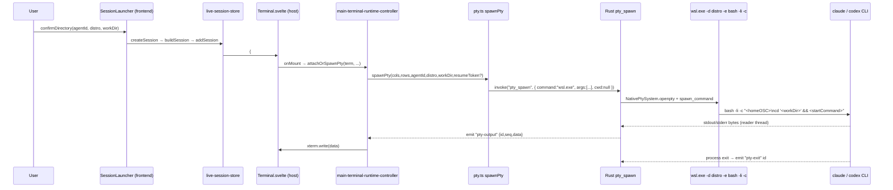

# Current State

> 이 문서는 CLCOMX의 **현재 PTY/xterm 중심 구조**를 코드 사실에 근거해 정밀 기술한다. 모든 경로/함수명/이벤트/타입은 `research/codebase-backend.md`·`research/codebase-frontend.md`가 확인한 commit `e7a5f9e`에서 직접 읽은 것이다. direct runtime 설계의 출발점이자 "보존/분리 경계"의 권위 기준이다. 구현 전에는 반드시 현재 작업트리의 실제 코드와 대조한다.
>
> **역할 분리**: 본 문서는 *현재 상태*를 기술한다. 목표 아키텍처는 [03](03-target-architecture.md), 공통 모델 규칙은 [04](04-normalized-agent-model.md), 타입 정본은 [15](15-data-contracts.md), backend runtime 계약은 [07](07-tauri-process-runtime.md)에 있다. 코드 1차 근거는 [`research/codebase-backend.md`](research/codebase-backend.md)·[`research/codebase-frontend.md`](research/codebase-frontend.md)이며, 본 문서는 그 사실을 direct runtime 관점에서 요약·해석한다.

조사 기준: 2026-06-25. 스택: Tauri v2, Svelte 5(runes), TypeScript, xterm.js, Rust PTY backend(`portable-pty` 0.9.0 vendored), `serde`/`serde_json`.

---

## 0. 요약 (TL;DR)

CLCOMX는 단일 PTY runtime을 운영한다. frontend `spawnPty`(`src/lib/pty.ts`)가 agent별 shell 문자열을 조립해 backend `pty_spawn`(`src-tauri/src/features/terminal/mod.rs`)에 넘기고, backend는 `wsl.exe -d <distro> -e bash -li -c <script>`로 WSL 안에서 CLI를 실행한다. stdout/stderr는 `portable_pty`로 **한 byte stream**으로 합쳐져 `record_output_chunk`를 거쳐 `pty-output` 이벤트로 emit되고, frontend `main-terminal-runtime-controller`가 xterm에 그대로 쓴다. 즉 현재 아키텍처는 **터미널 byte stream을 화면에 그대로 재현하는 emulator 모델**이며, agent message·tool call·approval·diff 같은 구조는 escape sequence 텍스트 안에 녹아 있어 별도로 추출되지 않는다.

이 구조의 강점은 "실제 CLI를 그대로 보여줘서 인증/config/TUI를 자연스럽게 재사용"하는 것이고, 한계는 "구조화된 transcript UI를 만들 수 없고, session id·resume를 terminal 텍스트 휴리스틱으로 긁어내야 한다"는 것이다. direct runtime은 이 PTY runtime을 **대체하지 않고 별도 runtime family로 공존**시킨다([15](15-data-contracts.md) §7, [07](07-tauri-process-runtime.md)).

---

## 1. 현재 실행 흐름 (end-to-end)

세션 1개를 띄울 때 실제로 일어나는 일을 코드 경로 순서대로 기술한다([`research/codebase-frontend.md`](research/codebase-frontend.md) §3.2, [`research/codebase-backend.md`](research/codebase-backend.md) §2.2, §5.1).



1. 사용자가 launcher에서 디렉터리/agent를 확정한다. `session-launcher-controller.ts`의 `confirmDirectory()` → `deps.onConfirm(agentId, distro, workDir)`.
2. `App.svelte`의 `createSession` → `sessionLifecycle.createSession(...)` → `buildSession(request)`(`session/service/session-factory.ts`) → `addSession`(`live-session-store.svelte.ts`)로 세션이 단일 source of truth에 추가된다.
3. `SessionViewport`가 `{#each sessions}`로 host 컴포넌트(`Terminal.svelte`)를 mount한다. 활성 탭만 `visible`이고 비활성은 CSS로 숨긴다(§5.3 무재mount 계약).
4. `Terminal.svelte`의 `onMount`가 xterm `Terminal`을 만들고 `mainTerminalRuntime.attachOrSpawnPty(...)`를 호출한다.
5. `spawnPty`(`src/lib/pty.ts`)가 `agents/registry.ts`의 `buildStartCommand`/`buildResumeCommand`로 shell 문자열을 만들고 `invoke("pty_spawn", {...})`로 backend에 넘긴다.
6. backend `pty_spawn`이 native PTY pair를 열고 `wsl.exe -d <distro> -e bash -li -c <script>`로 child를 실행한다.
7. reader thread가 stdout/stderr byte를 읽어 `record_output_chunk`로 흘려보내고, `pty-output` 이벤트로 emit한다.
8. frontend가 `listen("pty-output", ...)`로 받아 xterm에 쓰고, loading/ready signal·bottom-lock·resume fallback marker·canonical screen snapshot을 관리한다.

---

## 2. Backend: PTY runtime 해부

> 1차 근거: [`research/codebase-backend.md`](research/codebase-backend.md) §2. 실제 구현은 전부 `src-tauri/src/features/terminal/mod.rs`에 있고, `src-tauri/src/commands/pty.rs`는 `pub use crate::features::terminal::*;` 한 줄 re-export다.

### 2.1 상태 모델 — `PtyState(Mutex<HashMap>)`

```rust
// features/terminal/mod.rs:18-43
enum PtyRuntime {
    Native { master: Box<dyn MasterPty + Send>, writer: Box<dyn Write + Send> },
    Mock,
}
struct PtySession {
    runtime: PtyRuntime,
    initial_output: Arc<Mutex<String>>,
    output_log: Arc<Mutex<String>>,
    output_chunks: Arc<Mutex<VecDeque<PtyOutputChunkRecord>>>,
    home_dir: Arc<Mutex<Option<String>>>,
    home_dir_osc_remainder: Arc<Mutex<String>>,
    size: Arc<Mutex<PtyDimensions>>,
    output_seq: Arc<AtomicU64>,
    buffer_initial_output: Arc<AtomicBool>,
    exited: Arc<AtomicBool>,
}
#[derive(Default)]
pub struct PtyState {
    sessions: Mutex<HashMap<u32, PtySession>>,
    next_id: Mutex<u32>,
}
```

확인된 사실:

- 세션 ID는 `u32`, `PtyState.next_id`를 잠가 단조 증가(`next_session_id`).
- 동시성은 전부 `std::sync::{Mutex, Arc, AtomicU64, AtomicBool}`. **mpsc/crossbeam 채널·tokio import 0건**. tokio는 `Cargo.toml`에 선언만 되어 있고 `src-tauri/src`에서 미사용([`research/codebase-backend.md`](research/codebase-backend.md) §7). 모든 `#[tauri::command]`는 동기 `fn`이며 반환은 거의 전부 `Result<T, String>`.
- `is_test_mode()`가 true면 native 대신 `PtyRuntime::Mock`을 만든다(`create_mock_session`). 이 test-mode 경로가 WSL 없이 E2E를 돌리는 핵심 장치다.

### 2.2 spawn / I/O 스레드 모델 — `pty_spawn`

native 경로(`pty_spawn`, mod.rs:355-607):

1. `NativePtySystem::default().openpty(PtySize{rows,cols,..})`로 PTY pair 생성.
2. `command`(기본 `wsl.exe`) + `args` + `cwd`로 `CommandBuilder`를 만들고 `pair.slave.spawn_command(cmd)`로 child 실행. **shell string이 아니라 executable + argv 배열**을 받는다.
3. `try_clone_reader()`/`take_writer()`로 reader/writer 확보.
4. **Thread 1 (child wait)**: `child.wait()` → `exited.store(true)` → 200ms sleep → `app.emit("pty-exit", session_id)`.
5. **Thread 2 (reader loop)**: 4096-byte buffer로 `reader.read()` 루프. `decode_utf8_stream_chunk`로 incomplete UTF-8 경계를 보존하며 디코딩 후 `record_output_chunk`로 흘려보낸다.
6. 두 스레드 핸들은 join 없이 detach. 세션을 `HashMap`에 insert.

> stdout/stderr가 PTY에서 **하나의 byte stream으로 합쳐진다**는 점이 핵심이다. direct runtime은 반대로 stdout(JSON-RPC) / stderr(진단 로그)를 분리해야 한다([07](07-tauri-process-runtime.md) §Framing).

### 2.3 output buffering / seq / snapshot / delta — late-attach 메커니즘

`record_output_chunk`(mod.rs:184-229)가 출력 chunk 처리의 단일 진입점이다:

- `buffer_initial_output`이 true면 `initial_output`에 누적(첫 attach 전 버퍼링).
- `update_home_dir_cache`로 OSC 633 `CLCOMX_HOME` 시퀀스를 소비(§4).
- `output_seq.fetch_add(1) + 1`로 **1-based 단조 증가 seq** 발급.
- `output_log`(전체 텍스트 4MB cap, `trim_output_log`)와 `output_chunks`(seq별 chunk 4MB cap, `trim_output_chunks`)에 동시 기록.
- `app.emit("pty-output", PtyOutput{ id, seq, data })`.

snapshot/delta API(모두 `pub fn` core + `#[tauri::command]` 래퍼 쌍):

| 목적 | core fn | command | 반환 타입 |
| --- | --- | --- | --- |
| 전체 출력+seq+home | `get_output_snapshot` | `pty_get_output_snapshot` | `PtyOutputSnapshot { data, seq, home_dir }` |
| 위+cols/rows | `get_runtime_snapshot` | `pty_get_runtime_snapshot` | `PtyRuntimeSnapshot { data, seq, cols, rows, home_dir }` (camelCase) |
| seq 이후 증분 | `get_output_delta_since` | `pty_get_output_delta_since` | `PtyOutputDelta { data, seq, complete }` |
| 첫 버퍼 take | — | `pty_take_initial_output` | `String` (mem::take, buffer off) |

`get_output_delta_since`의 `complete` 플래그가 late-attach 신뢰성의 핵심이다: chunk log가 trim되어 `after_seq+1`이 가장 오래된 보존 chunk보다 앞서면 `complete=false`를 돌려주고, frontend는 full snapshot으로 fallback한다. **이 `seq + delta + complete` 3요소 패턴은 direct runtime의 transcript late-attach에도 동일 원리로 재사용해야 한다**([15](15-data-contracts.md) §8.3 주석, [04](04-normalized-agent-model.md) §3.4 순서 보존).

### 2.4 write / resize / kill

```text
pty_write  (mod.rs:721-748): Native면 writer.write_all + flush; Mock이면 가짜 응답 append
pty_resize (mod.rs:750-775): Native면 master.resize(PtySize{..}); size 캐시 갱신
pty_kill   (mod.rs:777-780): kill_pty_session → sessions.remove(&id) (Drop이 프로세스 정리)
```

`kill_pty_session`은 `HashMap`에서 제거만 한다 — `MasterPty`/`Child`가 Drop되며 OS가 프로세스를 정리하는 데 의존한다. **명시적 graceful shutdown(stdin close → timeout → kill)이 없다.** direct runtime은 JSON-RPC 특성상 명시적 종료가 필요하므로 이 단순 `remove` 모델을 그대로 따르면 안 된다([07](07-tauri-process-runtime.md) §Process lifecycle).

### 2.5 resume token 캡처 — `pty_close_and_capture_resume` (회귀 위험원)

종료 시 `exit\r`(claude) 또는 `0x03`(codex Ctrl-C)를 writer에 쓰고, `output_log`를 폴링하며 `extract_resume_token`으로 resume 토큰 문자열을 **terminal 출력에서 긁어낸다**. EOF fallback(`0x04`), 타임아웃(`RESUME_CAPTURE_TIMEOUT_MS=2200`), exit grace 등 타이밍 상수가 박혀 있다. **이것은 terminal byte stream에서 resume 명령 문자열을 추정 추출하는 회귀 위험이 큰 경로**(§6 한계)이며, direct runtime이 protocol-level session id로 대체하려는 바로 그 지점이다. direct runtime은 이 휴리스틱을 재사용하지 않고 ACP `session/new` 결과나 Codex thread id를 그대로 영속화한다([15](15-data-contracts.md) §7.1).

### 2.6 재사용 가능 자산 — `features/terminal/parsing.rs`

| 함수 | direct runtime 재사용성 |
| --- | --- |
| `decode_utf8_stream_chunk(pending, chunk, flush)` | **높음.** stdio JSON-RPC도 UTF-8 byte stream을 chunk로 읽으므로 incomplete UTF-8 경계 보존이 그대로 필요. `pub(super)` → 공용화 시 terminal 테스트 import 갱신 필요([`research/codebase-backend.md`](research/codebase-backend.md) §2.6, §11). |
| `strip_ansi_sequences` | 낮음(transcript는 ANSI 없음). stderr 로그 정리에만 선택 사용. |
| `consume_home_dir_osc` | 중간. PTY 보조 셸 메타데이터 전용. direct runtime은 protocol metadata로 cwd/home을 받음. |
| `extract_resume_token` | 낮음. PTY fallback 전용(§2.5). |

---

## 3. Backend: command 등록 / 이벤트 규칙

> 1차 근거: [`research/codebase-backend.md`](research/codebase-backend.md) §3.

### 3.1 모듈 트리와 컨벤션

확인된 컨벤션: **`commands/<x>.rs`는 얇은 `#[tauri::command]` 래퍼이고, 실제 로직·상태 타입은 `features/<x>/`에 둔다.** `pty.rs`/`workspace.rs`/`settings.rs` 모두 이 패턴을 따른다. State 주입은 `state: tauri::State<'_, T>`로 받고 내부 로직에는 `state.inner()`을 넘긴다. 한 command가 복수 State를 받을 수 있다(`close_session`이 `WorkspaceState` + `PtyState`).

### 3.2 이벤트 emit / listen 규칙

- emit: `AppHandle`을 command 인자로 받아 `use tauri::Emitter` + `app.emit("<event-name>", payload)`. payload는 `#[derive(Clone, Serialize)]`.
- event 이름은 kebab-case 리터럴: `"pty-output"`, `"pty-exit"`, `"workspace-updated"`, `"window-frontend-ready"`.
- listen(frontend): `@tauri-apps/api/event`의 `listen<T>`(단, 신규 코드는 `src/lib/tauri/event.ts` 래퍼 경유 — §5.5).
- payload 직렬화는 일부 `#[serde(rename_all = "camelCase")]`(예: `PtyRuntimeSnapshot`, `PtyOutputDelta`). 신규 payload는 camelCase rename 명시가 안전하다.

---

## 4. WSL 경계 / cwd·home 메타데이터 / resume fallback marker

> 1차 근거: [`research/codebase-backend.md`](research/codebase-backend.md) §5, [`research/codebase-frontend.md`](research/codebase-frontend.md) §4.2.

### 4.1 WSL 실행 경계 (`src/lib/pty.ts`)

frontend `spawnPty`(pty.ts:52-90)가 조립하는 실제 wire 형태:

```ts
invoke("pty_spawn", {
  cols, rows,
  command: "wsl.exe",
  args: ["-d", distro, "-e", "bash", "-li", "-c",
         `${homeMetadataCommand}\ncd '${safeWorkDir}' && ${startCommand}`],
  cwd: null,
  mockAgentId, mockDistro, mockWorkDir, mockResumeToken,   // test-mode mock 힌트
});
```

확인된 경계 사실:

- Windows backend가 `wsl.exe -d <distro> -e bash -li -c <script>`로 WSL 안에서 실행한다. cwd는 backend `cwd`가 아니라 **스크립트 내부 `cd '<workDir>'`로 진입**한다(`cwd: null`).
- `startCommand`는 `agents/registry.ts`의 `buildStartCommand`/`buildResumeCommand`로 만든 **shell 문자열**이다.
- resume fallback(`__CLCOMX_RESUME_FAILED__`):
  ```sh
  if ! <resumeCommand>; then printf '__CLCOMX_RESUME_FAILED__\r\n'; <startCommand>; fi
  ```
  resume 실패 시 stdout에 marker를 찍고 새 세션으로 폴백한다. frontend `main-terminal-runtime-controller.ts`(상수 `RESUME_FAILED_MARKER`, :16/:376/:497)가 이 marker를 감지해 transcript에서 제거한다.
- `wsl.rs`의 `WslState`는 PTY와 **별개**의 영속 bash 프로세스 풀(`Mutex<HashMap<distro, WslShell>>`)을 distro당 하나 유지해 빠른 디렉터리 listing/검색을 한다. `std::process::Command`(stdin/stdout piped, `CREATE_NO_WINDOW`)를 직접 쓴다 — **direct runtime이 비-PTY 프로세스를 띄울 때 참고할 레퍼런스**([07](07-tauri-process-runtime.md) §WSL/Windows 경계).

### 4.2 OSC 633 메타데이터 시퀀스

| 시퀀스 | 의미 | emit 위치 | parse 위치 |
| --- | --- | --- | --- |
| `\033]633;CLCOMX_HOME;<base64>\007` | $HOME | pty.ts:66-69 (spawn 직후 1회) | Rust `consume_home_dir_osc`(parsing.rs); frontend `src/lib/terminal/aux-shell-metadata.ts:3` |
| `\033]633;CLCOMX_CWD;<base64>\007` | 보조 셸 cwd | pty.ts:133 (PROMPT_COMMAND마다) | frontend `src/lib/terminal/aux-shell-metadata.ts:2` |

prefix 상수: Rust `HOME_DIR_OSC_PREFIX = "\u{1b}]633;CLCOMX_HOME;"`. base64 payload는 `decode_base64_utf8`로 디코딩. 부분 시퀀스는 `home_dir_osc_remainder`에 carry over.

**direct runtime 함의**: ACP/Codex는 cwd/home을 protocol metadata로 전달하므로 OSC 시퀀스가 불필요하다. 단 ACP는 absolute path를 요구하므로 adapter 입력 직전 path canonicalization이 필요하고, frontend file-link 변환(`src/lib/features/editor/navigation/wsl-path-utils.ts`)은 그대로 재사용한다.

---

## 5. Frontend: terminal feature 구조와 host 모델

> 1차 근거: [`research/codebase-frontend.md`](research/codebase-frontend.md) §1, §2, §3.

### 5.1 feature 레이어 규약

`src/lib/features/<feature>/{view,controller,state,contracts,service,navigation}` 분리 규약. view(`.svelte`)는 거의 로직 없는 props wiring, controller(`create*Controller(deps)` DI 팩토리)가 동작, state(`*-state.svelte.ts` 룬 class + `create*State()` 팩토리)가 세션 단위 상태, 모듈 store(`*.svelte.ts` top-level `$state`)가 전역 상태를 담당한다.

### 5.2 main-terminal-runtime-controller / state

`main-terminal-runtime-controller.ts`가 PTY 통합의 중심이다([`research/codebase-frontend.md`](research/codebase-frontend.md) §2.2). 책임:

- PTY attach/spawn/replay(`attachOrSpawnPty`), output chunk 라우팅(`handleMainOutputChunk` — `event.id !== state.livePtyId`면 무시하는 **PTY 단위 멀티플렉싱**), 스크롤 bottom-lock, 로딩 lifecycle, resume fallback marker 제거(`RESUME_FAILED_MARKER`), resize/exit 처리.
- DI deps 28개(`MainTerminalRuntimeControllerDeps`)는 전부 getter 또는 effect 함수(`spawnPty`/`writeTerminalData`/`resizePty`/`onPtyId`/`onExit` …). controller는 `invoke`/`listen`을 직접 부르지 않아 vitest에서 `vi.fn()` 모킹 가능.

state는 `main-terminal-runtime-state.svelte.ts`(`MainTerminalRuntimeState`). DOM에 영향 주는 값(`livePtyId`/`spawnError`/`terminalLoadingState`/`shellHomeDir`)만 `$state`, timer handle·누적 버퍼·remainder string은 plain 멤버.

### 5.3 host 조립부와 탭 전환 무재mount 계약

`src/lib/components/Terminal.svelte`가 host다. `$props()`로 `SessionHostProps`(`sessionId, visible, agentId, distro, workDir, ptyId, resumeToken, sessionSnapshot, onPtyId, onAuxStateChange, onExit, onResumeFallback, onEditorSessionStateChange`)를 받는다(구조분해 `Terminal.svelte:98–115`). `onMount`에서 xterm 생성 → `term.open(outputEl)` → `listen("pty-output", ...)` + `listen("pty-exit", ...)` → `attachOrSpawnPty(...)`. template은 `TerminalEmbeddedEditorSurface`(Monaco)와 `TerminalRuntimeSurface`(xterm)를 **둘 다 mount**하고 `editorViewMode`로 하나만 보이게 한다(`Terminal.svelte:1152/1176`).

핵심 계약(§3.3 frontend research): `SessionViewport`는 **모든 세션 host를 계속 mount**한 채 `visible`만 바꾼다. 비활성 host는 `.hidden` CSS로 숨겨지고 PTY/xterm 인스턴스는 살아있다 → **탭 전환이 host 재mount를 일으키지 않는다.** direct runtime의 transcript host도 이 계약(visible prop만 받고 자체 숨김, 비활성에서도 transport 유지)을 지켜야 한다.

### 5.4 overlay / 보조 controller들

- `overlay-interaction-controller.ts`(+`overlay-clipboard-image-controller.ts`, `overlay-file-link-actions.ts`, `overlay-link-menu-items.ts`): file link 클릭 메뉴, 클립보드 이미지 paste, 외부 URL 열기. → `TerminalOverlayStack.svelte`(link menu / clipboard image modal / editor picker / interrupt confirm).
- `aux-terminal-runtime-controller.ts`·`aux-terminal-resize-controller.ts`: 보조 셸 dock.
- `draft-composer-controller.ts`: draft 입력 박스.
- `terminal-editor-integration-controller.ts`·`terminal-editor-preflight-controller.ts`: terminal↔editor 모드 전환.
- `terminal-renderer-controller.ts`: DOM/WebGL 렌더러 스위칭. `terminal-focus-bridge.ts`·`terminal-shortcut-routing.ts`: focus/단축키 라우팅.

### 5.5 invoke/listen 래퍼 규칙

`src/lib/tauri/core.ts`(`invoke<T>`)·`src/lib/tauri/event.ts`(`listen<T>`/`emitTo`)가 browser preview/테스트 분기를 흡수한다. **신규 runtime도 반드시 이 래퍼만 경유**해야 browser preview/테스트가 안 깨진다([15](15-data-contracts.md) §0.6).

---

## 6. 현재 강점

코드 근거와 함께 정리한다(보존 결정의 토대 — [13](13-risks-open-questions.md) Terminal regression).

- **실 CLI의 TUI를 그대로 재현.** `wsl.exe ... bash -li -c <CLI>`로 실제 CLI를 실행하므로(§4.1) CLI 인증·config·shell environment·TUI 화면을 별도 작업 없이 그대로 쓴다.
- **검증된 late-attach.** `seq + delta + complete`(§2.3)로 탭 전환·창 복원 후에도 화면을 무손실 복구한다. 이 메커니즘 자체는 direct runtime이 그대로 차용할 자산이다.
- **통합 완성도.** xterm, 보조 셸 dock, 파일 경로/URL 링크, 이미지 붙여넣기, session restore, editor 임베드가 이미 한 host에 통합되어 있다(§5.3, §5.4).
- **test-mode mock 경로.** `is_test_mode()`(§2.1)로 WSL 없이 E2E/단위 테스트가 가능하다.
- **명확한 레이어 규약.** view/controller/state/contracts 분리(§5.1)로 DI 테스트가 쉽다.

---

## 7. 현재 한계

direct runtime이 해결하려는 문제(코드 근거 포함):

- **구조 부재.** agent message·tool call·approval·diff·command output이 구조화되지 않고 한 terminal byte stream에 섞인다(§2.2 — stdout/stderr 단일 stream). UI는 이를 escape sequence로만 받아 구조화 카드(transcript)를 만들 수 없다.
- **불안정한 식별자.** Codex/Claude의 session/turn/message/tool id를 안정적으로 알 수 없다. resume는 terminal 출력에서 문자열을 긁어내는 `extract_resume_token`/`pty_close_and_capture_resume` 휴리스틱에 의존한다(§2.5) — 출력 포맷 변경에 취약한 회귀 위험원.
- **UI marker 의존.** ready signal·prompt glyph·footer text·`RESUME_FAILED_MARKER`(§4.1) 같은 텍스트 marker에 로직이 묶여 있어 CLI 화면이 바뀌면 깨진다.
- **라우팅 곤란.** 여러 turn stream·background task를 byte stream만으로 정확히 분리·라우팅하기 어렵다.
- **approval/tool UI 부재.** approval modal·tool progress·diff card를 만들려면 terminal text/escape를 추정 파싱해야 한다.

---

## 8. 보존할 기능 (direct runtime 도입 후에도 유지)

- **보조 셸 dock과 명령 실행 화면**(`aux-terminal-*` controller, `spawnShellPty`).
- **legacy PTY session 실행 전체 경로**(`pty_spawn`~`pty_kill`, `main-terminal-runtime-controller`). direct runtime 미지원/실패 시 fallback으로 살린다([15](15-data-contracts.md) §1 `legacy-pty`).
- **xterm 기반 terminal rendering**(`TerminalRuntimeSurface`). direct runtime에서는 "embedded command output / raw diagnostic / legacy fallback" 표면으로 역할이 축소된다([08](08-ui-composition.md)).
- **파일 경로 링크·URL 링크·이미지 붙여넣기**(overlay controller, `wsl-path-utils.ts`).
- **기존 session history와 resume token fallback**(`features/history`, `__CLCOMX_RESUME_FAILED__`).
- **late-attach 메커니즘 원리**(`seq + delta + complete`) — direct runtime transcript에 재사용.

---

## 9. 분리할 경계 (direct runtime 통합점)

direct runtime은 기존 `spawnPty`를 대체하지 않고 **새 runtime family**로 추가한다. 코드 사실 기반 경계([`research/codebase-backend.md`](research/codebase-backend.md) §10, [`research/codebase-frontend.md`](research/codebase-frontend.md) §9·§10):

| 경계 | 현재(PTY) | direct runtime | 근거 |
| --- | --- | --- | --- |
| backend 상태 | `PtyState` | 별도 `AgentRuntimeState`(`Mutex<HashMap<RuntimeId, AgentRuntime>>`), RuntimeId 공간 분리 | backend §10 권고 1 |
| command/event 네임스페이스 | `pty_*` / `pty-*` | `agent_runtime_*` / `agent-runtime-*` | [15](15-data-contracts.md) §8 |
| transport | raw byte stream(`output_log`) | framed JSON-RPC message(stdout) + 분리된 stderr | [07](07-tauri-process-runtime.md) §Framing |
| process 종료 | `HashMap::remove` + Drop | 명시적 graceful shutdown(stdin close→timeout→kill) | backend §2.4, §10 권고 5 |
| executable 신뢰 | frontend가 임의 shell 문자열 전달, backend 검증 없음 | provider enum 기반 backend allowlist 검증(신규 강화) | backend §6, §10 권고 6 |
| resume 키 | terminal 텍스트 휴리스틱(`extract_resume_token`) | protocol session/thread id 영속화 | backend §2.5, [15](15-data-contracts.md) §7.1 |
| late-attach | `seq+delta+complete`(재사용) | 동일 원리를 message stream에 적용 | backend §2.3, §10 권고 3 |

**direct runtime이 붙는 자리(integration points)** — [`research/codebase-backend.md`](research/codebase-backend.md) §9의 "연동 지점"과 [`research/codebase-frontend.md`](research/codebase-frontend.md) §10 체크리스트 인용:

- backend: `commands/mod.rs`에 `pub mod agent_runtime;`, `lib.rs`에 `use` + `.manage(AgentRuntimeState::default())` + `generate_handler![]` 등록(3곳). 신설 모듈은 `features/agent_runtime/{mod,transport,process,tests}.rs` + `commands/agent_runtime.rs`([`research/codebase-backend.md`](research/codebase-backend.md) §9 표).
- frontend host 분기: **옵션 B(구현됨)** — `SessionShell.svelte`에서 `session.runtimeKind`로 legacy `<Terminal>` vs direct `<AgentTranscriptSurface>`를 분기한다. `SessionViewportProps`/`App.svelte`/`session-shell-loader` 변경 없이 host props adapter(`createSessionHostProps`)에서 공통 props를 만든다([`research/codebase-frontend.md`](research/codebase-frontend.md) §9 옵션 B).
- 타입/persistence: `SessionCore`/`WorkspaceTabSnapshot`에 `runtimeKind` optional 추가([15](15-data-contracts.md) §7.2), `session-factory.buildSession`·`createSessionHostProps` 전파.
- callback 흐름: direct runtime은 ptyId가 없으므로 PTY 전제 콜백(`onPtyId`/`onAuxStateChange`/`onExit`/`onResumeFallback`)을 direct host에서 호출하지 않는다([`research/codebase-frontend.md`](research/codebase-frontend.md) §11 위험). close 정책은 `hasLiveSessionRuntime`이 `runtimeKind.startsWith("direct-")`를 live runtime으로 취급해 direct `ptyId=-1` 세션을 죽은 세션으로 오인하지 않도록 보강됐다.

---

## 10. 교차 참조

| 대상 | 문서 | 절 |
| --- | --- | --- |
| 목표 아키텍처(Port/Adapter/Router/Store) | [03](03-target-architecture.md) | 전체 |
| 공통 모델 규칙(상태머신·upsert·approval) | [04](04-normalized-agent-model.md) | 전체 |
| Tauri command/event·framing·process lifecycle | [07](07-tauri-process-runtime.md) | 전체 |
| UI 구성(transcript surface·host 분기) | [08](08-ui-composition.md) | 전체 |
| persistence migration·scrub 경계 | [10](10-persistence-migration.md) | 전체 |
| 타입 정본(`AgentEvent`/`AgentRuntimeStartParams` 등) | [15](15-data-contracts.md) | 전체 |
| 위험·기본값(terminal regression·callback 우회) | [13](13-risks-open-questions.md) | 전체 |
| backend 코드 현실 | [`research/codebase-backend.md`](research/codebase-backend.md) | §2,§3,§4,§5,§9,§10 |
| frontend 코드 현실 | [`research/codebase-frontend.md`](research/codebase-frontend.md) | §1,§2,§3,§4,§9,§10 |
