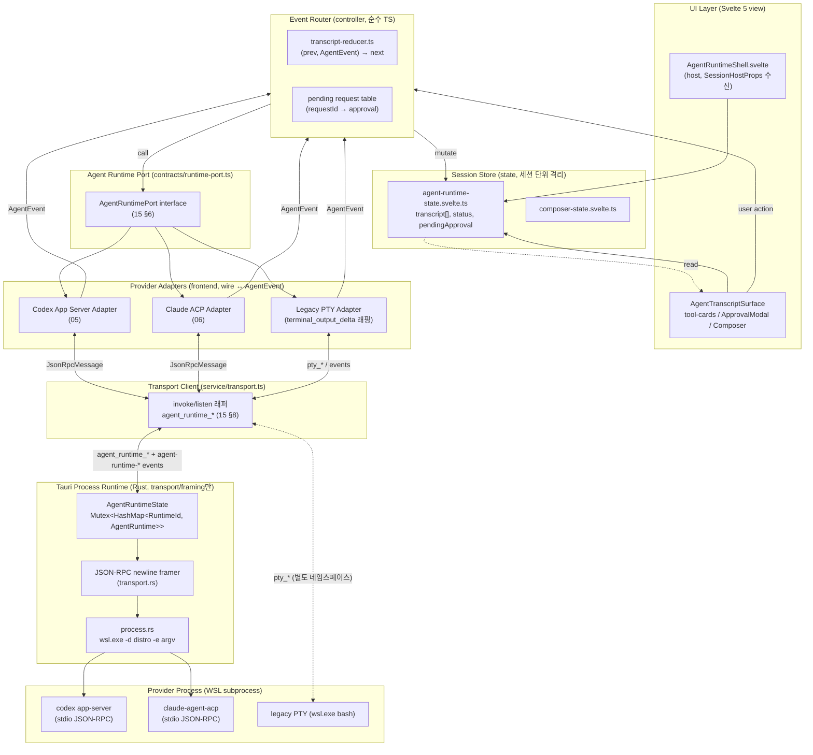

# Target Architecture

> 이 문서는 CLCOMX "Direct Agent Runtime"의 **목표 아키텍처**를 정의한다. 레이어 구성, 각 구성요소의 책임·입출력·소유 상태, 모듈 배치, 데이터 흐름 요약을 다룬다.
>
> **역할 분리(권위 경계)**:
> - **타입 정본**은 [`15-data-contracts.md`](15-data-contracts.md)다. 이 문서는 `AgentEvent`/`ProviderRef`/`ToolCallUpdate`/`Approval*`/`AgentRuntimePort`/`AgentRuntimeMetadata`/`JsonRpcMessage`/`AgentRuntimeStartParams` 등 **공통 타입을 재정의하지 않고** 15의 §번호로 인용한다.
> - **규칙 정본**(상태 전이, upsert/reconcile, 순서 보존, approval 생명주기, 식별자 라우팅)은 [`04-normalized-agent-model.md`](04-normalized-agent-model.md)다. 이 문서는 04를 인용만 한다.
> - **프로토콜 wire 사실**은 [`ref-codex-app-server-protocol.md`](ref-codex-app-server-protocol.md) / [`ref-acp-protocol.md`](ref-acp-protocol.md) / [`ref-claude-agent-acp.md`](ref-claude-agent-acp.md)의 §번호로 인용한다.
> - **코드 현실**은 [`research/codebase-frontend.md`](research/codebase-frontend.md) / [`research/codebase-backend.md`](research/codebase-backend.md)의 §번호로 인용한다.
> - **데이터 흐름 다이어그램(시퀀스/상태)**은 [`14-sequence-and-state.md`](14-sequence-and-state.md)에 있다. 이 문서는 흐름을 **요약**하고 세부 다이어그램은 14로 링크한다.

조사 시점: 2026-06-25. 코드 정합 기준: 브랜치 `feat/claude-tui-fullscreen-option`.

---

## 1. 패턴: Hexagonal (Ports & Adapters)

Direct Agent Runtime은 **hexagonal architecture**(ports & adapters)를 적용한다. 핵심 도메인(transcript/세션 모델, 상태 머신, approval 생명주기)은 provider protocol에 무지(無知)해야 하고, Codex app-server·Claude ACP·legacy PTY는 **교체 가능한 adapter**로 격리한다.

세 가지 불변 경계가 이 아키텍처를 정의한다.

1. **UI/Store는 normalized model만 본다.** renderer는 Codex/ACP의 provider-specific wire 타입을 직접 import하지 않는다. UI가 소비하는 것은 [`15`](15-data-contracts.md) §3 `AgentEvent`와 §1–§5의 normalized 타입뿐이다 (`research/codebase-frontend.md` §9 옵션 B의 "renderer는 transport만 본다" 정신).
2. **wire → AgentEvent 변환은 frontend adapter가 한다.** backend(Tauri Rust)는 **transport/framing만** 책임진다. backend는 raw JSON-RPC를 그대로 올리고 protocol 의미를 해석하지 않는다. 이 경계는 [`15`](15-data-contracts.md) §8.3과 [`07`](07-tauri-process-runtime.md) §Framing에서 정본화된 핵심 결정이다.
3. **provider 원본 id/payload를 잃지 않는다.** 모든 변환은 [`15`](15-data-contracts.md) §0.1·§0.2 컨벤션(원본 id는 `ProviderRef`, 미매핑 payload는 `raw`/`rawInput`/`rawOutput`)을 지킨다.

### 1.1 레이어 component 다이어그램



> **다이어그램 읽는 법**: 위→아래가 hexagonal의 "안쪽(도메인) → 바깥쪽(adapter/infra)" 방향이다. UI와 Store는 도메인 안쪽이라 normalized 타입만 다루고, Adapter 레이어 아래(transport/backend/provider)는 wire/byte의 세계다. **변환의 단일 경계선은 Provider Adapter**다. backend는 그 아래에서 framing/transport만 한다 ([`15`](15-data-contracts.md) §8.3).

---

## 2. 구성요소: 책임 / 입력 / 출력 / 소유 상태

각 구성요소를 "무엇을 책임지는가(responsibility), 무엇을 입력받는가(in), 무엇을 내보내는가(out), 어떤 상태를 소유하는가(owns)"로 정의한다. 모듈 경로는 §3을 따른다.

### 2.1 UI Layer (view)

- **responsibility**: 렌더링만. transcript 항목·tool card·approval dialog·composer를 그리고, 사용자 입력을 controller 콜백으로 위임한다. 로직을 두지 않는다 (`research/codebase-frontend.md` §1.2 view 규약).
- **in**: Store(`agent-runtime-state`)의 reactive 값(`transcript[]`, `status`, `pendingApproval`), host props `SessionHostProps`(`sessionId`/`visible`/`agentId`/`distro`/`workDir` 등, `research/codebase-frontend.md` §2.4).
- **out**: 사용자 의도(prompt submit, approval 선택, cancel)를 controller 콜백으로.
- **owns**: 소유 상태 없음. DOM ref와 `$derived` 표시 값만. 비활성 탭에서도 unmount하지 않고 `visible` prop으로 CSS 토글한다 (`research/codebase-frontend.md` §3.3 무재mount 계약).
- **핵심 컴포넌트**: host `AgentRuntimeShell.svelte`(= `Terminal.svelte` 대응), `AgentTranscriptSurface.svelte`, `tool-cards/*.svelte`, `ApprovalModal.svelte`(+ `ApprovalInlineCard.svelte`), `AgentComposer.svelte`. 컴포넌트명 정본은 [`08`](08-ui-composition.md) §10.

### 2.2 Session Store (state, 세션 단위 격리)

- **responsibility**: 한 세션의 transcript·세션 상태·pending approval을 **권위 있게 보관**한다. UI는 이 store만 읽는다. transcript item 상태(message/tool card/command output/diff/approval/error)와 provider 원본 id(`ProviderRef`)를 보존한다.
- **in**: Event Router가 적용하는 mutation(reducer 결과).
- **out**: reactive 값(view가 구독).
- **owns(소유 상태)**:
  - `transcript: TranscriptItem[]` — message/tool/command/diff/error 항목. 각 항목은 [`15`](15-data-contracts.md) §1 `ProviderRef`를 보존.
  - `status: AgentSessionStatus` — [`15`](15-data-contracts.md) §2. 전이 규칙은 [`04`](04-normalized-agent-model.md) §2.
  - `pendingApproval` / pending table — [`15`](15-data-contracts.md) §5 `ApprovalRequest`. 생명주기는 [`04`](04-normalized-agent-model.md) §4.
  - `agentRuntime` metadata(provider session/thread id 등, resume용) — [`15`](15-data-contracts.md) §7.1 `AgentRuntimeMetadata`.
- **규약**: 세션 인스턴스마다 격리돼야 하므로 **state class**(`createAgentRuntimeState()`)로 만든다. 윈도우 전역 상태(전역 approval queue 등)는 모듈 store(`*.svelte.ts`)로 분리한다 (`research/codebase-frontend.md` §1.3·§1.4 규약 결론).
- **주의**: 기존 `live-session-store`는 세션 목록/활성 탭의 single source of truth를 그대로 유지한다. agent-runtime state는 그 위에 얹히는 **세션별 transcript 상태**다. `SessionViewMode`(`"terminal"|"editor"`)는 `"agent"`로 확장하지 **않는다** — host 종류는 `runtimeKind`로 구분한다 ([`15`](15-data-contracts.md) §7.2 주의, `research/codebase-frontend.md` §5).

### 2.3 Event Router (controller, 순수 TS)

- **responsibility**: adapter가 emit한 `AgentEvent`를 받아 (a) `ProviderRef` 라우팅 키로 올바른 transcript 항목/tool card/approval에 매핑하고, (b) `transcript-reducer`로 store를 mutate하고, (c) approval은 pending table에 등록/해소한다. **변환은 안 하고 적용만 한다** — wire→AgentEvent 변환은 adapter 책임이다.
- **in**: `AgentEvent`(adapter에서, [`15`](15-data-contracts.md) §3). 사용자 의도(view에서, submit/approve/cancel).
- **out**: store mutation. 사용자 의도를 Port 메서드 호출로 변환(`sendPrompt`/`respondApproval`/`cancelTurn`).
- **owns**: pending request table(`requestId → ApprovalRequest`). 라우팅 키 인덱스(Codex `(threadId, turnId, itemId)`, ACP `(sessionId, messageId)`/`(sessionId, toolCallId)`).
- **적용 규칙(인용)**:
  - upsert/append/replace 의미, Codex delta→completed reconcile, ACP chunk vs update replace는 [`04`](04-normalized-agent-model.md) §3.1–§3.3.
  - 순서 보존·sequence 부여는 [`04`](04-normalized-agent-model.md) §3.4.
  - approval 정상/cancel/process-exit 정리는 [`04`](04-normalized-agent-model.md) §4·§5.
  - 식별자 라우팅 키는 [`04`](04-normalized-agent-model.md) §1, [`15`](15-data-contracts.md) §1.1.
- **구현 형태**: `transcript-reducer.ts`는 `(prev: TranscriptItem[], event: AgentEvent) => TranscriptItem[]` 순수 함수로, `vi.fn` 없이 fixture 단위 테스트가 가능하다 (`research/codebase-frontend.md` §8 service/reducer). controller(`agent-runtime-controller.ts`)는 DI deps(`subscribe`/`send`/`cancel`)만 호출하고 직접 `invoke`/`listen`을 부르지 않는다 (`research/codebase-frontend.md` §1.5).

### 2.4 Agent Runtime Port (contracts)

- **responsibility**: provider별 adapter 구현을 숨기는 TS-facing interface. UI/Store/Router는 이 interface만 본다.
- **정의 정본**: [`15`](15-data-contracts.md) §6 `AgentRuntimePort`. 7개 메서드(`startSession`/`resumeSession`/`sendPrompt`/`cancelTurn`/`respondApproval`/`subscribeEvents`/`shutdown`)와 입력 타입(`StartSessionParams`/`ResumeSessionParams`/`SendPromptInput`/`SessionStartResult`)은 거기서 정의된다. **여기서 재정의하지 않는다.**
- **in/out**: 메서드 시그니처는 [`15`](15-data-contracts.md) §6 참조. `subscribeEvents`는 push 콜백 + `UnlistenFn`(frontend `listen` 래퍼 패턴, `research/codebase-frontend.md` §4.1).
- **owns**: 상태 없음(interface). 구현체(adapter)가 상태를 가진다.

### 2.5 Provider Adapters (frontend, 변환 경계)

- **responsibility**: **wire ↔ normalized 변환의 단일 지점.** provider wire(JSON-RPC params/result/notification)를 [`15`](15-data-contracts.md) §3 `AgentEvent`로 변환하고, Port 메서드 호출을 provider-specific JSON-RPC message(`JsonRpcMessage`, [`15`](15-data-contracts.md) §8.1)로 변환한다.
- **in**: Port 메서드 호출(Router에서). Transport Client가 올리는 raw `JsonRpcMessage`/stderr/exit/error 이벤트([`15`](15-data-contracts.md) §8.3 `AgentRuntimeEvent`).
- **out**: `AgentEvent` 스트림(Router로). `agent_runtime_send`로 내보낼 `JsonRpcMessage`(Transport Client로).
- **owns**: provider별 protocol 상태 — 협상된 protocol 버전, pending JSON-RPC id ↔ 의미 매핑, ACP turn id 합성 카운터([`04`](04-normalized-agent-model.md) §1 turn id 합성 규칙), Codex thread/turn/item 진행 추적.
- **세 adapter**:
  - **Codex App Server Adapter**: app-server JSON-RPC + typed schema. wire→AgentEvent 매핑은 [`ref-codex-app-server-protocol.md`](ref-codex-app-server-protocol.md) §8, reconcile은 §7. envelope는 `jsonrpc` 필드 없음(ref-codex §1.2, [`15`](15-data-contracts.md) §8.1 주석). 설계는 [`05`](05-codex-app-server-adapter.md).
  - **Claude ACP Adapter**: ACP stdio JSON-RPC + `@agentclientprotocol/claude-agent-acp`. wire→AgentEvent 매핑은 [`ref-acp-protocol.md`](ref-acp-protocol.md) §13, content/tool/permission은 §4–§6. envelope는 `jsonrpc:"2.0"` 정식(ref-acp §1). 구현체 capability/launch는 [`ref-claude-agent-acp.md`](ref-claude-agent-acp.md). 설계는 [`06`](06-claude-acp-adapter.md).
  - **Legacy PTY Adapter**: 기존 PTY flow를 [`15`](15-data-contracts.md) §3 `terminal_output_delta` event로 감싼다. transcript 모델로 끌어올리지 않고 terminal surface 전용으로만 라우팅한다 ([`04`](04-normalized-agent-model.md) §3.5). 이 adapter는 `pty_*` command/`pty-*` event를 그대로 쓴다(별도 네임스페이스, `research/codebase-backend.md` §10 권고 2).
- **불변식**: adapter는 미매핑 payload를 `ProviderRef.raw`/`rawInput`/`rawOutput`에 보존하고([`15`](15-data-contracts.md) §0.2), 수신 순서를 보존해 emit한다([`04`](04-normalized-agent-model.md) §3.4).

### 2.6 Transport Client (service)

- **responsibility**: Tauri command/event 경계의 frontend 측 얇은 래퍼. `agent_runtime_*` invoke와 `agent-runtime-*` listen만 한다 (`pty.ts`의 direct runtime 대응).
- **in**: adapter의 send 요청(`agentRuntimeSend`), 구독 요청.
- **out**: backend가 emit한 `AgentRuntimeEvent`([`15`](15-data-contracts.md) §8.3)를 adapter listener로.
- **owns**: 상태 없음. runtimeId ↔ sessionHandle 매핑은 adapter/Router 쪽이 가진다.
- **규약**: 반드시 `src/lib/tauri/core.ts`의 `invoke`, `src/lib/tauri/event.ts`의 `listen`만 경유한다. `@tauri-apps/api`를 직접 import하지 않는다 — browser preview/테스트가 깨진다 ([`15`](15-data-contracts.md) §0.6, `research/codebase-frontend.md` §4.1). invoke 래퍼 시그니처는 [`15`](15-data-contracts.md) §8.2.

### 2.7 Tauri Process Runtime (Rust backend, transport/framing만)

- **responsibility**: agent subprocess lifecycle(spawn/graceful shutdown/kill), stdio JSON-RPC **framing**(newline-delimited), stderr 캡처, bounded queue/backpressure, late-attach용 seq/snapshot. **protocol 의미를 해석하지 않는다.**
- **in**: `agent_runtime_start`/`send`/`cancel`/`shutdown`/`get_snapshot` command([`15`](15-data-contracts.md) §8.2). `send`는 raw `JsonRpcMessage`를 받아 그대로 stdin에 framing해 쓴다.
- **out**: `agent-runtime-message`(raw JSON-RPC)/`-stderr`/`-exit`/`-error`/`-backpressure` event([`15`](15-data-contracts.md) §8.3). message는 **변환 없이** 그대로 올린다.
- **owns(소유 상태)**: `AgentRuntimeState`(`Mutex<HashMap<RuntimeId, AgentRuntime>>` + `next_id`). PTY `PtyState`와 **별도** state로 manage한다 — RuntimeId 공간을 PTY `u32` 세션 ID와 섞지 않는다 (`research/codebase-backend.md` §10 권고 1, [`07`](07-tauri-process-runtime.md) `transportKind` vs `SessionRuntimeKind` 구분).
- **경계 강화(신규)**: `command`/`args`/`env`는 adapter 생성 값만 허용하고, Rust handler가 provider별 allowlist로 재검증한다. PTY의 자유 shell 문자열 모델을 따르지 않는다 — 현 코드에 선례 없는 의도적 강화 지점 ([`07`](07-tauri-process-runtime.md) §Tauri command v1 계약, `research/codebase-backend.md` §6·§10 권고 6, [`15`](15-data-contracts.md) §8.1 주석).
- **상세 설계**: framing/lifecycle/WSL 경계/logging은 전부 [`07`](07-tauri-process-runtime.md)에 정의된다. 동시성 모델(`std::thread` vs tokio)은 `research/codebase-backend.md` §7과 [`adr-001`](adr-001-direct-agent-runtime.md) 참조.

### 2.8 책임 매트릭스 (한눈에)

| 구성요소 | 변환(wire↔normalized) | 라우팅/적용 규칙 | provider 상태 소유 | transcript 상태 소유 | process/transport |
|---|:---:|:---:|:---:|:---:|:---:|
| UI view | — | — | — | — (read만) | — |
| Session Store | — | — | metadata만 | **소유** | — |
| Event Router | — | **소유** | — | mutate | — |
| Runtime Port | — | — | — | — | — (interface) |
| Provider Adapter | **소유** | — | **소유** | — | — |
| Transport Client | — | — | — | — | invoke/listen만 |
| Tauri Runtime (Rust) | **금지(raw 전달)** | — | runtime/process | — | **소유** |

> 가장 중요한 행: **변환은 Provider Adapter만**, **transcript 상태는 Session Store만**, **process/framing은 Tauri Runtime만** 소유한다. 이 세 경계를 섞으면 hexagonal 격리가 깨진다.

---

## 3. 모듈 배치 (기존 feature 레이어 규약 정합)

신규 코드는 기존 feature 레이어 규약(`view/controller/state/contracts/service`, `commands/` + `features/`)에 정확히 맞춰 배치한다.

### 3.1 Frontend — `src/lib/features/agent-runtime/`

위치의 단일 출처는 [`12`](12-implementation-workstreams.md) §0.1 모듈 배치표다(`research/codebase-frontend.md` §8 배치안 기반). 아래 트리는 그 표를 레이어 책임과 함께 요약한 것이며, 모든 경로는 신규 생성 대상이다.

```
src/lib/features/agent-runtime/
├── contracts/
│   ├── normalized.ts            # 15 §1–§5 타입을 여기 정의(정본 위치, 15가 권장한 경로)
│   ├── runtime-port.ts          # 15 §6 AgentRuntimePort (정본 위치)
│   ├── agent-runtime-shell.ts   # AgentRuntimeShellProps (SessionShellProps와 동형)
│   ├── transcript.ts            # TranscriptItem 유니온(view 표현용; AgentContent 기반)
│   └── composer.ts              # ComposerState/Action 타입
├── state/
│   ├── agent-runtime-state.svelte.ts  # createAgentRuntimeState(): transcript[], status, pendingApproval, agentRuntime
│   └── composer-state.svelte.ts       # createComposerState()
├── controller/
│   ├── agent-runtime-controller.ts    # createAgentRuntimeController(deps): Event Router 본체
│   ├── approval-controller.ts         # approval 보존/응답(04 §4 규칙 구현)
│   └── composer-controller.ts         # 입력/이미지 paste/전송
├── service/
│   ├── transport.ts             # 15 §8.2 invoke 래퍼(agent_runtime_*), 15 §8.3 listen (adapter는 두지 않음)
│   └── transcript-reducer.ts    # 순수 함수 (prev, AgentEvent) → next (Event Router 적용 로직)
├── adapters/                    # 변환 경계(§2.5) — provider별 서브디렉터리. service/가 아니라 여기에 둔다.
│   ├── codex/                   # 05: codex-app-server-adapter.ts, codex-wire-mapper.ts, codex-launch.ts, codex-routing.ts (+ *.test.ts)
│   ├── claude-acp/              # 06: claude-acp-adapter.ts 외 06 §1.1의 파일들 (+ *.test.ts)
│   └── legacy-pty/              # legacy-pty-adapter.ts — PTY → terminal_output_delta 래핑(04 §3.5)
├── generated/
│   └── codex-app-server/        # codex app-server generate-ts 산출 타입(수정 금지·핀 고정, 12 §0.1)
└── view/
    ├── AgentRuntimeShell.svelte       # host (Terminal.svelte 대응)
    ├── AgentTranscriptSurface.svelte
    ├── AgentComposer.svelte
    ├── tool-cards/*.svelte            # ToolCallCard / CommandOutputCard / FileDiffCard ...
    ├── ApprovalModal.svelte           # escalation/destructive blocking modal (정본 08 §10)
    └── ApprovalInlineCard.svelte      # 비차단 inline 승인 카드
```

레이어 책임은 §2와 1:1 대응한다. **state는 class 패턴**(`create*State()`, `research/codebase-frontend.md` §1.3), **controller는 DI 팩토리**(`create*Controller(deps)`, 같은 문서 §1.5), **adapter/reducer는 순수 함수로 단위 테스트**한다(같은 문서 §8). **adapter는 `service/`가 아니라 `adapters/<provider>/` 아래** 둔다(§2.5 변환 경계 = 독립 레이어). provider별 세부 파일 구성은 Codex가 [`05`](05-codex-app-server-adapter.md) §1, Claude ACP가 [`06`](06-claude-acp-adapter.md) §1.1이며 co-located `*.test.ts`를 같은 디렉터리에 둔다. `generated/codex-app-server/`는 `codex app-server generate-ts` 산출물 전용 경로다(수정 금지·핀 고정, [`12`](12-implementation-workstreams.md) §0.1·§0.4). `normalized.ts`/`runtime-port.ts`는 [`15`](15-data-contracts.md)이 권장한 위치이므로 거기서 타입을 정의하고 다른 모듈은 import한다.

### 3.2 Backend — `src-tauri/src/`

`research/codebase-backend.md` §9 신설 위치를 정본으로 따른다.

```
src-tauri/src/
├── commands/
│   ├── mod.rs                  # `pub mod agent_runtime;` 추가
│   └── agent_runtime.rs        # 얇은 #[tauri::command] 래퍼 5종 + re-export
└── features/
    └── agent_runtime/
        ├── mod.rs              # AgentRuntimeState + spawn/send/cancel/shutdown core fn + snapshot
        ├── transport.rs        # newline-delimited JSON-RPC framing, stdin write, stdout/stderr reader thread
        ├── process.rs          # wsl.exe -d distro -e argv child spawn + graceful shutdown
        ├── types.rs            # 15 §8 Rust 미러 struct (serde camelCase)
        └── tests.rs            # fixture replay / snapshot/delta / framing 단위 테스트
```

등록은 3곳: `commands/mod.rs`(`pub mod`), `lib.rs`(`use` + `.manage(AgentRuntimeState::default())` + `generate_handler![]`) (`research/codebase-backend.md` §3.2). framing은 `features/terminal/parsing.rs::decode_utf8_stream_chunk`를 공용화해 재사용한다(같은 문서 §2.6·§10 권고 4). test-mode mock 경로를 1급으로 제공한다(같은 문서 §8·§10 권고 8).

### 3.3 통합 지점 (기존 코드 연결)

legacy terminal과 transcript의 공존은 **`SessionShell.svelte` 내부 분기(옵션 B)**로 한다. `SessionViewportProps`/`App.svelte`/`session-shell-loader` 변경이 **0**이고 `SessionShellProps`/`SessionHostProps` 계약을 재사용하기 때문이다 (`research/codebase-frontend.md` §9 옵션 B).

핵심 연결점(같은 문서 §10 체크리스트 요약):

| # | 파일/심볼 | 할 일 |
|---|---|---|
| 1 | `src/lib/types.ts` `SessionCore`/`WorkspaceTabSnapshot` | `runtimeKind?: SessionRuntimeKind` 추가([`15`](15-data-contracts.md) §7.2) |
| 2 | `session/service/session-factory.ts` `buildSession` | `runtimeKind` 세팅(launcher capability 기반) |
| 3 | `session/contracts/session-shell.ts` `SessionShellSession`/`SessionHostProps` | `runtimeKind` 전달 |
| 4 | `session/service/session-shell-adapter.ts` `createSessionHostProps` | 새 필드 매핑 |
| 5 | `session/view/SessionShell.svelte` | `{#if useDirectRuntime}` 분기 |
| 6 | `src/lib/tauri/core.ts`/`event.ts` | 신규 transport는 이 래퍼만 경유 |
| 7 | `src/lib/agents/registry.ts`/`types.ts` | provider direct 지원 capability 플래그(추정) |
| 8 | `App.svelte` `onPtyId` 흐름 | direct runtime은 ptyId 없음 → 우회/no-op (`research/codebase-frontend.md` §11 위험) |

backend 연결점은 `commands/mod.rs`·`lib.rs`·`features/workspace`(scrub 정책 유지)·`features/settings`(transport mode 토글)·`app_env`(test-mode) (`research/codebase-backend.md` §9).

---

## 4. 데이터 흐름 (요약 — 상세는 [`14`](14-sequence-and-state.md))

세부 시퀀스/상태 다이어그램은 [`14-sequence-and-state.md`](14-sequence-and-state.md)에 있다. 여기서는 레이어를 가로지르는 흐름의 **요약**만 둔다.

### 4.1 새 세션

UI(launcher) → Session Store(세션 shell 생성) → Runtime Port `startSession` → Adapter가 Transport Client 통해 `agent_runtime_start`(process spawn) → backend가 `agent-runtime-message`로 initialize 응답 전달 → Adapter가 protocol initialize + 세션 생성(Codex `thread/start` / ACP `session/new`) 후 `session_started` AgentEvent emit → Router가 status를 `ready`로 전이([`04`](04-normalized-agent-model.md) §2.1 규칙 1) → UI가 transcript surface로 전환. **process start와 protocol initialize는 분리**한다([`07`](07-tauri-process-runtime.md) §Process lifecycle). 상세: [`14`](14-sequence-and-state.md) §"새 세션".

### 4.2 프롬프트

UI composer → Router → Runtime Port `sendPrompt` → Adapter가 provider prompt request(`JsonRpcMessage`)로 변환 → backend stdin framing → provider stream → backend `agent-runtime-message`(raw) → Adapter가 wire→AgentEvent 변환(message/delta/tool/approval/completion) → Router가 upsert/append/reconcile 규칙으로 store에 적용([`04`](04-normalized-agent-model.md) §3) → UI는 store 변화만 렌더링. ACP는 turn id가 wire에 없으므로 Adapter가 prompt 단위로 합성한다([`04`](04-normalized-agent-model.md) §1 turn id 합성). 상세: [`14`](14-sequence-and-state.md) §"프롬프트".

### 4.3 취소

UI cancel → Runtime Port `cancelTurn` → Adapter가 provider cancel method 호출(`agent_runtime_cancel` target=`turn`, [`15`](15-data-contracts.md) §8.1) → **pending approval이 있으면 cancelled로 닫고 wire로도 cancelled 응답을 보낸다**([`04`](04-normalized-agent-model.md) §4.2 불변식: ACP MUST, Codex turn interrupt) → store가 turn status를 `cancelled` 또는 provider 보고 terminal state로 갱신([`04`](04-normalized-agent-model.md) §2.1 규칙 5). 상세: [`14`](14-sequence-and-state.md) §"취소".

### 4.4 process exit / 에러

backend `agent-runtime-exit`/`-error` → Transport Client → Adapter가 `process_exited`/`error` AgentEvent로 변환 → Router가 모든 pending request(approval 포함)를 실패로 닫고 status를 `exited`/`failed`로 전이([`04`](04-normalized-agent-model.md) §5, §2.1 규칙 6·7). `error.recoverable`은 Codex `willRetry`/ACP error 분류로 채운다([`15`](15-data-contracts.md) §3 주석). 상세: [`14`](14-sequence-and-state.md) §"상태 머신".

---

## 5. 설계 원칙

1. **provider 원본 event와 id를 잃지 않는다.** 모든 변환은 원본 id를 `ProviderRef`에([`15`](15-data-contracts.md) §0.1·§1), 미매핑 payload를 `raw`/`rawInput`/`rawOutput`에([`15`](15-data-contracts.md) §0.2) 보존한다. experimental/unstable 필드(Codex `#[experimental]`, ACP `_meta`)는 raw에만 둔다.

2. **renderer는 provider-specific type을 직접 import하지 않는다.** UI/Store/Router는 [`15`](15-data-contracts.md) §1–§6 normalized 타입과 Port만 본다. provider wire 타입은 adapter 안에만 존재한다(hexagonal 격리, §1 경계 1).

3. **변환 경계는 단 하나, frontend Provider Adapter다.** backend는 raw JSON-RPC를 그대로 올리고 protocol 의미를 해석하지 않는다. 이 경계를 backend로 밀면 Rust가 두 protocol schema에 결합되어 protocol drift([`13`](13-risks-open-questions.md) §Protocol drift)에 취약해진다 ([`15`](15-data-contracts.md) §8.3, [`07`](07-tauri-process-runtime.md) §Framing).

4. **상태 소유를 한 곳으로 모은다.** transcript 상태는 Session Store만, 라우팅/pending table은 Event Router만, provider protocol 상태는 Adapter만, process/runtime 상태는 Tauri Runtime만 소유한다(§2.8 매트릭스). 같은 상태를 두 곳에서 쓰지 않는다.

5. **순서와 신뢰성을 보존한다.** adapter는 수신 순서를 보존해 emit하고, 재정렬 가능 경로에는 단조 증가 sequence를 부여한다([`04`](04-normalized-agent-model.md) §3.4). transcript late-attach는 PTY와 동일한 seq + snapshot/delta-since 원리를 따른다([`15`](15-data-contracts.md) §8.3 주석, `research/codebase-backend.md` §2.3·§10 권고 3 — seq 필드는 후속 단계).

6. **모든 user-visible label은 i18n key로 설계한다.** approval option label, status, tool kind, error는 `agentRuntime.*` namespace로(`research/codebase-frontend.md` §6.3). provider 원본 label은 [`15`](15-data-contracts.md) §5 `ApprovalOption.label`에 보존하되 표시는 i18n으로 감싼다.

7. **terminal UI는 삭제하지 않는다.** legacy PTY는 `pty_*` command/`pty-*` event를 그대로 유지하고, explicit terminal card와 fallback runtime으로 남긴다([`04`](04-normalized-agent-model.md) §3.5, `research/codebase-backend.md` §10 권고 1·2). transcript와 terminal의 공존은 `SessionShell.svelte` 옵션 B 분기로 회귀를 최소화한다(§3.3).

8. **보안 경계를 강화·유지한다.** (a) backend가 provider allowlist로 `command`/`args`를 검증한다(신규 강화, [`07`](07-tauri-process-runtime.md), `research/codebase-backend.md` §6·§10 권고 6). (b) provider session/thread/resume id는 기존 `pty_id`/`resume_token`과 동일하게 디스크 저장 직전 scrub한다([`15`](15-data-contracts.md) §7.3, `research/codebase-backend.md` §10 권고 7). (c) raw protocol log는 기본 비활성, redacted debug mode만([`13`](13-risks-open-questions.md) §Resolved defaults, [`07`](07-tauri-process-runtime.md) §Logging).

9. **app launch 전에 protocol mapping을 검증한다.** adapter fixture(provider wire 샘플 → 기대 `AgentEvent`)와 reducer/store 단위 테스트로 매핑을 먼저 검증한다(`research/codebase-frontend.md` §8 테스트, `research/codebase-backend.md` §8 fixture replay). 수용 기준은 [`11`](11-testing-acceptance.md).

10. **opt-in으로 출시한다.** direct runtime은 첫 구현에서 실험 flag 뒤에 두고, Codex/Claude 모두 stdio 우선, websocket transport는 검증 후 optional이다([`13`](13-risks-open-questions.md) §Resolved defaults, `research/codebase-backend.md` §11). Claude integration이 Anthropic 공식 제품처럼 보이지 않도록 provider 표시/copy를 조심한다([`13`](13-risks-open-questions.md) §Branding).

---

## 6. 미확정 / 결정 필요 (→ [`13`](13-risks-open-questions.md))

- **(unverified)** backend 동시성 모델(`std::thread` vs tokio): 코드 현실은 100% `std::thread`이며 tokio 도입은 ADR 사안이다. trade-off는 `research/codebase-backend.md` §7, 결정은 [`adr-001`](adr-001-direct-agent-runtime.md). → [`13`](13-risks-open-questions.md).
- **(unverified)** transcript late-attach용 message seq 필드: [`15`](15-data-contracts.md) §8.3 계약에는 아직 미포함(후속 단계 권고). → [`13`](13-risks-open-questions.md).
- **(unverified)** ACP `agent_thought_chunk`(reasoning)·`audio` content의 전용 AgentEvent/AgentContent 부재: v1은 thought를 `agent_message` 또는 raw로, audio는 미지원. 최종 정책은 [`04`](04-normalized-agent-model.md) §"이벤트"에서 확정([`15`](15-data-contracts.md) §3 모델 gap 주석). → [`13`](13-risks-open-questions.md).
- **(unverified)** `AgentDefinition` direct 지원 capability 플래그 위치/형태(`research/codebase-frontend.md` §10 #7 추정). → [`13`](13-risks-open-questions.md).
- **(unverified)** terminal/agent 세션 혼재 시 `App.svelte`의 단일 `SessionShellComponent` 룬 가정과 `onPtyId` 흐름 우회 검증(`research/codebase-frontend.md` §11 위험). → [`13`](13-risks-open-questions.md).

---

## 7. 교차 참조

| 대상 | 문서 | 절 |
|---|---|---|
| 모든 normalized/Port/persistence/Tauri 타입(정본) | [`15-data-contracts.md`](15-data-contracts.md) | §1–§9 |
| 상태 머신·upsert/reconcile·approval 생명주기·라우팅 규칙 | [`04-normalized-agent-model.md`](04-normalized-agent-model.md) | 전체 |
| 시퀀스/상태 다이어그램(새 세션/프롬프트/취소/exit) | [`14-sequence-and-state.md`](14-sequence-and-state.md) | 전체 |
| Codex 어댑터 설계 | [`05-codex-app-server-adapter.md`](05-codex-app-server-adapter.md) | 전체 |
| Claude ACP 어댑터 설계 | [`06-claude-acp-adapter.md`](06-claude-acp-adapter.md) | 전체 |
| Tauri command/event·framing·lifecycle·WSL 경계·logging | [`07-tauri-process-runtime.md`](07-tauri-process-runtime.md) | 전체 |
| UI 구성·i18n·fallback | [`08-ui-composition.md`](08-ui-composition.md) | 전체 |
| 권한·보안·감사 | [`09-permissions-security.md`](09-permissions-security.md) | 전체 |
| persistence·resume/load·scrub | [`10-persistence-migration.md`](10-persistence-migration.md) | 전체 |
| 테스트·수용 기준 | [`11-testing-acceptance.md`](11-testing-acceptance.md) | 전체 |
| 위험·기본값·미확정 | [`13-risks-open-questions.md`](13-risks-open-questions.md) | 전체 |
| Codex/ACP wire 사실 | [`ref-codex-app-server-protocol.md`](ref-codex-app-server-protocol.md) / [`ref-acp-protocol.md`](ref-acp-protocol.md) / [`ref-claude-agent-acp.md`](ref-claude-agent-acp.md) | §6–§8 / §4–§6·§13 / §1–§3 |
| frontend 코드 현실(feature 레이어·host 분기·연결점) | [`research/codebase-frontend.md`](research/codebase-frontend.md) | §1, §3, §4, §8, §9, §10, §11 |
| backend 코드 현실(상태·등록·framing·scrub·allowlist) | [`research/codebase-backend.md`](research/codebase-backend.md) | §2, §3, §6, §7, §8, §9, §10 |
</content>
</invoke>
