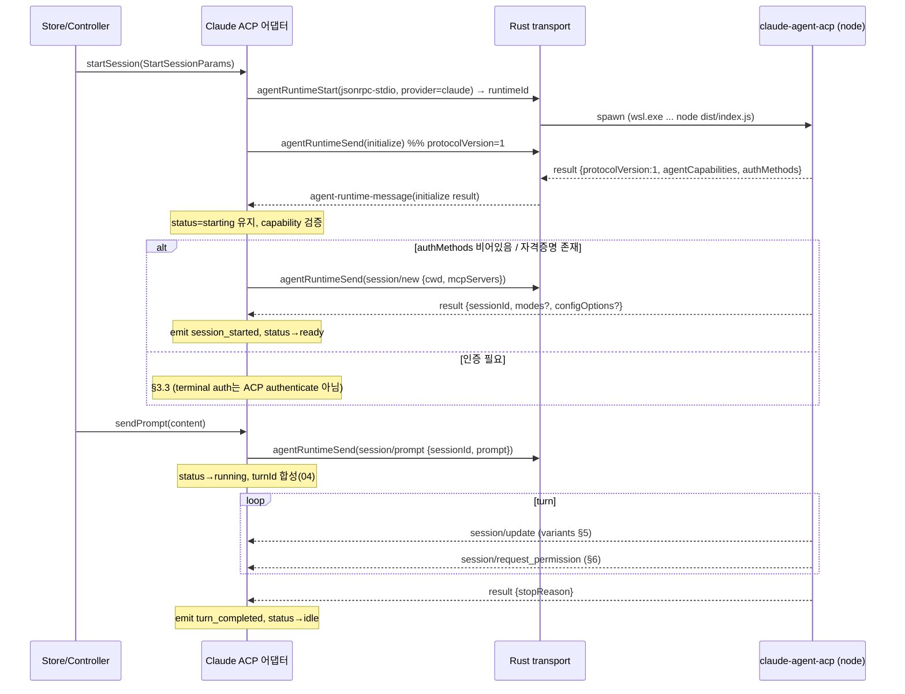

# Claude ACP Adapter

> 이 문서는 CLCOMX가 Claude를 ACP agent로 직접 실행하는 **Claude ACP 어댑터**의 구현 설계다. 다운스트림 구현 에이전트가 이 문서 + 정본 문서만 읽고 어댑터를 작성할 수 있도록 파일 경로·함수 시그니처·의사코드·체크리스트·수용 기준을 담는다.
>
> **권위 분리 (반드시 준수)**
> - **타입 정본**: 모든 공통 타입(`AgentEvent`/`ProviderRef`/`ToolCallUpdate`/`Approval*`/`AgentRuntimeMetadata`/`JsonRpcMessage`/`AgentRuntimeStartParams` 등)은 [`15-data-contracts.md`](15-data-contracts.md)에 정의돼 있다. 이 문서는 그 타입을 **재정의하지 않고** §번호로 인용한다.
> - **규칙 정본**: 상태 머신·upsert/append/replace·approval 생명주기·식별자 라우팅 규칙은 [`04-normalized-agent-model.md`](04-normalized-agent-model.md)에 있다. 이 문서는 그 규칙을 인용한다.
> - **프로토콜 wire 사실**: [`ref-acp-protocol.md`](ref-acp-protocol.md)(ACP v1 wire, ref `schema-v1.16.0`, `protocolVersion = 1`), [`ref-claude-agent-acp.md`](ref-claude-agent-acp.md)(`@agentclientprotocol/claude-agent-acp@0.51.0`, commit `23626c9`).
> - **코드 현실**: [`research/codebase-frontend.md`](research/codebase-frontend.md), [`research/codebase-backend.md`](research/codebase-backend.md).
>
> 미확인/결정 필요 항목은 본문에서 `unverified`/`결정 필요`로 표기하고 [`13-risks-open-questions.md`](13-risks-open-questions.md)로 연결한다.
>
> pinned 버전: `@agentclientprotocol/claude-agent-acp@0.51.0`(commit `23626c9`), 의존 `@anthropic-ai/claude-agent-sdk@0.3.187`, `@agentclientprotocol/sdk@0.29.0`, node `>=22`, ESM (ref-claude-agent-acp §버전 고정).

---

## 1. 어댑터의 책임 경계

Claude는 terminal TUI 출력이 아니라 **ACP agent로 직접 연결**한다. CLCOMX가 ACP **client**가 되고 `claude-agent-acp` process를 subprocess로 실행한다.

레이어 책임은 hexagonal 분리를 따른다([`03-target-architecture.md`](03-target-architecture.md), [`research/codebase-frontend.md`](research/codebase-frontend.md) §8).

| 레이어 | 책임 | 위치 |
|---|---|---|
| Rust transport | process spawn(`wsl.exe`), newline-delimited JSON-RPC framing, stdin write, stdout/stderr reader, graceful shutdown. **protocol 의미를 해석하지 않는다** — raw `JsonRpcMessage`만 emit. | `src-tauri/src/features/agent_runtime/` ([`07-tauri-process-runtime.md`](07-tauri-process-runtime.md), [`research/codebase-backend.md`](research/codebase-backend.md) §9) |
| TS transport client | `agent_runtime_*` command invoke + `agent-runtime-*` event listen 래퍼. | `src/lib/features/agent-runtime/service/transport.ts` (15 §8) |
| **Claude ACP 어댑터** | **ACP wire(JSON-RPC 2.0) ↔ CLCOMX `AgentEvent`/`ApprovalRequest` 변환, lifecycle 메서드 호출, session/update variant 변환, request_permission 응답, pending table 관리.** | `src/lib/features/agent-runtime/adapters/claude-acp/` (본 문서) |
| Event Router / Store | `AgentEvent` → transcript state 적용(upsert/append/replace). | `src/lib/features/agent-runtime/{controller,state,service}/` (04 §3) |

> 핵심: 어댑터는 **frontend TypeScript 모듈**이다. Rust backend는 byte stream framing만 책임지고 protocol 의미를 모른다([`research/codebase-backend.md`](research/codebase-backend.md) §10 권고 2·3, 15 §8.3 "`agent-runtime-message`는 raw JSON-RPC를 그대로 올린다"). 어댑터는 raw `JsonRpcMessage`를 받아 `AgentEvent`로 변환한다.

### 1.1 어댑터 파일 배치 (신규)

기존 feature 레이어 규약([`research/codebase-frontend.md`](research/codebase-frontend.md) §1, §8)에 맞춘 경로. 모두 신규 생성 대상이다.

```
src/lib/features/agent-runtime/
├── adapters/
│   └── claude-acp/
│       ├── claude-acp-adapter.ts          # createClaudeAcpAdapter(deps): AgentRuntimePort 구현 (§3, §4)
│       ├── claude-acp-launch.ts           # buildClaudeAcpLaunchParams(...): AgentRuntimeStartParams 생성 (§2)
│       ├── claude-acp-initialize.ts       # buildInitializeRequest / parseInitializeResponse (§3.2)
│       ├── claude-acp-session-update.ts   # mapSessionUpdate(update): AgentEvent[] (§5)
│       ├── claude-acp-permission.ts       # mapRequestPermission / buildPermissionResponse (§6)
│       ├── claude-acp-content.ts          # mapContentBlock / toAcpPromptContent (§7)
│       ├── claude-acp-mode.ts             # session mode / set_config_option 처리 (§8)
│       ├── claude-acp-pending.ts          # pending request/approval table (§4, §6.3)
│       └── *.test.ts                      # co-located vitest (각 매핑 함수 단위 테스트, §11)
└── contracts/
    └── claude-acp.ts                      # 어댑터 내부 전용 타입(wire shape 부분 + deps interface)
```

> `contracts/normalized.ts`(15 §1–§5)와 `contracts/runtime-port.ts`(15 §6)는 정본이며 어댑터가 import한다. `contracts/claude-acp.ts`는 **ACP wire shape 중 어댑터가 직접 다루는 부분 타입**(SessionUpdate discriminant, RequestPermission shape 등)과 deps interface만 둔다. wire 타입 권위는 ref-acp와 sdk `dist/schema/types.gen.d.ts`다(아래 §1.2).

> **코드 스타일 규약**: 위 파일은 매핑 함수별로 도메인 단위 분리(`session-update`/`permission`/`content`/`pending` 등)를 유지하고(한 파일이 2000줄을 넘으면 추가 분리를 검토), 모든 클래스/함수에 한글 JSDoc 주석을 단다 — 분리·주석 정본은 [`17-coding-conventions.md`](17-coding-conventions.md) §A·§B. 본 문서의 의사코드/시그니처 예시는 그 doc-comment 문체(`/** 기능 1줄 + @param */`)를 따른다.

### 1.2 wire 타입 출처 (재정의 금지 vs 부분 정의 허용)

- **CLCOMX 공통 타입**: 재정의 금지. 15에서 import.
- **ACP wire 타입**: `@agentclientprotocol/sdk@0.29.0`이 `dist/schema/types.gen.d.ts`를 제공한다(ref-claude-agent-acp §2 "어댑터가 바인딩하는 wire RPC method"). 어댑터는 **가능하면 이 sdk 타입을 import**해 wire shape를 다룬다. sdk를 frontend 번들에 직접 의존시키기 부적절하면(번들 크기/ESM 이슈) `contracts/claude-acp.ts`에 **필요한 부분만** 좁게 정의한다 — 단 이는 wire shape의 *부분 미러*이지 CLCOMX 공통 타입이 아니다.
  - sdk를 frontend 의존성으로 둘지, 부분 타입 미러로 갈지는 `결정 필요` → [`13-risks-open-questions.md`](13-risks-open-questions.md). 1차 권고: **부분 타입 미러**(frontend는 raw `JsonRpcMessage`만 다루므로 sdk 런타임 불필요. 어댑터 process는 backend가 spawn하는 별도 node process이고 frontend 번들과 무관). sdk 패키지는 `claude-agent-acp` 어댑터 process가 실행하는 node 의존성으로만 존재한다.

---

## 2. 어댑터 process 실행 (WSL launch)

### 2.1 transport와 launch 계약

ACP transport는 **stdio**다(ref-acp §1 stdio transport, ref-claude-agent-acp §1 "ACP transport는 stdio"). CLCOMX는 `wsl.exe`를 통해 WSL 안에서 node bin을 실행하고, stdin/stdout으로 newline-delimited JSON-RPC 2.0만 주고받는다. stderr는 log stream으로 분리한다.

backend가 받는 기동 파라미터는 정본 `AgentRuntimeStartParams`(15 §8.1)의 `jsonrpc-stdio` + `provider:"claude"` variant다. **renderer/adapter는 실행 파일 `command`를 넘기지 않는다**(S1 정본, R4). backend가 provider로 신뢰 절대경로를 resolve한다 — `claude`는 backend가 resolve한 신뢰 `node` 절대경로다. 어댑터는 `provider`/`distro`/`workDir`/`args`(검증 대상)/`env`(non-secret)만 넘기고, Rust handler가 provider별 allowlist로 command(절대경로)·args(정확 일치)·env key를 재검증한다([`07-tauri-process-runtime.md`](07-tauri-process-runtime.md) §8.1, [`research/codebase-backend.md`](research/codebase-backend.md) §6, §10 권고 6, 15 §8.1 주석). 동명 바이너리(`/tmp/node`)로 우회할 수 없다.

### 2.2 argv 결정 (WSL, absolute path 필수; executable은 backend resolve)

> **S1 정본 (command 비제어)**: adapter는 실행 executable(`node` 절대경로)을 **생성하지 않는다**. backend가 provider=`claude`로 신뢰 `node` 절대경로를 resolve한다(R4, 07 §8.1). adapter가 제어하는 것은 `args`(= `[adapterEntryPath]`, 검증 대상)·`distro`·`workDir`·`env`(non-secret)뿐이다. `adapterEntryPath`도 renderer 자유 입력이 아니라 backend가 resolve/검증하는 절대경로다.

ref-claude-agent-acp §1·§5에서 확정된 사실:

- bin은 `dist/index.js` **하나뿐**이고 transport 선택용 CLI 플래그가 없다(stdio 기본). 어댑터가 argv로 해석하는 건 `--cli`, `--hide-claude-auth`뿐.
- shebang은 `#!/usr/bin/env node`. nvm 등으로 node가 비표준 경로면 node 절대경로 실행이 안전하나, **이 node 절대경로 resolve는 renderer가 아니라 backend의 책임**이다(S1 정본, R4). adapter는 node 경로를 만들지 않는다(ref-claude-agent-acp §5, 07 §8.1).
- **npx는 비권장**(첫 실행 fetch/resolve 지연·비결정성, ref-claude-agent-acp §1 실행 커맨드 표). 1차 backend allowlist(07 §8.1)는 **backend-resolve한 node(신뢰 절대경로) + 검증된 `adapterEntryPath`(절대경로)만 허용**하고 npx는 제외한다(D9). `adapterEntryPath`는 renderer 자유 입력이 아니라 backend가 고정 npm 의존 위치에서 resolve(또는 사전 등록 절대경로)해 검증하는 대상이다(아래 resolve note, 07 §8.1 `is_trusted_adapter_entry_path`). npx 허용은 후속(optional)로만 검토.
- claude native 바이너리는 SDK 번들 optional dependency. `--omit=optional` 설치 금지(ref-claude-agent-acp §1 "claude native binary 해석").

`buildClaudeAcpLaunchParams`가 만드는 값(command 미생성 — backend resolve):

```ts
// src/lib/features/agent-runtime/adapters/claude-acp/claude-acp-launch.ts
import type { AgentRuntimeStartParams } from "../../service/transport"; // 15 §8.1 정본 (command 필드 없음, S1)

export interface ClaudeAcpLaunchConfig {
  distro: string;
  /** WSL absolute path. ACP cwd는 absolute 필수(§7.3). */
  workDir: string;
  /**
   * WSL 안 claude-agent-acp dist/index.js 절대경로.
   * **renderer 자유 입력이 아니다(S1)**: backend가 고정 npm 의존 위치에서 resolve(또는 사전 등록 절대경로)해
   * `is_trusted_adapter_entry_path`로 검증하는 대상이다(07 §8.1, §2.2 resolve note). adapter는 backend가
   * resolve해 deps.resolveLaunch(§4.1)로 돌려준 값을 args[0]에 실어 전달할 뿐 임의 경로를 생성하지 않는다.
   */
  adapterEntryPath: string;
  /**
   * **non-secret env 전용**(C1 보안 경계, 07 §5.1 / 09 정본). 비민감 모델 플래그 등만 싣는다.
   * `ANTHROPIC_API_KEY`/OAuth token/gateway header/session cookie 등 **secret은 여기에 넣지 않는다** —
   * 이 env는 launch argv `-e env KEY=VAL` 경로(07 §5.1)로 흐르고 OS 관측면(ps, /proc/<pid>/cmdline)에
   * 평문 노출되어 §9 redaction으로 막을 수 없다. secret 전달은 §3.3 참고(v1은 claude WSL 자체 인증 의존,
   * 필요 시 backend `Command::env()`+`WSLENV`). 평문 영속화 금지(§9, 15 §7.3 scrub).
   */
  env?: Record<string, string>;
}

export function buildClaudeAcpLaunchParams(cfg: ClaudeAcpLaunchConfig): AgentRuntimeStartParams {
  return {
    transportKind: "jsonrpc-stdio",
    provider: "claude",
    distro: cfg.distro,
    workDir: cfg.workDir,
    // S1 정본: command(node)를 **생성하지 않는다**. backend가 provider="claude"로 신뢰 node 절대경로를
    // resolve한다(R4, 07 §8.1 resolve_trusted_executable). 15 §8.1 AgentRuntimeStartParams에는 command 필드가
    // 없다 — renderer 비제어. adapter가 제어하는 실행 대상은 args[0]=adapterEntryPath(검증된 절대경로)뿐이다.
    // backend allowlist(07 §8.1)는 claude일 때 args.length==1 && args[0]==검증된 adapterEntryPath를 요구한다.
    args: [cfg.adapterEntryPath],
    // C1 경계: env는 non-secret 전용이다(07 §5.1 `-e env KEY=VAL` argv 경로 = OS 관측면 노출).
    // ANTHROPIC_API_KEY 등 secret은 절대 싣지 않는다 — secret이 필요하면 backend가
    // Command::env()+WSLENV로 자식 프로세스 환경에 주입(argv 비경유, 07 §5.1 note, 09).
    env: cfg.env,
  };
}
```

> **command 비제어 (S1 정본, 15 §8.1 동기화)**: 15 §8.1 `AgentRuntimeStartParams`의 `jsonrpc-stdio`+`provider:"claude"` variant에서 `command` 필드는 **제거**된다(renderer 비제어, TS+Rust 미러 동일). 따라서 `buildClaudeAcpLaunchParams`도 `command`/`nodePath`를 만들지 않는다. backend가 provider로 신뢰 node 절대경로를 resolve하고(07 §8.1 `resolve_trusted_executable`), `args[0]`(adapterEntryPath)는 backend가 resolve/검증한 절대경로와 정확 일치해야 한다. 동명 바이너리(`/tmp/node`) 및 임의 `.js` 우회는 거부된다(07 §8.1 3-claude).

> **secret env 경계 (C1 정본, 07 §5.1 / 09 인용)**: `buildClaudeAcpLaunchParams`가 만드는 `env`(= `AgentRuntimeStartParams.env`, 15 §8.1)는 backend에서 `wsl.exe … -e env KEY=VAL …` argv로 흐른다(07 §5.1). argv는 OS 관측면(`ps`, `/proc/<pid>/cmdline`, WSL process 목록)에 평문으로 남으므로 **secret(API key/OAuth token/gateway header/session cookie)을 절대 싣지 않는다** — §9 redaction으로도 막을 수 없다. 따라서 이 env는 **non-secret 전용**이다. secret 전달은 §3.3의 정본 경로(v1은 claude WSL 자체 인증 의존, gateway 등으로 꼭 필요하면 backend `std::process::Command::env()`+`WSLENV` passthrough = argv 비경유)를 따른다. 15 §8.1 타입 자체는 재정의하지 않으며 신뢰 경계 정본은 [`07-tauri-process-runtime.md`](07-tauri-process-runtime.md) §5.1·[`09-permissions-security.md`](09-permissions-security.md)다.
>
> **node/entry 경로 resolve (S1 정본: backend resolve; 세부 방식은 결정 필요)**: `node` 절대경로와 `dist/index.js`(`adapterEntryPath`) 절대경로는 **모두 backend가 resolve/검증하는 대상이며 renderer/adapter가 생성하지 않는다**(S1, R4, 07 §8.1). adapter는 backend가 resolve해 `deps.resolveLaunch`(§4.1)로 돌려준 `adapterEntryPath`만 `args[0]`에 싣는다. backend resolve 후보:
> 1. CLCOMX가 자체 번들한 `node_modules`를 WSL에서 접근 가능한 경로(예: 앱 리소스를 WSL mount 경로로)로 두고 절대경로 고정.
> 2. WSL 안 user 글로벌 설치(`npm i -g @agentclientprotocol/claude-agent-acp`)를 `which`로 resolve.
> 3. backend가 `wsl.exe -d <distro> -e bash -lc "command -v node"` / `node -e "console.log(require.resolve(...))"`로 1회 resolve 후 캐시.
> WSL과 Windows는 홈/노드 설치가 다르므로 어느 쪽 node·패키지를 쓰는지 명확히 해야 한다(ref-claude-agent-acp §5 "node 위치", "자격증명 경로"). 1차 구현 권고: **방식 3(backend resolve) + 캐시**, 실패 시 명확한 setup 에러. resolve 주체·캐시 무효화·adapterEntryPath 탐색 방식은 `결정 필요` → [`13-risks-open-questions.md`](13-risks-open-questions.md)("command/entry resolve 주체"). 어느 방식이든 결과 절대경로를 backend가 `resolve_trusted_executable`(node)·`is_trusted_adapter_entry_path`(entry)로 재검증한다(07 §8.1).

### 2.3 backend가 조립하는 실제 WSL 커맨드

backend(`features/agent_runtime/process.rs`)는 PTY와 동일한 WSL 경계를 유지하되 PTY가 아니라 piped stdio로 띄운다([`research/codebase-backend.md`](research/codebase-backend.md) §5.1, §9). 정본 커맨드 형태는 **로그인 셸 비경유 직접 실행**이다([`07-tauri-process-runtime.md`](07-tauri-process-runtime.md) §5.1 backend 정본):

```
wsl.exe -d <distro> --cd <wslWorkDir> -e env KEY1=V1 KEY2=V2 <backend-resolved node 절대경로> <adapterEntryPath> <argv...>
```

> executable(`node` 절대경로)은 adapter가 넘기지 않고 **backend가 provider로 resolve한 신뢰 절대경로**다(S1, 07 §8.1). adapter가 제어하는 argv는 `[adapterEntryPath]`(검증된 절대경로)뿐이다.

- `--cd <wslWorkDir>`로 cwd를 설정한다(셸 `cd` 불필요, OQ-27 해소).
- `env KEY=VAL ...`는 WSL 실제 `env(1)` 바이너리로, 셸 메타문자 해석 없이 환경변수를 그대로 주입한다(OQ-28 해소). node/argv는 그 뒤에 직접 온다.
- stdout = ACP JSON-RPC 전용, stderr = log. **로그인 셸을 경유하지 않으므로** `bash -lic`의 login/rc 출력이 stdout framing을 깨뜨릴 우려가 원천 해소된다(셸 startup 메시지 자체가 없음, ref-claude-agent-acp §5 "stdout 청결").
- 어댑터 자체는 `console.log`를 `console.error`로 redirect해 stdout을 ACP 전용으로 지킨다(ref-claude-agent-acp §1). stdout에 ACP 아닌 텍스트가 섞이면 protocol error로 처리(§9).

### 2.4 launch 실패 분류

| 실패 | 신호 | 어댑터 처리 |
|---|---|---|
| node 없음/버전 < 22 | backend `agent-runtime-exit`(즉시 비정상 종료) 또는 stderr | `error{recoverable:false}` + setup 안내 + PTY fallback 제안(§10) |
| entry 경로 못 찾음 | spawn 실패 → `agent-runtime-error` | 동상 |
| optional dep 누락(native binary 없음) | initialize는 되나 prompt 시 SDK 에러(stderr/`error` notification) | `error` + 재설치 안내(ref-claude-agent-acp §1) |
| 자격증명 없음 | initialize 응답의 `authMethods` 비어있지 않음 / prompt 시 `-32000` | §3.3 인증 흐름 |

---

## 3. Lifecycle: initialize → session → prompt

전이 규칙은 04 §2(상태 머신)를 따른다. `starting`→`ready`는 process spawn + `initialize` + `session/new|load|resume` 완료 시점(04 §2.1 규칙 1, [`07-tauri-process-runtime.md`](07-tauri-process-runtime.md) "process start와 protocol initialize를 분리").



### 3.1 lifecycle 단계 (구현 순서)

1. `initialize`로 protocol version(=1)과 capability 협상(§3.2).
2. 필요 시 인증 처리(§3.3). 일반 케이스(이미 `claude` 로그인)는 생략.
3. 새 대화는 `session/new`(§3.4). 기존 대화는 capability 확인 후 `session/load`(replay) 또는 `session/resume`(no replay)(§3.5).
4. prompt는 `session/prompt`(§3.6). 출력/상태는 `session/update` notification(§5)·`session/request_permission`(§6)으로 수신.
5. cancel은 `session/cancel` notification(§4.3). 종료는 graceful shutdown(§4.4).

### 3.2 initialize (capability negotiation, protocolVersion=1)

정확한 params/result는 ref-acp §3.1. 어댑터가 보내는 `clientCapabilities`는 **client가 광고해야만 agent 기능이 켜지는** 게이트다(ref-claude-agent-acp §2 "주의(게이트)"). CLCOMX가 광고할 capability 결정표:

| capability | 1차 값 | 근거/효과 |
|---|---|---|
| `protocolVersion` | `1` | ref-acp §0, ref-claude-agent-acp §4. 어댑터는 항상 `1` 회신(ref-claude-agent-acp §2). 불일치 시 protocol error(§9). |
| `clientCapabilities.fs.readTextFile` / `writeTextFile` | `false`(1차) | true면 어댑터가 `fs/read_text_file`/`fs/write_text_file`로 client가 IO를 대행(ref-acp §7). 1차는 어댑터 SDK 자체 IO에 맡기고 client fs 미광고. (`결정 필요`: editor 통합 시 true 검토 → 13) |
| `clientCapabilities.terminal` | `false`(1차) | true면 `terminal/*`로 명령 실행 terminal을 client가 호스팅(ref-acp §8). 1차는 tool_call content(terminal embed)를 어댑터가 채우게 두고 client terminal 미광고. (후속: command output을 CLCOMX terminal surface로 끌어올릴 때 true) |
| `clientCapabilities._meta["terminal_output"]` | `false`(1차) | 어댑터의 terminal_info/terminal_output/terminal_exit meta 게이트(ref-claude-agent-acp §2). 1차 미광고. |
| `clientCapabilities.auth.terminal` / `_meta["terminal-auth"]` | §3.3 결정 | 광고 시 어댑터가 terminal auth method 제시(ref-claude-agent-acp §1 인증 표). |
| `clientCapabilities.elicitation.form` / `.url` | `false`(1차) | true면 `AskUserQuestion`이 form elicitation으로 surface(ref-claude-agent-acp §3 request_permission 1번). 1차 미광고 → `AskUserQuestion`이 어떻게 오는지 확인 필요(`결정 필요`, 13). |
| `clientInfo` | `{name:"clcomx", version:<앱버전>}` | ref-acp §3.1. branding 주의(§9, 13). |

```ts
// claude-acp-initialize.ts (개념 시그니처)
import type { JsonRpcMessage } from "../../service/transport"; // 15 §8.1

export interface ClaudeAcpClientCapabilities {
  fs: { readTextFile: boolean; writeTextFile: boolean };
  terminal: boolean;
  // elicitation / auth / _meta는 1차 값에 따라 선택 포함
}

export function buildInitializeRequest(opts: {
  id: string | number;
  appVersion: string;
  capabilities: ClaudeAcpClientCapabilities;
}): JsonRpcMessage {
  return {
    jsonrpc: "2.0",
    id: opts.id,
    method: "initialize",
    params: {
      protocolVersion: 1,
      clientCapabilities: opts.capabilities,
      clientInfo: { name: "clcomx", version: opts.appVersion },
    },
  };
}

export interface ParsedInitialize {
  protocolVersion: number;
  agentCapabilities: unknown; // 부분 미러; loadSession/sessionCapabilities/promptCapabilities 추출
  authMethods: Array<{ id: string; name: string; description?: string }>; // ref-acp §3.2 AuthMethodAgent
  /** loadSession capability(top-level bool, ref-acp §3.2). */
  canLoad: boolean;
  /** sessionCapabilities.resume({} = 지원). */
  canResume: boolean;
  promptImage: boolean;       // promptCapabilities.image
  promptEmbeddedContext: boolean;
}
```

**검증 규칙(`parseInitializeResponse`)**:
1. `protocolVersion !== 1`이면 protocol error(§9), `status→failed`, fallback 제안(ref-acp §3.1 "Client가 응답 버전 미지원이면 연결 SHOULD 닫기").
2. capability **위치 비대칭** 주의: `loadSession`은 **top-level bool**, `resume`은 `sessionCapabilities.resume`(`{}`=지원)에서 읽는다(ref-acp §3.5 "구현 주의"). 한 쪽에서 다른 쪽을 찾으면 항상 미지원 오판.
3. `agentCapabilities`는 ref-claude-agent-acp §2 표 기준 0.51.0에서 `loadSession:true`, `sessionCapabilities.resume:{}`, `promptCapabilities.image:true, embeddedContext:true`가 온다 — 그러나 **값을 하드코딩하지 말고 응답에서 읽어** persistence metadata(`canLoad`/`canResume`, 15 §7.1)와 composer content 게이트(§7)에 반영한다(0.x minor마다 변할 수 있음, ref-claude-agent-acp §4).
4. `authMethods`가 비어있지 않으면 인증 미완 가능성 → §3.3.

> initialize 협상 완료는 event가 아니다(ref-acp §13.1). `ProviderRef.provider="claude"`를 확정하고 내부 상태만 갱신한다. `agentCapabilities`/`agentInfo.version`은 `AgentRuntimeMetadata.protocolVersion`/`providerVersion`/`adapterVersion`(15 §7.1)에 보존한다.

### 3.3 인증(authentication)

ref-claude-agent-acp §1 "인증 전제"가 권위다. **핵심: terminal 로그인은 ACP `authenticate` RPC로 수행되지 않는다** — `authenticate(params)`는 `gateway`/`gateway-bedrock` methodId만 구현하고 그 외(terminal method)는 `throw "Method not implemented."`(ref-claude-agent-acp §1).

| 경로 | 전제 | 어댑터 동작 |
|---|---|---|
| **이미 로그인됨**(v1 기본) | WSL 측 `~/.claude` 또는 `CLAUDE_CONFIG_DIR`에 자격증명 존재(`claude login`/config) | 별도 인증 없이 바로 `session/new`. **v1 정본 경로** — secret을 런타임으로 전혀 넘기지 않는다(C1, 07 §5.1 v1 기본값). |
| **API key (secret env)** | gateway 등으로 `ANTHROPIC_API_KEY`(또는 Bedrock/Vertex/Foundry env)가 꼭 필요한 경우 | **launch argv `-e env`로 넘기지 않는다**(C1: OS 관측면 평문 노출, 07 §5.1). backend가 `std::process::Command::env()`로 `wsl.exe` 프로세스 환경에 secret을 설정하고 `WSLENV`(예: `WSLENV=ANTHROPIC_API_KEY/u`)로 WSL 측에 passthrough(argv 비경유). interactive login 불필요. 평문 영속화 금지(§9, 15 §7.3 scrub). v1은 secret 미전달이 기본이며 이 경로는 gateway 등 명시적 필요 시에만. |
| **terminal 구독/Console 로그인** | client가 `auth.terminal`/`_meta["terminal-auth"]` 광고 | 어댑터가 terminal auth method 제시, 실제 로그인은 `--cli auth login --claudeai`/`--console` passthrough를 **별도 터미널**에서 실행(ref-claude-agent-acp §1 표). non-remote에서만 `claude-ai-login`/`console-login` 제시, remote(SSH 등)는 `claude-login`만(ref-claude-agent-acp §1 "remote 분기 주의"). |
| **gateway** | client가 `auth._meta.gateway===true` 광고 | `authenticate` 요청에 `_meta.gateway.{baseUrl, headers}` 채워 보냄. gateway header 등 secret 값은 argv가 아니라 backend `Command::env()`+`WSLENV` secret 경로로 자식 환경에 주입한다(C1, 07 §5.1). 어댑터가 query 시 env 합성(ref-claude-agent-acp §1 authenticate 처리). |

> **1차 인증 정책(정본)**: v1은 **WSL 측 자체 인증(`claude login`/config)에 의존**하고 secret env를 런타임으로 넘기지 않는다(C1 기본값, 07 §5.1). gateway 등으로 API key가 꼭 필요하면 launch argv(`-e env KEY=VAL`)가 아니라 backend `std::process::Command::env()`+`WSLENV` passthrough로만 secret을 자식 프로세스 환경에 주입한다(argv 비경유 → `ps`/`/proc/<pid>/cmdline` 평문 노출 방지). terminal/gateway interactive 인증은 후속으로 둔다 — terminal auth를 켜려면 CLCOMX가 PTY로 `claude /login`을 띄우는 별도 UX가 필요(WSL 경계). 이는 `결정 필요` → [`13-risks-open-questions.md`](13-risks-open-questions.md). WSL 환경에서 SSH env(`SSH_CONNECTION` 등)가 설정돼 있으면 어댑터가 remote로 오판해 `claude-login`만 제시할 수 있으니 launch env를 점검한다(ref-claude-agent-acp §1).

### 3.4 session/new

params/result: ref-acp §3.3 (`required: cwd, mcpServers`). `cwd`는 absolute MUST(§7.3). 1차는 `mcpServers: []`, `additionalDirectories: []`.

```ts
// claude-acp-adapter.ts (개념)
function buildNewSession(id, sessionId_unused, p: { cwd: string }): JsonRpcMessage {
  return { jsonrpc: "2.0", id, method: "session/new",
    params: { cwd: p.cwd, mcpServers: [], additionalDirectories: [] } };
}
```

result 처리:
- `result.sessionId` → `ProviderRef.sessionId` 보존(15 §1.1, 컨벤션 §0.1). `emit { type:"session_started", ref, cwd }`(15 §3, §13.1). `status→ready`.
- `result.modes`(`SessionModeState`) → 현재/가용 mode 보관(§8). `result.configOptions` → config selector 보관(§8).
- MCP 서버를 후속에 붙이려면 `McpServer`(stdio/http/sse) 구성은 ref-acp §9. http/sse는 어댑터 `mcpCapabilities.http/sse:true`(ref-claude-agent-acp §2)에 의존.

### 3.5 session/load (replay) vs session/resume (no replay)

선택 기준은 persistence metadata(15 §7.1)의 `canLoad`/`canResume`와 `replay` 의도(`ResumeSessionParams.replay`, 15 §6).

| 메서드 | capability gate | 동작 | params(ref) |
|---|---|---|---|
| `session/load` | `agentCapabilities.loadSession`(top-level) | **replay**: 응답 전 `session/update`들로 transcript 재구성(ref-acp §3.4) | `{sessionId, cwd, mcpServers, additionalDirectories?}` |
| `session/resume` | `sessionCapabilities.resume` | replay 없이 세션 재개 | `{sessionId, cwd, additionalDirectories?, mcpServers?}` |

**replay 처리 규칙(load)**: load 응답(`LoadSessionResponse`)을 받기 전에 들어오는 `session/update`는 **transcript 재구성용**으로 처리한다(ref-acp §3.4, ref-acp §13.1). 어댑터는 "load 진행 중" 플래그를 두고, 이 동안의 update는 `emit`하되 store가 replay임을 알 수 있게 한다(`session_loaded` event를 먼저 emit하거나 replay 플래그 전달 — 04 §3과 store 설계 소관). `user_message_chunk`도 이 경로로 온다(ref-claude-agent-acp §2 variant 표 비고).

```ts
// resume/load 분기 (개념)
function buildLoadOrResume(id, p: ResumeSessionParams, caps: ParsedInitialize): JsonRpcMessage {
  const base = { sessionId: p.providerSessionId, cwd: p.workDir };
  if (p.replay) {
    if (!caps.canLoad) throw new AdapterError("loadSession unsupported"); // §9 / fallback §10
    return { jsonrpc: "2.0", id, method: "session/load",
      params: { ...base, mcpServers: [], additionalDirectories: [] } };
  }
  if (!caps.canResume) throw new AdapterError("resume unsupported");
  return { jsonrpc: "2.0", id, method: "session/resume",
    params: { ...base, mcpServers: [], additionalDirectories: [] } };
}
```

result 처리: 둘 다 `{modes?, configOptions?}`. `emit { type:"session_loaded", ref }`(15 §3). resume는 replay 없음(ref-acp §13.1).

### 3.6 session/prompt + stopReason

params: ref-acp §3.6 (`required: sessionId, prompt`). `prompt`는 `ContentBlock[]`(§7). turn id는 ACP wire에 없으므로 CLCOMX가 prompt 단위로 합성한다(04 §"turn id 합성 규칙": `<sessionId>:t<n>`). 그 turn 동안 발생하는 모든 `AgentEvent.ref.turnId`에 같은 값을 넣는다.

전송 시: `status→running`(04 §2.1 규칙 2 + ref-acp §13.1 "session/prompt 전송 → running"). accepted 개념은 response가 아니라 turn 시작 시점이다(04 §2.1 + ref-acp §13.1).

응답 `stopReason`(closed enum 5종, ref-acp §3.6 — default branch 불필요):

| stopReason | CLCOMX 변환 | ref-acp §13.1 |
|---|---|---|
| `end_turn` / `max_tokens` / `max_turn_requests` | `turn_completed{status:"completed"}` + `session_status_changed: idle` | |
| `cancelled` | `turn_completed{status:"cancelled"}` | cancel MUST 반환값 |
| `refusal` | `turn_completed{status:"completed"}` + UI 거부 표시 | refusal은 CLCOMX status enum에 없음 → metadata 보존 |

`usage_update`로 받은 마지막 `TokenUsage`를 `turn_completed.usage`에 동승할 수 있다(15 §3, §5; ACP `UsageUpdate{used,size}`는 inputTokens 등으로 직접 매핑 안 되므로 `used` 보강 또는 raw 보존, 15 §5 주의).

---

## 4. AgentRuntimePort 구현 매핑

어댑터는 `AgentRuntimePort`(15 §6)를 구현한다. 메서드별 ACP 동작:

| Port 메서드(15 §6) | ACP 동작 | 절 |
|---|---|---|
| `startSession` | `agentRuntimeStart` → `initialize` → `session/new` | §2, §3.2, §3.4 |
| `resumeSession` | `agentRuntimeStart` → `initialize` → `session/load`\|`session/resume` | §3.5 |
| `sendPrompt` | `session/prompt`(content는 §7로 변환) | §3.6, §7 |
| `cancelTurn` | `session/cancel` notification + pending approval cleanup | §4.3 |
| `respondApproval` | `session/request_permission` response 전송 | §6 |
| `subscribeEvents` | `agent-runtime-message` listen → `JsonRpcMessage` → `AgentEvent[]` 변환 후 listener 호출 | §5, §6 |
| `shutdown` | graceful shutdown(stdin close → timeout → kill) | §4.4 |

### 4.1 어댑터 deps (DI, controller 패턴)

[`research/codebase-frontend.md`](research/codebase-frontend.md) §1.5 DI 패턴. 어댑터는 `invoke`/`listen`을 직접 부르지 않고 transport client(15 §8)를 deps로 받는다 → vitest에서 `vi.fn()` 모킹 가능([`research/codebase-frontend.md`](research/codebase-frontend.md) §1.6, §8).

```ts
// claude-acp-adapter.ts
import type {
  AgentRuntimePort, StartSessionParams, ResumeSessionParams,
  SendPromptInput, SessionStartResult, AgentSessionHandle,
} from "../../contracts/runtime-port";        // 15 §6 정본
import type { AgentEvent, ApprovalDecision, ProviderRef } from "../../contracts/normalized"; // 15 §1–§5 정본
import type {
  RuntimeId, JsonRpcMessage, AgentRuntimeEvent, AgentRuntimeStartParams, AgentRuntimeCancelTarget,
} from "../../service/transport";             // 15 §8 정본
import type { UnlistenFn } from "$lib/tauri/event";

export interface ClaudeAcpAdapterDeps {
  /** 15 §8.2 invoke 래퍼. */
  startRuntime(params: AgentRuntimeStartParams): Promise<RuntimeId>;
  sendMessage(runtimeId: RuntimeId, message: JsonRpcMessage): Promise<void>;
  cancelRuntime(runtimeId: RuntimeId, target: AgentRuntimeCancelTarget): Promise<void>;
  shutdownRuntime(runtimeId: RuntimeId): Promise<void>;
  /** 15 §8.3 agent-runtime-* 이벤트 구독. */
  subscribeRuntime(runtimeId: RuntimeId, handler: (e: AgentRuntimeEvent) => void): UnlistenFn;
  /**
   * WSL entry 경로 resolve(§2.2). S1 정본: `node` 절대경로(command)는 backend가 resolve하고 start params에
   * 싣지 않으므로 여기서 돌려주지 않는다. adapter가 받는 값은 backend가 resolve/검증할 `adapterEntryPath`
   * (args[0]에 실음) + non-secret env뿐이다.
   */
  resolveLaunch(p: StartSessionParams | ResumeSessionParams): Promise<{ adapterEntryPath: string; env?: Record<string, string> }>;
  /** 단조 증가 JSON-RPC id 발급기. */
  nextRequestId(): number;
  /** 앱 버전(initialize clientInfo). */
  appVersion: string;
  now(): number;
}

export function createClaudeAcpAdapter(deps: ClaudeAcpAdapterDeps): AgentRuntimePort { /* §4.2 */ }
```

### 4.2 내부 상태와 라우팅

어댑터는 sessionHandle 단위로 다음을 보관한다(ACP 라우팅 키, 04 §1):

```ts
interface ClaudeAcpSessionRuntime {
  sessionHandle: AgentSessionHandle;
  runtimeId: RuntimeId;
  providerSessionId?: string;       // session/new|load|resume result
  caps?: ParsedInitialize;          // §3.2
  turnSeq: number;                  // turnId 합성 카운터(04 §turn id 합성)
  activeTurnId?: string;            // 현재 진행 turn(<sessionId>:t<n>)
  // pending 매칭(§4.3, §6.3)
  pendingRequests: Map<string | number, PendingRequest>; // client→agent 요청 응답 매칭
  pendingApprovals: Map<string, PendingApproval>;        // agent→client request_permission, key=String(rpcId); PendingApproval.rpcId가 원본 타입 보존(§6.1, R3)
  loadingReplay: boolean;           // session/load replay 진행 플래그(§3.5)
  // session/update 상태
  currentMessageId?: string;        // ContentChunk.messageId 그룹핑(04 §3.3)
  modes?: { currentModeId: string; availableModes: Array<{ id: string; name: string; description?: string }> };
  configOptions?: unknown[];        // §8
  lastUsage?: unknown;              // usage_update → turn_completed.usage
}
```

라우팅(04 §1, 15 §1.1):
- 메시지 event: `ProviderRef = { provider:"claude", sessionId, messageId, turnId: activeTurnId }`.
- tool call event: `ProviderRef = { provider:"claude", sessionId, toolCallId, turnId: activeTurnId }`.
- approval event: `ProviderRef = { provider:"claude", sessionId, requestId, turnId: activeTurnId }`.
- 매핑 안 된 payload는 `ProviderRef.raw`(컨벤션 §0.2).

> ACP는 한 process에 1 session이 일반적이지만(turn id가 wire에 없음, 04 §1), 어댑터는 `sessionId`로 라우팅해 멀티세션을 방어적으로 지원한다. `agent-runtime-message`는 runtimeId로 도착하므로 sessionHandle↔runtimeId 매핑 + message params의 `sessionId`로 dispatch한다.

### 4.3 cancelTurn → cleanup 순서 (approval cancelled 먼저 → session/cancel 나중)

`session/cancel`은 notification(응답 없음, ref-acp §3.8). cancel 시 cleanup 순서·불변식은 **04 §4.2가 권위**다. cleanup 순서는 단일 정본으로 통일된다 — **pending approval에 `cancelled` 응답을 먼저 보내고 그 다음에 `session/cancel` notification을 보낸다**(approval-first). 이는 cancel을 받은 agent가 turn 종료를 진행하기 전에 client가 이미 모든 pending approval을 닫았음을 보장해, agent 쪽 turn 종료 처리와 client 쪽 approval 응답이 교차하며 생기는 이중 응답·deadlock을 막는다(04 §4.2).

정본 순서(04 §4.2):
1. **해당 turn의 pending approval을 원자적으로 `closing`으로 표시**한다(이중 응답 방지). 이후 도착하는 동일 requestId 응답·resolve는 멱등하게 무시(아래 4단계).
2. **각 pending approval에 `cancelled` 응답을 wire로 먼저 보낸다**(ACP `{ jsonrpc:"2.0", id, result:{outcome:{outcome:"cancelled"}} }`, ref-acp §6·§3.8 MUST). 동시에 `approval_resolved{outcome:"cancelled"}` emit + pending table에서 제거.
3. **그 다음 `session/cancel` notification을 보낸다**(id 없음, ref-acp §3.8).
4. **cancel 이후 도착하는 늦은 resolved/stopReason/동일 requestId 응답은 멱등하게 무시**한다(이미 `closing`/closed). `stopReason:"cancelled"`는 `session/prompt` 응답으로 따로 도착 → `turn_completed{cancelled}`(이미 정리된 approval은 재처리하지 않음).

```ts
async function cancelTurn(handle, turnId?) {
  const rt = byHandle(handle);
  // 1. 해당 turn의 pending approval을 원자적으로 closing 표시(이중 응답 방지, 04 §4.2 규칙 1).
  //    closing 표시 후 도착하는 동일 requestId 응답/resolve는 멱등 무시(4단계).
  const closing = [...rt.pendingApprovals.entries()].filter(([, ap]) => !turnId || ap.ref.turnId === turnId);
  for (const [id] of closing) rt.pendingApprovals.get(id)!.closing = true;
  // 2. pending approval에 cancelled 응답을 wire로 먼저 보낸다(ref-acp §3.8 MUST, ref-acp §6).
  //    + approval_resolved emit + pending table에서 제거.
  for (const [id, ap] of closing) {
    // wire 응답은 보존한 원본 rpcId(타입 유지)로 — Map 키 id(String)가 아니라 ap.rpcId 사용(R3, §6.2).
    await deps.sendMessage(rt.runtimeId, buildPermissionResponse(ap.rpcId, { outcome: "cancelled" })); // §6.2
    emit({ type: "approval_resolved", ref: ap.ref, decision: { requestId: String(id), outcome: "cancelled" } });
    rt.pendingApprovals.delete(id);
  }
  // 3. 그 다음 session/cancel notification(id 없음, ref-acp §3.8).
  await deps.sendMessage(rt.runtimeId, {
    jsonrpc: "2.0", method: "session/cancel", params: { sessionId: rt.providerSessionId },
  });
  // 4. cancel 이후 도착하는 늦은 resolved/stopReason/동일 requestId 응답은 멱등 무시(이미 closing/closed, 04 §4.2 규칙 4).
  //    미완료 tool call은 client가 cancelled로 합성(ACP wire엔 cancelled status 없음, ref-acp §5)
  //    → store가 활성 turn의 미완료 tool call status를 "cancelled"로 표시(04 §3, 15 §5 주의).
  //    stopReason:"cancelled"는 session/prompt 응답으로 따로 도착 → turn_completed{cancelled}.
}
```

> 순서 정본화 배경(Codex 검토): 기존 구현은 `session/cancel`을 먼저 보내고 approval cancelled를 나중에 처리했으나, approval-first(2단계) → session/cancel(3단계)로 **뒤집는다**. `closing` 표시(1단계)와 멱등 무시(4단계)로 cancel과 사용자 응답이 교차해도 한 requestId에 두 번 응답하지 않는다. 상태·멱등 규칙의 정본은 04 §4.2다.
> `PendingApproval`에 `closing` 표시 필드를 둔다(어댑터 내부 전용, `contracts/claude-acp.ts`). `respondApproval`(§6.2)도 `closing`/부재 시 멱등 무시한다.
> cleanup 누락은 approval deadlock 위험([`13-risks-open-questions.md`](13-risks-open-questions.md) "Approval deadlock"). cancel 시 모든 pending approval에 `cancelled` 응답은 ACP MUST(ref-acp §3.8, 04 §4.2 규칙 1).

### 4.4 shutdown (authoritative cleanup 경계, S3)

`agent_runtime_shutdown`을 **authoritative cleanup 경계**로 정의한다(S3 정본). pending 종료는 멱등하며 정확히 한 번만 수행된다(이중 종료/누락 없음). 순서·멱등 규칙의 권위는 04 §5, 14다.

**(a) adapter — pending 종료 → backend shutdown await → listener 해제 순서**:
1. (process가 아직 살아 있으므로) 모든 pending approval을 `cancelled`로 닫는다(04 §4.2/§5, ref-acp §3.8 MUST). §4.3/§6.3 cleanup과 동일한 `closing` 표시 + wire `cancelled` 응답 + `approval_resolved{cancelled}` emit + table 제거 경로를 쓴다. **이때 listener는 살아 있어야** 닫는 도중 처리가 정상 동작한다.
2. pending RPC(client→agent 요청, `pendingRequests`)를 **로컬에서 reject**한다(응답을 더 못 받으므로 `error`/실패로 settle).
3. `deps.shutdownRuntime`(15 §8.2 `agentRuntimeShutdown`)을 **await**한다 — backend가 stdin close → grace → kill → child reap까지 끝낸 뒤 반환한다((b)). 그 사이 도착하는 늦은 exit/응답은 멱등 무시된다((c)).
4. shutdown이 **반환된 뒤에만** `subscribeRuntime`의 `UnlistenFn`을 호출해 listener를 해제하고 세션 런타임(`ClaudeAcpSessionRuntime`)을 삭제한다.

   순서가 핵심이다 — **pending 종료 → backend shutdown(reap) await → 그다음 unlisten/세션 삭제**여야, shutdown 도중의 최종 exit과 늦은 응답을 listener가 멱등 처리한 뒤 안전하게 정리된다. unlisten을 backend shutdown보다 **먼저** 하면 exit event·늦은 메시지를 놓친다.

**(b) backend — reap 후 반환**: backend `agent_runtime_shutdown`은 graceful stdin close(EOF) → grace timeout → kill → **child reap(`wait`)까지 끝낸 뒤 반환**한다(07 §5.2/§5.3). 최종 exit이 반영·계상된 후에만 teardown(HashMap 제거 등)이 일어난다.

**(c) 멱등·정확히 한 번**: exit(`agent-runtime-exit`)으로 인한 pending 종료와 shutdown으로 인한 pending 종료는 **멱등하며 정확히 한 번만** 수행된다. 어댑터는 `agent-runtime-exit` 수신 시 `emit { type:"process_exited", ref, code?, signal? }`하고 남은 pending approval/request를 닫되, 이미 (a)에서 닫힌 항목은 `closing`/closed 표시로 멱등 무시한다(04 §4.2 규칙 4, §5). exit이 shutdown보다 먼저 오든 나중에 오든 같은 pending을 두 번 닫지 않고, 어느 경로로도 빠뜨리지 않는다.

> ACP는 `session/close`(`sessionCapabilities.close`)도 있다(ref-acp §2). 1차는 process shutdown으로 충분하나, 한 process에 여러 session을 둘 경우 session별 close가 필요할 수 있다(`결정 필요`, 13).

---

## 5. session/update variant → AgentEvent 변환

`mapSessionUpdate(rt, update): AgentEvent[]`가 핵심 변환 함수다. discriminant는 `update.sessionUpdate`(snake_case). 런타임 wire에 등장할 수 있는 **정본 variant 집합은 13종**(sdk 0.29.0 schema 기준)이다: `user_message_chunk`, `agent_message_chunk`, `agent_thought_chunk`, `tool_call`, `tool_call_update`, `plan`, `plan_update`, `plan_removed`, `available_commands_update`, `current_mode_update`, `config_option_update`, `session_info_update`, `usage_update`. ref-acp §2(출처별 11/13 분기 — `plan_update`/`plan_removed`는 sdk 0.29.0 전용), ref-claude-agent-acp §2 표(동일 13종)가 권위이며, 매핑 정본은 ref-acp §13.2/§13.3/§13.4다. 작업 지시가 명시한 **8개 핵심 variant**를 우선 구현하고, 나머지(`plan_update`/`plan_removed`/`config_option_update`/`session_info_update`/`usage_update`)는 방어적으로 처리한다.

> **불변식(04 §3.3)**: ACP는 **chunk=append, update=replace** 두 의미가 섞인다. `*_chunk`는 `messageId` 기준 append(값 바뀌면 새 메시지), `tool_call_update.content`/`locations`와 `plan`은 **전체 교체**(replace). adapter는 수신 순서를 보존한다(04 §3.4). 알 수 없는 `session/update` variant(=id 없는 **notification**)는 raw 보존 + counter로 가시화한 뒤 graceful하게 무시한다(응답 불필요, 04 §5, ref-claude-agent-acp §2, ref-acp §2). 단 **id가 있는 server→client REQUEST**는 무응답 폐기하면 안 된다 — 미지원 method라도 반드시 응답한다(§6.4, R5).

### 5.1 변환표 (8개 핵심 + 보조)

| `sessionUpdate` | payload(ref-acp) | AgentEvent(15 §3) | upsert/replace 규칙(04 §3) |
|---|---|---|---|
| `agent_message_chunk` | `ContentChunk` | `agent_message_delta{delta}`(text면) 또는 `agent_message{mode:"append"}` | messageId 기준 append. messageId 바뀌면 새 메시지(§5.2) |
| `agent_thought_chunk` | `ContentChunk` | `agent_message_delta{channel:"thought"}`(text면) 또는 `agent_message{channel:"thought", mode:"append"}`(15 §3) | messageId 기준 thought 스트림 append(§5.3) |
| `user_message_chunk` | `ContentChunk` | `user_message{mode:"append"}` | replay 경로(§3.5). messageId 기준 append |
| `tool_call` | `ToolCall` | `tool_call_updated{update}`(신규 upsert) | toolCallId 기준 신규 생성(§5.4) |
| `tool_call_update` | `ToolCallUpdate` | `tool_call_updated{update}`(부분 갱신) | toolCallId 기준 upsert. content/locations는 **replace**(§5.4) |
| `plan` | `Plan` | `plan_updated{entries}` | 전체 교체(§5.5) |
| `available_commands_update` | `AvailableCommandsUpdate` | (전용 event 없음, ref-acp §13.2) → command palette 상태 갱신(§5.6) | 전체 교체 |
| `current_mode_update` | `CurrentModeUpdate{currentModeId}` | (전용 event 없음) → mode 상태 갱신(§8) | 현재 mode 갱신 |
| `config_option_update` | `ConfigOptionUpdate{configOptions}` | (전용 event 없음) → config 상태 갱신(§8) | 전체 set 교체 |
| `session_info_update` | `SessionInfoUpdate{title?,updatedAt?}` | (전용 event 없음) → 세션 title 갱신 | null=clear |
| `usage_update` | `UsageUpdate{used,size,cost?}` | `turn_completed.usage` 동승용 보관(§3.6) | 최신값 보관 |
| `plan_update`/`plan_removed` | — | 어댑터 미관측(ref-claude-agent-acp §2) → 방어적 무시 또는 raw | — |

### 5.2 메시지 chunk (agent/user)

```ts
function mapMessageChunk(rt, update, kind: "agent" | "user"): AgentEvent[] {
  const chunk = update; // ContentChunk: { content: ContentBlock, messageId? }
  const msgId = chunk.messageId ?? rt.currentMessageId; // null이면 직전 유지(방어)
  if (msgId !== rt.currentMessageId) rt.currentMessageId = msgId; // 바뀌면 새 메시지 시작(04 §3.3)
  const ref: ProviderRef = { provider: "claude", sessionId: rt.providerSessionId, messageId: msgId, turnId: rt.activeTurnId, raw: chunk._meta };
  const content = mapContentBlock(chunk.content); // §7 → AgentContent
  if (kind === "agent" && content.type === "text") {
    return [{ type: "agent_message_delta", ref, delta: content.text }]; // 15 §3
  }
  return [{ type: kind === "agent" ? "agent_message" : "user_message", ref, content: [content], mode: "append" }];
}
```

> `agent_message_chunk`는 ACP에서 **chunk이지 완결 메시지가 아니다**(ref-claude-agent-acp §2 비고 "agent_message가 아니라 agent_message_chunk"). text는 `agent_message_delta`로 흘리고(점진 렌더), 비텍스트(image/resource)는 `agent_message{append}`로. Codex와 달리 ACP엔 별도 "completed message" reconcile이 없으므로 delta 누적이 최종본이다(04 §3.2는 Codex 전용; ACP는 §3.3 chunk append).

### 5.3 thought chunk (reasoning/thinking)

`agent_thought_chunk`는 reasoning/thinking 스트림이다(ref-acp §13.2). CLCOMX reasoning/thinking 정책(정본, D11): `agent_message`/`agent_message_delta`의 optional `channel?: "response" | "thought"` 필드(15 §3, 미지정 시 `"response"`)로 표현한다. thought 채널은 response와 **별도 스트림으로 누적**한다(04 §3.2.2/§3.2.5).

```ts
function mapThoughtChunk(rt, update): AgentEvent[] {
  const chunk = update; // ContentChunk: { content: ContentBlock, messageId? }
  const msgId = chunk.messageId ?? rt.currentMessageId;
  const ref: ProviderRef = { provider: "claude", sessionId: rt.providerSessionId, messageId: msgId, turnId: rt.activeTurnId, raw: chunk._meta };
  const content = mapContentBlock(chunk.content); // §7
  if (content.type === "text") {
    return [{ type: "agent_message_delta", ref, delta: content.text, channel: "thought" }]; // 15 §3
  }
  return [{ type: "agent_message", ref, content: [content], mode: "append", channel: "thought" }];
}
```

- text는 `agent_message_delta{channel:"thought"}`로 점진 누적, 비텍스트는 `agent_message{channel:"thought", mode:"append"}`.
- UI는 `channel==="thought"`를 접이식 'thinking' 블록(기본 collapsed)으로 렌더해 response와 시각 구분한다([`08-ui-composition.md`](08-ui-composition.md), D11). transcript 누적 회귀 테스트는 [`11-testing-acceptance.md`](11-testing-acceptance.md) NM-10/NM-11/CL-17.

### 5.4 tool_call / tool_call_update

ACP `ToolCall`/`ToolCallUpdate` → CLCOMX `ToolCallUpdate`(15 §5) 매핑은 ref-acp §13.3.

```ts
function mapToolCall(rt, raw, isNew: boolean): AgentEvent {
  const ref: ProviderRef = { provider: "claude", sessionId: rt.providerSessionId, toolCallId: raw.toolCallId, turnId: rt.activeTurnId, raw: raw._meta };
  const update: ToolCallUpdate = {        // 15 §5
    id: raw.toolCallId,
    title: raw.title,                      // tool_call_update는 optional
    kind: mapToolKind(raw.kind),           // switch_mode → "other"(ref-acp §13.3, ref-acp §5)
    status: raw.status,                    // ACP에 cancelled 없음 → client 합성만(§4.3)
    content: raw.content?.map(mapToolCallContent), // replace 의미(04 §3.3)
    locations: raw.locations,              // {path,line?} → FileLocation(column 없음)
    rawInput: raw.rawInput,
    rawOutput: raw.rawOutput,
  };
  return { type: "tool_call_updated", ref, update };
}
```

- `mapToolKind`: ACP `ToolKind` 10종 → CLCOMX 9종, `switch_mode`→`other`(ref-acp §13.3, ref-acp §5).
- `tool_call_update`는 바뀐 필드만 옴 → undefined 필드는 store가 기존값 유지(04 §3.1 upsert). 단 `content`/`locations`가 오면 **전체 교체**(04 §3.3, ref-acp §5).
- ToolCallContent(`content`/`diff`/`terminal`) → AgentContent 매핑은 §7.2. `diff{oldText,newText}` → `{type:"diff", patch}`는 어댑터가 patch 생성(15 §4, §13.5). `terminal`은 `terminalId`로 output 조회가 필요하나 1차는 client terminal 미광고(§3.2)이므로 어댑터가 채운 content를 그대로 사용(`결정 필요` if terminal capability 켤 때).
- tool_call이 streaming content를 증분으로 줄 때 `tool_call_content_delta`(15 §3)로 흘릴 수 있으나, ACP `tool_call_update.content`는 replace이므로 **1차는 replace로 처리**하고 content delta는 사용하지 않는다(04 §3.3).

### 5.5 plan

`Plan{entries}` → `plan_updated{entries}`. **전체 교체**(ref-acp §10, 04 §3.3).

```ts
function mapPlan(rt, plan): AgentEvent {
  const entries: AgentPlanEntry[] = plan.entries.map((e) => ({  // 15 §5
    content: e.content,
    status: e.status,         // pending|in_progress|completed (ACP 이미 snake_case, 15 §5 주의)
    priority: e.priority,     // high|medium|low
  }));
  return { type: "plan_updated", ref: refFor(rt), entries };
}
```

### 5.6 available_commands_update

slash command 목록(ref-acp §10 `AvailableCommand{name,description,input?}`). CLCOMX 모델에 전용 event 없음(ref-acp §13.2) → composer command palette 상태로 보관(§8/§7 composer). **로컬 처리 slash command** `/context`·`/heapdump`·`/extra-usage`(ref-claude-agent-acp §2 `LOCAL_ONLY_COMMANDS`)는 별도 취급(모델 호출 없이 어댑터가 로컬 처리). `AvailableCommandInput`은 현재 `unstructured`(hint string)만 정의 — 알 수 없는 variant는 방어적 fallback(ref-acp §10).

---

## 6. session/request_permission → ApprovalRequest

agent→client request. params/result: ref-acp §6. CLCOMX 매핑 정본: ref-acp §13.4. 어댑터별 옵션 구성: ref-claude-agent-acp §3 "request_permission 매핑".

### 6.1 수신 → ApprovalRequest emit

```ts
function mapRequestPermission(rt, msg: JsonRpcMessage /* request */): AgentEvent {
  const { id, params } = msg as { id: string | number; params: { sessionId: string; toolCall: any; options: any[] } };
  // requestId(=String(id))는 UI·store·pending 키 등 **문자열 키 전용**이다(04 §1, §4.1).
  // 원본 JSON-RPC id는 **타입 그대로**(string|number) PendingApproval.rpcId에 보존해 wire 응답에 쓴다(R3 아래).
  const ref: ProviderRef = { provider: "claude", sessionId: params.sessionId, requestId: String(id), toolCallId: params.toolCall?.toolCallId, turnId: rt.activeTurnId, raw: params._meta };
  const request: ApprovalRequest = {                // 15 §5
    id: String(id),                                 // ApprovalRequest.id는 문자열 키(04 §1, §4.1). wire 응답에 쓰지 않는다.
    title: params.toolCall?.title ?? "",
    body: undefined,                                // toolCall content 요약 가능(선택)
    toolCallId: params.toolCall?.toolCallId,
    options: params.options.map((o) => ({ id: o.optionId, label: o.name, kind: o.kind })), // 15 §5 ApprovalOption
  };
  // rpcId: 원본 JSON-RPC id를 타입 보존(string|number). String화 금지 — wire 응답은 이 값으로 복원(§6.2).
  rt.pendingApprovals.set(String(id), { rpcId: id, ref, request });
  // status → requires_action (client 합성, 04 §2.1 규칙 3 + ref-acp §13.1)
  return { type: "approval_requested", ref, request };
}
```

> **원본 JSON-RPC id 타입 보존(R3, 05 §6 CodexRouting `rpcId`와 동일 패턴)**: `PendingApproval`에 `rpcId: string | number`(원본 JSON-RPC id)를 보존한다(어댑터 내부 전용, `contracts/claude-acp.ts`). `String(id)`로 정규화한 값은 **UI·store용 문자열 키**(`ApprovalRequest.id` / `ProviderRef.requestId` / `pendingApprovals` Map 키)에만 쓰고, wire 응답(`buildPermissionResponse`)에는 보존한 원본 `rpcId`를 **타입 그대로** 쓴다. numeric id(예: `42`)를 `"42"`로 바꿔 응답하면 agent가 자신이 보낸 request의 `id`(number)와 매칭하지 못해 응답 누락·deadlock이 난다(ref-acp §6 JSON-RPC id 타입 일치). `PendingApproval` 부분 미러 예시:
>
> ```ts
> // contracts/claude-acp.ts (어댑터 내부 전용)
> interface PendingApproval {
>   rpcId: string | number;   // 원본 JSON-RPC id — 타입 보존, wire 응답 { id: rpcId, ... }에 그대로 사용(R3)
>   ref: ProviderRef;         // ref.requestId는 String(rpcId) — 문자열 키 전용
>   request: ApprovalRequest; // request.id도 String(rpcId) — UI/store 키 전용
>   closing?: boolean;        // §4.3 cancel cleanup 멱등 플래그
> }
> ```

- `PermissionOptionKind` 4종(`allow_once`/`allow_always`/`reject_once`/`reject_always`) → `ApprovalOption.kind`로 1:1(15 §5, ref-acp §6). ACP엔 `cancel`/`other` 없음.
- 어댑터가 보내는 옵션 집합(일반 tool 3-option, ExitPlanMode 옵션, AskUserQuestion form 등)은 ref-claude-agent-acp §3 표대로 도착. UI는 label을 그대로 보여주되 **i18n key로 감싼다**(`agentRuntime.approval.*`, [`research/codebase-frontend.md`](research/codebase-frontend.md) §6.3, ref-claude-agent-acp §3 마지막).
- `ExitPlanMode` 승인은 옵션 선택 시 mode 전환을 유발하고 `current_mode_update`+`config_option_update` 양쪽으로 통지될 수 있다(§8, ref-claude-agent-acp §2·§3).

### 6.2 응답 (respondApproval → RequestPermissionResponse)

```ts
// id는 원본 JSON-RPC id 타입(string|number)을 그대로 받는다 — String화 금지(R3, ref-acp §6).
function buildPermissionResponse(id: string | number, decision: { outcome: "selected" | "cancelled"; optionId?: string }): JsonRpcMessage {
  const outcome = decision.outcome === "selected"
    ? { outcome: "selected", optionId: decision.optionId }
    : { outcome: "cancelled" };                     // ref-acp §6
  return { jsonrpc: "2.0", id, result: { outcome } }; // id = 보존한 원본 rpcId(타입 유지)
}

async function respondApproval(handle, decision: ApprovalDecision) { // 15 §5
  const rt = byHandle(handle);
  const ap = rt.pendingApprovals.get(decision.requestId);  // decision.requestId = String 키
  if (!ap || ap.closing) return; // 이미 cancel/resolve/closing됨 → 멱등 무시(04 §4.2 규칙 4)
  // ApprovalDecision.outcome: "failed"는 client 내부 전용 → wire로 selected/cancelled만(15 §5, 04 §4.2 규칙 4)
  const wire = decision.outcome === "failed" ? { outcome: "cancelled" as const } : { outcome: decision.outcome, optionId: decision.optionId };
  // wire 응답은 보존한 원본 rpcId(타입 유지)로 — ap.request.id(String화 값)가 아니라 ap.rpcId 사용(R3).
  await deps.sendMessage(rt.runtimeId, buildPermissionResponse(ap.rpcId, wire));
  rt.pendingApprovals.delete(decision.requestId);
  emit({ type: "approval_resolved", ref: ap.ref, decision });   // status → running(04 §4.1)
}
```

정상 흐름은 04 §4.1: 요청 → UI 옵션 표시 → `respondApproval(selected)` → wire 응답 → `approval_resolved` emit + pending 제거 + `status→running`.

### 6.3 cancel/exit cleanup (불변식)

04 §4.2가 권위. 요약:
1. `cancelTurn`/`turn_completed{cancelled}` 시 해당 turn의 pending approval을 원자적으로 `closing` 표시 → 각 approval에 `cancelled` 응답을 wire로 **먼저** 보내고(`approval_resolved` emit + table 제거) → 그 다음 `session/cancel` notification(§4.3). approval-first → session/cancel 순서가 정본이다. ACP MUST(ref-acp §3.8).
2. cancel 이후 도착하는 늦은 resolved/stopReason/동일 requestId 응답은 멱등 무시(이미 `closing`/closed). `respondApproval`도 `closing`/부재 시 무시(§6.2).
3. **shutdown/`process_exited` 시 모든 pending approval/request를 닫음(04 §5, §4.4 S3)**: `shutdown`은 `agentRuntimeShutdown` 호출 **전에** pending approval을 `cancelled`로, pending RPC를 reject로 닫고 그 뒤 unlisten/세션 삭제한다(§4.4 (a)). `process_exited`(exit)도 남은 pending을 닫는다. 두 경로의 pending 종료는 **멱등하며 정확히 한 번**만 수행된다 — `closing`/closed 표시로 이미 닫힌 항목은 재처리하지 않는다(04 §4.2 규칙 4, §4.4 (c)).
4. ACP에는 Codex `serverRequest/resolved` 같은 외부 resolve 경로가 없다 — pending approval은 사용자 응답·cancel·shutdown·exit으로만 닫힌다.
5. `failed`는 wire로 보내지 않음(15 §5, 04 §4.2 규칙 4).

> 응답하지 않은 permission request가 process shutdown 뒤에 남지 않도록 `pendingApprovals` 정리가 필수다(ref-claude-agent-acp 본 문서 기존 §Permission, [`13-risks-open-questions.md`](13-risks-open-questions.md) "Approval deadlock"). shutdown은 authoritative cleanup 경계이므로 pending 종료가 unlisten/세션 삭제·backend reap보다 먼저 일어나도록 순서를 지킨다(§4.4 S3, 14 shutdown 시퀀스).

### 6.4 미지원 server→client request 응답 (무응답 폐기 금지, R5)

**규칙 정본은 04 §5(error/edge)다**: provider(agent)가 client로 보내는 **REQUEST(id 있는 요청)** 중 어댑터가 지원하지 않는 method(예: client capability를 광고하지 않은 `fs/read_text_file`·`fs/write_text_file`·`terminal/*`, 또는 미지의 method)는 **반드시 JSON-RPC error 응답 또는 명시적 decline 응답을 보낸다**. 무응답 silent-drop은 금지된다 — agent가 client 응답을 영구 대기하다 turn이 멈추는 deadlock을 유발한다(05 §7.1 unknown server request 처리와 동일 원칙, 13 "unknown-variant silent-drop 금지").

- **REQUEST(id 있음)**: 지원 안 하면 JSON-RPC error로 회신한다 — `{ jsonrpc:"2.0", id, error:{ code:-32601, message:"Method not found" } }`(method not found, ref-acp §11 error code 표). 의미상 거부가 맞는 method(예: capability 미광고 fs/terminal)는 error 대신 명시적 decline 응답을 보낼 수도 있다(어느 쪽이든 **응답은 필수**). id는 §6.1/§6.2와 동일하게 **원본 타입 보존**(String화 금지, R3, ref-acp §6).
- **NOTIFICATION(id 없음)**: 응답 불필요. unknown notification은 raw 보존 + counter로 가시화하고 무시한다(§5 intro, 04 §5).

```ts
// 어댑터 메시지 dispatch의 server→client request default 분기(개념)
function handleServerRequest(rt, msg: JsonRpcMessage /* request, id 있음 */): void {
  const { id, method } = msg as { id: string | number; method: string };
  switch (method) {
    case "session/request_permission": /* §6.1 */ break;
    case "authenticate":               /* §3.3 (gateway만) */ break;
    // fs/*·terminal/*는 client capability 광고 시에만 도달(§3.2). 1차는 미광고 → 여기로 떨어지면 미지원.
    default:
      // R5: 미지원 server request는 무응답 폐기 금지 — JSON-RPC error(또는 명시적 decline) 응답 필수(04 §5).
      // id는 원본 JSON-RPC id 타입 보존(String화 금지, R3, ref-acp §6).
      deps.sendMessage(rt.runtimeId, {
        jsonrpc: "2.0", id,
        error: { code: -32601, message: "Method not found" }, // ref-acp §11
      });
      // raw + counter로 가시화(04 §5, §9).
  }
}
```

> Codex 어댑터(05 §7.1 default 분기)와 **parity**: unknown server request에 대해 `routing.resolveApproval` 후 빈 응답으로 끝내지 않고 JSON-RPC error/unsupported(또는 명시적 decline)를 먼저 보낸다. 11에 unknown-request 응답 테스트를 추가한다(§11.2).

---

## 7. Prompt content / content block 매핑

### 7.1 composer → ACP prompt content (`toAcpPromptContent`)

CLCOMX composer는 `AgentContent[]`(15 §4)를 만들고 어댑터가 ACP `ContentBlock[]`(ref-acp §4)로 변환해 `session/prompt.prompt`에 넣는다. content type은 **어댑터 capability에 맞춰 제한**한다(§3.2 `promptCapabilities`).

| CLCOMX AgentContent(15 §4) | ACP ContentBlock(ref-acp §4) | 게이트 |
|---|---|---|
| `text` | `{type:"text", text}` | baseline(항상) |
| `image{uri,mimeType}` | `{type:"image", data(base64), mimeType, uri?}` | `promptCapabilities.image`(0.51.0=true). 어댑터는 base64 `data` 필요 → uri에서 읽어 base64 인코딩(§7.3) |
| `resource{uri,mimeType?,text?}` | `{type:"resource_link", name, uri}` 또는 `{type:"resource", resource:{uri,mimeType?,text?}}` | embedded context는 `promptCapabilities.embeddedContext`(0.51.0=true) |

- 상대 경로는 UI 표시에만 쓰고 ACP wire에는 **absolute path 또는 file URI로 정규화**(§7.3, ref-acp §1 "모든 파일 경로 absolute MUST").
- `image`는 capability와 adapter 지원 확인 후에만 활성화. capability false면 composer에서 첨부 비활성(`promptImage`, §3.2).

### 7.2 ACP ContentBlock → AgentContent (`mapContentBlock`)

수신 content(메시지 chunk, tool call content) 변환. content/tool content 타입 자체는 15 §4/§5, wire→normalized 매핑 정본은 ref-acp §13.2(content)·§13.5(tool content).

| ACP | AgentContent(15 §4) | 비고 |
|---|---|---|
| `text` | `{type:"text", text}` | |
| `image{data,mimeType}` | `{type:"image", uri, mimeType}` | ACP는 base64 `data` → adapter가 data URI(`data:<mime>;base64,...`) 또는 저장 후 uri 생성(15 §4, ref-acp §13.2) |
| `audio` | (모델에 없음, 15 §4) | **gap**: 미지원/raw 보존(결정 필요 → 13) |
| `resource_link{name,uri,mimeType?}` | `{type:"resource", uri, mimeType?}` | |
| `resource`(embedded text) | `{type:"resource", uri, mimeType?, text}` | |
| `resource`(embedded blob) | `{type:"resource", uri, mimeType?}` | blob은 별도 보존(raw) |
| ToolCallContent `diff{path,oldText,newText}` | `{type:"diff", path, patch}` | adapter가 oldText/newText로 unified patch 생성. oldText=null → 신규 파일(ref-acp §13.5) |
| ToolCallContent `terminal` | `{type:"terminal", output}` | terminalId로 output 조회(client terminal capability 필요, 1차 미사용 §3.2) |

### 7.3 WSL/path 정규화 (absolute 필수)

- ACP `cwd`/`additionalDirectories`/file mention/`resource_link.uri`는 모두 absolute MUST(ref-acp §1, §3.3). 어댑터 입력 직전 canonicalize([`research/codebase-backend.md`](research/codebase-backend.md) §5.2).
- WSL path ↔ Windows path ↔ file URI 구분: frontend file-link 변환 `src/lib/features/editor/navigation/wsl-path-utils.ts` 재사용([`research/codebase-backend.md`](research/codebase-backend.md) §5.2). `workDir`는 WSL absolute path여야 하며 `StartSessionParams.workDir`(15 §6 "ACP는 absolute 필수")가 이미 그 계약.
- 위험은 [`13-risks-open-questions.md`](13-risks-open-questions.md) "Windows/WSL path".

---

## 8. Session mode / set_config_option

ref-claude-agent-acp §3(mode 6종, `applySessionMode`)·§2(`set_config_option`)가 권위. ACP wire는 ref-acp §10(modes/config options).

### 8.1 session mode (6종)

`applySessionMode`가 받는 modeId는 **6종**: `auto`, `default`, `acceptEdits`, `bypassPermissions`, `dontAsk`, `plan`(ref-claude-agent-acp §3). 그 외는 `throw "Invalid Mode"`. **ACP session mode ↔ SDK permissionMode는 동일 id**.

`availableModes`는 모델별로 산출(ref-claude-agent-acp §3 `buildAvailableModes`):
- 항상 포함: `default`, `acceptEdits`, `plan`, `dontAsk`.
- `auto`: 모델이 `supportsAutoMode`일 때만.
- `bypassPermissions`: `ALLOW_BYPASS`(root 아님 또는 sandbox)일 때만.

어댑터(CLCOMX) 처리:
- mode 상태는 `session/new|load|resume` result의 `modes`(`SessionModeState`)와 `current_mode_update`(`currentModeId`)로 추적(§5.1, ref-acp §10).
- mode 변경 요청은 `session/set_mode`(request, `{sessionId, modeId}` → `{}`, ref-acp §10, ref-claude-agent-acp §2). modeId는 **해당 세션 `availableModes`에 존재해야** 함(없으면 `Mode <id> is not available` throw, ref-claude-agent-acp §3).
- **side-effect 주의**: `set_mode` 또는 `ExitPlanMode` 승인으로 mode가 바뀌면 어댑터가 `current_mode_update`와 `config_option_update`를 **양쪽** emit할 수 있다(ref-claude-agent-acp §2·§3). 어댑터는 둘 다 처리해 mode 상태를 동기화한다.

```ts
// claude-acp-mode.ts (개념)
function buildSetMode(id, sessionId, modeId): JsonRpcMessage {
  return { jsonrpc: "2.0", id, method: "session/set_mode", params: { sessionId, modeId } };
}
```

> CLCOMX 모델에는 mode 전용 `AgentEvent`가 없다(ref-acp §13.1 "current_mode_update → 직접 매핑 event 없음, metadata 보존"). mode는 어댑터/store 내부 상태 + `AgentRuntimeMetadata`(또는 UI mode selector)로 surface한다. UI 노출은 [`08-ui-composition.md`](08-ui-composition.md) 소관.

### 8.2 set_config_option

`session/set_config_option`(request, ref-acp §10, ref-claude-agent-acp §2). **응답은 빈 객체가 아니라 `{configOptions}`**(전체 옵션 set + 현재 값)를 돌려준다(ref-acp §10 "응답은 빈 객체가 아니다", ref-claude-agent-acp §2). 어댑터가 빈 result로 가정하면 set 직후 config 상태 유실.

- 요청: `{sessionId, configId, value}`(ref-acp §10). `model` configId는 alias("opus"/"sonnet" 등) 허용(ref-claude-agent-acp §2 `resolveModelPreference`).
- 응답: `{configOptions: SessionConfigOption[]}` → 어댑터가 config 상태 갱신.
- `configId === "mode"`면 어댑터가 `applySessionMode` 후 `current_mode_update`도 emit(ref-claude-agent-acp §2). 즉 mode는 `set_mode`와 `set_config_option("mode")` 두 경로 모두 가능.
- `config_option_update` notification(전체 set 교체)도 수신 처리(§5.1).

```ts
function buildSetConfigOption(id, sessionId, configId, value): JsonRpcMessage {
  return { jsonrpc: "2.0", id, method: "session/set_config_option", params: { sessionId, configId, value } };
}
// 응답 result.configOptions를 rt.configOptions에 저장(빈 객체 가정 금지)
```

> `SessionConfigOption` 구조(`select` type, `currentValue`/`options`)는 ref-acp §10. 1차에서 config selector를 UI에 노출할지는 [`08-ui-composition.md`](08-ui-composition.md)/[`13-risks-open-questions.md`](13-risks-open-questions.md) 소관. 어댑터는 최소한 상태를 보관·갱신한다.

---

## 9. 에러 처리 / protocol error

| 상황 | 신호 | 어댑터 처리 |
|---|---|---|
| stdout에 ACP 아닌 텍스트 | backend framing 단계에서 비-JSON 라인(transport 책임) 또는 parse 실패 | `error{recoverable:false}`, protocol error로 분류, `status→failed`, fallback 제안(§10) |
| `protocolVersion !== 1` | initialize 응답 | protocol error(§3.2), 연결 종료, fallback |
| JSON-RPC error response | `{id, error:{code,message}}` | pending request 매칭 후 처리. `-32000 Authentication required` → §3.3. `-32601 Method not found`(capability 미스매치) → `error{recoverable:false}` |
| `authenticate` Method not implemented | terminal method를 ACP authenticate로 보냈을 때 throw(ref-claude-agent-acp §1) | 어댑터는 terminal 로그인을 ACP authenticate로 보내지 **않는다**(§3.3) — gateway만 authenticate |
| 미지원 server→client request | id 있는 REQUEST가 미지원 method(미광고 fs/terminal, 미지의 method) | **무응답 폐기 금지** — JSON-RPC error(`-32601`) 또는 명시적 decline 응답 필수(§6.4, 04 §5, R5). id 원본 타입 보존(R3) |
| unknown notification | id 없는 알 수 없는 `session/update` 등 | raw 보존 + counter 가시화 후 무시(응답 불필요, §5, 04 §5) |
| process exit | `agent-runtime-exit` | `process_exited` emit + 남은 pending 전부 닫음. shutdown/exit pending 종료는 멱등·정확히 한 번(§4.4 S3, 04 §5) |
| backpressure | `agent-runtime-backpressure`(15 §8.3) | `error{recoverable:true}` warning, pending approval 자동 방치 금지([`13-risks-open-questions.md`](13-risks-open-questions.md)) |
| 0.x minor capability 회귀 | initialize capability 변화 | capability 회귀 테스트로 조기 감지(§11, ref-claude-agent-acp §4) |

error code: ref-acp §11. `error.recoverable`은 재시도 가능 여부(15 §3, 04 §5). ACP error를 코드별로 분류하되 매핑 불가 항목은 raw 보존(04 §5).

> **branding 주의**: provider 표시·UI copy가 Claude Code/Anthropic 공식 제품처럼 보이면 안 된다([`13-risks-open-questions.md`](13-risks-open-questions.md) "Branding and product confusion"). 어댑터는 `agentInfo`/version을 metadata에 보존하되 UI 표기는 별도 규약.

---

## 10. Fallback (PTY) 정책

ACP adapter 실행 실패, capability 부족, schema/protocol mismatch가 발생하면 사용자가 **legacy PTY Claude session**으로 열 수 있게 fallback action을 제공한다.

- fallback은 **자동 실행하지 않고 명시적 선택**으로 처리(기존 정책 유지, [`13-risks-open-questions.md`](13-risks-open-questions.md) Resolved defaults "실험 flag 뒤에").
- legacy PTY Claude는 기존 `pty_spawn` + `agents/registry.ts` `claude` 경로 그대로([`research/codebase-backend.md`](research/codebase-backend.md) §6, [`research/codebase-frontend.md`](research/codebase-frontend.md) §4.2). `SessionShell.svelte` 분기(옵션 B, [`research/codebase-frontend.md`](research/codebase-frontend.md) §9)에서 `runtimeKind`를 `"pty"`로 돌리면 `Terminal.svelte` host로 fallback.
- fallback 트리거: launch 실패(§2.4), initialize 실패(§3.2), `loadSession`/`resume` 미지원(§3.5), protocol error(§9).
- legacy PTY output은 transcript 모델로 끌어올리지 않고 `terminal_output_delta`로만 보존(04 §3.5, 15 §3).

UI 카피는 `agentRuntime.fallback.*` i18n namespace([`research/codebase-frontend.md`](research/codebase-frontend.md) §6.3). 상세 UI는 [`08-ui-composition.md`](08-ui-composition.md) "legacy PTY fallback session".

---

## 11. 테스트 / 수용 기준

co-located vitest + `vi.fn()` deps 모킹([`research/codebase-frontend.md`](research/codebase-frontend.md) §1.6, §8). 매핑 함수는 순수 함수로 단위 테스트, 어댑터는 transport deps 모킹으로 통합 테스트. 자세한 매트릭스는 [`11-testing-acceptance.md`](11-testing-acceptance.md).

### 11.1 단위 테스트 (순수 매핑)

- `mapSessionUpdate`: 8개 핵심 variant 각각 fixture → 기대 `AgentEvent[]` 검증. messageId 그룹핑(바뀌면 새 메시지, §5.2), tool_call_update content **replace**(§5.4), plan 전체 교체(§5.5).
- `mapRequestPermission`/`buildPermissionResponse`: option kind 1:1, selected/cancelled wire shape(§6, ref-acp §6). **rpcId 타입 보존**: numeric id(예: `42`)로 온 request_permission에 대해 wire 응답 `id`가 `42`(number)로 유지되는지(String `"42"` 금지, R3). `ApprovalRequest.id`/`ProviderRef.requestId`는 `"42"`(문자열 키)인지.
- `mapContentBlock`/`toAcpPromptContent`: image base64↔uri, diff patch 생성, path absolute 정규화(§7).
- `buildInitializeRequest`/`parseInitializeResponse`: protocolVersion=1 검증, capability 위치 비대칭(loadSession top-level vs resume in sessionCapabilities, §3.2).
- `buildSetMode`/`buildSetConfigOption`: 6 modes, set_config_option 응답 `{configOptions}` 비-빈 가정(§8).

### 11.2 통합 테스트 (어댑터 + 모킹 transport)

- lifecycle: startSession → initialize → session/new → sendPrompt → session/update 스트림 → stopReason → turn_completed. status 전이(starting→ready→running→idle) 검증(04 §2).
- replay: session/load 시 응답 전 update가 transcript 재구성 경로로 처리되는지(§3.5).
- cancel cleanup: cancelTurn 시 pending approval이 모두 cancelled wire 응답 + `approval_resolved` emit(§4.3, 04 §4.2). **deadlock 회귀 방지 핵심**.
- shutdown/process exit (S3): `shutdown` 시 `agentRuntimeShutdown` 호출 **전에** pending approval cancelled 종료 + pending RPC reject가 일어나고 그 뒤 unlisten/세션 삭제됨을 검증(§4.4 (a)). 늦은 exit이 와도 pending이 두 번 닫히지 않고(멱등·정확히 한 번, §4.4 (c)) 누락도 없음. `process_exited`만 단독으로 와도 남은 pending이 닫힘(§4.4, 04 §5).
- protocol error: protocolVersion≠1 / 비-JSON stdout → failed + fallback 신호(§9, §10).
- unknown server request: id 있는 미지원 method REQUEST 수신 → JSON-RPC error(`-32601`)/decline 응답을 보내고 무응답 폐기하지 않는지(§6.4, 04 §5, R5). 응답 `id`가 원본 타입 보존인지(R3). unknown notification(id 없음)은 응답 없이 raw 보존만 하는지.

### 11.3 수용 기준 (Acceptance)

1. 사전 `claude` 로그인 또는 `ANTHROPIC_API_KEY` 환경에서 새 세션 생성 → 텍스트 prompt → agent 응답이 transcript에 점진 렌더(§3.6, §5.2).
2. tool call(edit/execute) 발생 시 tool card upsert, diff/terminal content 표시(§5.4, §7.2).
3. permission 요청 시 옵션 다이얼로그 표시 → 선택 → turn 재개(§6). cancel 시 pending approval cancelled 응답, 멈춤 없음(§4.3).
4. plan/mode 변경이 UI에 반영(§5.5, §8). `current_mode_update`+`config_option_update` 양쪽 수신 처리.
5. launch/initialize 실패 시 명시적 PTY fallback action 제공, 자동 fallback 없음(§10).
6. capability 회귀 테스트: 0.51.0 initialize 응답 fixture로 `loadSession`/`resume`/`promptCapabilities` 파싱 고정. 버전 핀 + 회귀 감지(ref-claude-agent-acp §4).
7. 기존 terminal E2E 회귀 없음(legacy PTY 공존, [`13-risks-open-questions.md`](13-risks-open-questions.md) "Terminal regression").

---

## 12. 미확인 / 결정 필요 (→ [13](13-risks-open-questions.md))

본 문서에서 확정하지 못해 [`13-risks-open-questions.md`](13-risks-open-questions.md)로 라우팅하는 항목:

1. **node/entry 경로 resolve 세부 방식**(§2.2): resolve **주체는 backend로 확정**(S1, R4 — renderer는 command 비제어, `adapterEntryPath`도 backend resolve/검증). 남은 결정은 backend resolve 방식(번들 vs WSL 글로벌 설치 vs `wsl.exe` 1회 resolve+캐시)·캐시 무효화·`adapterEntryPath` 탐색 방식이다. 1차 권고 backend resolve+캐시.
2. ~~**WSL launch 셸**(§2.3)~~: **해소됨** — 정본은 로그인 셸 비경유 `wsl.exe -d <distro> --cd <wslWorkDir> -e env ... <node> <entry>` 형태(D8, 07 §5.1). 셸 startup 출력이 없으므로 stdout framing 오염 우려 없음. OQ-27(cwd=--cd)·OQ-28(env=env 바이너리)도 함께 해소.
3. **인증 1차 범위**(§3.3): v1은 **WSL 측 자체 인증(`claude login`/config) 의존 + secret env 미전달**이 정본이다(C1, 07 §5.1). gateway 등으로 API key가 꼭 필요하면 launch argv(`-e env`)가 아니라 backend `Command::env()`+`WSLENV` secret 경로로만 주입(argv 비경유). terminal/gateway interactive auth는 후속. WSL SSH env 오판 위험은 잔존.
4. **client capability 1차 값**(§3.2): `fs`/`terminal`/`terminal_output`/`elicitation` 모두 false 시작 — `AskUserQuestion`/command terminal surface UX 영향.
5. ~~**agent_thought_chunk 정책**(§5.3)~~: **해소됨** — reasoning/thinking은 `agent_message`/`agent_message_delta`의 `channel:"thought"`로 누적, UI는 접이식 thinking 블록(기본 collapsed)으로 렌더(D11, 15 §3·04 §3.2.2/§3.2.5·13 OQ-01/RD-13).
6. **audio content**(§7.2): 미지원/raw 보존(모델 gap, 15 §4).
7. **sdk 타입 의존 방식**(§1.2): frontend가 `@agentclientprotocol/sdk` 타입 의존 vs 부분 미러. 1차 권고 부분 미러.
8. **session/close 필요성**(§4.4): 멀티세션 시 session별 close.
9. **0.50.0↔0.51.0 capability diff**(ref-claude-agent-acp §6): CHANGELOG 미인용.
10. **`src/tools.ts` tool content/diff 세부 매핑**·`SettingsManager.filterEscalatingDefaultMode` 동작(ref-claude-agent-acp §6 미확인): 구현 시 1차 소스 재확인.

---

## 13. 교차 참조

| 대상 | 문서 | 절 |
|---|---|---|
| 공통 타입 정본(AgentEvent/ProviderRef/ToolCallUpdate/Approval*/JsonRpcMessage/AgentRuntimeStartParams 등) | [`15-data-contracts.md`](15-data-contracts.md) | §1–§8 |
| 상태 머신·upsert/append/replace·approval 생명주기·식별자 라우팅 | [`04-normalized-agent-model.md`](04-normalized-agent-model.md) | §1–§5 |
| ACP wire(메서드/session/update variant/permission/content/mode/config) | [`ref-acp-protocol.md`](ref-acp-protocol.md) | §2–§6, §10, §13 |
| Claude ACP 구현체(launch/capability/auth/mode/set_config_option) | [`ref-claude-agent-acp.md`](ref-claude-agent-acp.md) | §1–§5 |
| Tauri transport·framing·process lifecycle·WSL 경계 | [`07-tauri-process-runtime.md`](07-tauri-process-runtime.md) | 전체 |
| 데스크톱 앱식 UI·transcript surface·i18n·fallback UI | [`08-ui-composition.md`](08-ui-composition.md) | 전체 |
| 권한·보안·감사(env scrub·redaction) | [`09-permissions-security.md`](09-permissions-security.md) | 전체 |
| persistence·resume/load·scrub | [`10-persistence-migration.md`](10-persistence-migration.md) | 전체 |
| 테스트·수용 기준 | [`11-testing-acceptance.md`](11-testing-acceptance.md) | 전체 |
| 위험·기본값·결정 필요 항목 | [`13-risks-open-questions.md`](13-risks-open-questions.md) | 전체 |
| backend 코드 현실(process spawn·framing·allowlist·scrub) | [`research/codebase-backend.md`](research/codebase-backend.md) | §2, §5, §6, §9, §10 |
| frontend 코드 현실(feature 레이어·DI·host 분기·i18n·testid) | [`research/codebase-frontend.md`](research/codebase-frontend.md) | §1, §4, §6, §8, §9 |
| 파일 분리(도메인·2000줄)·doc-comment(한글 JSDoc/rustdoc) 규약 | [`17-coding-conventions.md`](17-coding-conventions.md) | §A, §B |
