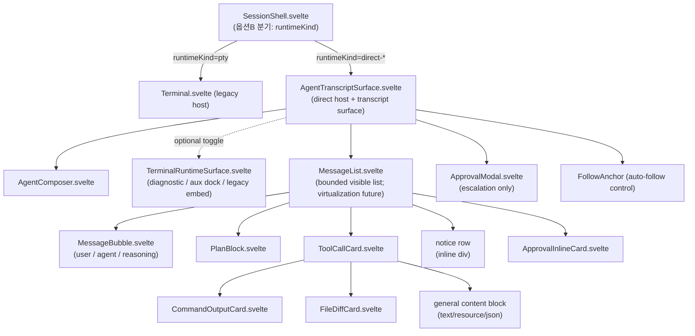

# UI Composition (데스크톱 앱식 transcript UI)

> 이 문서는 Direct Agent Runtime의 **프론트엔드 transcript UI**를 구현 가능한 수준으로 정의한다. Codex/Claude 데스크톱 앱처럼 message·tool activity·approval·diff·command output이 구분되는 구조화된 transcript를 만들고, 기존 xterm은 보조/legacy/diagnostic 역할로 강등한다.
>
> **역할 분리**: 이 문서는 **컴포넌트 트리·렌더 매핑·상호작용 규칙**을 다룬다.
> - 모든 공통 타입(`AgentEvent`, `AgentContent`, `ToolCallUpdate`, `ApprovalRequest`/`ApprovalOption`/`ApprovalDecision`, `AgentPlanEntry`, `AgentSessionStatus`, `ProviderRef` …)은 **재정의하지 않는다**. [`15-data-contracts.md`](15-data-contracts.md)의 §번호로 인용한다(타입 권위).
> - 상태 전이·upsert/append/replace·approval 생명주기·순서 보존 규칙은 [`04-normalized-agent-model.md`](04-normalized-agent-model.md)로 인용한다(규칙 권위).
> - UX 패턴 근거는 [`research/ux-reference.md`](research/ux-reference.md)의 §번호, frontend 코드 현실은 [`research/codebase-frontend.md`](research/codebase-frontend.md)의 §번호로 인용한다.
> - 브랜딩 제약은 [`09-permissions-security.md`](09-permissions-security.md) §"브랜드/제품 표시"를 따른다.
> - 미확정/결정 필요 항목은 본문에 `결정 필요`로 표기하고 [`13-risks-open-questions.md`](13-risks-open-questions.md)로 연결한다.

조사 시점: 2026-06-25. 코드 스냅샷 기준: commit `e7a5f9e`; 구현 전 현재 작업트리와 대조.

---

## 1. 목표와 설계 원칙

에이전트 응답을 terminal byte stream이 아니라 **구조화된 transcript**로 표시한다. 핵심 원칙:

1. **provider 비결합**: UI는 `AgentEvent`(15 §3)와 `AgentContent`(15 §4)만 소비한다. Codex/ACP wire를 직접 보지 않는다. provider→`AgentEvent` 변환은 adapter([05](05-codex-app-server-adapter.md)/[06](06-claude-acp-adapter.md))가 담당한다.
2. **feature 레이어 규약 준수**: 신규 UI는 `src/lib/features/agent-runtime/{contracts,state,controller,service,view}` 모듈로 추가한다(research/codebase-frontend.md §1, §8). view는 로직 없는 `.svelte`, 상태는 룬 `$state` class(`create*State()`), 동작은 `create*Controller(deps)` DI 팩토리.
3. **legacy 보존 + 무회귀 공존**: 기존 terminal surface(`Terminal.svelte` host)는 그대로 두고 `SessionShell.svelte` 내부 분기(옵션 B, research/codebase-frontend.md §9)로 host를 선택한다. 탭 전환 시 비활성 host를 살려두는 계약(research/codebase-frontend.md §3.3)을 깨지 않는다.
4. **streaming-first layout**: sticky-bottom composer + 그 위 scrollable transcript(ux-reference §1.1). v1은 residency eviction으로 bounded된 `visibleItemIds`를 렌더하고, scroll-window DOM 가상화는 후속 도입 범위다. auto-follow는 사용자가 위로 스크롤하면 멈추고, approval dialog는 auto-scroll 설정과 무관하게 항상 view로 끌어온다(ux-reference §7).
5. **타입 권위 단일화**: 본 문서가 props/state로 다루는 모든 도메인 값은 15의 타입을 import한다. UI 전용 view-model 타입만 본 문서가 정의한다(§5).

### 1.6 설정 소비 (Settings consumption) (정본)

> **공백 보완**: 설계가 transcript surface의 설정(테마/글꼴/크기) 소비 경로를 명세하지 않아 구현에서 드러났다. 앱은 이미 `applyRuntimeStyleLayer`(src/lib/ui/theme-bridge.ts·style-layers.ts, App.svelte)로 `:root`에 정본 `--ui-*` 토큰을 주입한다(테마 색 = `getThemeTokenStyle`, UI 글꼴/크기/스케일 = `getUiPreferenceTokenStyle`). transcript surface는 이 토큰만 소비한다.

transcript surface(host = `AgentTranscriptSurface` 이하 모든 view)는 **settings store를 직접 import하지 않는다.** 색/테마·UI 글꼴/크기/스케일은 전부 정본 `--ui-*` CSS 토큰만 소비한다(터미널 분리 — 기존 `Terminal.svelte`가 `settings.terminal.*`를 xterm에 적용하는 것과 별개 경로).

| 소비 대상 | 정본 토큰 | 구동 설정 | 비고 |
|---|---|---|---|
| 색 / 테마 | `--ui-*`(색 토큰군) | settings theme | `getThemeTokenStyle`(theme-bridge) |
| UI 글꼴 스택 | `--ui-font-stack` | settings UI 글꼴 | `getUiPreferenceTokenStyle` |
| UI 글꼴 크기 | `--ui-font-size-*`(xs/sm/base/md/lg) | settings UI 크기 | 스케일 단계만 사용(절대 rem 금지) |
| UI 스케일 | `--ui-scale` | settings UI 스케일 | |
| 코드/명령출력 mono | `--ui-font-mono-stack`(신규, 15) | `settings.terminal.fontFamily`/`fontFamilyFallback` | `Terminal.svelte`의 `terminalFontFamily` 로직 재사용(15 신규 토큰 `UI_CSS_VARS.fontMonoStack`) |

규칙:
- **하드코딩 rem 금지**, 미정의 `--color-*`/`--font-mono` 금지. 타이포는 절대 px/rem이 아니라 `--ui-font-size-*` 스케일 단계(xs/sm/base/md/lg)로만 표기한다(§5 view-model·§10.2 카드 밀도에 고정).
- 코드/명령 출력의 mono 글꼴은 신규 토큰 `--ui-font-mono-stack`(= `UI_CSS_VARS.fontMonoStack`, 15 정본)을 쓴다. 이 토큰은 `settings.terminal.fontFamily`/`fontFamilyFallback`로 구동되며 `Terminal.svelte`의 `terminalFontFamily` 합성 로직을 재사용한다(mono 글꼴 재사용 vs 전용 설정 = v1은 재사용, [13](13-risks-open-questions.md) OQ-55 해소).
- **agent-runtime 전용 신규 Settings 섹션을 신설하지 않는다.** 기존 `TerminalSettings`/`InterfaceSettings`를 재사용한다(OQ-55 해소).

---

## 2. 컴포넌트 트리 (정보구조)

신규 트리는 research/codebase-frontend.md §8의 배치안을 정본화한 것이다. 현재 구현은 별도 `AgentRuntimeShell.svelte` 파일을 두지 않고 `AgentTranscriptSurface.svelte`가 direct host와 transcript surface 책임을 함께 소유한다. 아래처럼 `view/*.svelte`를 컴포넌트 단위로 다수 분리하고 view/controller/state/service 레이어를 나누는 것은 파일/디렉토리 분리 규약([`17-coding-conventions.md`](17-coding-conventions.md) §A)을 따른다.



### 2.1 컴포넌트 목록과 책임

| 컴포넌트 | 위치(권장) | 책임 | 비고 |
|---|---|---|---|
| `AgentTranscriptSurface.svelte` | `features/agent-runtime/view/` | direct host + transcript surface. `SessionHostProps`를 받아 controller/state 조립, transport 구독 lifecycle, transcript 레이아웃(scrollable region + sticky composer slot), auto-follow, `visible` 토글을 소유 | `Terminal.svelte` 대응 (§9) |
| `MessageList.svelte` | `view/` | `visibleItemIds`+`itemsById`(§5)에서 item을 순서대로 렌더. v1은 residency eviction으로 bounded된 visible list를 mount하고, scroll-window DOM 가상화는 후속(§7.2). tombstone 구간은 격리 replay affordance(§7.2) | ux-reference §1.1, §7.1 |
| `MessageBubble.svelte` | `view/` | user/agent/reasoning 텍스트 message 1건 렌더(streaming caret 포함) | §3, §6 |
| `PlanBlock.svelte` | `view/` | plan entry 목록(replace-only) | §3, ux-reference §4 |
| `ToolCallCard.svelte` | `view/tool-cards/` | tool call 1건. kind별 collapsed summary + expand | §3, §4 |
| `CommandOutputCard.svelte` | `view/tool-cards/` | execute kind 전용 command/cwd/stdout/stderr embed | §4, §7 |
| `FileDiffCard.svelte` | `view/tool-cards/` | edit/delete/move diff 표현 | §4 |
| `ApprovalInlineCard.svelte` | `view/` | 단일 tool 인라인 승인 UI | §4, ux-reference §8 |
| `ApprovalModal.svelte` | `view/` | escalation/destructive 승인 blocking modal | §4, §8 |
| `AgentComposer.svelte` | `view/` | 입력(text/image/mention) + send/stop + provider/model/mode indicator | §6 |

v1 구현 메모:
- `read`/`search`/`fetch`의 text/resource/json 산출물은 별도 `ResourceContentCard.svelte`가 아니라 `ToolCallCard.svelte`의 general content block으로 렌더한다. `locations[]`도 같은 expanded body에 표시된다.
- error/stop-reason/process-exit notice는 별도 `ErrorNotice.svelte`가 아니라 reducer가 만든 `TranscriptItem{type:"notice"}`를 `MessageList.svelte` inline notice row로 렌더한다.
- raw diagnostic/aux terminal surface(`TerminalRuntimeSurface.svelte`, `surfaceMode`)는 §7.4 후속이다.

### 2.2 host 조립부 (`AgentTranscriptSurface.svelte`)

`Terminal.svelte`(research/codebase-frontend.md §2.4)와 동형으로, host가 룬 `$state`/`$derived`/`$effect`를 보유하고 controller에 getter/콜백으로 연결한다.

> 컴포넌트·controller·reducer 등 신규 코드의 클래스/함수에는 JSDoc(`/** */`) 한글 보고서체 doc-comment를 단다([`17-coding-conventions.md`](17-coding-conventions.md) §B). reconcile·approval cleanup 같은 핵심 로직에는 한 줄 한글 주석을 둔다(17 §B.2).

현재 구현 조립 경계:

```svelte
<script lang="ts">
  import { onMount, onDestroy } from "svelte";
  import { createAgentRuntimeStore } from "../state/agent-runtime-store.svelte";
  import { createAgentRuntimeController } from "../controller/agent-runtime-controller";
  import { createDefaultPortFactory } from "../service/runtime-port-factory";
  import MessageList from "./MessageList.svelte";
  import AgentComposer from "./AgentComposer.svelte";
  import ApprovalModal from "./ApprovalModal.svelte";

  let props: AgentRuntimeHostProps = $props();
  const store = createAgentRuntimeStore({ sessionHandle: props.sessionId, provider });
  let controller: AgentRuntimeController | null = null;

  onMount(() => startRuntime());
  onDestroy(() => disposeSurfaceRuntime()); // shutdown + unsubscribe + registry 정리
</script>

<div class="agent-runtime-shell" class:hidden={!props.visible}>
  <MessageList {store} onRespondApproval={onRespondApproval} />
  <AgentComposer status={store.status} onSend={onSend} onStop={onStop} />
  {#if store.escalationApproval}
    <ApprovalModal request={store.escalationApproval} onRespond={onRespondApproval} />
  {/if}
</div>
```

실제 파일은 위보다 더 많은 fallback/replay/metadata/status 처리를 포함한다. 핵심 계약은 `AgentTranscriptSurface`가 session 단위 store와 controller를 소유하고, `onMount`에서 `startSession`/`resumeSession`, `onDestroy`/`pagehide`/`beforeunload`에서 idempotent shutdown을 시작한다는 점이다. separate composer/approval controller 파일은 v1 구현에 존재하지 않으며, composer/approval action은 `AgentTranscriptSurface`가 `AgentRuntimeController`에 위임한다.

> **계약 준수**: host는 `visible` prop만 받고 자체적으로 `.hidden`(absolute off-screen) CSS로 숨긴다. 비활성 시에도 transport 구독을 살려둬 transcript/연결을 유지한다(research/codebase-frontend.md §3.3, §9 전환 메커니즘 2). heavy DOM unmount/remount 금지.

---

## 3. AgentEvent → UI 렌더 매핑 (정본)

각 `AgentEvent` variant(15 §3)가 transcript state를 어떻게 바꾸고 어떤 컴포넌트로 렌더되는지의 매핑이다. **state mutation 규칙(upsert/append/replace/순서 보존)은 04를 따른다.** 본 표는 그 규칙이 어느 컴포넌트로 귀결되는지를 정의한다.

| `AgentEvent.type` (15 §3) | state 변경 (규칙: 04 §) | 렌더 컴포넌트 |
|---|---|---|
| `session_started` | 세션 메타 초기화, `status=ready` 동기화 | (transcript 헤더/상태 영역) |
| `session_loaded` | replay 시작 표시, 이후 event 순서 누적(04 §3.4) | "복원 중" 상태 + `MessageList` |
| `session_status_changed` | `runtimeState.status` 갱신(04 §2) | composer/surface indicator(§6.5) + 기존 tab bar의 runtime status badge(OQ-06) |
| `runtime_metadata_changed` | transcript 모델은 변경하지 않고 `AgentRuntimeMetadata` patch로 병합(15 §3/§7.1) | metadata strip badge(Permission Mode/Session Mode 등) + persistence callback |
| `session_title_changed` | transcript 모델은 변경하지 않고 live session title을 갱신한 뒤 workspace snapshot에 반영(15 §3, 10 §5) | 기존 tab/session title |
| `user_message` | `mode=replace`/`append` upsert by `ref`(04 §3.1) | `MessageBubble`(role=user) — **provider 소스 비대칭**(아래 비고) |
| `agent_message` | upsert by `itemId`/`messageId`. Codex completed가 권위(04 §3.2.1). `channel:"thought"`(15 §3)는 reasoning 권위 reconcile(04 §3.2.2) | `MessageBubble`(role=agent) / `channel:"thought"`이면 thinking 블록(§6.2) |
| `agent_message_delta` | 대상 message에 `delta` **append**(04 §3.1, §3.2.1). `channel:"thought"` delta는 thought 스트림으로 별도 누적(04 §3.2.2/§3.2.5) | `MessageBubble` 내 점진 텍스트 + streaming caret(§6.1) / `channel:"thought"`이면 thinking 블록(§6.2) |
| `plan_updated` | plan **전체 교체**(04 §3.3 "replace-only") | `PlanBlock` |
| `tool_call_updated` | `id` 기준 upsert(04 §3.1). ACP content/locations는 replace(04 §3.3) | `ToolCallCard`(kind별 §4) |
| `tool_call_content_delta` | 대상 tool call content에 일반 tool content 증분 추가(04 §3.2.3) | `CommandOutputCard` 또는 `ToolCallCard` general content block |
| `approval_requested` | pending table 등록, inline vs modal 분기(§4.4) | `ApprovalInlineCard` 또는 `ApprovalModal` |
| `approval_resolved` | pending table 제거, 카드 상태 갱신(04 §4) | 해당 approval 카드 닫힘 |
| `command_output_delta` | tool call의 stdout/stderr 버퍼에 stream별 append(04 §3.2.3) | `CommandOutputCard` |
| `file_change_updated` | `FileChangeSummary` upsert | `FileDiffCard` |
| `turn_completed` | turn 종료, `status=idle`, usage 반영. stop-reason notice(§3.1) | `MessageList` notice row(refusal/max_* 시) |
| `process_exited` | 세션 `exited`, pending 전부 실패 닫힘(04 §5) | `MessageList` notice row + composer 비활성 |
| `error` | `recoverable`에 따라 retry/실패 표시(04 §5) | `MessageList` notice row / fallback panel |
| `terminal_output_delta` | transcript 아님 — 보조/legacy terminal surface 전용(04 §3.5) | `TerminalRuntimeSurface` 후속(§7.4) |

> **content delta 시 DOM 가상화 후속 주의**: `agent_message_delta`/`command_output_delta`는 고빈도다. v1 `MessageList`는 scroll-window DOM 가상화를 하지 않고 bounded `visibleItemIds`를 그대로 mount하므로 streaming item unmount 문제는 현재 경로에서 발생하지 않는다(§7.2). DOM 가상화를 도입하는 후속 단계에서는 "현재 streaming 중인 마지막 item"과 바닥 N개 item을 항상 mount 상태로 유지해야 한다. 끝부분이 unmount되면 caret/append가 깜빡이고 `scrollHeight` 점프로 auto-follow가 튄다(§7.1/§7.2). `runtimeState.streamingItemId`는 이 후속 always-mount 게이트와 현재 auto-follow/debug 표면의 입력이다.
>
> **shallow 반응형과의 정합**: streaming delta는 `TranscriptModel.itemsById`(plain Map, 비반응형)의 body를 직접 갱신하고 `itemVersions[itemId]`만 bump해 해당 item 렌더를 트리거한다(§5). 반응형 표면이 `visibleItemIds`/`itemVersions`로 한정돼 있어, delta가 고빈도여도 반응성 비용은 세션 길이가 아니라 "현재 보이는/스트리밍 item 수"에 비례한다. streaming 중 turn은 항상 `unsealed`(또는 sealed-retained의 late-event unseal)이라 eviction 대상이 아니다(04 §3.7).
>
> **`user_message` provider 소스 비대칭(공백 보완)**: 같은 `MessageBubble`(role=user)로 렌더되지만 `user_message` event의 **출처가 provider별로 다르다.**
> - **ACP(Claude)**: 라이브 turn의 user prompt를 wire로 echo하지 **않는다.** 따라서 어댑터 `sendPrompt`가 running 전에 **로컬 optimistic `user_message` AgentEvent를 emit**한다(합성 `messageId` = `<sessionId>:t<n>:u`, content = 원본 `AgentContent[]`). 배선 정본은 04 §3.1·06 §3.6, 시퀀스는 14 Claude 분기의 user_message step.
> - **Codex**: wire가 `userMessage` item을 echo하므로 어댑터는 그 item을 경유해 `user_message`를 emit하고 **로컬 optimistic echo는 금지**한다(이중 렌더 방지, 05 명시).
> - UI는 두 경우 모두 동일한 reducer upsert(by `ref`, 04 §3.1)·`MessageBubble`로 흡수한다. 합성 messageId 충돌·비텍스트 echo 정확도는 [13](13-risks-open-questions.md) OQ-57.

### 3.1 stop reason / refusal notice

`turn_completed`는 `status: completed|failed|cancelled`만 가진다(15 §3). 그러나 ACP `StopReason`(`end_turn|max_tokens|max_turn_requests|refusal|cancelled`)·Codex `error.codexErrorInfo`는 `ProviderRef.raw`/metadata에 보존된다(ux-reference §6.2, 04 §5). `refusal`/`max_tokens`/`max_turn_requests`는 reducer가 `TranscriptItem{type:"notice"}`로 변환하고 `MessageList` inline notice row로 transcript에 명시 표시한다(ux-reference §11 #14). 원본 코드는 `raw`에 둔다.

---

## 4. Tool kind별 카드 표현 (정본)

`ToolCallUpdate.kind`(15 §5)는 `read|edit|delete|move|search|execute|think|fetch|other` 9종이다. ACP `ToolKind`는 `switch_mode`를 포함한 10종이며, 그중 `switch_mode → other`로 축약해 정규화 9종에 매핑한다(15 §5, ref-acp §5/§13.3; ux-reference §2.1). `ToolCallCard.svelte`가 kind로 collapsed summary와 expanded content를 분기한다.

| `kind` | collapsed summary | expanded content (전용 카드) | 출처 |
|---|---|---|---|
| `read` | `title` + 첫 `location.path` | `ToolCallCard` general content block(text/resource/json) + `locations[]` | ux-reference §2.2 |
| `search` | `title` + match 수(있으면) | `ToolCallCard` general content block | ux-reference §2.2 |
| `fetch` | `title` + URL/리소스명 | `ToolCallCard` general content block | ux-reference §2.2 |
| `edit` | `path` + `+N/-M` diffstat | `FileDiffCard`(`AgentContent{type:"diff"}` 15 §4) | ux-reference §2.2 |
| `delete`/`move` | operation + `path`(+`oldPath`) | `FileDiffCard`(`FileChangeSummary` 15 §5) | ux-reference §2.2 |
| `execute` | command 1줄 + cwd | `CommandOutputCard`(stdout/stderr embed §7) | ux-reference §5.2 |
| `think` | 요약 1줄 | reasoning 텍스트(§6.2 reasoning 블록과 통합) | ux-reference §4.2 |
| `other` | `title` | `rawInput`/`rawOutput` JSON(접힘) | fallback |

### 4.1 collapse/expand 규칙

- **tool call + result를 한 쌍으로 토글**한다(ux-reference §2.1 Claude fullscreen). `ToolCallCard`가 헤더(summary)와 body(expanded)를 한 컴포넌트에서 관리.
- **더 보여줄 게 있는 카드만 클릭 가능**: `content`/`locations`/`rawInput`/`rawOutput`가 비었으면 expand affordance를 숨긴다(ux-reference §2.1 "Only messages that have more to show are clickable").
- **nested card 금지**: `ToolCallCard` 안의 diff/terminal은 단일 전용 영역으로 두고 다단 중첩하지 않는다(현 §10.2 layout 원칙).
- `ToolCallUpdate.status`(15 §5)별 시각 표현: `pending`(승인 대기/입력 streaming) → `in_progress`(실행 중, 스피너) → `completed`/`failed`/`cancelled`. `pending`과 `in_progress`를 시각적으로 **반드시 구분**(ux-reference §8.2). `cancelled`는 turn cancel 시 client가 합성(04 §4.2, 15 §5 매핑 주의).

### 4.2 FileDiffCard

- `AgentContent{type:"diff"; path; patch}`(15 §4) 또는 `FileChangeSummary{operation, path, oldPath?, diff?}`(15 §5)를 표시.
- ACP는 `Diff{oldText,newText}`로 오므로 adapter가 patch로 정규화한다(15 §4 주의, 06). UI는 정규화된 `patch`만 본다.
- diffstat(`+N/-M`)을 헤더에 표시(ux-reference §2.2 Zed "Changes Accordion" 스타일).
- **hunk 단위 accept/reject는 provider가 승인 흐름을 제공할 때만 노출**한다. CLCOMX가 자체적으로 sandbox 밖 변경을 적용하지 않는다([09](09-permissions-security.md), ux-reference §2.2 #4).

### 4.3 locations 점프

`ToolCallUpdate.locations`(15 §5 `FileLocation[]`)는 그대로 보존하고, `ToolCallCard` expanded detail에 `path[:line[:column]]` 형태로 표시한다. 현재 UI는 `ToolCallCard` → `MessageList` → `AgentTranscriptSurface`까지 `onOpenLocation(FileLocation)` callback 경계를 열어 두며, callback이 주입된 경우 location row를 접근 가능한 버튼으로 렌더한다. 표시 문자열은 redaction을 거치지만 callback에는 raw `FileLocation`을 넘긴다. `SessionShell` direct host는 기존 `createEditorFacade`와 `TerminalEmbeddedEditorSurface`를 재사용하고, 기존 terminal file-link action 정책(`fileOpenTarget`/`fileOpenMode`/`defaultEditorId`)도 같이 재사용한다. `fileOpenTarget:"internal"`이면 WSL 절대 path 또는 session `workDir` 기준 상대 path를 internal editor tab으로 열고 line/column을 editor tab state에 보존한다. `fileOpenTarget:"external"`이면 direct `FileLocation` path를 `resolve_terminal_path`로 `ResolvedTerminalPath.windowsPath`까지 보강한 뒤 default editor 또는 editor picker 흐름을 탄다. 실제 Windows 앱에서 외부 editor 실행·focus·line reveal을 확인하는 것은 [13](13-risks-open-questions.md) OQ-61의 E2E 검증으로 남긴다.

### 4.4 Approval UI (inline vs modal)

approval 타입(`ApprovalRequest`/`ApprovalOption`/`ApprovalDecision`)은 15 §5, 생명주기는 04 §4. UI 규칙:

- **provider가 제시한 `options`를 그대로 보존·표시한다.** 표시하지 않은 option을 임의 선택하지 않는다([09](09-permissions-security.md), ux-reference §8.2).
- option label은 i18n으로 감싸되(§8 `agentRuntime.approval.*`), `optionId`/`kind`(15 §5)는 원본 유지.
- `ApprovalOption.kind`(15 §5: `allow_once|allow_always|reject_once|reject_always|cancel|other`)별로 버튼 스타일/아이콘을 구분한다. `allow_always`/`reject_always`는 시각적으로 "기억되는 승인"임을 알린다.
- **inline vs modal 분기**(ux-reference §8.2): 자연어 판단이 아니라 **15 §5 `ApprovalRequest.severity` 필드 기반**으로 분기한다(기본값 `"normal"`).
  - `severity!=="escalation"`(= `"normal"`, 대부분) → `ApprovalInlineCard`를 해당 `ToolCallCard` 하단에 인라인 표시(`pendingApprovals`로 노출). approval card는 auto-scroll 설정과 무관하게 항상 view로 스크롤(ux-reference §7.2, §9).
  - `severity==="escalation"`(sandbox 우회, 권한 상승)일 때만 → `ApprovalModal`(blocking, `escalationApproval`로 노출). modal escape 회귀 보호(§10.3).
  - **v1 기본값(고위험은 v1부터 escalation)**: adapter는 approval을 기본 `severity:"normal"`(inline)로 emit하되, [09](09-permissions-security.md) §8.3 고위험 집합(Claude `bypassPermissions`, Codex `danger-full-access`/sandbox 우회 = `Agent (Full Access)`)에 해당하는 approval·모드 신호는 **v1부터 `severity:"escalation"`**(→ `ApprovalModal`)으로 emit한다. severity를 채우는 주체는 05/06 adapter의 approval 매핑이며(감지 가능한 wire 신호가 불명확한 잔여 부분만 후속 — [`13`](13-risks-open-questions.md) OQ-47), UI는 "전부 inline"으로 단정하지 않는다.
- **진행/취소 상태**:
  - approval pending 동안 세션 status는 `requires_action`(04 §2)이고, composer는 "승인 대기 중" 표시 + cancel만 허용(ux-reference §9.2).
  - 사용자가 option 선택 → `ApprovalDecision{outcome:"selected", optionId}`로 응답(04 §4.1), 카드를 "처리 중"으로 잠그고 `approval_resolved` 수신 시 닫는다.
  - turn cancel/shutdown/process exit 시 pending approval을 `cancelled`(또는 process exit는 `failed`)로 닫고 provider에 명시 응답(04 §4.2, §5). UI는 카드에 "취소됨" 표기.
- **`allow_always`(자동 허용) 저장은 audit trail 준비 전까지 도입하지 않는다.** option이 와도 표시는 하되, "기억" 저장은 [09](09-permissions-security.md) 감사 경계가 갖춰진 뒤 활성화(ux-reference §8.2).

```text
┌─ ToolCallCard (kind=execute, status=pending) ─────────────┐
│ ▸ $ rm -rf build/        cwd: /home/u/proj                 │
│   ⚠ 승인이 필요합니다                                       │
│   ┌─ ApprovalInlineCard ────────────────────────────────┐ │
│   │ 이 명령을 실행하시겠습니까?                            │ │
│   │ [한 번 허용] [항상 허용] [한 번 거부] [거부] [취소]    │ │  ← options 원본 순서/개수 보존
│   └──────────────────────────────────────────────────────┘ │
└────────────────────────────────────────────────────────────┘
```

---

## 5. UI view-model 타입 (본 문서 정의 영역)

도메인 타입은 15가 권위이므로 **재정의하지 않는다**. transcript 렌더링을 위해 UI가 추가로 필요로 하는 view-model만 본 문서가 정의한다. 위치: `features/agent-runtime/contracts/transcript.ts`.

```ts
import type {
  AgentContent, AgentPlanEntry, ApprovalRequest, ToolCallUpdate,
  FileChangeSummary, AgentSessionStatus, ProviderRef, TokenUsage,
} from "./normalized"; // = 15 §1–§5 재export, 절대 재정의 금지

/** transcript에 순서대로 쌓이는 렌더 단위. discriminator = type. */
export type TranscriptItem =
  // role="reasoning"은 channel:"thought"(15 §3) 누적 스트림 → 접이식 thinking 블록(§6.2, 기본 collapsed).
  | { type: "message"; id: string; role: "user" | "agent" | "reasoning"; content: AgentContent[]; streaming: boolean; collapsed?: boolean; ref: ProviderRef }
  | { type: "plan"; id: string; entries: AgentPlanEntry[] }                       // replace-only(04 §3.3)
  | { type: "tool_call"; id: string; update: ToolCallUpdate; expanded: boolean; approval?: ApprovalRequest }
  | { type: "file_change"; id: string; change: FileChangeSummary }
  | { type: "notice"; id: string; level: "info" | "warning" | "error"; messageKey: string; raw?: unknown };

/**
 * turn 단위 메모리 거주 상태(=memory residency). protocol lifecycle(15 §3 event)와 **별개** 축으로,
 * 긴 세션에서 frontend in-memory transcript가 unbounded로 커지는 문제(위험 §1.12, 13)를 막기 위한
 * heap 경계 정책이다. 3-상태 정의·전이·late-event 규칙의 정본은 04 §3.7이다.
 * - `unsealed`: turn이 아직 종료 신호를 못 받았거나 quiescence grace 중. 모든 event를 그대로 apply.
 * - `sealed-retained`: seal 완료, body는 메모리에 유지. 늦게 도착한 same-turn event는 unseal→patch→reseal
 *   (telemetry 기록, 04 §3.7).
 * - `evicted-tombstone`: body가 evict됨(작은 tombstone만 보존). 늦은 event는 **apply 금지**하고
 *   `droppedLateEventCount`만 증가. 스크롤백 조회는 격리 replay 뷰(§7.2, 10 §4.7, T5.6)로만.
 */
export type TranscriptTurnResidency =
  | "unsealed"
  | "sealed-retained"
  | "evicted-tombstone";

/**
 * transcript의 **shallow 반응형 id-index 모델**(본 문서 §5 정본). 긴 세션에서도 반응성 오버헤드와 heap을
 * 세션 길이와 무관하게 bounded로 유지한다(위험 §1.12, 13).
 *
 * **shallow 반응형 표면**: 룬 `$state`로 두는 것은 `visibleItemIds`/`itemVersions`(+ `AgentRuntimeViewState`의
 * `status`/`pendingApprovals`/`escalationApproval`)만이다. item body(`itemsById`)는 **plain Map(비반응형)**이며,
 * streaming은 body를 직접 갱신하고 `itemVersions[itemId]`를 bump해 렌더만 트리거한다. 따라서 반응성 비용은
 * 세션 길이가 아니라 "현재 보이는/스트리밍 중인 item 수"에 비례한다.
 *
 * **sealed-turn 윈도우 eviction**: hot window = 최근 N개 **sealed** turn + 모든 unsealed/active turn(인터리빙
 * 포함) + 현재 streaming. cap(`HOT_WINDOW_*`) 초과 시 가장 오래된 sealed turn body를 evict하고 그 turn을
 * `evicted-tombstone`으로 전이시킨다(04 §3.7). **evict 시 메타 인덱스도 함께 pruning**: 해당 turn의
 * `itemVersions` 항목을 제거하고 `turnsById`는 {unsealed/sealed-retained + tombstone LRU}만 유지한다 —
 * 그래야 반응형 표면(`itemVersions`)·`turnsById`도 body와 함께 bounded된다(세션 길이에 비례해 자라지 않음).
 * reducer 시그니처 = `applyEvent(prev: TranscriptModel, event: AgentEvent): TranscriptModel`.
 */
export interface TranscriptModel {
  visibleItemIds: string[];                    // 반응형($state) — 순서·표시 대상(v1 bounded list, DOM 가상화 후속 §7.2)
  itemVersions: Record<string, number>;        // 반응형($state) — itemId별 렌더 트리거 버전(streaming 시 bump)
  itemsById: Map<string, TranscriptItem>;      // 비반응형 plain Map — item body(heap 경계 대상)
  turnsById: Map<string, { residency: TranscriptTurnResidency; itemIds: string[] }>; // turn별 residency + 소속 item
  tombstones: { lru: string[]; droppedLateEventCount: number }; // evicted turn의 작은 LRU + 늦은 event 폐기 카운터
}

/** AgentTranscriptSurface 세션 인스턴스 상태(룬 class, research/codebase-frontend.md §1.3). */
export interface AgentRuntimeViewState {
  transcript: TranscriptModel;                 // §5 shallow 반응형 id-index(구 TranscriptItem[] 대체)
  status: AgentSessionStatus;                  // 15 §2
  streamingItemId: string | null;              // streaming item 추적(후속 DOM 가상화 always-mount 입력, §3/§7.2)
  pendingApprovals: ApprovalRequest[];         // severity!=="escalation" 파생(inline, 15 §5, §4.4)
  escalationApproval: ApprovalRequest | null;  // severity==="escalation" 파생(modal, §4.4, OQ-47)
  capabilities: ComposerCapabilities;          // §6.4
  providerLabel: string;                       // §6.5 (브랜딩 §8 준수)
  usage: TokenUsage | null;                    // 15 §5 (turn 토큰)
  contextUsage?: { used: number; size: number } | null; // ACP usage_update → 15 §5 TokenUsage.contextUsed/contextSize(OQ-02 해소, 06 §3.6)
  autoFollow: boolean;                         // §7.2
  availableCommands: AgentCommand[];           // §6.6 — provider slash 명령 목록(15 AgentCommand). reducer가 available_commands_updated로 전체 교체(04 §3.8). composer는 adapter가 아니라 이 슬롯을 본다(우회 금지).
}

/** composer가 capability에 따라 활성/비활성하는 입력 기능(§6.4). */
export interface ComposerCapabilities {
  image: boolean;        // ACP promptCapabilities.image
  embeddedContext: boolean; // mention/resource 첨부
  audio: boolean;        // v1 미지원(15 §4 주의) → 항상 false
}

/**
 * sealed-turn 윈도우 / tombstone 경계 config. v1은 보수적 기본값을 쓰고, 실제 수치 실측은 13 OQ-52에 남긴다
 * (image cap은 OQ-12와 연동). 무거운 item(diff/이미지/긴 출력)의 bounded 표현은 13 §1.8(ring/요약)·OQ-12를 따른다.
 */
export interface TranscriptResidencyConfig {
  HOT_WINDOW_SEALED_TURNS: number; // 기본 50. hot window에 body를 유지할 최근 sealed turn 수.
  HOT_WINDOW_BYTES: number;        // 기본 8 MiB. hot window body heap 근사 상한.
  TOMBSTONE_LRU: number;           // 기본 200. evicted-tombstone LRU 슬롯 수.
  SEAL_QUIESCENCE_GRACE_MS: number;// 기본 250ms. seal 전 quiescence grace.
}
```

> **메모리 경계 요약(위험 §1.12, 13)**: 위 모델은 두 축으로 unbounded 증가를 막는다. (1) **반응성 경계** — `$state`는 `visibleItemIds`/`itemVersions`(+ status/pending)만이라 반응성 비용이 세션 길이와 무관하다. item body는 plain Map이라 streaming은 body 갱신 + `itemVersions` bump로만 렌더를 트리거한다. (2) **heap 경계** — sealed-turn 윈도우 eviction으로 오래된 sealed turn body를 `evicted-tombstone`으로 비운다(3-상태·seal 조건·late-event 규칙 정본 = 04 §3.7). 이 경계는 DOM 가상화(§7.2, OQ-17)와 **별개**다: surface가 살아 있어도(=DOM/store 유지) tombstone eviction으로 heap은 줄어든다. cold/tombstone 상태는 **runtime-only**이며 디스크에 영속하지 않는다(10 §4.7).

> **approval 파생 관계(이중 소유 아님)**: `pendingApprovals`/`escalationApproval`은 별도 권위 store가 아니라, Event Router가 소유하는 pending request table(`(sessionHandle, requestId) → ApprovalRequest`, [`03`](03-target-architecture.md) §2.3 — `requestId` 단독은 runtime 간 충돌)을 15 §5 `ApprovalRequest.severity`로 분류해 노출하는 **표시용 파생 값**이다. 권위는 pending table 한 곳이며 store 형상·소유 관계 정본은 [`03`](03-target-architecture.md) §2.2(owns 주의)다. `severity==="escalation"`만 `escalationApproval`(modal), 그 외는 `pendingApprovals`(inline). v1 기본은 `normal`이되 [09](09-permissions-security.md) §8.3 고위험 집합(`bypassPermissions`/`danger-full-access`/sandbox 우회)은 v1부터 `escalation`으로 분류되어 escalation 분기가 작동한다([`13`](13-risks-open-questions.md) OQ-47).

> `agent-event-reducer.ts`(controller, 12 §0.1 현재 구현 위치)는 **순수 함수** `applyEvent(prev: TranscriptModel, event: AgentEvent): TranscriptModel`로 04의 upsert/append/replace 규칙 + seal/eviction/late-event 규칙(04 §3.7)을 구현한다. shallow 반응형 표면을 깨지 않도록, body는 `itemsById`(plain Map)에 두고 `visibleItemIds`/`itemVersions`만 반응형으로 갱신한다(§5). controller는 이 reducer를 호출만 한다. reducer는 vitest 단위 테스트 대상이며, late same-turn event(unseal→patch→reseal)·eviction(→tombstone, droppedLateEventCount)은 **reducer/store event fixture**로 검증한다(실제 wire 도착 여부는 13 OQ-53; §9.4).

---

## 6. Composer

`AgentComposer.svelte`. doc 기존 항목(text/image/mention/send-cancel/indicator)을 구현 수준으로 구체화한다(ux-reference §9).

### 6.1 입력과 streaming

- **multiline 입력**: CLCOMX는 Tauri WebView이므로 터미널 키 제약이 없다(ux-reference §9.2). v1 키 바인딩은 `Enter`=전송, `Shift+Enter`=개행으로 확정했다(OQ-05). slash command palette가 열려 있을 때만 `Enter`/`Tab`은 command 선택으로 소비되고 전송하지 않는다.
- composer는 sticky bottom, transcript는 그 위 scrollable(ux-reference §1.2). streaming 중에도 composer는 움직이지 않는다(Claude fullscreen 고정 input).
- agent message streaming 표현: `agent_message_delta` append 시 `MessageBubble`에 점진 텍스트 + 끝에 streaming caret(▌). 텍스트는 `AgentContent{type:"text"}`로만 누적(04 §3.2).

### 6.2 reasoning / thinking 블록 (정본)

reasoning(think)은 agent message와 **분리된 collapsible "thinking" 블록**으로 둔다(ux-reference §1.2, §4.2). 데스크톱 앱식 보기 편한 화면을 위해 response 스트림과 시각적으로 구분한다.

**채널 기반 분기 정본**(D11): reasoning은 별도 `AgentEvent` variant가 아니라 `agent_message`/`agent_message_delta`의 optional `channel?: "response" | "thought"` 필드(15 §3, 미지정 시 `"response"`)로 구분한다.

- ACP `agent_thought_chunk`(06 §5)와 Codex `item/reasoning/textDelta`(05 §5.2)는 adapter가 `agent_message_delta{channel:"thought"}`로, completed reasoning item은 `agent_message{channel:"thought", mode:"replace"}`로 emit한다.
- `channel==="thought"`인 message는 `MessageBubble`의 `role="reasoning"`으로 렌더하되, **접이식 thinking 블록(기본 collapsed)**으로 둔다. `channel==="response"`(기본)는 일반 agent message로 렌더하며 두 스트림을 시각적으로 구분한다.
- thought delta는 `messageId`/`contentIndex`별로 append하고(04 §3.2.2/§3.2.5), completed reasoning item이 thought 채널의 권위로 reconcile한다(04 §3.2.2). response/thought는 별도 스트림으로 누적해 섞이지 않는다.
- thinking 블록은 collapsible 토글 + ARIA `aria-expanded`를 노출한다(§10.3, ux-reference §7.2).

> `TranscriptItem.message`의 `role`이 `"reasoning"`이면 thinking 렌더로 분기한다(§5). reducer는 `channel` 필드로 thought/response 스트림을 분리 누적한다(04 §3.2.2). v1에서 이 정책은 확정(`결정 필요` 아님)이며 13 OQ-01/RD-13은 '해소됨'이다.

### 6.3 image / mention

- **image 첨부(구현 + richer source 후속)**: content 계약과 adapter 변환 경로는 `AgentContent{type:"image"; uri; mimeType}`(15 §4)로 잡는다. `AgentComposer`는 `ComposerCapabilities.image === true`일 때만 image file attach 버튼과 hidden file input을 노출하고, 파일 선택·clipboard paste·drag/drop으로 들어온 `image/*` 파일을 data URI로 읽어 전송 대기 chip으로 표시한 뒤 `AgentContent{type:"image"}`로 함께 보낸다. draft가 비어 있지 않으면 현재 locale의 image label로 만든 `[Image #N]`/`[이미지 #N]` 형태 reference token을 text draft에 삽입한다. 파일 선택은 draft 끝에 붙이고, paste/drop은 textarea selection 위치에 삽입하며, chip 제거 시 대응 reference token도 draft에서 제거한다. 남은 attachment는 현재 순서대로 재번호를 매겨 prompt 안 image 번호가 항상 1부터 시작하게 한다. draft가 비어 있으면 token을 추가하지 않아 image-only prompt를 그대로 허용한다. 파일 크기는 기존 clipboard image cap(`MAX_CLIPBOARD_IMAGE_BYTES`)을 재사용해 data URI heap 폭주를 막는다. provider-backed richer image resource source는 후속이다. ACP는 base64 `data`라서 adapter가 data URI/blob 저장 후 `uri` 생성(15 §4 주의).
- **file/resource mention(1차 구현 + 후속 소스 확장)**: `@`-mention(Zed/Claude/Codex 공통)은 선택 시 `AgentContent{type:"resource"; uri; ...}`(15 §4)로 합류한다. 현재 1차 UI는 provider-backed `AgentRuntimePort.searchResources`를 먼저 호출해 Codex `fuzzyFileSearch` file 후보와 `skills/list{cwds:[workDir]}` enabled skill 후보를 사용하고, 결과가 없거나 provider search가 실패하면 기존 `search_session_files`/`searchSessionFiles` 경로로 workspace file 후보를 찾는다. `AgentComposer`는 draft 끝의 `@query` token을 `@relative/path ` 또는 `@skillName ` token으로 교체한 뒤 전송 시 원문 text content와 `resource{uri:"file://..."}` content를 함께 보낸다. Codex skill 후보는 `resourceKind:"skill"`과 `text:<skill name>`을 보존해 adapter가 `UserInput{type:"skill", name, path}`로 내린다. resource action button은 `resourceSearch` source가 있을 때만 표시되고, 입력 가능 상태에서 클릭하면 draft 끝에 `@` token을 열어 같은 팔레트 흐름으로 진입한다. 이때 선택된 resource는 해당 `@...` token이 공백 경계 안에 그대로 남아 있을 때만 전송 대상에 포함되며, 사용자가 token 뒤에 문자를 붙여 다른 단어로 바꾸면 stale resource를 붙이지 않는다. ACP text 없는 resource는 baseline `resource_link`로 보존하고, text 포함 embedded resource만 `embeddedContext` capability를 adapter 전송 경계에서 gate한다. ACP resource source 같은 richer source는 OQ-56 후속 범위다. wire는 absolute path/file URI로 정규화하고, file URI path segment는 percent-encoding해 공백·`#`·`?`가 fragment/query처럼 해석되지 않게 한다(06).
- **ACP resource source 경계(2026-06-30 확인)**: 현재 핀 `@agentclientprotocol/sdk@0.29.0`/`@agentclientprotocol/claude-agent-acp@0.51.0`에는 prompt content의 `resource_link`/embedded `resource`와 `PromptCapabilities.embeddedContext`만 있고 provider-backed resource search/list request는 없다. 따라서 ACP adapter의 `searchResources`는 v1에서 명시적으로 `[]`를 반환하며, UI는 workspace fallback을 유지한다. OQ-56의 ACP resource source 후속은 protocol/package가 search/list RPC를 제공하거나 별도 client-side provider source 정책을 정할 때만 다시 연다.
- composer의 clipboard/drag image 처리는 textarea `ClipboardEvent`/`DataTransfer`에서 image file만 추출하는 경계로 구현한다. paste/drop은 async file read 전에 현재 textarea selection을 보존해 reference token 위치가 사용자가 지정한 cursor를 따른다. 일반 text paste와 non-image drag/drop은 브라우저 기본 동작을 유지한다.

### 6.4 capability 기반 feature gating

composer 입력 기능은 provider capability에 따라 동적 enable/disable한다(ux-reference §10.2, §12). `ComposerCapabilities`(§5)는 adapter가 `initialize` 응답에서 채운다(06 ACP `promptCapabilities`, 05 Codex). `audio`는 v1 항상 false(15 §4). capability 미지원이면 해당 버튼을 비활성/숨김. 현재 image attach button/file input과 clipboard paste·drag/drop image handler는 `capabilities.image`와 입력 가능 상태로 gate하고, `AgentTranscriptSurface`가 store capability를 composer로 전달한다. resource action button은 provider content capability가 아니라 `resourceSearch` source 존재와 입력 가능 상태로 gate한다. ACP adapter는 `promptCapabilities.image`/`embeddedContext`를 `session/prompt` 직전 전송 경계에서 적용해 unsupported `image`와 text 포함 embedded `resource` content를 provider로 내리지 않는다. text 없는 resource는 baseline `resource_link`로 전송 가능하다. 전송 가능한 content가 하나도 남지 않으면 빈 `session/prompt`를 보내지 않고 recoverable error event만 emit한다. Codex adapter도 같은 전송 경계에서 `mapAgentContentToUserInput(...)` 결과가 비면 빈 `turn/start{input:[]}`를 보내지 않고 recoverable error만 emit하며, running 전이를 만들지 않는다(05 §5.3d, 11 CX-4c).

### 6.5 send / stop / indicator

- **send ↔ stop 전환**: turn 진행 중(`status=running`/`requires_action`)이면 send 버튼을 stop으로 전환(ux-reference §9.2). stop → `AgentRuntimePort.cancelTurn`(15 §6). cancel 시 pending approval cancelled 불변식 적용(04 §4.2).
- **active runtime/provider indicator**: provider/model/permission-mode를 composer 근처에 표시. provider label은 브랜딩 제약 준수 — Claude Code/Anthropic 공식 앱처럼 오인될 branding/ASCII art/visual copy 금지([09](09-permissions-security.md) §"브랜드/제품 표시"). 중립적 provider 식별자만 표시. i18n `agentRuntime.status.*`.
- **고위험 mode 표시**: `danger-full-access`/`bypassPermissions`/`Agent (Full Access)`는 metadata strip에서 warning badge(`data-risk="high"`, `agentRuntime.metadata.highRisk`)로 계속 노출한다. 이는 provider sandbox를 우회하지 않고 현재 session risk를 표시만 하는 09 §8.2/§8.3 경계다.
- **status별 composer 동작**:

| `AgentSessionStatus`(15 §2) | composer 상태 |
|---|---|
| `starting` | 입력 비활성, "시작 중" 표시 |
| `ready`/`idle` | 입력 활성, send 버튼 |
| `running` | draft 편집은 가능하지만 Enter/send 전송은 막고 stop 버튼만 활성. 다음 prompt queue 정책은 결정 전까지 도입하지 않는다 |
| `requires_action` | 입력 비활성, "승인 대기 중" + cancel만(§4.4) |
| `failed`/`exited` | 입력 비활성, retry/새 세션 안내(§3.1) |

`AgentTranscriptSurface`는 store status를 `onAgentRuntimeStatusChange`로 publish하고, live session의 `agentRuntimeStatus`를 통해 `TabBar.svelte`에 작은 status indicator로 표시한다(OQ-06). 이 값은 탭 UI용 live 상태이며 workspace snapshot에는 저장하지 않는다.

```text
┌─ AgentComposer (sticky bottom) ──────────────────────────────┐
│  [@mention][📎image]                                          │
│  ┌────────────────────────────────────────────────────────┐ │
│  │ multiline input … [Image #1]                            │ │
│  └────────────────────────────────────────────────────────┘ │
│  provider · model · mode        [status badge]  [send/stop]  │
└──────────────────────────────────────────────────────────────┘
```

### 6.6 Command palette / completion triggers (정본)

> **공백 보완**: 설계가 composer의 `/`·`@`·`$` 완성 트리거를 명세하지 않아 구현에서 드러났다. 슬래시 명령 소스는 신규 event `available_commands_updated`(15)·신규 타입 `AgentCommand`(15)에 의존한다.

composer v1 구현은 입력 첫 토큰의 `/` 명령 팔레트와 draft 끝 token의 `@` workspace file mention 팔레트를 띄운다. 팝업은 키보드 내비게이션(↑/↓ 이동, Enter/Tab 확정, Esc 닫기)과 마우스 click을 지원한다. `$`는 trigger 문자를 활성 완성 UI로 잡지 않는다.

| 트리거 | 의미 | 소스 | 게이트 |
|---|---|---|---|
| `/` | **명령 팔레트** | provider `availableCommands`(15 `available_commands_updated` event → `AgentCommand[]`) **+ 로컬 `/resume`** | 항상(provider 소스 없으면 로컬만) |
| `@` | **file/resource mention** | provider-backed `searchResources`(Codex `fuzzyFileSearch` file + `skills/list` skill) 우선, 없으면 현재 workspace file search(`search_session_files`) → `AgentContent{type:"resource"}`(§6.3). ACP richer resource source는 후속 | workspace file + Codex fuzzy file + Codex skill 1차 구현. text 포함 embedded resource는 `embeddedContext` capability(§6.4)를 따른다 |
| `$` | (예약) | — | **v1 보류**([13](13-risks-open-questions.md) OQ-56) |

- **`/` 명령 팔레트**: provider가 제시한 `AgentCommand{ name; description?; inputHint? }`(15 정본) 목록을 표시한다. ACP `available_commands_update`(06 §5)는 어댑터가 `available_commands_updated { ref; commands: AgentCommand[] }` event로 emit한다(`UnstructuredCommandInput.hint`만 `inputHint`로 추출, 미지 input variant는 방어적으로 무시; ref-acp §566-569). **Codex는 provider-backed slash 소스가 없다**(client-side 정적 명령만, 05 명시) → Codex 세션의 `/` 팔레트는 로컬 명령(`/resume`)만 노출한다.
- **로컬 `/resume`**: provider 명령과 함께 노출하며 선택 시 composer draft를 `/resume `로 채운다. v1에서 전송은 다른 slash command와 동일하게 평문 prompt(`sendPrompt`)로 흐른다. `AgentRuntimePort.resumeSession`은 현재 host mount 시 `agentRuntime` metadata로 결정되는 lifecycle 경로이며(10 §4 `canResume`/`canLoad`), composer의 `/resume` 선택이 즉시 port `resumeSession`을 호출하지 않는다. 명시적 resume picker/command가 필요하면 별도 UX·provider id 소스 설계 후 추가한다.
- **`@` mention**: outbound adapter는 `AgentContent{type:"resource"}`를 Codex mention/skill/ACP resource로 보낼 수 있다. ACP는 text 없는 resource를 baseline `resource_link`로 보내고, text 포함 embedded resource만 `embeddedContext` capability로 gate한다. 현재 composer는 provider-backed search(Codex `fuzzyFileSearch` file + `skills/list` skill) 결과를 우선 표시하고, 결과가 없으면 workspace file search 결과를 표시한다. 선택 시 draft 끝의 `@query` token만 `@relative/path ` 또는 `@skillName `으로 교체하며 전송 payload에 resource content를 추가한다. 선택 후 사용자가 token을 다른 단어로 편집하면 resource content는 제외된다. ACP resource source, richer picker는 OQ-56 후속이다.
- **ACP `@` source 한계**: `@agentclientprotocol/sdk@0.29.0`/`claude-agent-acp@0.51.0` 기준 ACP에는 resource search/list RPC가 없으므로 "ACP resource source"는 현재 구현 가능한 provider-backed source가 아니다. Claude ACP 세션은 text/resource 전송 capability gate만 제공하고, 후보 탐색은 workspace fallback이 담당한다.
- **`$`**: v1에서는 트리거를 잡지 않는다(의미·소스 미정 = OQ-56).
- i18n: 명령 팔레트/완성 UI text는 `agentRuntime.composer.command.*` namespace를 예약한다(§8). 명령 `name`/`description`/`inputHint` 원본은 provider 값을 그대로 표시하되(브랜딩 §8 준수), UI 셸 라벨("명령", "파일 멘션" 등)만 i18n으로 감싼다.

---

## 7. 긴 출력 / terminal embed / 스크롤 처리

### 7.1 auto-follow (스크롤 컨테이너 DOM 부수효과 — 정본)

> **공백 보완**: auto-follow를 단순 '상태 토글'로만 본 초기 설계는 구현에서 부족했다. auto-follow는 `autoFollow` boolean 1개의 토글이 아니라, **스크롤 컨테이너(`.transcript-region`)의 DOM 부수효과**로 정밀 명세한다. 적용 대상은 `AgentTranscriptSurface`의 scrollable region(`.transcript-region`)이며 **`MessageList` 루트가 아니다**. v1 `MessageList`는 bounded visible list를 렌더하고, 별도 가상화 viewport는 후속이다.

ux-reference §7.1(Claude fullscreen) 패턴을 채택하되 다음 DOM 규칙으로 구현한다:

- **추종(follow) 부수효과**: `autoFollow=true`이고 스크롤이 바닥에 anchored면, 새 item/delta가 transcript에 반영될 때마다 `.transcript-region.scrollTop = .transcript-region.scrollHeight`로 바닥 고정한다. `agent_message_delta`/`command_output_delta`는 고빈도이므로 매 delta마다 동기 호출하지 않고 **`tick()`/`requestAnimationFrame`로 디바운스**해 프레임당 1회만 바닥 스크롤한다(append 깜빡임·레이아웃 스래싱 방지).
- **추종 on/off 전환**: 컨테이너 `onscroll` 핸들러가 "바닥 근접 여부"(`scrollHeight - scrollTop - clientHeight <= 임계값`)로 `autoFollow`를 토글한다. 사용자가 위로 스크롤하면 off("Scrolling up pauses auto-follow"), 바닥 재도달 또는 명시적 행동(`Ctrl+End` 등)으로 on. 토글은 부수효과의 게이트일 뿐, 스크롤 위치 자체는 항상 DOM이 권위다.
- **approval은 항상 scrollIntoView**: approval card(inline/modal 진입 전 inline)는 `autoFollow`/바닥 anchored 여부와 **무관하게 항상** `scrollIntoView`로 view에 끌어온다(ux-reference §7.1, §9, §4.4). 이는 follow 디바운스 경로를 우회하는 별도 즉시 호출이다.
- `autoFollow`(§5 `AgentRuntimeViewState.autoFollow`)는 이 부수효과의 **게이트 플래그**로만 남고, 스크롤의 실제 권위는 컨테이너 DOM이다.

### 7.2 visible list / 가상화 후속 (소싱 + 격리 replay 뷰)

v1 `MessageList`는 `TranscriptModel.visibleItemIds`(순서·표시 대상)를 그대로 mount하고 각 id의 body를 `TranscriptModel.itemsById`(plain Map, §5)에서 소싱한다. 이 목록은 sealed-turn residency eviction(04 §3.7)으로 bounded되지만, 스크롤 viewport 기준으로 보이지 않는 row를 unmount하는 **DOM 가상화는 아직 구현하지 않는다**. 실제 scroll-window 가상화를 도입할 때 권장 라이브러리/방식은 별도 결정한다(직접 구현 vs 라이브러리, [13](13-risks-open-questions.md)).

> **가상화 × auto-follow 상호작용(공백 보완 — 후속 always-mount 규칙)**: DOM 가상화 도입 시 **`streamingItemId` + 바닥 N개 item은 항상 mount**해야 한다. 끝부분 item이 unmount되면 그 높이가 윈도우에서 빠져 `.transcript-region.scrollHeight`가 점프하고, §7.1의 follow 부수효과(`scrollTop = scrollHeight`)가 잘못된 위치로 튄다. 따라서 바닥 추종이 안정적이려면 가상화 하단 경계는 "마지막 N개 + streaming item"을 강제 mount해 scrollHeight를 안정화한다. §3(streamingItemId 추적) ↔ §7.1(follow 부수효과) ↔ 본 절(바닥 N개 always-mount)은 상호참조이며, auto-follow × 가상화 상호작용의 잔여 튜닝(N·임계값 실측)은 [13](13-risks-open-questions.md) OQ-58에서 확정한다.

> **두 경계가 별개임(① DOM 가상화 vs ② residency eviction vs ③ surface unmount 금지)**. ① **DOM 가상화(item 레벨)**는 `MessageList`가 **보이지 않는 transcript item DOM만** mount/unmount하는 것으로, store(`itemsById`) body는 그대로 둔다. ② **residency eviction(heap 레벨)**은 sealed-turn 윈도우 초과 시 `itemsById`에서 oldest sealed turn body를 비워 heap을 줄이는 것이다(`evicted-tombstone`, 04 §3.7). 즉 surface가 **살아 있어도(DOM/store 유지) heap은 감소**한다 — OQ-17이 다루는 "surface unmount"와는 직교한다. ③ [10](10-persistence-migration.md) §4.3의 "process 생존 중 unmount 금지"는 **transcript surface(host = `AgentTranscriptSurface`) 전체**에 적용되는 규칙이다. host는 `visible=false`(탭 비활성)에도 `.hidden` CSS로만 숨기고 unmount하지 않으며(§2.2), late-attach store(`AgentRuntimeViewState` §5)는 **surface 내부 메모리에 유지**된다. 가상화로 끝부분 item이 unmount돼도 store와 surface는 살아 있으므로 seq 재구성 없이 안전하다. 이 경계 확인은 [13](13-risks-open-questions.md) OQ-17의 "08 가상화 경로가 surface를 unmount하지 않음" 게이트를 충족한다.

**residency별 스크롤백 렌더**:

- `unsealed`/`sealed-retained` 구간: body가 `itemsById`에 살아 있으므로 위로 스크롤하면 Map에서 **read-only로 저렴하게 렌더**한다(추가 I/O 없음). `sealed-retained`로 늦은 same-turn event가 오면 unseal→patch→reseal로 반영한다(04 §3.7).
- `evicted-tombstone` 구간: body가 없으므로 일반 렌더 불가. 해당 위치에 **"이전 기록 불러오기" affordance**(tombstone placeholder)를 표시한다.
  - `canLoad`면 → **격리 read-only replay 뷰**(10 §4.7, T5.6)로 라우팅한다. 별도 scratch replay 세션(`session/load`·`thread/read`)으로 해당 구간만 조회해 read-only 인스펙션으로 보여주며, **live store에 병합하지 않는다**(복원/영속 캐시가 아님, running turn과 충돌 없음). 조회 성공/실패 뒤 scratch는 폐기하고, 닫기·unmount는 멱등 cleanup으로만 남긴다.
  - `canLoad`가 아니면 → "사용 불가" notice를 표시한다(영속되지 않은 runtime-only 구간).
  - 격리 replay 범위(`thread/read` `includeTurns`가 gap-only인지 전체 snapshot인지)는 13 OQ-54에서 확정한다.
- 무거운 item(diff/이미지/긴 출력)은 sealed-retained 구간에서도 bounded 표현(13 §1.8 ring/요약)으로 두고 지연 로드한다(image cap은 OQ-12 연동).

### 7.3 CommandOutputCard / 긴 출력

- card head: `command` + `cwd`(긴 명령은 §10 wrapping/horizontal scroll).
- body: **고정 높이 + resize handle** 출력 embed. live append, release 후에도 표시 유지(ACP terminals 규칙, ux-reference §5.2).
- footer: `exitStatus`(exitCode/signal) — 완료 시. `truncated`면 "앞부분 잘림" 표시 + "전체 로그 열기" 행동(§7.4로 라우팅, ux-reference §5.2, [05](05-codex-app-server-adapter.md) bounded buffer).
- stdout/stderr stream 구분 보존(04 §3.2.3). stderr diagnostic은 기본 collapsed([09](09-permissions-security.md)). ANSI는 terminal embed 내부에서만 처리.

### 7.4 xterm의 새 역할 (terminal embed / 보조 dock / legacy / diagnostic)

xterm은 전체 agent 화면이 아니라 다음 역할로만 쓴다(`terminal_output_delta` 전용, 04 §3.5):

| 역할 | 컴포넌트/위치 | 트리거 |
|---|---|---|
| **legacy PTY fallback** | `Terminal.svelte`(기존 host) | `runtimeKind=pty` 세션, 또는 direct 미지원 agent(§9) |
| **command output embed** | `CommandOutputCard` 내부의 경량 read-only 렌더 | execute tool call의 live output(§7.3) |
| **보조 셸 dock** | `TerminalRuntimeSurface`(aux) | 사용자가 보조 셸 토글 |
| **raw diagnostic view** | `AgentTranscriptSurface`의 surface 토글(§2.2 `surfaceMode`, 후속) | "전체 로그 열기" / 진단 모드(research/codebase-frontend.md §9 전환 메커니즘 3) |

diagnostic 토글은 `Terminal.svelte`의 "두 surface mount + viewMode 토글" 선례(research/codebase-frontend.md §2.4, §9)를 재사용한다. command output embed는 full xterm을 쓰지 않고 `CommandOutputCard`의 경량 read-only 렌더를 채택한다. 임베드는 키 입력 포커스를 가지지 않아 앱 단축키를 가로채지 않으며, stdout/stderr 구분과 stderr 기본 접힘만 보존한다(FE-16, 11 §5).

---

## 8. i18n

신규 UI text는 모두 `en.ts`/`ko.ts`에 **동시에** 같은 키 트리로 추가한다(research/codebase-frontend.md §6.2). 현재 `agentRuntime` namespace는 `src/lib/i18n/locales/en.ts`/`ko.ts`에 추가되어 있고, `src/lib/i18n/key-parity.test.ts`가 핵심 키 구조 parity를 고정한다.

예약 namespace(현 문서 + research/codebase-frontend.md §6.2 확정):

- `agentRuntime.status.*` — 세션/turn 상태 라벨(starting/ready/running/requires_action/idle/failed/exited), provider/model indicator
- `agentRuntime.approval.*` — option label(`allowOnce`/`allowAlways`/`rejectOnce`/`rejectAlways`/`cancel`), 승인 본문, "승인 대기 중", "취소됨"
- `agentRuntime.toolKind.*` — kind별 라벨(read/edit/delete/move/search/execute/think/fetch/other)
- `agentRuntime.errors.*` — error/retry/stop-reason notice(refusal/maxTokens/maxTurnRequests/processExited)
- `agentRuntime.fallback.*` — legacy fallback/diagnostic 안내
- `agentRuntime.composer.*` — placeholder, send/stop, mention/image, "전체 로그 열기", "복원 중"
- `agentRuntime.composer.command.*` — `/` 명령 팔레트 UI 셸 라벨(§6.6: provider 명령 + 로컬 `/resume`). provider 명령 `name`/`description`/`inputHint` 원본은 i18n으로 감싸지 않고 그대로 표시(브랜딩 준수). `@` 파일 팔레트 셸 라벨은 `agentRuntime.composer.resourcePalette`를 쓴다.

> **브랜딩 주의**([09](09-permissions-security.md)): provider label·notice·copy는 Claude Code/Anthropic 공식 앱 오인 소지 branding/ASCII art/visual copy를 쓰지 않는다. 중립적·기능적 표현만.

---

## 9. legacy 공존 / host 분기 / lifecycle

### 9.1 분기 지점 (옵션 B)

research/codebase-frontend.md §9 옵션 B를 정본화한다. 구현은 `SessionShell.svelte`의 얇은 host 분기에서 `session.runtimeKind`로 host를 선택한다:

```svelte
<script lang="ts">
  import Terminal from "../../../components/Terminal.svelte";
  import AgentTranscriptSurface from "../../agent-runtime/view/AgentTranscriptSurface.svelte";
  import type { SessionShellProps } from "../contracts/session-shell";
  import { createSessionHostProps } from "../service/session-shell-adapter";

  let props: SessionShellProps = $props();
  const hostProps = $derived(createSessionHostProps(props));
  // runtimeKind: "pty" | "direct-codex" | "direct-claude" (15 §7 SessionRuntimeKind)
  const useDirectRuntime = $derived(props.session.runtimeKind?.startsWith("direct-") ?? false);
</script>

{#if useDirectRuntime}
  <AgentTranscriptSurface {...hostProps} />
{:else}
  <Terminal {...hostProps} />
{/if}
```

현재 실제 구현은 legacy PTY 경로를 notice wrapper와 함께 렌더하고, direct 경로는 `AgentTranscriptSurface`에 `onFallbackToPty`를 연결한다. `SessionShell.test.ts`는 direct runtime 세션에서 legacy PTY notice가 보이지 않고 host에 `runtimeKind="direct-codex"`가 전달되는지 검증한다. `SessionViewport.test.ts` FE-21은 active tab 변경 시 keyed session shell이 destroy/remount되지 않고 `visible` prop만 바뀌는지 검증한다.

완료된 contract 확장(research/codebase-frontend.md §10 체크리스트):
1. `SessionShellSession`(`session/contracts/session-shell.ts`)에 `runtimeKind` 추가.
2. `createSessionHostProps`(`session-shell-adapter.ts`)에 `runtimeKind`와 `agentRuntime` 매핑.
3. `SessionViewportProps`/`App.svelte`/`session-shell-loader` 변경 **0**(옵션 B의 장점).

> `SessionRuntimeKind`(`"pty"|"direct-codex"|"direct-claude"`)와 persistence 전파는 15 §7, [10](10-persistence-migration.md) 소관. `SessionViewMode`를 `"agent"`로 확장하지 **않는다**(15 §7.2 주의, research/codebase-frontend.md §5).

### 9.2 PTY 없는 세션의 콜백 흐름

direct runtime은 ptyId가 없다. `onPtyId`/`onAuxStateChange`/`onExit`/`onResumeFallback`(PTY 전제 콜백, research/codebase-frontend.md §11 위험)은 direct host에서 호출하지 않는다. direct runtime의 live 여부는 `ptyId >= 0`이 아니라 `runtimeKind.startsWith("direct-")`도 함께 보는 `hasLiveSessionRuntime`으로 판단한다. 이 경계는 `session-tab-behavior.test.ts`와 `tab-close-orchestration-controller.test.ts`가 direct `ptyId=-1` 세션을 close-confirm 대상으로 분류하는지 검증한다. 저장/복원 경계는 [10](10-persistence-migration.md) §4.3·§5.5처럼 direct snapshot/history에서 stale PTY/resume token을 제거하는 테스트로 고정한다.

### 9.3 transport lifecycle

- `onMount` → `AgentRuntimePort.startSession`/`resumeSession`(15 §6). resume 시 `session/load` replay 중 "복원 중" 상태 + composer 잠금(ux-reference §10.2).
- 구독은 `subscribeEvents`(15 §6)로 등록하고 `UnlistenFn`을 host가 보유, `onDestroy`에서 해제.
- 탭 비활성(`visible=false`) 시에도 구독/연결 유지(§2.2 계약). `onDestroy`는 탭 닫힘/세션 종료 시에만. `shutdown` 정책(graceful)은 [07](07-tauri-process-runtime.md).

> **transport controller ↔ `AgentRuntimePort`(15 §6) 매핑**: §2.2 host가 쓰는 `transport.*`는 controller가 `props.sessionId`(= sessionHandle)를 **자동 주입**하는 얇은 래퍼라서, 호출부는 sessionHandle을 명시하지 않는다.

| transport controller(호출부) | `AgentRuntimePort` 메서드(15 §6) | 비고 |
|---|---|---|
| `transport.sendPrompt(content)` | `sendPrompt(sessionHandle, input)` | sessionHandle 주입 |
| `transport.searchResources(query, limit?)` | `searchResources(sessionHandle, {query, workDir, limit})` | provider-backed `@` 후보, 미지원 시 workspace fallback |
| `transport.cancelTurn()` | `cancelTurn(sessionHandle, turnId?)` | turnId 생략 시 active turn |
| `transport.respondApproval(decision)` | `respondApproval(sessionHandle, decision)` | sessionHandle 주입(§2.2 주석) |
| `transport.subscribeEvents(listener)` | `subscribeEvents(sessionHandle, listener)` | `UnlistenFn` 반환 |
| `runtime.start(props)` | `startSession`/`resumeSession(params)` | §9.3 lifecycle |
| `runtime.dispose()` | `shutdown(sessionHandle)` + unsubscribe | onDestroy 정책 |

### 9.4 테스트

- `agent-event-reducer.ts`(순수 함수): `AgentEvent` 시퀀스 → `TranscriptModel` 스냅샷을 vitest로 검증(04 규칙 케이스: append/replace/upsert/reconcile/approval cleanup). seal/eviction/late-event(04 §3.7)는 **reducer/store event fixture**로 검증한다 — sealed-retained에 늦은 same-turn event 도착 시 unseal→patch→reseal, evicted-tombstone 구간 late event는 apply 금지 + `droppedLateEventCount` 증가(실제 wire 도착 여부는 13 OQ-53). research/codebase-frontend.md §1.6.
- controller: `vi.fn()` deps로 단위 테스트(transport send/cancel/subscribe 모킹).
- view: `@testing-library/svelte`. testid는 `src/lib/testids.ts` `TEST_IDS`에 추가(`agentTranscript`, `agentComposerInput`, `approvalModal`, `approvalInlineCard`, `agentToolCard`, `agentPlanBlock`)(research/codebase-frontend.md §1.6, §10 #9). approval 컴포넌트/testid 정본은 `ApprovalModal.svelte`/`approvalModal`, `ApprovalInlineCard.svelte`/`approvalInlineCard`이며 11·12와 통일한다. 수용 기준은 [11](11-testing-acceptance.md).

---

## 10. 반응형 레이아웃과 focus/shortcut 회귀 방지

### 10.1 레이아웃

- transcript는 tab content 영역 기준 **full-height flex layout**(scrollable transcript + sticky-bottom composer, ux-reference §1.2).
- tool card는 nested card를 피하고 반복 item card만 사용한다(§4.1).
- 긴 command/path/model name은 wrapping 또는 horizontal scroll(§7.3).
- terminal embed는 고정 높이 + resize handle(§7.3).
- 좁은 폭에서는 composer indicator(provider/model/mode)를 2줄로 접거나 아이콘 축약.
- **타이포 토큰(§1.6 준수)**: 카드/메시지/composer 타이포는 절대 px/rem이 아니라 `--ui-font-size-*` 스케일 단계(xs/sm/base/md/lg)·`--ui-font-stack`(코드/명령 출력은 `--ui-font-mono-stack`)으로만 표기한다. 하드코딩 rem·미정의 `--color-*`/`--font-mono` 금지.

### 10.2 카드 밀도

- 카드 밀도 단계(요약 1줄 / 본문 / 코드 블록)의 글자 크기는 `--ui-font-size-*` 스케일 단계로 매핑한다(예: collapsed summary = `--ui-font-size-sm`, 본문 = `--ui-font-size-base`, 코드/명령 출력 = `--ui-font-mono-stack` + `--ui-font-size-sm`). 절대 rem 금지 — 사용자 UI 크기/스케일 설정(§1.6)에 자동 반응해야 한다.
- `/focus` 류 밀도 축소 뷰(마지막 prompt + tool call 1줄 요약 + 최종 응답)는 "compact transcript" 옵션으로 고려(ux-reference §7.2, §11 #16) — `결정 필요`(v1 포함 여부, [13](13-risks-open-questions.md)).

### 10.3 focus / shortcut 회귀 방지 (높은 위험)

기존 terminal focus·assistant dock shortcut과 충돌 위험이 크다(research/codebase-frontend.md §11). 원칙:

- **composer focus와 terminal embed focus를 분리**한다. command output terminal embed가 일반 app shortcut을 가로채지 않게 한다(research/codebase-frontend.md §11 focus/shortcut 위험).
- 기존 `terminal-focus-bridge.ts`/`terminal-shortcut-routing.ts`(Ctrl+T/Ctrl+W 등, research/codebase-frontend.md §2.2, §11)와 composer 입력 focus 충돌을 방지: composer textarea가 focus를 가진 동안에는 App 전역 탭 전환 단축키가 입력 표면을 가로지르지 않도록 keydown bubble을 차단한다. command output embed처럼 입력 표면이 아닌 read-only 영역은 일반 app shortcut을 가로채지 않는다.
- 기존 **Space toggle, tab movement, modal escape** 동작은 별도 회귀 테스트로 보호한다([11](11-testing-acceptance.md)).
- `ApprovalModal` Escape 동작은 pending approval을 미해결 상태로 조용히 닫지 않는다. Escape는 명시적인 `ApprovalDecision{outcome:"cancelled"}`로 응답해 provider deadlock을 막고, 임의 승인/거부(`selected`)는 절대 보내지 않는다(§4.4, 04 §4.2).
- collapsible 요소(tool card/reasoning/plan)는 키보드 토글 + ARIA `aria-expanded` 노출(ux-reference §7.2, §11 #16).

---

## 11. 구현 체크리스트 (다운스트림)

| # | 항목 | 근거 |
|---|---|---|
| 1 | `features/agent-runtime/` 모듈 트리 생성(§2.1) | research/codebase-frontend.md §8 |
| 2 | `transcript.ts` view-model(§5) — 15 타입 import 재정의 금지 + `TranscriptModel`/`TranscriptTurnResidency` shallow 반응형 id-index 정의 | 15 §1–§5, 04 §3.7 |
| 3 | `agent-event-reducer.ts` 순수 함수 `applyEvent(prev, event): TranscriptModel`로 04 규칙 + seal/eviction/late-event 구현 | 04 §3, §3.7, §4, §5 |
| 4 | `AgentTranscriptSurface.svelte` host 조립(§2.2), `visible`/lifecycle 계약 | research/codebase-frontend.md §3.3, §9 |
| 5 | `SessionShell.svelte` 옵션 B 분기 + contract 확장(§9.1) | research/codebase-frontend.md §9, §10 |
| 6 | AgentEvent→렌더 매핑 표(§3) 컴포넌트로 구현 | 15 §3, 04 |
| 7 | kind별 카드(§4) + collapse/expand + status 구분 | ux-reference §2, 15 §5 |
| 8 | approval inline/modal(§4.4), options 원본 보존, label만 i18n | 04 §4, 09, ux-reference §8 |
| 9 | composer(§6): multiline/send-stop/indicator, `/` command palette, image file attach/paste/drop capability gate와 reference token, workspace file + Codex `fuzzyFileSearch`/`skills/list` `@` mention과 resource action button source/input gating은 v1 구현 범위. ACP richer resource source와 provider-backed richer image source는 후속 | ux-reference §9, §10, OQ-56 |
| 9a | `channel:"thought"` 접이식 thinking 블록 렌더(§6.2, 기본 collapsed, response와 시각 구분) | 15 §3 channel, 04 §3.2.2 |
| 9b | composer 완성 트리거(§6.6): `/` 명령 팔레트(provider availableCommands + 로컬 /resume)와 workspace file + Codex `fuzzyFileSearch`/`skills/list` `@` mention/resource action button은 v1 구현 범위. ACP richer resource source와 `$`는 후속. `agentRuntime.composer.command.*`/`agentRuntime.composer.resourceButton`/`agentRuntime.composer.resourcePalette` i18n | 15 `available_commands_updated`/`AgentCommand`/`searchResources`, 06 §5, OQ-56 |
| 9d | composer image attach(§6.3/§6.4): `ComposerCapabilities.image`가 true일 때만 image file button과 paste/drop image handling을 활성화하고, 선택·paste·drop된 image file을 data URI `AgentContent.image`로 전송. draft가 비어 있지 않으면 file picker는 끝에, paste/drop은 cursor 위치에 `[Image #N]`/`[이미지 #N]` reference token을 넣고 chip 제거 시 token도 제거한다. 삭제 후 남은 token과 다음 prompt의 token은 다시 #1부터 맞춘다. image-only prompt 허용, file size는 clipboard image cap 재사용 | 15 `AgentContent.image`, OQ-56 |
| 9c | transcript surface 설정 소비(§1.6): settings store 직접 import 금지, `--ui-*` 토큰만(테마/글꼴/크기/스케일), 코드/명령 mono = `--ui-font-mono-stack`. 하드코딩 rem·미정의 `--color-*`/`--font-mono` 금지 | 15 `UI_CSS_VARS.fontMonoStack`, OQ-55 해소 |
| 10 | auto-follow(§7.1 `.transcript-region` DOM 부수효과: follow scrollTop=scrollHeight 디바운스, onscroll 토글, approval 항상 scrollIntoView) + v1 bounded visible list(`visibleItemIds`+`itemsById` 소싱). DOM 가상화와 streamingItemId·바닥 N개 강제 포함은 후속(§3, §7.2) | ux-reference §7, OQ-58 |
| 10a | sealed-turn 윈도우 eviction + tombstone 격리 replay 뷰(§7.2; live 미병합, scratch 폐기), 무거운 item bounded 표현 | 04 §3.7, 10 §4.7, 13 §1.8/§1.12, OQ-52/54/12 |
| 11 | xterm 새 역할(§7.4): legacy/embed/aux/diagnostic | 04 §3.5 |
| 12 | i18n `agentRuntime.*` en/ko 동시 추가(§8), 브랜딩 준수 | research/codebase-frontend.md §6, 09 |
| 13 | testid 추가 + reducer/controller/view 테스트(§9.4) | research/codebase-frontend.md §1.6 |
| 14 | focus/shortcut/modal escape 회귀 테스트(§10.3) | research/codebase-frontend.md §11 |

---

## 12. 교차 참조

| 대상 | 문서 | 절 |
|---|---|---|
| 모든 공통 타입(정본) | [`15-data-contracts.md`](15-data-contracts.md) | §1–§6 |
| 상태 머신·upsert/append/replace·approval 생명주기·순서 보존 | [`04-normalized-agent-model.md`](04-normalized-agent-model.md) | §2, §3, §4, §5 |
| seal 불변식·seal 조건·3-상태 residency·late-event 규칙(정본) | [`04-normalized-agent-model.md`](04-normalized-agent-model.md) | §3.7 |
| runtime scrollback replay(read-only history inspection; live 미병합) | [`10-persistence-migration.md`](10-persistence-migration.md) | §4.7 |
| Long-session transcript memory(S2)·window/cap 실측·격리 replay 범위 | [`13-risks-open-questions.md`](13-risks-open-questions.md) | §1.12, OQ-52/53/54 |
| mono 글꼴 재사용·composer `$`/Codex slash 소스·user_message 합성 messageId·auto-follow×가상화 | [`13-risks-open-questions.md`](13-risks-open-questions.md) | OQ-55/56/57/58 |
| UX 패턴 근거 | [`research/ux-reference.md`](research/ux-reference.md) | §1–§11 |
| frontend feature 레이어·host 분기·룬 store·연결점 | [`research/codebase-frontend.md`](research/codebase-frontend.md) | §1, §2, §3, §8, §9, §10, §11 |
| 권한·승인·브랜딩 제약 | [`09-permissions-security.md`](09-permissions-security.md) | 전체 |
| Codex/Claude adapter(AgentEvent 변환·diff 정규화·capability) | [`05-codex-app-server-adapter.md`](05-codex-app-server-adapter.md), [`06-claude-acp-adapter.md`](06-claude-acp-adapter.md) | 전체 |
| Tauri transport/lifecycle/shutdown | [`07-tauri-process-runtime.md`](07-tauri-process-runtime.md) | 전체 |
| persistence·runtimeKind 전파·resume/load | [`10-persistence-migration.md`](10-persistence-migration.md) | 전체 |
| 테스트·수용 기준 | [`11-testing-acceptance.md`](11-testing-acceptance.md) | 전체 |
| 결정 필요/위험 항목 | [`13-risks-open-questions.md`](13-risks-open-questions.md) | 전체 |
| 파일 분리·JSDoc 한글 주석 규약 | [`17-coding-conventions.md`](17-coding-conventions.md) | §A, §B |
