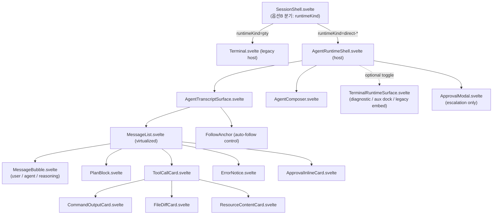

# UI Composition (데스크톱 앱식 transcript UI)

> 이 문서는 Direct Agent Runtime의 **프론트엔드 transcript UI**를 구현 가능한 수준으로 정의한다. Codex/Claude 데스크톱 앱처럼 message·tool activity·approval·diff·command output이 구분되는 구조화된 transcript를 만들고, 기존 xterm은 보조/legacy/diagnostic 역할로 강등한다.
>
> **역할 분리**: 이 문서는 **컴포넌트 트리·렌더 매핑·상호작용 규칙**을 다룬다.
> - 모든 공통 타입(`AgentEvent`, `AgentContent`, `ToolCallUpdate`, `ApprovalRequest`/`ApprovalOption`/`ApprovalDecision`, `AgentPlanEntry`, `AgentSessionStatus`, `ProviderRef` …)은 **재정의하지 않는다**. [`15-data-contracts.md`](15-data-contracts.md)의 §번호로 인용한다(타입 권위).
> - 상태 전이·upsert/append/replace·approval 생명주기·순서 보존 규칙은 [`04-normalized-agent-model.md`](04-normalized-agent-model.md)로 인용한다(규칙 권위).
> - UX 패턴 근거는 [`research/ux-reference.md`](research/ux-reference.md)의 §번호, frontend 코드 현실은 [`research/codebase-frontend.md`](research/codebase-frontend.md)의 §번호로 인용한다.
> - 브랜딩 제약은 [`09-permissions-security.md`](09-permissions-security.md) §"브랜드/제품 표시"를 따른다.
> - 미확정/결정 필요 항목은 본문에 `결정 필요`로 표기하고 [`13-risks-open-questions.md`](13-risks-open-questions.md)로 연결한다.

조사 시점: 2026-06-25. 코드 정합 기준 브랜치: `feat/claude-tui-fullscreen-option`.

---

## 1. 목표와 설계 원칙

에이전트 응답을 terminal byte stream이 아니라 **구조화된 transcript**로 표시한다. 핵심 원칙:

1. **provider 비결합**: UI는 `AgentEvent`(15 §3)와 `AgentContent`(15 §4)만 소비한다. Codex/ACP wire를 직접 보지 않는다. provider→`AgentEvent` 변환은 adapter([05](05-codex-app-server-adapter.md)/[06](06-claude-acp-adapter.md))가 담당한다.
2. **feature 레이어 규약 준수**: 신규 UI는 `src/lib/features/agent-runtime/{contracts,state,controller,service,view}` 모듈로 추가한다(research/codebase-frontend.md §1, §8). view는 로직 없는 `.svelte`, 상태는 룬 `$state` class(`create*State()`), 동작은 `create*Controller(deps)` DI 팩토리.
3. **legacy 보존 + 무회귀 공존**: 기존 terminal surface(`Terminal.svelte` host)는 그대로 두고 `SessionShell.svelte` 내부 분기(옵션 B, research/codebase-frontend.md §9)로 host를 선택한다. 탭 전환 시 비활성 host를 살려두는 계약(research/codebase-frontend.md §3.3)을 깨지 않는다.
4. **streaming-first layout**: sticky-bottom composer + 그 위 scrollable·가상화 transcript(ux-reference §1.1). auto-follow는 사용자가 위로 스크롤하면 멈추고, approval dialog는 auto-scroll 설정과 무관하게 항상 view로 끌어온다(ux-reference §7).
5. **타입 권위 단일화**: 본 문서가 props/state로 다루는 모든 도메인 값은 15의 타입을 import한다. UI 전용 view-model 타입만 본 문서가 정의한다(§5).

---

## 2. 컴포넌트 트리 (정보구조)

신규 트리는 research/codebase-frontend.md §8의 배치안을 정본화한 것이다. 기존 `Terminal.svelte` host와 대등한 위치에 `AgentRuntimeShell.svelte`(host)를 둔다. 아래처럼 `view/*.svelte`를 컴포넌트 단위로 다수 분리하고 view/controller/state/service 레이어를 나누는 것은 파일/디렉토리 분리 규약([`17-coding-conventions.md`](17-coding-conventions.md) §A)을 따른다.



### 2.1 컴포넌트 목록과 책임

| 컴포넌트 | 위치(권장) | 책임 | 비고 |
|---|---|---|---|
| `AgentRuntimeShell.svelte` | `features/agent-runtime/view/` | host. `SessionHostProps` 받아 controller/state 조립. transport 구독 lifecycle 소유 | `Terminal.svelte` 대응 (§9) |
| `AgentTranscriptSurface.svelte` | `view/` | transcript 레이아웃(scrollable region + sticky composer slot), auto-follow, `visible`/`viewMode` 토글 | `TerminalRuntimeSurface.svelte` 대응 |
| `MessageList.svelte` | `view/` | transcript item 배열을 순서대로 렌더. 가상화(visible만 mount) | ux-reference §1.1, §7.1 |
| `MessageBubble.svelte` | `view/` | user/agent/reasoning 텍스트 message 1건 렌더(streaming caret 포함) | §3, §6 |
| `PlanBlock.svelte` | `view/` | plan entry 목록(replace-only) | §3, ux-reference §4 |
| `ToolCallCard.svelte` | `view/tool-cards/` | tool call 1건. kind별 collapsed summary + expand | §3, §4 |
| `CommandOutputCard.svelte` | `view/tool-cards/` | execute kind 전용 command/cwd/stdout/stderr embed | §4, §7 |
| `FileDiffCard.svelte` | `view/tool-cards/` | edit/delete/move diff 표현 | §4 |
| `ResourceContentCard.svelte` | `view/tool-cards/` | read/search/fetch 산출물(text/resource/image) | §4 |
| `ApprovalInlineCard.svelte` | `view/` | 단일 tool 인라인 승인 UI | §4, ux-reference §8 |
| `ApprovalModal.svelte` | `view/` | escalation/destructive 승인 blocking modal | §4, §8 |
| `ErrorNotice.svelte` | `view/` | error/retry/stop-reason notice | §3 |
| `AgentComposer.svelte` | `view/` | 입력(text/image/mention) + send/stop + provider/model/mode indicator | §6 |

### 2.2 host 조립부 (`AgentRuntimeShell.svelte`)

`Terminal.svelte`(research/codebase-frontend.md §2.4)와 동형으로, host가 룬 `$state`/`$derived`/`$effect`를 보유하고 controller에 getter/콜백으로 연결한다.

> 컴포넌트·controller·reducer 등 신규 코드의 클래스/함수에는 JSDoc(`/** */`) 한글 보고서체 doc-comment를 단다([`17-coding-conventions.md`](17-coding-conventions.md) §B). reconcile·approval cleanup 같은 핵심 로직에는 한 줄 한글 주석을 둔다(17 §B.2).

```svelte
<script lang="ts">
  import { onMount, onDestroy } from "svelte";
  import type { SessionHostProps } from "$lib/features/session/contracts/session-shell";
  import { createAgentRuntimeState } from "../state/agent-runtime-state.svelte";
  import { createComposerState } from "../state/composer-state.svelte";
  import { createAgentRuntimeController } from "../controller/agent-runtime-controller";
  import { createAgentTransportController } from "../controller/agent-transport-controller";
  import { createApprovalController } from "../controller/approval-controller";
  import { createComposerController } from "../controller/composer-controller";
  import AgentTranscriptSurface from "./AgentTranscriptSurface.svelte";
  import AgentComposer from "./AgentComposer.svelte";
  import ApprovalModal from "./ApprovalModal.svelte";

  let props: SessionHostProps = $props();

  // 세션 인스턴스 단위 상태 (룬 class — research/codebase-frontend.md §1.3)
  const runtimeState = createAgentRuntimeState();
  const composerState = createComposerState();

  // viewMode: transcript ↔ diagnostic terminal embed 토글 (선택)
  let surfaceMode = $state<"transcript" | "diagnostic">("transcript");

  // transport: invoke/listen 래퍼 경유만 (research/codebase-frontend.md §4.1)
  const transport = createAgentTransportController({
    getSessionHandle: () => props.sessionId,
    // send/cancel/subscribe는 service/transport.ts(§9) 래퍼를 deps로 받음
  });

  const approval = createApprovalController({
    getState: () => runtimeState,
    respondApproval: (decision) => transport.respondApproval(decision),
  });

  const runtime = createAgentRuntimeController({
    getState: () => runtimeState,
    getSessionHandle: () => props.sessionId,
    // adapter가 변환한 AgentEvent(15 §3)를 subscribe로 받아 reducer로 state mutate
    subscribeEvents: transport.subscribeEvents,
    onApprovalRequested: approval.enqueue,
  });

  const composer = createComposerController({
    getState: () => composerState,
    getCapabilities: () => runtimeState.capabilities, // capability gating(§6.4)
    sendPrompt: (content) => transport.sendPrompt(content),
    cancelTurn: () => transport.cancelTurn(),
  });

  onMount(() => runtime.start(props)); // startSession 또는 resumeSession
  onDestroy(() => runtime.dispose());  // unsubscribe + shutdown 정책(§9.3)
</script>

<div class="agent-runtime-shell" class:hidden={!props.visible}>
  <AgentTranscriptSurface
    visible={props.visible}
    viewMode={surfaceMode}
    items={runtimeState.transcript}
    status={runtimeState.status}
    onFollowToggle={runtime.setAutoFollow}
    onResolveApproval={approval.respond}
    onToggleSurface={() => (surfaceMode = surfaceMode === "transcript" ? "diagnostic" : "transcript")}
  >
    <AgentComposer
      slot="composer"
      state={composerState}
      status={runtimeState.status}
      providerLabel={runtimeState.providerLabel}
      onSend={composer.send}
      onStop={composer.stop}
      onAttachImage={composer.attachImage}
      onMention={composer.openMention}
    />
  </AgentTranscriptSurface>

  {#if runtimeState.escalationApproval}
    <ApprovalModal
      request={runtimeState.escalationApproval}
      onSelect={approval.respond}
      onCancel={approval.cancel}
    />
  {/if}
</div>
```

> **계약 준수**: host는 `visible` prop만 받고 자체적으로 `.hidden`(absolute off-screen) CSS로 숨긴다. 비활성 시에도 transport 구독을 살려둬 transcript/연결을 유지한다(research/codebase-frontend.md §3.3, §9 전환 메커니즘 2). heavy DOM unmount/remount 금지.

---

## 3. AgentEvent → UI 렌더 매핑 (정본)

각 `AgentEvent` variant(15 §3)가 transcript state를 어떻게 바꾸고 어떤 컴포넌트로 렌더되는지의 매핑이다. **state mutation 규칙(upsert/append/replace/순서 보존)은 04를 따른다.** 본 표는 그 규칙이 어느 컴포넌트로 귀결되는지를 정의한다.

| `AgentEvent.type` (15 §3) | state 변경 (규칙: 04 §) | 렌더 컴포넌트 |
|---|---|---|
| `session_started` | 세션 메타 초기화, `status=ready` 동기화 | (transcript 헤더/상태 영역) |
| `session_loaded` | replay 시작 표시, 이후 event 순서 누적(04 §3.4) | "복원 중" 상태 + `MessageList` |
| `session_status_changed` | `runtimeState.status` 갱신(04 §2) | composer indicator(§6.5), 탭 badge(§8) |
| `user_message` | `mode=replace`/`append` upsert by `ref`(04 §3.1) | `MessageBubble`(role=user) |
| `agent_message` | upsert by `itemId`/`messageId`. Codex completed가 권위(04 §3.2.1). `channel:"thought"`(15 §3)는 reasoning 권위 reconcile(04 §3.2.2) | `MessageBubble`(role=agent) / `channel:"thought"`이면 thinking 블록(§6.2) |
| `agent_message_delta` | 대상 message에 `delta` **append**(04 §3.1, §3.2.1). `channel:"thought"` delta는 thought 스트림으로 별도 누적(04 §3.2.2/§3.2.5) | `MessageBubble` 내 점진 텍스트 + streaming caret(§6.1) / `channel:"thought"`이면 thinking 블록(§6.2) |
| `plan_updated` | plan **전체 교체**(04 §3.3 "replace-only") | `PlanBlock` |
| `tool_call_updated` | `id` 기준 upsert(04 §3.1). ACP content/locations는 replace(04 §3.3) | `ToolCallCard`(kind별 §4) |
| `tool_call_content_delta` | 대상 tool call content에 증분 추가(Codex command output append; 04 §3.2.3) | `CommandOutputCard`/`ResourceContentCard` |
| `approval_requested` | pending table 등록, inline vs modal 분기(§4.4) | `ApprovalInlineCard` 또는 `ApprovalModal` |
| `approval_resolved` | pending table 제거, 카드 상태 갱신(04 §4) | 해당 approval 카드 닫힘 |
| `command_output_delta` | tool call의 stdout/stderr 버퍼에 stream별 append(04 §3.2.3) | `CommandOutputCard` |
| `file_change_updated` | `FileChangeSummary` upsert | `FileDiffCard` |
| `turn_completed` | turn 종료, `status=idle`, usage 반영. stop-reason notice(§3.1) | `ErrorNotice`(refusal/max_* 시) |
| `process_exited` | 세션 `exited`, pending 전부 실패 닫힘(04 §5) | `ErrorNotice` + composer 비활성 |
| `error` | `recoverable`에 따라 retry/실패 표시(04 §5) | `ErrorNotice` |
| `terminal_output_delta` | transcript 아님 — 보조/legacy terminal surface 전용(04 §3.5) | `TerminalRuntimeSurface`(§7.4) |

> **content delta 시 가상화 주의**: `agent_message_delta`/`command_output_delta`는 고빈도다. `MessageList` 가상화는 "현재 streaming 중인 마지막 item"을 항상 mount 상태로 유지해야 한다(끝부분이 unmount되면 caret/append가 깜빡인다). 권장: streaming 중인 item id를 `runtimeState.streamingItemId`로 보유하고 가상화 윈도우에 강제 포함.

### 3.1 stop reason / refusal notice

`turn_completed`는 `status: completed|failed|cancelled`만 가진다(15 §3). 그러나 ACP `StopReason`(`end_turn|max_tokens|max_turn_requests|refusal|cancelled`)·Codex `error.codexErrorInfo`는 `ProviderRef.raw`/metadata에 보존된다(ux-reference §6.2, 04 §5). `refusal`/`max_tokens`/`max_turn_requests`는 `ErrorNotice`로 transcript에 명시 표시한다(ux-reference §11 #14). 원본 코드는 `raw`에 둔다.

---

## 4. Tool kind별 카드 표현 (정본)

`ToolCallUpdate.kind`(15 §5)는 `read|edit|delete|move|search|execute|think|fetch|other` 9종이며 ACP `ToolKind`와 정합(ux-reference §2.1). `ToolCallCard.svelte`가 kind로 collapsed summary와 expanded content를 분기한다.

| `kind` | collapsed summary | expanded content (전용 카드) | 출처 |
|---|---|---|---|
| `read` | `title` + 첫 `location.path` | `ResourceContentCard`(text/resource) + `locations[]` | ux-reference §2.2 |
| `search` | `title` + match 수(있으면) | `ResourceContentCard`(result) | ux-reference §2.2 |
| `fetch` | `title` + URL/리소스명 | `ResourceContentCard`(fetched) | ux-reference §2.2 |
| `edit` | `path` + `+N/-M` diffstat | `FileDiffCard`(`AgentContent{type:"diff"}` 15 §4) | ux-reference §2.2 |
| `delete`/`move` | operation + `path`(+`oldPath`) | `FileDiffCard`(`FileChangeSummary` 15 §5) | ux-reference §2.2 |
| `execute` | command 1줄 + cwd | `CommandOutputCard`(stdout/stderr embed §7) | ux-reference §5.2 |
| `think` | 요약 1줄 | reasoning 텍스트(§6.2 reasoning 블록과 통합) | ux-reference §4.2 |
| `other` | `title` | `rawInput`/`rawOutput` JSON(접힘) | fallback |

### 4.1 collapse/expand 규칙

- **tool call + result를 한 쌍으로 토글**한다(ux-reference §2.1 Claude fullscreen). `ToolCallCard`가 헤더(summary)와 body(expanded)를 한 컴포넌트에서 관리.
- **더 보여줄 게 있는 카드만 클릭 가능**: `content`/`locations`/`rawOutput`가 비었으면 expand affordance를 숨긴다(ux-reference §2.1 "Only messages that have more to show are clickable").
- **nested card 금지**: `ToolCallCard` 안의 diff/terminal은 단일 전용 영역으로 두고 다단 중첩하지 않는다(현 §10.2 layout 원칙).
- `ToolCallUpdate.status`(15 §5)별 시각 표현: `pending`(승인 대기/입력 streaming) → `in_progress`(실행 중, 스피너) → `completed`/`failed`/`cancelled`. `pending`과 `in_progress`를 시각적으로 **반드시 구분**(ux-reference §8.2). `cancelled`는 turn cancel 시 client가 합성(04 §4.2, 15 §5 매핑 주의).

### 4.2 FileDiffCard

- `AgentContent{type:"diff"; path; patch}`(15 §4) 또는 `FileChangeSummary{operation, path, oldPath?, diff?}`(15 §5)를 표시.
- ACP는 `Diff{oldText,newText}`로 오므로 adapter가 patch로 정규화한다(15 §4 주의, 06). UI는 정규화된 `patch`만 본다.
- diffstat(`+N/-M`)을 헤더에 표시(ux-reference §2.2 Zed "Changes Accordion" 스타일).
- **hunk 단위 accept/reject는 provider가 승인 흐름을 제공할 때만 노출**한다. CLCOMX가 자체적으로 sandbox 밖 변경을 적용하지 않는다([09](09-permissions-security.md), ux-reference §2.2 #4).

### 4.3 locations 점프

`ToolCallUpdate.locations`(15 §5 `FileLocation[]`)는 그대로 보존하고, 클릭 시 CLCOMX editor/파일 열기로 연결한다(Zed follow-along / Claude `Cmd/Ctrl`-click path 패턴, ux-reference §2.2). 연결 대상은 기존 editor integration(`terminal-editor-integration-controller.ts`, research/codebase-frontend.md §2.2)의 파일 열기 경로를 재사용한다 — `결정 필요`(editor open API 시그니처 확정, [13](13-risks-open-questions.md)).

### 4.4 Approval UI (inline vs modal)

approval 타입(`ApprovalRequest`/`ApprovalOption`/`ApprovalDecision`)은 15 §5, 생명주기는 04 §4. UI 규칙:

- **provider가 제시한 `options`를 그대로 보존·표시한다.** 표시하지 않은 option을 임의 선택하지 않는다([09](09-permissions-security.md), ux-reference §8.2).
- option label은 i18n으로 감싸되(§8 `agentRuntime.approval.*`), `optionId`/`kind`(15 §5)는 원본 유지.
- `ApprovalOption.kind`(15 §5: `allow_once|allow_always|reject_once|reject_always|cancel|other`)별로 버튼 스타일/아이콘을 구분한다. `allow_always`/`reject_always`는 시각적으로 "기억되는 승인"임을 알린다.
- **inline vs modal 분기**(ux-reference §8.2):
  - 단일 tool 승인(대부분) → `ApprovalInlineCard`를 해당 `ToolCallCard` 하단에 인라인 표시. approval card는 auto-scroll 설정과 무관하게 항상 view로 스크롤(ux-reference §7.2, §9).
  - escalation/destructive(sandbox 우회, 권한 상승) → `ApprovalModal`(blocking). modal escape 회귀 보호(§10.3).
- **진행/취소 상태**:
  - approval pending 동안 세션 status는 `requires_action`(04 §2)이고, composer는 "승인 대기 중" 표시 + cancel만 허용(ux-reference §9.2).
  - 사용자가 option 선택 → `ApprovalDecision{outcome:"selected", optionId}`로 응답(04 §4.1), 카드를 "처리 중"으로 잠그고 `approval_resolved` 수신 시 닫는다.
  - turn cancel/shutdown/process exit 시 pending approval을 `cancelled`(또는 process exit는 `failed`)로 닫고 provider에 명시 응답(04 §4.2, §5). UI는 카드에 "취소됨" 표기.
- **`allow_always`(자동 허용) 저장은 audit trail 준비 전까지 도입하지 않는다.** option이 와도 표시는 하되, "기억" 저장은 [09](09-permissions-security.md) 감사 경계가 갖춰진 뒤 활성화(ux-reference §8.2).

```text
┌─ ToolCallCard (kind=execute, status=pending) ─────────────┐
│ ▸ $ rm -rf build/        cwd: /home/u/proj                 │
│   ⚠ 승인이 필요합니다                                       │
│   ┌─ ApprovalInlineCard ────────────────────────────────┐ │
│   │ 이 명령을 실행하시겠습니까?                            │ │
│   │ [한 번 허용] [항상 허용] [한 번 거부] [거부] [취소]    │ │  ← options 원본 순서/개수 보존
│   └──────────────────────────────────────────────────────┘ │
└────────────────────────────────────────────────────────────┘
```

---

## 5. UI view-model 타입 (본 문서 정의 영역)

도메인 타입은 15가 권위이므로 **재정의하지 않는다**. transcript 렌더링을 위해 UI가 추가로 필요로 하는 view-model만 본 문서가 정의한다. 위치: `features/agent-runtime/contracts/transcript.ts`.

```ts
import type {
  AgentContent, AgentPlanEntry, ApprovalRequest, ToolCallUpdate,
  FileChangeSummary, AgentSessionStatus, ProviderRef, TokenUsage,
} from "./normalized"; // = 15 §1–§5 재export, 절대 재정의 금지

/** transcript에 순서대로 쌓이는 렌더 단위. discriminator = type. */
export type TranscriptItem =
  // role="reasoning"은 channel:"thought"(15 §3) 누적 스트림 → 접이식 thinking 블록(§6.2, 기본 collapsed).
  | { type: "message"; id: string; role: "user" | "agent" | "reasoning"; content: AgentContent[]; streaming: boolean; collapsed?: boolean; ref: ProviderRef }
  | { type: "plan"; id: string; entries: AgentPlanEntry[] }                       // replace-only(04 §3.3)
  | { type: "tool_call"; id: string; update: ToolCallUpdate; expanded: boolean; approval?: ApprovalRequest }
  | { type: "file_change"; id: string; change: FileChangeSummary }
  | { type: "notice"; id: string; level: "info" | "warning" | "error"; messageKey: string; raw?: unknown };

/** AgentRuntimeShell 세션 인스턴스 상태(룬 class, research/codebase-frontend.md §1.3). */
export interface AgentRuntimeViewState {
  transcript: TranscriptItem[];
  status: AgentSessionStatus;                  // 15 §2
  streamingItemId: string | null;              // 가상화 강제 포함 대상(§3)
  pendingApprovals: ApprovalRequest[];         // inline 표시 대상(15 §5)
  escalationApproval: ApprovalRequest | null;  // modal 표시 대상
  capabilities: ComposerCapabilities;          // §6.4
  providerLabel: string;                       // §6.5 (브랜딩 §8 준수)
  usage: TokenUsage | null;                    // 15 §5 (turn 토큰)
  contextUsage?: { used: number; size: number } | null; // ACP usage_update — 결정 필요(13)
  autoFollow: boolean;                         // §7.2
}

/** composer가 capability에 따라 활성/비활성하는 입력 기능(§6.4). */
export interface ComposerCapabilities {
  image: boolean;        // ACP promptCapabilities.image
  embeddedContext: boolean; // mention/resource 첨부
  audio: boolean;        // v1 미지원(15 §4 주의) → 항상 false
}
```

> `transcript-reducer.ts`(service, research/codebase-frontend.md §8)는 **순수 함수** `apply(state, event: AgentEvent): void`(또는 immutable 변형)로 04의 upsert/append/replace 규칙을 구현한다. controller는 이 reducer를 호출만 한다. reducer는 vitest 단위 테스트 대상(§9.4).

---

## 6. Composer

`AgentComposer.svelte`. doc 기존 항목(text/image/mention/send-cancel/indicator)을 구현 수준으로 구체화한다(ux-reference §9).

### 6.1 입력과 streaming

- **multiline 입력**: CLCOMX는 Tauri WebView이므로 터미널 키 제약이 없다(ux-reference §9.2). 권장 기본: `Enter`=전송, `Shift+Enter`=개행. 다만 최종 키 바인딩은 기존 CLCOMX UX 컨벤션과 통일 — `결정 필요`([13](13-risks-open-questions.md), ux-reference §12 #5).
- composer는 sticky bottom, transcript는 그 위 scrollable(ux-reference §1.2). streaming 중에도 composer는 움직이지 않는다(Claude fullscreen 고정 input).
- agent message streaming 표현: `agent_message_delta` append 시 `MessageBubble`에 점진 텍스트 + 끝에 streaming caret(▌). 텍스트는 `AgentContent{type:"text"}`로만 누적(04 §3.2).

### 6.2 reasoning / thinking 블록 (정본)

reasoning(think)은 agent message와 **분리된 collapsible "thinking" 블록**으로 둔다(ux-reference §1.2, §4.2). 데스크톱 앱식 보기 편한 화면을 위해 response 스트림과 시각적으로 구분한다.

**채널 기반 분기 정본**(D11): reasoning은 별도 `AgentEvent` variant가 아니라 `agent_message`/`agent_message_delta`의 optional `channel?: "response" | "thought"` 필드(15 §3, 미지정 시 `"response"`)로 구분한다.

- ACP `agent_thought_chunk`(06 §5)와 Codex `item/reasoning/textDelta`(05 §5.2)는 adapter가 `agent_message_delta{channel:"thought"}`로, completed reasoning item은 `agent_message{channel:"thought", mode:"replace"}`로 emit한다.
- `channel==="thought"`인 message는 `MessageBubble`의 `role="reasoning"`으로 렌더하되, **접이식 thinking 블록(기본 collapsed)**으로 둔다. `channel==="response"`(기본)는 일반 agent message로 렌더하며 두 스트림을 시각적으로 구분한다.
- thought delta는 `messageId`/`contentIndex`별로 append하고(04 §3.2.2/§3.2.5), completed reasoning item이 thought 채널의 권위로 reconcile한다(04 §3.2.2). response/thought는 별도 스트림으로 누적해 섞이지 않는다.
- thinking 블록은 collapsible 토글 + ARIA `aria-expanded`를 노출한다(§10.3, ux-reference §7.2).

> `TranscriptItem.message`의 `role`이 `"reasoning"`이면 thinking 렌더로 분기한다(§5). reducer는 `channel` 필드로 thought/response 스트림을 분리 누적한다(04 §3.2.2). v1에서 이 정책은 확정(`결정 필요` 아님)이며 13 OQ-01/RD-13은 '해소됨'이다.

### 6.3 image / mention

- **image 첨부**: paste/drag 모두 지원. Claude `[Image #N]` chip처럼 **위치 참조형 chip**을 입력 본문에 삽입(ux-reference §9.2). 전송 시 `AgentContent{type:"image"; uri; mimeType}`(15 §4)로 변환. ACP는 base64 `data`라서 adapter가 data URI/blob 저장 후 `uri` 생성(15 §4 주의).
- **file/resource mention**: `@`-mention(Zed/Claude/Codex 공통). 선택 시 `AgentContent{type:"resource"; uri; ...}`(15 §4). wire는 absolute path/file URI로 정규화(06).
- 기존 클립보드 이미지 paste 인프라(`overlay-clipboard-image-controller.ts`, research/codebase-frontend.md §2.2)를 재사용 가능 — `결정 필요`(재사용 vs 신규, [13](13-risks-open-questions.md)).

### 6.4 capability 기반 feature gating

composer 입력 기능은 provider capability에 따라 동적 enable/disable한다(ux-reference §10.2, §12). `ComposerCapabilities`(§5)는 adapter가 `initialize` 응답에서 채운다(06 ACP `promptCapabilities`, 05 Codex). `audio`는 v1 항상 false(15 §4). capability 미지원이면 해당 버튼을 비활성/숨김.

### 6.5 send / stop / indicator

- **send ↔ stop 전환**: turn 진행 중(`status=running`/`requires_action`)이면 send 버튼을 stop으로 전환(ux-reference §9.2). stop → `AgentRuntimePort.cancelTurn`(15 §6). cancel 시 pending approval cancelled 불변식 적용(04 §4.2).
- **active runtime/provider indicator**: provider/model/permission-mode를 composer 근처에 표시. provider label은 브랜딩 제약 준수 — Claude Code/Anthropic 공식 앱처럼 오인될 branding/ASCII art/visual copy 금지([09](09-permissions-security.md) §"브랜드/제품 표시"). 중립적 provider 식별자만 표시. i18n `agentRuntime.status.*`.
- **status별 composer 동작**:

| `AgentSessionStatus`(15 §2) | composer 상태 |
|---|---|
| `starting` | 입력 비활성, "시작 중" 표시 |
| `ready`/`idle` | 입력 활성, send 버튼 |
| `running` | 입력 활성(다음 prompt queue 정책은 결정 필요), stop 버튼 |
| `requires_action` | 입력 비활성, "승인 대기 중" + cancel만(§4.4) |
| `failed`/`exited` | 입력 비활성, retry/새 세션 안내(§3.1) |

```text
┌─ AgentComposer (sticky bottom) ──────────────────────────────┐
│  [@mention][📎image]                                          │
│  ┌────────────────────────────────────────────────────────┐ │
│  │ multiline input … [Image #1]                            │ │
│  └────────────────────────────────────────────────────────┘ │
│  provider · model · mode        [status badge]  [send/stop]  │
└──────────────────────────────────────────────────────────────┘
```

---

## 7. 긴 출력 / terminal embed / 스크롤 처리

### 7.1 auto-follow

ux-reference §7.1(Claude fullscreen) 패턴을 채택한다:
- streaming 중 transcript는 하단을 추종한다(`autoFollow=true`).
- 사용자가 위로 스크롤하면 auto-follow 일시 정지("Scrolling up pauses auto-follow"). 맨 아래 도달 또는 명시적 행동(`Ctrl+End` 등)으로 재개.
- **approval dialog는 auto-scroll 설정과 무관하게 항상 view로 스크롤**(ux-reference §7.1, §9, §4.4).

### 7.2 가상화

긴 transcript 성능을 위해 **보이는 item만 mount**(ux-reference §1.1, §7.1). `MessageList`가 윈도잉을 담당하되 §3 주의대로 `streamingItemId` item은 강제 포함. 권장 라이브러리/방식은 `결정 필요`(직접 구현 vs 라이브러리, [13](13-risks-open-questions.md)).

### 7.3 CommandOutputCard / 긴 출력

- card head: `command` + `cwd`(긴 명령은 §10 wrapping/horizontal scroll).
- body: **고정 높이 + resize handle** 출력 embed. live append, release 후에도 표시 유지(ACP terminals 규칙, ux-reference §5.2).
- footer: `exitStatus`(exitCode/signal) — 완료 시. `truncated`면 "앞부분 잘림" 표시 + "전체 로그 열기" 행동(§7.4로 라우팅, ux-reference §5.2, [05](05-codex-app-server-adapter.md) bounded buffer).
- stdout/stderr stream 구분 보존(04 §3.2.3). stderr diagnostic은 기본 collapsed([09](09-permissions-security.md)). ANSI는 terminal embed 내부에서만 처리.

### 7.4 xterm의 새 역할 (terminal embed / 보조 dock / legacy / diagnostic)

xterm은 전체 agent 화면이 아니라 다음 역할로만 쓴다(`terminal_output_delta` 전용, 04 §3.5):

| 역할 | 컴포넌트/위치 | 트리거 |
|---|---|---|
| **legacy PTY fallback** | `Terminal.svelte`(기존 host) | `runtimeKind=pty` 세션, 또는 direct 미지원 agent(§9) |
| **command output embed** | `CommandOutputCard` 내부(또는 경량 렌더) | execute tool call의 live output(§7.3) |
| **보조 셸 dock** | `TerminalRuntimeSurface`(aux) | 사용자가 보조 셸 토글 |
| **raw diagnostic view** | `AgentRuntimeShell`의 surface 토글(§2.2 `surfaceMode`) | "전체 로그 열기" / 진단 모드(research/codebase-frontend.md §9 전환 메커니즘 3) |

diagnostic 토글은 `Terminal.svelte`의 "두 surface mount + viewMode 토글" 선례(research/codebase-frontend.md §2.4, §9)를 재사용한다. command output embed가 무거우면 live append만 하는 경량 read-only 렌더로 대체 가능 — `결정 필요`(full xterm vs 경량, [13](13-risks-open-questions.md)).

---

## 8. i18n

신규 UI text는 모두 `en.ts`/`ko.ts`에 **동시에** 같은 키 트리로 추가한다(research/codebase-frontend.md §6.2). 현재 `agentRuntime` 키는 없음(추가 대상).

예약 namespace(현 문서 + research/codebase-frontend.md §6.2 확정):

- `agentRuntime.status.*` — 세션/turn 상태 라벨(starting/ready/running/requires_action/idle/failed/exited), provider/model indicator
- `agentRuntime.approval.*` — option label(`allowOnce`/`allowAlways`/`rejectOnce`/`rejectAlways`/`cancel`), 승인 본문, "승인 대기 중", "취소됨"
- `agentRuntime.toolKind.*` — kind별 라벨(read/edit/delete/move/search/execute/think/fetch/other)
- `agentRuntime.errors.*` — error/retry/stop-reason notice(refusal/maxTokens/maxTurnRequests/processExited)
- `agentRuntime.fallback.*` — legacy fallback/diagnostic 안내
- `agentRuntime.composer.*` — placeholder, send/stop, mention/image, "전체 로그 열기", "복원 중"

> **브랜딩 주의**([09](09-permissions-security.md)): provider label·notice·copy는 Claude Code/Anthropic 공식 앱 오인 소지 branding/ASCII art/visual copy를 쓰지 않는다. 중립적·기능적 표현만.

---

## 9. legacy 공존 / host 분기 / lifecycle

### 9.1 분기 지점 (옵션 B)

research/codebase-frontend.md §9 옵션 B를 정본화한다. `SessionShell.svelte`(현재 약 10줄의 얇은 분기 컴포넌트, research/codebase-frontend.md §9)에서 `session.runtimeKind`로 host 선택:

```svelte
<script lang="ts">
  import Terminal from "$lib/components/Terminal.svelte";
  import AgentRuntimeShell from "$lib/features/agent-runtime/view/AgentRuntimeShell.svelte";
  import type { SessionShellProps } from "../contracts/session-shell";
  import { createSessionHostProps } from "../service/session-shell-adapter";

  let props: SessionShellProps = $props();
  const hostProps = $derived(createSessionHostProps(props));
  // runtimeKind: "pty" | "direct-codex" | "direct-claude" (15 §7 SessionRuntimeKind)
  const useDirect = $derived(props.session.runtimeKind?.startsWith("direct-") ?? false);
</script>

{#if useDirect}
  <AgentRuntimeShell {...hostProps} />
{:else}
  <Terminal {...hostProps} />
{/if}
```

> 위 코드는 **target 형태**다. 현재 코드는 `terminalProps`만 넘기는 단일 `Terminal` 렌더이며(변수명 `terminalProps`, `Terminal`은 `"../../../components/Terminal.svelte"`에서 import), 본 분기는 옵션 B 적용 후 형태다. 변수명을 `hostProps`로 일반화하는 것은 contract 확장(아래)의 일부다.

필요한 contract 확장(research/codebase-frontend.md §10 체크리스트):
1. `SessionShellSession`(`session/contracts/session-shell.ts`)에 `runtimeKind` 추가.
2. `createSessionHostProps`(`session-shell-adapter.ts`)에 `runtimeKind` 매핑 한 줄.
3. `SessionViewportProps`/`App.svelte`/`session-shell-loader` 변경 **0**(옵션 B의 장점).

> `SessionRuntimeKind`(`"pty"|"direct-codex"|"direct-claude"`)와 persistence 전파는 15 §7, [10](10-persistence-migration.md) 소관. `SessionViewMode`를 `"agent"`로 확장하지 **않는다**(15 §7.2 주의, research/codebase-frontend.md §5).

### 9.2 PTY 없는 세션의 콜백 흐름

direct runtime은 ptyId가 없다. `onPtyId`/`onAuxStateChange`/`onExit`/`onResumeFallback`(PTY 전제 콜백, research/codebase-frontend.md §11 위험)은 `AgentRuntimeShell`에서 no-op 또는 우회한다. workspace autosave `$effect`(research/codebase-frontend.md §11)가 "ptyId 부재"를 죽은 세션으로 오인하지 않도록 검증 필요 — [10](10-persistence-migration.md)/[11](11-testing-acceptance.md)와 cross-check. `결정 필요`(autosave 추적 필드 조정, [13](13-risks-open-questions.md)).

### 9.3 transport lifecycle

- `onMount` → `AgentRuntimePort.startSession`/`resumeSession`(15 §6). resume 시 `session/load` replay 중 "복원 중" 상태 + composer 잠금(ux-reference §10.2).
- 구독은 `subscribeEvents`(15 §6)로 등록하고 `UnlistenFn`을 host가 보유, `onDestroy`에서 해제.
- 탭 비활성(`visible=false`) 시에도 구독/연결 유지(§2.2 계약). `onDestroy`는 탭 닫힘/세션 종료 시에만. `shutdown` 정책(graceful)은 [07](07-tauri-process-runtime.md).

### 9.4 테스트

- `transcript-reducer.ts`(순수 함수): `AgentEvent` 시퀀스 → transcript 스냅샷을 vitest로 검증(04 규칙 케이스: append/replace/upsert/reconcile/approval cleanup). research/codebase-frontend.md §1.6.
- controller: `vi.fn()` deps로 단위 테스트(transport send/cancel/subscribe 모킹).
- view: `@testing-library/svelte`. testid는 `src/lib/testids.ts` `TEST_IDS`에 추가(`agentTranscript`, `agentComposerInput`, `approvalModal`, `approvalInlineCard`, `agentToolCard`, `agentPlanBlock`)(research/codebase-frontend.md §1.6, §10 #9). approval 컴포넌트/testid 정본은 `ApprovalModal.svelte`/`approvalModal`, `ApprovalInlineCard.svelte`/`approvalInlineCard`이며 11·12와 통일한다. 수용 기준은 [11](11-testing-acceptance.md).

---

## 10. 반응형 레이아웃과 focus/shortcut 회귀 방지

### 10.1 레이아웃

- transcript는 tab content 영역 기준 **full-height flex layout**(scrollable transcript + sticky-bottom composer, ux-reference §1.2).
- tool card는 nested card를 피하고 반복 item card만 사용한다(§4.1).
- 긴 command/path/model name은 wrapping 또는 horizontal scroll(§7.3).
- terminal embed는 고정 높이 + resize handle(§7.3).
- 좁은 폭에서는 composer indicator(provider/model/mode)를 2줄로 접거나 아이콘 축약.

### 10.2 카드 밀도

- `/focus` 류 밀도 축소 뷰(마지막 prompt + tool call 1줄 요약 + 최종 응답)는 "compact transcript" 옵션으로 고려(ux-reference §7.2, §11 #16) — `결정 필요`(v1 포함 여부, [13](13-risks-open-questions.md)).

### 10.3 focus / shortcut 회귀 방지 (높은 위험)

기존 terminal focus·assistant dock shortcut과 충돌 위험이 크다(research/codebase-frontend.md §11). 원칙:

- **composer focus와 terminal embed focus를 분리**한다. command output terminal embed가 일반 app shortcut을 가로채지 않게 한다(research/codebase-frontend.md §11 focus/shortcut 위험).
- 기존 `terminal-focus-bridge.ts`/`terminal-shortcut-routing.ts`(Ctrl+T/Ctrl+W 등, research/codebase-frontend.md §2.2, §11)와 composer 입력 focus 충돌을 방지: composer가 focus를 가진 동안에도 탭 전환 단축키는 동작해야 한다.
- 기존 **Space toggle, tab movement, modal escape** 동작은 별도 회귀 테스트로 보호한다([11](11-testing-acceptance.md)).
- `ApprovalModal` escape 동작은 기존 modal escape 컨벤션(`TerminalOverlayStack.svelte`의 interrupt confirm 등, research/codebase-frontend.md §2.1)과 일치시킨다. escape는 modal 닫기이며 approval은 별도 cancel 행동(option) — escape로 임의 승인/거부하지 않는다(§4.4 원본 option 보존).
- collapsible 요소(tool card/reasoning/plan)는 키보드 토글 + ARIA `aria-expanded` 노출(ux-reference §7.2, §11 #16).

---

## 11. 구현 체크리스트 (다운스트림)

| # | 항목 | 근거 |
|---|---|---|
| 1 | `features/agent-runtime/` 모듈 트리 생성(§2.1) | research/codebase-frontend.md §8 |
| 2 | `transcript.ts` view-model(§5) — 15 타입 import, 재정의 금지 | 15 §1–§5 |
| 3 | `transcript-reducer.ts` 순수 함수로 04 규칙 구현 | 04 §3, §4, §5 |
| 4 | `AgentRuntimeShell.svelte` host 조립(§2.2), `visible`/lifecycle 계약 | research/codebase-frontend.md §3.3, §9 |
| 5 | `SessionShell.svelte` 옵션 B 분기 + contract 확장(§9.1) | research/codebase-frontend.md §9, §10 |
| 6 | AgentEvent→렌더 매핑 표(§3) 컴포넌트로 구현 | 15 §3, 04 |
| 7 | kind별 카드(§4) + collapse/expand + status 구분 | ux-reference §2, 15 §5 |
| 8 | approval inline/modal(§4.4), options 원본 보존, label만 i18n | 04 §4, 09, ux-reference §8 |
| 9 | composer(§6): multiline/image/mention/send-stop/indicator/capability gating | ux-reference §9, §10 |
| 9a | `channel:"thought"` 접이식 thinking 블록 렌더(§6.2, 기본 collapsed, response와 시각 구분) | 15 §3 channel, 04 §3.2.2 |
| 10 | auto-follow + 가상화 + streamingItemId 강제 포함(§3, §7) | ux-reference §7 |
| 11 | xterm 새 역할(§7.4): legacy/embed/aux/diagnostic | 04 §3.5 |
| 12 | i18n `agentRuntime.*` en/ko 동시 추가(§8), 브랜딩 준수 | research/codebase-frontend.md §6, 09 |
| 13 | testid 추가 + reducer/controller/view 테스트(§9.4) | research/codebase-frontend.md §1.6 |
| 14 | focus/shortcut/modal escape 회귀 테스트(§10.3) | research/codebase-frontend.md §11 |

---

## 12. 교차 참조

| 대상 | 문서 | 절 |
|---|---|---|
| 모든 공통 타입(정본) | [`15-data-contracts.md`](15-data-contracts.md) | §1–§6 |
| 상태 머신·upsert/append/replace·approval 생명주기·순서 보존 | [`04-normalized-agent-model.md`](04-normalized-agent-model.md) | §2, §3, §4, §5 |
| UX 패턴 근거 | [`research/ux-reference.md`](research/ux-reference.md) | §1–§11 |
| frontend feature 레이어·host 분기·룬 store·연결점 | [`research/codebase-frontend.md`](research/codebase-frontend.md) | §1, §2, §3, §8, §9, §10, §11 |
| 권한·승인·브랜딩 제약 | [`09-permissions-security.md`](09-permissions-security.md) | 전체 |
| Codex/Claude adapter(AgentEvent 변환·diff 정규화·capability) | [`05-codex-app-server-adapter.md`](05-codex-app-server-adapter.md), [`06-claude-acp-adapter.md`](06-claude-acp-adapter.md) | 전체 |
| Tauri transport/lifecycle/shutdown | [`07-tauri-process-runtime.md`](07-tauri-process-runtime.md) | 전체 |
| persistence·runtimeKind 전파·resume/load | [`10-persistence-migration.md`](10-persistence-migration.md) | 전체 |
| 테스트·수용 기준 | [`11-testing-acceptance.md`](11-testing-acceptance.md) | 전체 |
| 결정 필요/위험 항목 | [`13-risks-open-questions.md`](13-risks-open-questions.md) | 전체 |
| 파일 분리·JSDoc 한글 주석 규약 | [`17-coding-conventions.md`](17-coding-conventions.md) | §A, §B |
