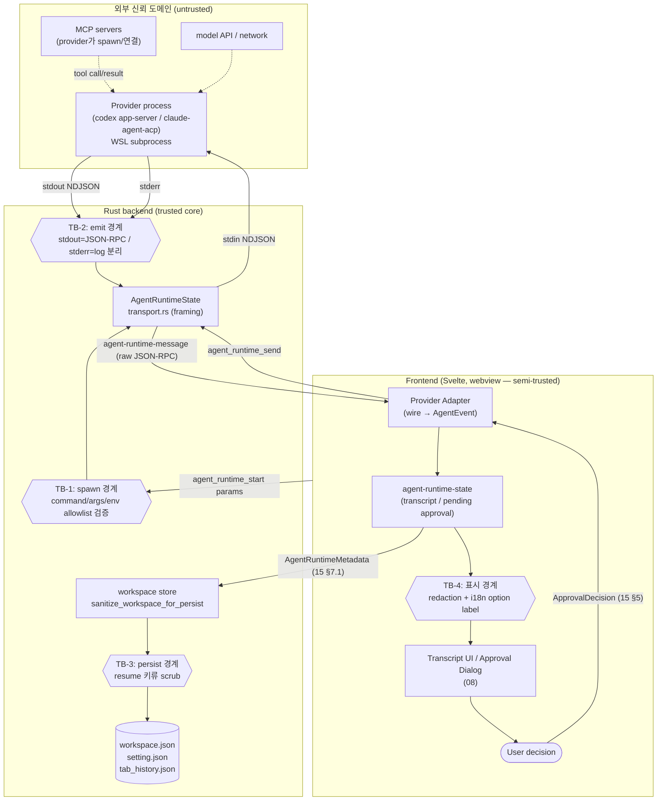

# Permissions, Security and Audit

> 이 문서는 Direct Agent Runtime의 **권한·보안·감사 경계**를 위협모델 수준으로 정의한다. 타입은 재정의하지 않고 [`15-data-contracts.md`](15-data-contracts.md)의 §번호로 인용하며, approval 생명주기·cleanup 불변식 같은 규칙은 [`04-normalized-agent-model.md`](04-normalized-agent-model.md)의 §번호로 인용한다. provider wire 사실은 ref-* 문서로, 현 코드 사실은 `research/*` 문서로 인용한다.
>
> **역할 분리**: 이 문서는 보안 *정책·경계·체크리스트*의 권위다. 어떤 타입을 쓰는지는 15, 어떤 순서로 상태가 전이되고 pending이 닫히는지는 04, process spawn/shutdown 기제는 [`07-tauri-process-runtime.md`](07-tauri-process-runtime.md), UI 표면(modal/badge)은 [`08-ui-composition.md`](08-ui-composition.md), 디스크 영속화 scrub 구현은 [`10-persistence-migration.md`](10-persistence-migration.md)에 있다. 충돌 시 위 권위 문서가 우선한다.

조사 시점: 2026-06-25. 코드 스냅샷 기준: commit `e7a5f9e`; 구현 전 현재 작업트리와 대조.

---

## 0. 위협모델 요약 (STRIDE 관점)

Direct runtime은 terminal byte stream보다 **훨씬 풍부한 구조화 권한 정보**(approval option, sandbox mode, permission mode, MCP credential, tool input/output)를 다룬다. 정보가 많아질수록 노출·오남용 표면도 커진다. 아래는 본 문서가 방어 대상으로 삼는 위협이다.

| 위협 (STRIDE) | 시나리오 | 1차 방어 | 본 문서 절 |
|---|---|---|---|
| **Spoofing** | renderer가 provider가 보여주지 않은 approval option을 임의로 선택해 응답 | option id 보존 + 표시된 것만 선택 | §2, §3 |
| **Tampering** | renderer가 임의 executable/shell string·임의 `.js`·임의 args·임의 env 키를 `agent_runtime_start`로 넘겨 코드 실행 | command는 renderer 입력에서 제거하고 backend가 provider로 신뢰 절대경로를 resolve, args(provider별 정확 일치)·env key allowlist를 Rust handler에서 재검증(basename-only 불충분) | §4 |
| **Repudiation** | 어떤 approval을 누가 언제 허용했는지 추적 불가 | audit trail(결정·시각·optionId·scope) | §3.4, §6 |
| **Information disclosure** | API key·OAuth token·env·MCP credential·파일 내용이 로그/디스크/transcript에 평문 노출 | redaction 목록 + raw 로그 기본 비활성 + persistence scrub | §5, §6, §7 |
| **Denial of service** | pending approval이 닫히지 않아 agent가 영구 정지(approval deadlock) | cancel/exit 시 pending cleanup 불변식 | §3.5 |
| **Elevation of privilege** | sandbox/permission mode 우회, bypass mode 자동 진입 | provider sandbox 비우회 + mode 명시 표시 + bypass 게이트 | §8 |
| **제품 오인** | Claude Code/Anthropic 공식 앱처럼 보여 브랜드·약관 위반 | 브랜딩 가이드 | §9 |

> **확인된 사실 vs 추정**: 본 문서에서 ref-*/`research/*` 인용이 붙은 항목은 1차 소스 검증된 사실이다. 그 외 정책 선택(예: allowlist 구체 형태, audit 저장 포맷)은 "결정 필요"로 표기하고 [`13-risks-open-questions.md`](13-risks-open-questions.md)로 연결한다.

---

## 1. 신뢰 경계 (Trust boundaries)

신뢰 경계는 "데이터가 한 신뢰 도메인에서 다른 도메인으로 넘어가는 지점"이다. 각 화살표가 검증/redaction/scrub이 일어나야 하는 지점이다.



경계별 책임(정본 위치):

- **TB-1 (renderer → backend spawn)**: renderer가 보낸 `AgentRuntimeStartParams`(15 §8.1)의 `provider`/`args`/`env`를 Rust handler가 provider allowlist로 **재검증**한다. `command` 필드는 제거됐고 renderer가 executable을 넘기지 않는다. backend가 `provider`로 신뢰 절대경로를 resolve하거나 사전 등록 절대경로 화이트리스트에서 고른다. renderer는 신뢰 경계 밖(웹뷰는 변조 가능)이라고 가정하므로, **검증은 backend-resolved executable·정확 args·env key 수준까지 내려가야 한다**: executable은 backend가 resolve한 신뢰 절대경로, `args`는 provider별 정확 일치(Codex `["app-server","--stdio"]`, Claude는 검증된 `adapterEntryPath` 단일 인자), `env`는 key allowlist + 형식 검증을 통과한 non-secret 키만. **basename만 비교하면 불충분**하다(공격자가 `/tmp/codex` 같은 임의 경로의 동명 바이너리를 통과시킬 수 있음). §4, 07 §8.1 참조. 현 PTY엔 선례 없음 (`research/codebase-backend.md` §6, §10 권고 6). **`AgentRuntimeStartParams.env`는 non-secret env 전용 규약**이며, secret(API key/token 등)은 이 경계를 launch argv로 통과하지 않는다 — §5.3(secret env 경계, 07 launch 정본 인용).
- **TB-2 (provider → backend framing)**: provider stdout은 **JSON-RPC만**, stderr는 **log만**. claude-agent-acp는 `console.*`를 stderr로 redirect해 stdout 청결을 보장한다 (ref-claude-agent-acp §1 "stdout 청결", ref-acp §1 stdout purity MUST). backend는 protocol 의미를 해석하지 않고 framing만 한다 (15 §8.3 주석, `07-tauri-process-runtime.md` §Framing).
- **TB-3 (메모리 → 디스크)**: `providerSessionId`/`providerThreadId`/`providerResumeToken`을 디스크 직전 scrub. §7, 15 §7.3 정본, `research/codebase-backend.md` §4.2.
- **TB-4 (store → 화면)**: redaction 적용 + approval option label을 i18n으로 감싸 표시. §5, §3.2.

---

## 2. 승인 원칙 (Approval principles)

approval 결정 타입은 15 §5(`ApprovalRequest`/`ApprovalOption`/`ApprovalDecision`), 생명주기·cleanup 불변식은 04 §4가 권위다. 본 절은 그 위에 얹는 **보안 원칙**만 정의한다.

1. **id 보존 무결성**: provider가 준 request id(JSON-RPC `id`)와 각 `ApprovalOption.id`는 절대 재생성·재매핑하지 않고 원본 그대로 보존한다(15 §0.1 컨벤션, `ProviderRef.requestId`). 응답 매칭은 이 id로만 한다.
2. **표시-선택 일치 (Spoofing 방어)**: UI가 사용자에게 **실제로 보여준 option 중 하나만** 선택해 응답한다. provider가 보낸 적 없는 optionId나 UI가 숨긴 옵션을 client가 임의로 합성해 보내지 않는다. `ApprovalDecision.outcome`은 15 §5의 `selected`/`cancelled`/`failed`만 쓰며, `failed`는 **wire로 보내지 않는** client 내부 전용이다(15 §5 주석, 04 §4.2 규칙 4).
3. **자동 허용 금지(기본값)**: client측 자동 허용(auto-approve)은 별도 설정 + audit trail이 준비되기 전까지 도입하지 않는다([`13`](13-risks-open-questions.md) Resolved defaults). provider 자체의 sandbox/permission mode(예: Codex `Agent (Full Access)`, Claude `bypassPermissions`)는 §8에서 표시·게이트만 하고 client가 흉내내지 않는다.
4. **cleanup 불변식 준수**: turn cancel·session shutdown·process exit 시 pending approval을 반드시 닫는다. 정확한 규칙은 04 §4.2/§5, 본 문서 §3.5에 운영 체크리스트로 옮겼다.
5. **escalation은 modal**: sandbox 우회·`bypassPermissions` 진입·protected path 쓰기 같은 고위험 결정은 비차단 inline이 아니라 modal로 표시한다(`research/ux-reference.md` 라인 336, 08 modal escape 회귀 보호).

> **구현 시 점검 (§2)**
> - [ ] `respondApproval`은 store의 pending table에 실제로 존재하는 `requestId`에만 응답하는가(없는 id면 거부/로그).
> - [ ] 보내는 `optionId`가 해당 `ApprovalRequest.options[].id` 집합에 속하는지 wire 전송 직전 assert하는가.
> - [ ] `outcome:"failed"`가 절대 `agent_runtime_send`로 나가지 않는지 adapter에서 가드하는가(04 §4.2 규칙 4).
> - [ ] auto-approve 설정 토글이 존재한다면, 켜질 때 audit trail이 함께 활성화되는가(미구현이면 토글 자체를 노출하지 않음).

---

## 3. Approval 흐름의 보안 운영 규칙

### 3.1 정상 흐름의 신뢰 경계

정상 흐름 단계는 04 §4.1이 정본이다. 보안 관점 보강:

- provider→client request의 raw payload(Codex `CommandExecutionRequestApprovalParams` 등, ref-codex §4.1; ACP `RequestPermissionRequest`, ref-acp §6)는 매핑되지 않은 필드를 `ProviderRef.raw`/`rawInput`에 보존하되, **raw payload를 transcript에 그대로 펼쳐 렌더링하지 않는다**(§5 redaction). UI에는 정규화된 `title`/`body`/`options`만 노출한다.
- option `label`은 provider 원본 문자열이므로 **i18n key로 감싸** 표시한다(04 §4.1 단계 2, ref-acp §6, ref-claude-agent-acp §3 request_permission 매핑). label을 코드/HTML로 해석하지 않는다(XSS 방어 — webview에서 text node로만 렌더).

### 3.2 provider별 wire 응답 형태 (검증된 사실)

adapter가 `ApprovalDecision`을 provider wire로 변환할 때의 형태. 정확한 매핑표는 ref가 권위다.

- **Codex**: `{ id, result: { decision } }` (JSON-RPC `jsonrpc` 필드 없음 — ref-codex §1.2). `decision`은 `accept`/`acceptForSession`/`decline`/`cancel` **단순 4종만** 보낼 것을 권장한다. `acceptWithExecpolicyAmendment`/`applyNetworkPolicyAmendment`는 데이터를 가진 variant라 외부 태그 객체로 직렬화되며, client가 정책 수정안을 합성해 보내면 권한 상승 위험이 있어 **v1에서 보내지 않는다**(ref-codex §4.1 경고).
- **ACP**: `{ jsonrpc:"2.0", id, result: { outcome: { outcome:"selected", optionId } } }` (ref-acp §6, ref-claude-agent-acp §3). cancel은 `{ outcome: { outcome:"cancelled" } }`.

### 3.3 다중 approval / 라우팅 분기 (Codex)

Codex zsh-exec-bridge 분기 시 한 `itemId`에 복수 approval callback이 붙을 수 있고, 이때 `approvalId`(원본은 `raw`)로 구분한다(ref-codex §6 라인 535, 04 §1, 15 §1.1). 보안 함의: **잘못된 approval에 사용자의 "허용"이 잘못 매칭되면 의도치 않은 명령이 실행**된다. 따라서 pending table 키는 단순 `itemId`가 아니라 `(requestId)` 또는 `(itemId, approvalId)` 조합이어야 하며, 응답은 항상 JSON-RPC `id`로 라우팅한다(ref-codex §6 라인 535).

### 3.4 Audit trail (Repudiation 방어)

자동 허용을 도입하든 안 하든, 모든 approval 결정은 추적 가능해야 한다. v1 최소 audit 레코드(메모리 + opt-in redacted 로그):

```ts
// 결정 필요(13): audit 저장 위치/보존기간/포맷은 미확정. 아래는 최소 필드 권고.
interface ApprovalAuditEntry {
  sessionHandle: string;       // AgentSessionHandle (15 §6)
  provider: AgentProvider;     // 15 §1
  requestId: string;           // ProviderRef.requestId (15 §1)
  toolCallId?: string;
  optionId?: string;           // 선택된 옵션 (raw label은 저장 금지 — i18n key/kind만)
  optionKind?: ApprovalOption["kind"]; // 15 §5 (allow_once 등)
  outcome: ApprovalDecision["outcome"]; // "selected"|"cancelled"|"failed"
  scope?: "once" | "session";  // allow_always류면 session
  decidedAt: number;           // epoch ms
  decidedBy: "user" | "auto" | "cleanup"; // cleanup = cancel/shutdown→cancelled(wire) / exit→failed(내부, 04 §5.0)
}
```

- audit에는 **명령 전문/파일 내용/credential을 저장하지 않는다** — `requestId`/`optionId`/`kind`/`outcome`/시각만. raw 명령은 §5 redaction 대상.
- `decidedBy:"auto"`는 향후 auto-approve가 생길 때만 발생하며, 그 자체가 보안 감사 신호다.

> **구현 시 점검 (§3)**
> - [ ] Codex 응답에 `jsonrpc` 필드를 넣지 않는가 / ACP 응답에 `jsonrpc:"2.0"`을 넣는가(ref-codex §1.2, ref-acp §1).
> - [ ] pending table 키가 `requestId`(또는 `itemId+approvalId`)로 충돌 없이 분리되는가(§3.3).
> - [ ] approval option label을 text node로만 렌더하고 코드로 해석하지 않는가(XSS).
> - [ ] 모든 결정에 audit entry가 1건 기록되는가(user/auto/cleanup 모두).
> - [ ] audit entry에 명령 전문·credential·파일 내용이 섞이지 않는가.

### 3.5 Cancel/exit 시 pending cleanup (DoS/deadlock 방어)

approval deadlock은 명시적 위험으로 분류돼 있다([`13`](13-risks-open-questions.md) "Approval deadlock"). cleanup 불변식의 권위는 04 §4.2/§5이며, 두 protocol의 MUST와 정확히 대응한다(ref-acp §3.8 "pending된 모든 `session/request_permission`에 `cancelled`로 MUST 응답", ref-codex §4 `serverRequest/resolved`). 보안 운영 체크리스트로 재정리:

> **구현 시 점검 (§3.5 cleanup 불변식)**
> - [ ] `cancelTurn` 또는 `turn_completed{status:"cancelled"}` 수신 시, 해당 turn의 모든 pending approval에 `{outcome:"cancelled"}`를 **wire로** 보내고 pending table에서 제거하는가(04 §4.2 규칙 1).
> - [ ] `process_exited` 수신 시 모든 pending approval/request를 닫는가(04 §5, `decidedBy:"cleanup"` audit 기록).
> - [ ] Codex `serverRequest/resolved{threadId, requestId}` 수신 시 해당 `requestId`만 닫는가(사용자 응답 불필요, 04 §4.2 규칙 3).
> - [ ] UI/탭이 닫히거나 webview가 reload돼도 backend의 pending이 끊긴 채 남지 않는가(process가 살아있으면 shutdown으로 정리, 07 §Process lifecycle).
> - [ ] cleanup으로 닫힌 approval이 이후 도착하는 사용자 응답으로 **이중 응답**되지 않는가(닫힌 requestId 재응답 거부).

---

## 4. Command / args / env allowlist (TB-1, 신규 강화 지점)

### 4.1 배경: PTY엔 선례가 없다

현 PTY는 frontend가 자유롭게 shell 문자열을 만들어 `pty_spawn`에 넘기고, **backend에 executable allowlist 검증이 없다**(`research/codebase-backend.md` §6, §10 권고 6). Direct runtime은 이 자유 shell 모델을 따르지 않는다. 15 §8.1 주석이 정본 요구를 명시한다: executable `command`는 renderer 입력에서 제거하고 backend가 provider로 resolve하며, `args`/`env`는 adapter가 생성한 검증된 값만 허용하고 Rust handler가 provider별 allowlist로 재검증한다(임의 executable/shell string 차단). 이는 PTY 대비 **의도적 강화 지점**이며 현 코드에 선례가 없어 신규 구현이다.

**basename-only는 불충분 (Tampering 정본)**: `command`의 basename만 화이트리스트와 비교하면(예: basename이 `codex`/`node`이면 통과), renderer가 `/tmp/codex`·`/dev/shm/node` 같은 **임의 경로의 동명 바이너리**를 심어 통과시킬 수 있어 코드 실행 우회가 된다. 따라서 검증 정본(07 §8.1, R4)은 basename 비교를 제거하고 `command` 자체를 renderer 입력에서 제거한다. backend가 (a) 직접 resolve한 신뢰 절대경로 또는 (b) 사전 등록된 절대경로 화이트리스트에서 executable을 고르고, `args`는 provider별 **정확 일치**, `env`는 **key allowlist**까지 함께 재검증한다. 즉 "renderer가 준 이름이 맞나"가 아니라 "backend가 확정한 절대경로 + 이 args + 이 env key 집합인가"를 확인한다.

### 4.2 이중 방어 (defense in depth)

renderer는 신뢰 경계 밖(TB-1)이므로 frontend 검증만으로는 부족하다. 두 층에서 검증한다.

- **Layer 1 (frontend adapter)**: Codex/Claude adapter가 `AgentRuntimeStartParams`(15 §8.1)를 **provider별로 고정된 형태**로만 생성한다. 사용자 입력은 model/cwd/옵션에만 영향을 주고 executable은 만들지 않으며 core argv는 코드 상수에서 온다.
- **Layer 2 (Rust handler, 권위)**: `agent_runtime_start`(15 §8.2)가 `params.provider`(`codex`|`claude`) enum에 따라 backend-resolved executable/`args`/`env`를 allowlist로 재검증한다. 통과 못 하면 `Result<_, String>` Err로 거부(`research/codebase-backend.md` §2.1 에러 컨벤션).

### 4.3 provider별 allowlist 사양 (권고 — 일부 결정 필요)

| provider | 허용 executable (절대경로/backend-resolved) | 허용 core `args` 형태 (정확 일치) | 근거 |
|---|---|---|---|
| `claude` | node 절대경로(`CLAUDE_RUNTIME_NODE` 등으로 핀, backend resolve 또는 사전 등록 절대경로) | `args.length == 1` 이고 `args[0]`이 검증된 `adapterEntryPath`(절대경로, `…/claude-agent-acp/dist/index.js` 패턴). 임의 `.js`/임의 바이너리 거부 | ref-claude-agent-acp §1, §5; 07 §8.1; 06 §2.2 |
| `codex` | `codex` 바이너리 절대경로(backend resolve 또는 사전 등록 절대경로) | `args`가 정확히 `["app-server","--stdio"]`. experimental flag는 §0 experimental 경고 게이트 뒤에서만 | ref-codex §1.1 (app-server 기본 stdio); 07 §8.1 |

allowlist 검증 규칙(Rust handler — 정본 07 §8.1, basename-only 금지):

1. **executable 절대경로 검증 (basename-only 금지)**: executable은 renderer가 넘기지 않고 backend가 `provider`로 resolve한다. resolve 결과는 (a) backend가 resolve한 신뢰 절대경로이거나 (b) 사전 등록된 절대경로 화이트리스트에 속해야 한다. **basename 일치만으로 통과시키지 않는다** — basename이 `codex`/`node`인 임의 경로(`/tmp/codex` 등)는 거부. PATH lookup으로 임의 바이너리를 찾지 않는다(nvm 등 비표준 node는 절대경로 핀, ref-claude-agent-acp §5). resolve owner/cache/entry 탐색은 OQ-36 결정 후 구현한다.
2. **args 정확 검증 (provider별 exact match)**: Codex는 `args`가 정확히 `["app-server","--stdio"]`일 것. Claude는 `args.length == 1` 이고 `args[0]`이 검증된 `adapterEntryPath`(절대경로, `claude-agent-acp dist/index.js` 패턴)일 것. 임의 `.js`/임의 바이너리는 거부한다. shell 메타문자 검사는 **방어용으로 유지**하되(`wsl.exe -e`가 shell을 거치지 않더라도, `research/codebase-backend.md` §2.2 "executable + argv 배열" 규칙), 일차 방어선은 위 정확 일치다(free shell string 합성 금지).
3. **`npx` 등 비결정 launch 거부(claude)**: 검증된 `adapterEntryPath` 외의 진입(특히 `npx`)은 비결정성/네트워크 fetch 때문에 runtime launch에서 거부한다(ref-claude-agent-acp §1 표 "npx 비권장").
4. **env key allowlist (§4.4)**: env key는 `^[A-Za-z_][A-Za-z0-9_]*$` 형식 + provider별 허용 key 집합을 모두 통과한 키만 child env에 합성하고, 값은 non-secret(§5.3). 그 외 key는 drop.

> **결정 필요(13)**: OQ-36에서 backend resolver owner/cache/entry 탐색 방식을 확정하고, OQ-38에서 provider별 non-secret env key allowlist를 확정한다. WSL 경로/node 위치가 배포 대상마다 달라(ref-claude-agent-acp §5 "unverified for target") 절대경로를 settings로 받더라도 **형태 검증과 신뢰 결정은 Rust가** 해야 한다. → [`13`](13-risks-open-questions.md).

### 4.4 env 변수 allowlist

provider env는 credential 주입 경로이자 권한 상승 경로다(예: `IS_SANDBOX`가 root에서 `bypassPermissions`를 허용 — ref-claude-agent-acp §1 표). 따라서 child process env는 **OQ-38에서 확정한 provider별 allowlist**로 구성한다.

- **claude 허용 키**: OQ-38에서 non-secret 최소 집합으로 확정한다. `ANTHROPIC_API_KEY`/gateway header/session cookie 같은 secret은 이 argv env allowlist에 넣지 않는다. **`IS_SANDBOX`는 v1에서 주입하지 않는다**(root bypass 게이트 — §8.3, 결정 필요).
- **codex 허용 키**: OQ-38에서 codex가 요구하는 non-secret 최소 집합으로 확정한다. API/account secret은 argv env가 아니라 `Command::env()`+`WSLENV` 별도 경로만 허용한다.
- **env key 형식 + allowlist 검증**: 기존 PTY와 동일하게 key 형식을 `^[A-Za-z_][A-Za-z0-9_]*$`로 검증하고(`assertValidEnvKey`, `research/codebase-backend.md` §6), **그 위에 provider별 허용 key 집합(위 claude/codex 목록)으로 한 번 더 제한**한다. 형식만 맞고 allowlist에 없는 key는 drop한다. adapter도 backend도 검증한다(07 §8.1).
- **redaction과 연동**: env value는 §5 redaction 대상이며 로그/transcript/디스크에 평문으로 나타나면 안 된다.
- **secret/non-secret 분리 (§5.3)**: 위 allowlist를 통과한 키 중 secret(API key/token/gateway header 등)은 launch argv로 child에 합성하지 않는다. argv 경유는 non-secret 키 전용이고, secret이 꼭 필요하면 `Command::env()`+`WSLENV` passthrough(07 §5.1 launch 정본)로만 주입한다 — OS 관측면 평문 노출 차단. v1 기본값은 secret env를 런타임으로 넘기지 않음(§5.3, §9 인증 기본 경로).

> **구현 시 점검 (§4 — untrusted renderer 재검증, 07 §8.1 정본)**
> - [ ] `agent_runtime_start` Rust handler가 executable을 renderer 입력이 아니라 **backend-resolved 절대경로(또는 사전 등록 화이트리스트)** 로 확정하고, **basename-only 비교를 쓰지 않는가**(`/tmp/codex`·`/dev/shm/node` 류 거부).
> - [ ] Codex `args`가 정확히 `["app-server","--stdio"]`인지 검증하는가(임의 args 거부).
> - [ ] Claude `args.length == 1` 이고 `args[0]`이 검증된 `adapterEntryPath`(절대경로, `claude-agent-acp dist/index.js` 패턴)인지 검증하는가(임의 `.js`/임의 바이너리 거부).
> - [ ] env key가 `^[A-Za-z_][A-Za-z0-9_]*$` 형식 + **provider별 허용 key 집합**을 모두 통과하는가(형식만 맞고 allowlist 밖인 key는 drop).
> - [ ] child를 shell 없이 executable+argv로 spawn하고, shell 메타문자 검사를 방어용으로 유지하는가(free shell string 합성 없음).
> - [ ] `IS_SANDBOX` 등 권한 상승 env가 v1에서 차단되는가(§8.3 결정 따라).
> - [ ] `npx` 등 비결정 launch가 거부되는가(ref-claude-agent-acp §1).
> - [ ] 위 검증 중 하나라도 실패하면 `Err`로 거부하고, 거부 사유를 stderr/audit에 redacted로 남기는가.
> - [ ] secret 키(API key/token 등)가 launch argv(`-e env KEY=VAL`)가 아닌 `Command::env()`+`WSLENV`로만 주입되는가(§5.3, 07 §5.1).
>
> **수용 기준 (11 테스트 연동, R4)**: 아래는 backend allowlist 단위 테스트로 검증해야 한다(07 §8.1 → 11).
> - [ ] 승인된 backend-resolved 절대경로만 통과하고, basename은 같지만 경로가 다른 executable 후보(예: `/tmp/codex`)는 `Err`로 거부.
> - [ ] Codex `args`가 정확히 `["app-server","--stdio"]`가 아니면 거부(추가/변경 인자 포함 시 `Err`).
> - [ ] Claude `args[0]`이 검증된 `adapterEntryPath`가 아니면 거부(특히 `command=node`+`args=["/tmp/x.js"]` 거부).
> - [ ] env key allowlist: 허용 key만 통과하고 형식 불일치/비허용 key는 drop 또는 `Err`.

---

## 5. Redaction (민감 정보 비노출)

### 5.1 redaction 대상 목록

아래 데이터는 **로그·transcript·디스크·audit 어디에도 평문으로 나타나면 안 된다**. 발견 즉시 `***REDACTED***` 등 placeholder로 치환한다.

| 대상 | 출처/예시 | 어디서 나타날 수 있나 |
|---|---|---|
| **API key** | `ANTHROPIC_API_KEY`, codex API key (ref-claude-agent-acp §1) | env, stderr, MCP 설정 |
| **OAuth / auth token** | gateway `ANTHROPIC_AUTH_TOKEN`/`AWS_BEARER_TOKEN_BEDROCK`(ref-claude-agent-acp §1), account token | env, auth stdout/stderr |
| **session cookie / 자격증명 디렉터리 내용** | `~/.claude` credential (ref-claude-agent-acp §5) | stderr, error message |
| **command environment 전체** | child env map (15 §8.1 `env`) | spawn 로그, snapshot |
| **runtime startup command env** | `AgentRuntimeStartParams.env` (15 §8.1, non-secret 전용 규약 §5.3) | 로그, audit, OS 관측면(secret이 잘못 들어간 경우 — §5.3로 차단) |
| **auth 관련 stdout/stderr** | `--cli auth login` passthrough 출력(ref-claude-agent-acp §1) | stderr 채널 |
| **MCP server credential** | MCP `McpServerStdio.env`(ref-acp §9), Codex mcp credential | tool 설정, 로그 |
| **file content raw** | tool read/write 파일 내용, diff 본문 | transcript, raw 로그 |

**v1 redaction 최소 패턴 집합 (반드시 마스킹 — 구현 시 확장 가능):** 위 대상을 어디서 잡아낼지의 정본 최소 집합이다. 과소 redaction을 줄이기 위해 **최소 이 집합은 마스킹**하고, 구현은 provider 키 형식 변화에 맞춰 패턴을 확장한다(이 집합을 줄이지는 않는다).

| 패턴 부류 | 매칭 신호 (최소 집합) | 비고 |
|---|---|---|
| **provider key prefix** | `sk-`, `sk-ant-`(Anthropic), `AKIA`(AWS access key id) 로 시작하는 토큰 | prefix + 뒤따르는 영숫자/`-`/`_` 런을 통째로 마스킹. codex/anthropic API key, AWS 자격 모두 포괄 (ref-claude-agent-acp §1) |
| **bearer / auth token** | `ANTHROPIC_AUTH_TOKEN`/`AWS_BEARER_TOKEN_BEDROCK` 등 §5.1 token류의 값 | env value 마스킹 경로로 함께 처리 |
| **주입된 env value** | 이 child에 주입한 env(§4.4 allowlist 통과분)의 **값** + `AgentRuntimeStartParams.env`(15 §8.1) 값 | 키가 secret이 아니어도 값이 stderr/로그에 그대로 echo될 수 있으므로 **주입한 env value는 값 기준으로 마스킹**. secret env는 §5.3대로 애초에 argv로 흐르지 않음 |

> prefix 목록은 1차 소스에서 확인된 형태이고(`sk-`/`sk-ant-`/`AKIA`), 다른 provider/포맷(예: 향후 key 스킴)은 OQ-28 잔여 결정과 무관하게 패턴을 **추가**해 대응한다. 이 표는 "여기까지는 무조건 마스킹"의 하한이다.

### 5.2 redaction 적용 지점

- **TB-2 (backend stderr emit)**: `agent-runtime-stderr` 라인을 emit하기 전 §5.1 **v1 최소 패턴 집합**(provider key prefix `sk-`/`sk-ant-`/`AKIA`, bearer/auth token, 주입된 env value)을 마스킹한다. 최소 이 집합은 반드시 마스킹하고 패턴은 확장 가능하다(§5.1). stderr는 기본 collapsed로 둔다(§6).
- **TB-4 (frontend 표시)**: transcript에 올라가는 content/`ToolCallUpdate.rawInput`/`rawOutput`(15 §5)을 표시할 때, env·credential 필드를 redact한다. raw payload를 그대로 펼치지 않는다(§3.1).
- **audit**: §3.4대로 credential/명령 전문을 애초에 저장하지 않는다.

### 5.3 secret env는 launch argv로 노출하지 않는다 (보안 경계 정본)

redaction은 로그·transcript·디스크 평문 노출을 막지만, **OS 관측면(observability surface)에 들어간 secret은 redaction으로 막을 수 없다**. backend가 `wsl.exe` child를 spawn할 때 secret env를 launch argv로 넘기면(예: `wsl.exe … -e env ANTHROPIC_API_KEY=sk-… <executable> …` 형태) 그 값이 process 명령행에 평문으로 들어가, 아래 관측면에 그대로 노출된다.

| 관측면 | 노출 경로 |
|---|---|
| Windows process 목록 | `wsl.exe`의 command line(`ps`류·Task Manager·`Get-CimInstance Win32_Process`) |
| WSL 측 process 목록 | child의 `/proc/<pid>/cmdline`, `ps -ef`, `ps aux` |
| WSL process tree | `wsl.exe -e env KEY=VAL …`의 argv가 그대로 노출 |

이 노출은 CLCOMX의 로그·snapshot·persistence 바깥에서 일어나므로 §5.1/§5.2 redaction의 사정거리 밖이다. 따라서 **secret env는 launch argv 경유를 금지한다.** 여기서 secret = API key / OAuth·account token / gateway header / session cookie 등(§5.1 redaction 대상 중 credential류).

**정본 결정:**

1. **`-e env KEY=VAL …` argv 형태는 non-secret env 전용**이다(예: 비민감 플래그·라우팅 힌트). launch 정본 형태와 argv 규약은 07 §5.1(`spawn_wsl_process` / launch 커맨드 정본)이 권위이며, 본 절은 그 위의 보안 경계만 정의한다.
2. **`AgentRuntimeStartParams.env`(15 §8.1)는 non-secret env 전용 규약**이다 — 타입 정의는 15 §8.1을 인용하며 여기서 재정의하지 않는다. adapter는 secret을 이 필드에 싣지 않는다.
3. **v1 기본값**: provider 인증은 각 CLI의 WSL 측 자체 로그인/config(`claude login`, `codex auth`, 기존 `~/.claude` 자격)에 의존하고, CLCOMX는 secret env를 런타임으로 넘기지 않는다(§9 인증 기본 경로와 일치). 이로써 v1에서는 secret env 주입 경로 자체가 닫혀 있다.
4. **secret env를 꼭 넘겨야 하는 경우(gateway 등)의 정본 메커니즘** — argv 비경유:
   - Rust `std::process::Command::env()`로 `wsl.exe` 프로세스 **환경**에 secret을 설정(argv가 아니라 환경 블록에 들어가므로 명령행에 노출되지 않는다).
   - `WSLENV`(예: `WSLENV=ANTHROPIC_API_KEY/u`)로 WSL 측에 passthrough해 child가 환경변수로 상속받게 한다.
   - 이 메커니즘의 정확한 launch 구현은 07 §5.1 launch 정본에 통합돼 있다(argv는 non-secret, secret은 `Command::env()`+`WSLENV`). 본 절은 보안 요구만 명시하고 구현은 07을 인용한다.

> **결정 필요(13, OQ-28 해소)**: secret env 주입(gateway 등)을 v1에 노출할지, env 키별로 어떤 키를 `WSLENV` passthrough 대상으로 둘지는 13 OQ-28에서 본 결정으로 해소됐다 — argv 비경유 원칙은 확정, 실제 gateway secret 주입 UI/설정 노출 여부만 잔여 결정. → [`13`](13-risks-open-questions.md).

> **구현 시 점검 (§5)**
> - [ ] env value가 어떤 로그/이벤트/디스크에도 평문으로 흐르지 않는가(spawn 시점 포함).
> - [ ] auth passthrough(`--cli auth login`) 출력이 transcript가 아닌 stderr 채널로만 가고, 그마저 redacted/collapsed인가.
> - [ ] MCP server `env`(ref-acp §9)가 표시·로그에서 마스킹되는가.
> - [ ] tool `rawInput`/`rawOutput`(15 §5)을 펼칠 때 credential 패턴이 마스킹되는가.
> - [ ] redaction이 normalize **이전**(원본 보존 raw)이 아니라 표시/저장 **직전**에 적용돼, 라우팅에 필요한 id는 보존되는가.
> - [ ] secret env(API key/token/gateway header/cookie)가 launch argv(`-e env KEY=VAL`)로 들어가지 않는가 — OS 관측면(`ps`/`/proc/<pid>/cmdline`/WSL process 목록) 노출 차단(§5.3).
> - [ ] secret 주입이 필요하면 argv가 아니라 `Command::env()`+`WSLENV` passthrough(07 §5.1 launch 정본)로만 가는가.
> - [ ] adapter가 `AgentRuntimeStartParams.env`(15 §8.1)에 secret을 싣지 않고 non-secret만 채우는가(§5.3 규약).

---

## 6. 로그 정책

[`13`](13-risks-open-questions.md) Resolved defaults가 권위: *"raw protocol log는 기본 비활성화하고 redacted debug mode만 둔다."* 운영 규칙:

- **raw JSON-RPC 메시지 저장은 기본 OFF**. provider stdout/stdin 전문은 디스크에 남기지 않는다.
- **debug raw log는 opt-in**이며, 켜도 §5 redaction을 거친 뒤 저장한다(평문 credential 금지). 설정 토글은 §4 settings 패턴(`research/codebase-frontend.md` §7.3, `research/codebase-backend.md` §4.3)을 따른다.
- **사용자에게 보이는 transcript**는 provider가 표시 목적으로 보낸 정규화 content(15 §4 `AgentContent`)와 CLCOMX가 만든 summary만 포함한다. raw protocol envelope는 표시하지 않는다.
- **stderr diagnostic은 기본 collapsed**(`research/ux-reference.md` 진단 표시 패턴, 08). 펼치면 redacted 라인만 보인다.
- **backend는 비치명적 오류를 `eprintln!`로 무시**하는 기존 컨벤션(`research/codebase-backend.md` §7)을 따르되, 그 출력에도 §5 redaction을 적용한다.

> **구현 시 점검 (§6)**
> - [ ] raw protocol 영속화가 기본 비활성이고, 활성화 토글이 명시적 opt-in인가.
> - [ ] debug log 저장 경로가 §5 redaction을 통과한 뒤 기록되는가.
> - [ ] transcript에 raw JSON-RPC envelope가 노출되지 않는가.
> - [ ] stderr 카드가 기본 collapsed이고 redacted인가.

---

## 7. Persistence scrub 경계 (TB-3)

정본은 15 §7.3과 [`10-persistence-migration.md`](10-persistence-migration.md)이다. 보안 요점:

- `AgentRuntimeMetadata`(15 §7.1)의 **`providerSessionId`/`providerThreadId`/`providerResumeToken`**은 기존 PTY `pty_id`/`resume_token`과 **동일하게 디스크 저장 직전 scrub**한다. 이들은 세션 재개 키이자 사실상 자격 토큰이므로 평문 영속화하면 기존 보안 경계가 깨진다(15 §7.3 정본, `research/codebase-backend.md` §4.2 `sanitize_workspace_for_persist`, §10 권고 7).
- 구현: `sanitize_workspace_for_persist`(store.rs)에 이 3필드 제거를 추가한다. history(`tab_history.json`)에는 애초에 저장하지 않는다(`research/codebase-backend.md` §4.4 — resume_token이 항상 `None`으로 강제되는 것과 동일 정책).
- 읽기 시 `scrub_workspace_resume_tokens`류 청소가 legacy/잔존 토큰을 한 번 더 제거하고 즉시 재기록하는 기존 패턴을 새 필드에도 적용한다(`research/codebase-backend.md` §4.2).

> **구현 시 점검 (§7)**
> - [ ] `sanitize_workspace_for_persist`가 `providerSessionId`/`providerThreadId`/`providerResumeToken`을 모두 제거하는가(15 §7.3).
> - [ ] history upsert/read 경로가 새 resume 키류를 저장하지 않는가(`research/codebase-backend.md` §4.4).
> - [ ] 디스크에 기록된 `workspace.json`을 직접 grep해 위 키가 평문으로 없는지 테스트가 있는가(11 수용 기준 연동).
> - [ ] 메모리 상태(`AgentRuntimeState`)에만 resume 키가 살아있고, emit/snapshot(`AgentRuntimeSnapshot`, 15 §8.1)에는 포함되지 않는가.

---

## 8. MCP / client tool / sandbox / permission mode 표시

### 8.1 MCP 와 client tool 권한

ACP와 Codex app-server는 MCP/client tool 흐름을 가질 수 있다(ref-acp §9 MCP servers, ref-codex §3.3 standalone exec / fs commands). CLCOMX가 client tool을 제공하거나 MCP를 중계할 때:

- 각 client tool의 **이름·입력 schema·권한 수준**을 문서화하고, file write·command execution·network fetch는 user approval 또는 provider permission(15 §5 `ApprovalRequest`)과 **반드시 연결**한다. 승인 없는 부수효과 금지.
- tool result는 transcript에 표시 가능한 **summary와 raw data를 분리**한다(15 §5 `ToolCallUpdate.content` vs `rawOutput`). raw는 §5 redaction 대상.
- MCP server 설정(`McpServerStdio.env`, ref-acp §9)의 credential은 §5 redaction + §7 scrub 경계를 동일하게 적용한다.

### 8.2 provider sandbox / permission mode 표시 (Elevation 방어, 비우회 원칙)

**CLCOMX는 provider의 sandbox/approval policy를 UI에 표시만 하고, 앱이 provider sandbox를 우회해 명령을 실행하지 않는다**(`research/ux-reference.md` 라인 146, 339; 08). 즉 권한 결정의 source of truth는 provider이며 client는 이를 시각화·전달만 한다.

표시 대상(session metadata badge, `research/ux-reference.md` 라인 339, 08):

| provider | 표시할 mode/policy | 값 (검증된 사실) | 출처 |
|---|---|---|---|
| **Codex** | `sandbox` (SandboxMode) | `read-only` / `workspace-write` / `danger-full-access` (kebab-case) | ref-codex §6.5 (`ThreadStartParams.sandbox`) |
| **Codex** | `approvalPolicy` (AskForApproval) | `untrusted` / `on-failure` / `on-request` / `never` / `granular`(experimental) | ref-codex §6 라인 434 |
| **Codex** | `approvalsReviewer` | `user` / `auto_review` | ref-codex §6 라인 434 |
| **Claude** | permission mode | `default` / `acceptEdits` / `plan` / `auto` / `dontAsk` / `bypassPermissions` | ref-claude-agent-acp §3 |
| **Claude** | ACP session mode | `SessionModeState.currentModeId` + `availableModes`(`buildAvailableModes`) | ref-acp §10, ref-claude-agent-acp §3 |

- "approval mode = 언제 물을지, sandbox mode = 무엇을 읽/쓸지"라는 두 축을 UI에서 혼동 없이 표시한다(`research/ux-reference.md` 라인 321).
- mode 전환 UI(Shift+Tab 순환 등)는 **provider가 노출하는 범위에서만** 제공한다 — provider 의존(`research/ux-reference.md` 라인 339). Claude는 `session/set_mode`(v1)/`session/set_config_option`로, mode 변경이 `current_mode_update`와 `config_option_update` 양쪽으로 통지될 수 있으므로 둘 다 처리한다(ref-claude-agent-acp §2 set_config_option, §3).

### 8.3 bypass / full-access 게이트

`bypassPermissions`(Claude) / `danger-full-access`(Codex) / `Agent (Full Access)`는 전부 자동 승인하는 고위험 모드다. 보안 규칙:

- 이 모드로의 진입·표시는 **명확한 고위험 시각 경고**(modal/배지 강조)와 함께한다(§2 규칙 5).
- Claude `bypassPermissions`는 어댑터 측에서 `ALLOW_BYPASS = !IS_ROOT || !!IS_SANDBOX`로 게이트되며 root에서는 비활성이다(ref-claude-agent-acp §1, §3). CLCOMX는 이 게이트를 **무력화하는 env(`IS_SANDBOX`)를 v1에서 주입하지 않는다**(§4.4) — root에서 bypass를 강제로 켜지 않는다.
- ExitPlanMode에서 `bypassPermissions` 옵션은 `ALLOW_BYPASS`일 때만 노출되는 어댑터 동작을 그대로 존중한다(ref-claude-agent-acp §3 ExitPlanMode 표).

### 8.4 legacy PTY fallback 경계

legacy PTY fallback은 provider terminal policy에 맡기되, CLCOMX UI는 direct runtime과 **같은 수준의 구조화 권한 보장을 제공하지 않는다**고 명시 표시한다. legacy 경로는 `terminal_output_delta`(15 §3)로만 다루고 transcript/approval 모델로 끌어올리지 않는다(04 §3.5).

> **구현 시 점검 (§8)**
> - [ ] client가 제공하는 모든 tool의 부수효과(write/exec/fetch)가 approval(15 §5)과 연결되는가.
> - [ ] tool `content`(표시)와 `rawOutput`(raw)을 분리하고 raw를 redact하는가.
> - [ ] Codex `sandbox`/`approvalPolicy`/`approvalsReviewer`를 session badge로 표시하는가(값은 §8.2 표).
> - [ ] Claude permission mode/ACP session mode를 badge로 표시하고, `current_mode_update`+`config_option_update` 둘 다 반영하는가.
> - [ ] bypass/full-access 진입에 고위험 경고가 붙는가.
> - [ ] `IS_SANDBOX` 등 bypass 게이트 우회 env를 주입하지 않는가(§4.4).
> - [ ] legacy PTY 세션에 "구조화 권한 보장 없음" 표시가 있는가.

---

## 9. 브랜딩 / 제품 오인 방지 (Anthropic / Claude Code)

제품 오인은 명시적 위험으로 분류돼 있다([`13`](13-risks-open-questions.md) "Branding and product confusion"). Claude Agent SDK 통합은 CLCOMX가 **Claude Code 또는 Anthropic 공식 제품처럼 보이지 않아야** 한다.

규칙:

- agent provider는 표시하되(예: "Claude" / "Codex" provider 라벨), Claude Code/Anthropic **공식 앱처럼 오인될 수 있는 branding, 로고, ASCII art, visual copy를 사용하지 않는다**. UX 패턴은 참고하되 시각/브랜딩/카피는 복제하지 않는다(`research/ux-reference.md` 라인 11 명시).
- Anthropic은 서드파티 제품에서 claude.ai 로그인/rate limit 제공을 일반적으로 허용하지 않으며 **API key 방식을 권장**한다(ref-claude-agent-acp §1 branding/auth note — 단 정확한 문구는 unverified, §아래 결정 필요). v1 기본 인증 경로를 API key/기존 `~/.claude` 자격으로 두고, 구독 로그인 흐름을 1차 기능으로 전면에 내세우지 않는다.
- adapter `--hide-claude-auth` 플래그(ref-claude-agent-acp §1)는 claude 구독 로그인 method 노출을 줄이는 어댑터 옵션이다. 제품 오인/약관 우려를 줄이는 방향으로 활용을 고려한다(결정 필요).

> **결정 필요(13)**: Anthropic의 정확한 서드파티 인증/브랜딩 약관 문구는 1차 소스에서 미확정(ref-claude-agent-acp §6 unverified). 출시 전 overview 페이지/약관 재확인 필요. → [`13`](13-risks-open-questions.md).

> **구현 시 점검 (§9)**
> - [ ] UI에 Anthropic/Claude Code 공식 로고·ASCII art·공식 카피를 복제하지 않는가.
> - [ ] provider 라벨이 "공식 앱"이 아닌 "provider 선택"으로 읽히는가.
> - [ ] 기본 인증 경로가 API key/기존 자격이고, 구독 로그인을 1차로 강요하지 않는가.
> - [ ] `--hide-claude-auth` 사용 정책을 결정·문서화했는가.

---

## 10. 교차 참조

| 대상 | 문서 | 절 |
|---|---|---|
| approval/decision 타입 정본 | [`15-data-contracts.md`](15-data-contracts.md) | §5, §1 |
| approval 생명주기·cleanup 불변식 | [`04-normalized-agent-model.md`](04-normalized-agent-model.md) | §4, §5 |
| persistence scrub 타입·정책 | [`15-data-contracts.md`](15-data-contracts.md) / [`10-persistence-migration.md`](10-persistence-migration.md) | 15 §7.3 |
| spawn/shutdown·framing·process lifecycle | [`07-tauri-process-runtime.md`](07-tauri-process-runtime.md) | 전체 |
| spawn allowlist 재검증(절대경로·정확 args·env key) | [`07-tauri-process-runtime.md`](07-tauri-process-runtime.md) | §8.1 |
| approval UI·badge·modal | [`08-ui-composition.md`](08-ui-composition.md) | permission/status 절 |
| Codex sandbox/approval wire 사실 | [`ref-codex-app-server-protocol.md`](ref-codex-app-server-protocol.md) | §4, §6 |
| ACP permission/mode wire 사실 | [`ref-acp-protocol.md`](ref-acp-protocol.md) | §3.8, §6, §10 |
| Claude permission mode/auth/env 사실 | [`ref-claude-agent-acp.md`](ref-claude-agent-acp.md) | §1, §2, §3 |
| 현 코드 allowlist/scrub/env 검증 부재·선례 | [`research/codebase-backend.md`](research/codebase-backend.md) | §4, §6, §10 |
| 위험 등록·기본값·결정 필요 항목 | [`13-risks-open-questions.md`](13-risks-open-questions.md) | 전체 |
