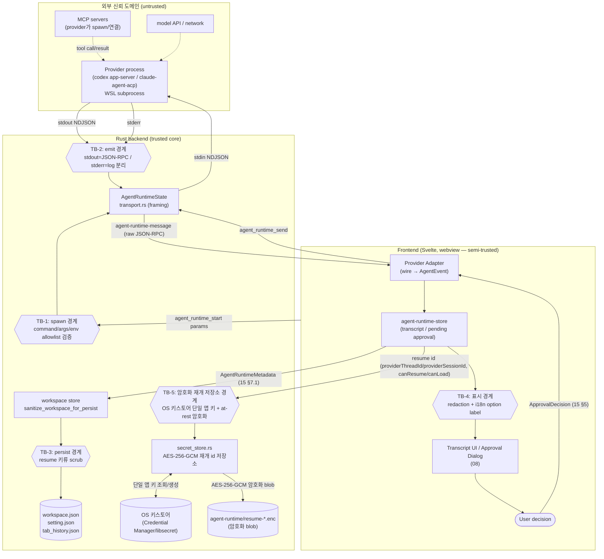

# Permissions, Security and Audit

> 이 문서는 Direct Agent Runtime의 **권한·보안·감사 경계**를 위협모델 수준으로 정의한다. 타입은 재정의하지 않고 [`15-data-contracts.md`](15-data-contracts.md)의 §번호로 인용하며, approval 생명주기·cleanup 불변식 같은 규칙은 [`04-normalized-agent-model.md`](04-normalized-agent-model.md)의 §번호로 인용한다. provider wire 사실은 ref-* 문서로, 현 코드 사실은 `research/*` 문서로 인용한다.
>
> **역할 분리**: 이 문서는 보안 *정책·경계·체크리스트*의 권위다. 어떤 타입을 쓰는지는 15, 어떤 순서로 상태가 전이되고 pending이 닫히는지는 04, process spawn/shutdown 기제는 [`07-tauri-process-runtime.md`](07-tauri-process-runtime.md), UI 표면(modal/badge)은 [`08-ui-composition.md`](08-ui-composition.md), 디스크 영속화 scrub 구현은 [`10-persistence-migration.md`](10-persistence-migration.md)에 있다. 충돌 시 위 권위 문서가 우선한다.

조사 시점: 2026-06-25. 코드 스냅샷 기준: commit `e7a5f9e`; 구현 전 현재 작업트리와 대조.

---

## 0. 위협모델 요약 (STRIDE 관점)

Direct runtime은 terminal byte stream보다 **훨씬 풍부한 구조화 권한 정보**(approval option, sandbox mode, permission mode, MCP credential, tool input/output)를 다룬다. 정보가 많아질수록 노출·오남용 표면도 커진다. 아래는 본 문서가 방어 대상으로 삼는 위협이다.

| 위협 (STRIDE) | 시나리오 | 1차 방어 | 본 문서 절 |
|---|---|---|---|
| **Spoofing** | renderer가 provider가 보여주지 않은 approval option을 임의로 선택해 응답 | option id 보존 + 표시된 것만 선택 | §2, §3 |
| **Tampering** | renderer가 임의 executable/shell string·임의 `.js`·임의 args·임의 env 키를 `agent_runtime_start`로 넘겨 코드 실행 | command는 renderer 입력에서 제거하고 backend가 provider로 신뢰 절대경로를 resolve, args(provider별 정확 일치)·env key allowlist를 Rust handler에서 재검증(basename-only 불충분) | §4 |
| **Repudiation** | 어떤 approval을 누가 언제 허용했는지 추적 불가 | audit trail(결정·시각·optionId·scope) | §3.4, §6 |
| **Information disclosure** | API key·OAuth token·env·MCP credential·파일 내용이 로그/디스크/transcript에 평문 노출 | redaction 목록 + raw 로그 기본 비활성 + persistence scrub | §5, §6, §7 |
| **Denial of service** | pending approval이 닫히지 않아 agent가 영구 정지(approval deadlock) | cancel/exit 시 pending cleanup 불변식 | §3.5 |
| **Elevation of privilege** | sandbox/permission mode 우회, bypass mode 자동 진입 | provider sandbox 비우회 + mode 명시 표시 + bypass 게이트 | §8 |
| **제품 오인** | Claude Code/Anthropic 공식 앱처럼 보여 브랜드·약관 위반 | 브랜딩 가이드 | §9 |

> **확인된 사실 vs 추정**: 본 문서에서 ref-*/`research/*` 인용이 붙은 항목은 1차 소스 검증된 사실이다. 그 외 정책 선택은 미확정이면 "결정 필요"로 표기하고 [`13-risks-open-questions.md`](13-risks-open-questions.md)로 연결한다. 현재 allowlist 구체 형태는 OQ-36/OQ-38로 확정됐고, audit은 v1 기본 in-memory 형식이 OQ-51로 확정됐다. 영속 audit 로그의 저장소/retention/포맷만 후속 enhancement다.

---

## 1. 신뢰 경계 (Trust boundaries)

신뢰 경계는 "데이터가 한 신뢰 도메인에서 다른 도메인으로 넘어가는 지점"이다. 각 화살표가 검증/redaction/scrub이 일어나야 하는 지점이다.



경계별 책임(정본 위치):

- **TB-1 (renderer → backend spawn)**: renderer가 보낸 `AgentRuntimeStartParams`(15 §8.1)의 `provider`/`args`/`env`를 Rust handler가 provider allowlist로 **재검증**한다. `command` 필드는 제거됐고 renderer가 executable을 넘기지 않는다. backend가 `provider`로 신뢰 절대경로를 resolve하거나 사전 등록 절대경로 화이트리스트에서 고른다. renderer는 신뢰 경계 밖(웹뷰는 변조 가능)이라고 가정하므로, **검증은 backend-resolved executable·정확 args·env key 수준까지 내려가야 한다**: executable은 backend가 resolve한 신뢰 절대경로, `args`는 provider별 정확 일치(Codex `["app-server","--stdio"]`, Claude는 검증된 `adapterEntryPath` 단일 인자), `env`는 key allowlist + 형식 검증을 통과한 non-secret 키만. **basename만 비교하면 불충분**하다(공격자가 `/tmp/codex` 같은 임의 경로의 동명 바이너리를 통과시킬 수 있음). §4, 07 §8.1 참조. 현 PTY엔 선례 없음 (`research/codebase-backend.md` §6, §10 권고 6). **`AgentRuntimeStartParams.env`는 non-secret env 전용 규약**이며, secret(API key/token 등)은 이 경계를 launch argv로 통과하지 않는다 — §5.3(secret env 경계, 07 launch 정본 인용).
- **TB-2 (provider → backend framing)**: provider stdout은 **JSON-RPC만**, stderr는 **log만**. claude-agent-acp는 `console.*`를 stderr로 redirect해 stdout 청결을 보장한다 (ref-claude-agent-acp §1 "stdout 청결", ref-acp §1 stdout purity MUST). backend는 protocol 의미를 해석하지 않고 framing만 한다 (15 §8.3 주석, `07-tauri-process-runtime.md` §Framing).
- **TB-3 (메모리 → 디스크)**: `providerSessionId`/`providerThreadId`/`providerResumeToken`을 디스크 직전 scrub. §7, 15 §7.3 정본, `research/codebase-backend.md` §4.2.
- **TB-4 (store → 화면)**: redaction 적용 + approval option label을 i18n으로 감싸 표시. §5, §3.2.
- **TB-5 (메모리 → 암호화 재개 저장소, OQ-16 후속)**: cross-restart 하이브리드 복원([`10-persistence-migration.md`](10-persistence-migration.md) §4.4a)이 재개 id(`providerThreadId`/`providerSessionId` + `canResume`/`canLoad`)를 **TB-3(workspace.json)과 별도의 암호화 저장소**에 둔다. `workspace.json` 평문 scrub 경계(TB-3)는 그대로이며, TB-5는 그 경계를 대체하거나 약화하지 않는다 — 재개 id가 흘러가는 목적지가 다를 뿐이다. 상세는 §7.1.

---

## 2. 승인 원칙 (Approval principles)

approval 결정 타입은 15 §5(`ApprovalRequest`/`ApprovalOption`/`ApprovalDecision`), 생명주기·cleanup 불변식은 04 §4가 권위다. 본 절은 그 위에 얹는 **보안 원칙**만 정의한다.

1. **id 보존 무결성**: provider가 준 request id(JSON-RPC `id`)와 각 `ApprovalOption.id`는 절대 재생성·재매핑하지 않고 원본 그대로 보존한다(15 §0.1 컨벤션, `ProviderRef.requestId`). 응답 매칭은 이 id로만 한다.
2. **표시-선택 일치 (Spoofing 방어)**: UI가 사용자에게 **실제로 보여준 option 중 하나만** 선택해 응답한다. provider가 보낸 적 없는 optionId나 UI가 숨긴 옵션을 client가 임의로 합성해 보내지 않는다. `ApprovalDecision.outcome`은 15 §5의 `selected`/`cancelled`/`failed`만 쓰며, `failed`는 **wire로 보내지 않는** client 내부 전용이다(15 §5 주석, 04 §4.2 규칙 4).
3. **자동 허용 금지(기본값)**: client측 자동 허용(auto-approve)은 별도 설정 + audit trail이 준비되기 전까지 도입하지 않는다([`13`](13-risks-open-questions.md) Resolved defaults). provider 자체의 sandbox/permission mode(예: Codex `Agent (Full Access)`, Claude `bypassPermissions`)는 §8에서 표시·게이트만 하고 client가 흉내내지 않는다.
4. **cleanup 불변식 준수**: turn cancel·session shutdown·process exit 시 pending approval을 반드시 닫는다. 정확한 규칙은 04 §4.2/§5, 본 문서 §3.5에 운영 체크리스트로 옮겼다.
5. **escalation은 modal**: sandbox 우회·`bypassPermissions` 진입·protected path 쓰기 같은 고위험 결정은 비차단 inline이 아니라 modal로 표시한다(`research/ux-reference.md` 라인 336, 08 modal escape 회귀 보호). §8.3 고위험 집합(Claude `bypassPermissions`, Codex `danger-full-access`/sandbox 우회)은 **v1부터 `severity:"escalation"`**(modal)로 분류하며 v1에서 normal로 강등하지 않는다(§8.3, 08 §4.4, 15 §5, [`13`](13-risks-open-questions.md) OQ-47).

> **구현 시 점검 (§2)**
> - [x] 사용자 action 경계의 `respondApproval`은 store의 pending table에 실제로 존재하는 `requestId`에만 응답하는가(없는 id면 거부/로그). `AgentRuntimeController.approve`가 `pendingApprovals`/`escalationApproval`에 없는 `requestId`를 port 호출 전에 거부한다. adapter 내부의 늦은/중복 응답 no-op은 04 §4.2 멱등 규칙으로 별도 유지한다. 증거: `agent-runtime-controller.test.ts` SEC-APPROVAL.
> - [x] 보내는 `optionId`가 해당 `ApprovalRequest.options[].id` 집합에 속하는지 wire 전송 직전 assert하는가. Codex는 공용 `OPTION_KIND_TO_DECISION` 허용 집합으로, Claude ACP는 pending `request.options[].id`로 검증한다. 증거: `codex-app-server-adapter.test.ts` / `claude-acp-adapter.test.ts` SEC-APPROVAL.
> - [x] `outcome:"failed"`가 절대 `agent_runtime_send`로 나가지 않는지 adapter에서 가드하는가(04 §4.2 규칙 4). 증거: controller/adapters NM-20 tests.
> - [x] auto-approve 설정 토글이 존재한다면, 켜질 때 audit trail이 함께 활성화되는가(미구현이면 토글 자체를 노출하지 않음). v1 direct runtime에는 client측 auto-approve 설정/UI를 노출하지 않는다. `Settings`/`DEFAULT_SETTINGS`와 `SettingsModal` registry에는 direct runtime approval 설정이 없고, `terminal.claudeCliFlags.enableAutoMode`는 legacy PTY Claude CLI에 `--enable-auto-mode`를 붙이는 터미널 플래그일 뿐 direct runtime approval 자동 허용이 아니다. 향후 자동 결정이 추가되더라도 store audit 경계는 `decidedBy:"auto"`를 포함해 결정 1건당 audit entry 1건을 남긴다. 증거: `types.ts`, `settings.svelte.ts`, `settings/registry.ts`, `TerminalSettingsSection.svelte`, `claude-cli-flags.ts`, `agent-runtime-store.svelte.test.ts` NM-20b/20c.

---

## 3. Approval 흐름의 보안 운영 규칙

### 3.1 정상 흐름의 신뢰 경계

정상 흐름 단계는 04 §4.1이 정본이다. 보안 관점 보강:

- provider→client request의 raw payload(Codex `CommandExecutionRequestApprovalParams` 등, ref-codex §4.1; ACP `RequestPermissionRequest`, ref-acp §6)는 매핑되지 않은 필드를 `ProviderRef.raw`/`rawInput`에 보존하되, **raw payload를 transcript에 그대로 펼쳐 렌더링하지 않는다**(§5 redaction). UI에는 정규화된 `title`/`body`/`options`만 노출한다.
- option `label`은 provider 원본 문자열이므로 **i18n key로 감싸** 표시한다(04 §4.1 단계 2, ref-acp §6, ref-claude-agent-acp §3 request_permission 매핑). Codex mapper가 넣는 CLCOMX 내부 key(`agentRuntime.approval.*`)는 approval 표시 경계에서 locale 문자열로 변환한 뒤 redaction하고, provider raw label은 raw 문자열로 유지하되 text node로만 렌더한다(XSS 방어). 증거: `ApprovalInlineCard.test.ts`/`ApprovalModal.test.ts`의 approval title/option key 번역 테스트와 credential redaction/XSS 테스트.

### 3.2 provider별 wire 응답 형태 (검증된 사실)

adapter가 `ApprovalDecision`을 provider wire로 변환할 때의 형태. 정확한 매핑표는 ref가 권위다.

- **Codex**: `{ id, result: { decision } }` (JSON-RPC `jsonrpc` 필드 없음 — ref-codex §1.2). `decision`은 `accept`/`acceptForSession`/`decline`/`cancel` **단순 4종만** 보낼 것을 권장한다. `acceptWithExecpolicyAmendment`/`applyNetworkPolicyAmendment`는 데이터를 가진 variant라 외부 태그 객체로 직렬화되며, client가 정책 수정안을 합성해 보내면 권한 상승 위험이 있어 **v1에서 보내지 않는다**(ref-codex §4.1 경고).
- **ACP**: `{ jsonrpc:"2.0", id, result: { outcome: { outcome:"selected", optionId } } }` (ref-acp §6, ref-claude-agent-acp §3). cancel은 `{ outcome: { outcome:"cancelled" } }`.

### 3.3 다중 approval / 라우팅 분기 (Codex)

Codex zsh-exec-bridge 분기 시 한 `itemId`에 복수 approval callback이 붙을 수 있고, 이때 `approvalId`(원본은 `raw`)로 구분한다(ref-codex §6 라인 535, 04 §1, 15 §1.1). 보안 함의: **잘못된 approval에 사용자의 "허용"이 잘못 매칭되면 의도치 않은 명령이 실행**된다. 따라서 pending table 키는 단순 `itemId`가 아니라 `(requestId)` 또는 `(itemId, approvalId)` 조합이어야 하며, 응답은 항상 JSON-RPC `id`로 라우팅한다(ref-codex §6 라인 535).

### 3.4 Audit trail (Repudiation 방어)

자동 허용을 도입하든 안 하든, 모든 approval 결정은 추적 가능해야 한다. v1 최소 audit 레코드(in-memory, store 수명 동안만 보존):

```ts
// v1 확정(13 OQ-51): 기본 audit은 in-memory만이다. 영속 audit은 후속 enhancement에서 별도 결정한다.
interface ApprovalAuditEntry {
  sessionHandle: string;       // AgentSessionHandle (15 §6)
  provider: AgentProvider;     // 15 §1
  requestId: string;           // ProviderRef.requestId (15 §1)
  toolCallId?: string;
  optionId?: string;           // 선택된 옵션 (raw label은 저장 금지 — i18n key/kind만)
  optionKind?: ApprovalOption["kind"]; // 15 §5 (allow_once 등)
  outcome: ApprovalDecision["outcome"]; // "selected"|"cancelled"|"failed"
  scope?: "once" | "session";  // allow_always류면 session
  decidedAt: number;           // epoch ms
  decidedBy: "user" | "auto" | "cleanup"; // cleanup = cancel/shutdown→cancelled(wire) / exit→failed(내부, 04 §5.0)
}
```

- audit에는 **명령 전문/파일 내용/credential을 저장하지 않는다** — `requestId`/`optionId`/`kind`/`outcome`/시각만. raw 명령은 §5 redaction 대상.
- `decidedBy:"auto"`는 client가 사용자에게 표시하지 않고 자동 결정한 경우의 보안 감사 신호다. v1에서는 Codex permission-profile 미지원 자동 decline 같은 방어적 자동 결정에서 발생할 수 있으며, 사용자 선택이 아닌 cancel/shutdown/exit cleanup은 `decidedBy:"cleanup"`으로 기록한다.

> **구현·검증·저장 분담 (cross-ref)**: 본 §3.4는 approval audit의 **정책 권위**(어떤 필드를 남기고 무엇을 저장 금지하는지)다. v1 기본 형태는 **in-memory audit**(위 `ApprovalAuditEntry` 형식, 명령 전문/credential/파일 내용 비저장)이며, 실제 audit task로의 작업분해는 [`12-implementation-workstreams.md`](12-implementation-workstreams.md), 모든 결정 1건 기록 + 비밀 비포함 수용 케이스는 [`11-testing-acceptance.md`](11-testing-acceptance.md)에서 다룬다. [`13`](13-risks-open-questions.md) **OQ-51** 결론에 따라 opt-in redacted 영속 로그는 v1 기본 구현에서 제외하고 후속 enhancement로 둔다. 여기서 audit 형식을 재정의하지 않고 위 분담 문서를 인용만 한다.

> **구현 시 점검 (§3)**
> - [x] Codex 응답에 `jsonrpc` 필드를 넣지 않는가 / ACP 응답에 `jsonrpc:"2.0"`을 넣는가(ref-codex §1.2, ref-acp §1). 증거: `codex-app-server-adapter.test.ts` CX-12/Codex envelope, `claude-acp-permission.test.ts` CL-21/CL-22.
> - [x] pending table 키가 `requestId`(또는 `itemId+approvalId`)로 충돌 없이 분리되는가(§3.3). 증거: `pending-approval-table.test.ts` NM-15b, `codex-routing.test.ts` approval pending table.
> - [x] approval option label을 text node로만 렌더하고 코드로 해석하지 않는가(XSS). 증거: `ApprovalInlineCard.test.ts` / `ApprovalModal.test.ts`의 provider label HTML 비해석 회귀 테스트, agent-runtime surface에 `{@html` 없음.
> - [x] 모든 결정에 audit entry가 1건 기록되는가(user/auto/cleanup 모두). adapter-side cleanup/auto 경로는 `approval_resolved.decidedBy`를 통해 store audit까지 보존되는가. 증거: `agent-runtime-store.svelte.test.ts` NM-20b + adapter cleanup decidedBy, `codex-app-server-adapter.test.ts`, `claude-acp-adapter.test.ts`, `codex-wire-mapper.test.ts`.
> - [x] audit entry에 명령 전문·credential·파일 내용이 섞이지 않는가. 증거: `agent-runtime-store.svelte.test.ts` NM-20c.

### 3.5 Cancel/exit 시 pending cleanup (DoS/deadlock 방어)

approval deadlock은 명시적 위험으로 분류돼 있다([`13`](13-risks-open-questions.md) "Approval deadlock"). cleanup 불변식의 권위는 04 §4.2/§5이며, 두 protocol의 MUST와 정확히 대응한다(ref-acp §3.8 "pending된 모든 `session/request_permission`에 `cancelled`로 MUST 응답", ref-codex §4 `serverRequest/resolved`). 보안 운영 체크리스트로 재정리:

> **구현 시 점검 (§3.5 cleanup 불변식)**
> - [x] `cancelTurn` 또는 `turn_completed{status:"cancelled"}` 수신 시, 해당 turn의 모든 pending approval에 `{outcome:"cancelled"}`를 **wire로** 보내고 pending table에서 제거하는가(04 §4.2 규칙 1). 증거: `codex-app-server-adapter.test.ts` / `claude-acp-adapter.test.ts` cancel cleanup, `pending-approval-table.test.ts` NM-16.
> - [x] `process_exited` 수신 시 모든 pending approval/request를 닫는가(04 §5, `decidedBy:"cleanup"` audit 기록). 증거: `codex-app-server-adapter.test.ts` / `claude-acp-adapter.test.ts` process exit, `pending-approval-table.test.ts` NM-18, `agent-runtime-store.svelte.test.ts` NM-20b.
> - [x] Codex `serverRequest/resolved{threadId, requestId}` 수신 시 해당 `requestId`만 닫는가(사용자 응답 불필요, 04 §4.2 규칙 3). 증거: `codex-app-server-adapter.test.ts` New-F1 `serverRequest/resolved` race, `pending-approval-table.test.ts` NM-19.
> - [x] UI/탭이 닫히거나 webview가 reload돼도 backend의 pending이 끊긴 채 남지 않는가(process가 살아있으면 shutdown으로 정리, 07 §Process lifecycle). 증거: `AgentTranscriptSurface.svelte`가 `onDestroy`와 `pagehide`/`beforeunload` 모두에서 같은 idempotent `disposeSurfaceRuntime()`을 호출하고, `agent-runtime-controller.test.ts` Finding 3은 dispose가 unsubscribe 전에 `port.shutdown()`을 await해 shutdown-time cleanup event가 store에 도달함을 검증한다. `AgentTranscriptSurface.test.ts` 09 §3.5는 pagehide/webview reload에서 runtime shutdown이 정확히 1회 호출됨을 검증한다. adapter-side pending cleanup은 `codex-app-server-adapter.test.ts` / `claude-acp-adapter.test.ts` shutdown S3 테스트와 Rust RS-13..15c가 보강한다.
> - [x] cleanup으로 닫힌 approval이 이후 도착하는 사용자 응답으로 **이중 응답**되지 않는가(닫힌 requestId 재응답 거부). 증거: `agent-runtime-controller.test.ts` SEC-APPROVAL, `codex-app-server-adapter.test.ts` / `claude-acp-adapter.test.ts` shutdown·exit 멱등 및 in-flight race tests.

---

## 4. Command / args / env allowlist (TB-1, 신규 강화 지점)

### 4.1 배경: PTY엔 선례가 없다

현 PTY는 frontend가 자유롭게 shell 문자열을 만들어 `pty_spawn`에 넘기고, **backend에 executable allowlist 검증이 없다**(`research/codebase-backend.md` §6, §10 권고 6). Direct runtime은 이 자유 shell 모델을 따르지 않는다. 15 §8.1 주석이 정본 요구를 명시한다: executable `command`는 renderer 입력에서 제거하고 backend가 provider로 resolve하며, `args`/`env`는 adapter가 생성한 검증된 값만 허용하고 Rust handler가 provider별 allowlist로 재검증한다(임의 executable/shell string 차단). 이는 PTY 대비 **의도적 강화 지점**이며 현 코드에 선례가 없어 신규 구현이다.

**basename-only는 불충분 (Tampering 정본)**: `command`의 basename만 화이트리스트와 비교하면(예: basename이 `codex`/`node`이면 통과), renderer가 `/tmp/codex`·`/dev/shm/node` 같은 **임의 경로의 동명 바이너리**를 심어 통과시킬 수 있어 코드 실행 우회가 된다. 따라서 검증 정본(07 §8.1, R4)은 basename 비교를 제거하고 `command` 자체를 renderer 입력에서 제거한다. backend가 (a) 직접 resolve한 신뢰 절대경로 또는 (b) 사전 등록된 절대경로 화이트리스트에서 executable을 고르고, `args`는 provider별 **정확 일치**, `env`는 **key allowlist**까지 함께 재검증한다. 즉 "renderer가 준 이름이 맞나"가 아니라 "backend가 확정한 절대경로 + 이 args + 이 env key 집합인가"를 확인한다.

### 4.2 이중 방어 (defense in depth)

renderer는 신뢰 경계 밖(TB-1)이므로 frontend 검증만으로는 부족하다. 두 층에서 검증한다.

- **Layer 1 (frontend adapter)**: Codex/Claude adapter가 `AgentRuntimeStartParams`(15 §8.1)를 **provider별로 고정된 형태**로만 생성한다. 사용자 입력은 model/cwd/옵션에만 영향을 주고 executable은 만들지 않으며 core argv는 코드 상수에서 온다.
- **Layer 2 (Rust handler, 권위)**: `agent_runtime_start`(15 §8.2)가 `params.provider`(`codex`|`claude`) enum에 따라 backend-resolved executable/`args`/`env`를 allowlist로 재검증한다. 통과 못 하면 `Result<_, String>` Err로 거부(`research/codebase-backend.md` §2.1 에러 컨벤션).

### 4.3 provider별 allowlist 사양 (정본)

| provider | 허용 executable (절대경로/backend-resolved) | 허용 core `args` 형태 (정확 일치) | 근거 |
|---|---|---|---|
| `claude` | node 절대경로(`CLAUDE_RUNTIME_NODE` 등으로 핀, backend resolve 또는 사전 등록 절대경로) | `args[0]`이 검증된 `adapterEntryPath`(절대경로, `…/claude-agent-acp/dist/index.js` 패턴)이고, 전체 형태는 `[entry, "--hide-claude-auth"]`(기본) 또는 `[entry]`(구독 인증 opt-in, §9)의 둘 중 하나. 임의 `.js`/임의 바이너리/임의 argv 거부 | ref-claude-agent-acp §1, §5; 07 §8.1; 06 §2.2 |
| `codex` | `codex` 바이너리 절대경로(backend resolve 또는 사전 등록 절대경로) | `args`가 정확히 `["app-server","--stdio"]`. experimental flag는 §0 experimental 경고 게이트 뒤에서만 | ref-codex §1.1 (app-server 기본 stdio); 07 §8.1 |

allowlist 검증 규칙(Rust handler — 정본 07 §8.1, basename-only 금지):

1. **executable 절대경로 검증 (basename-only 금지)**: executable은 renderer가 넘기지 않고 backend가 `provider`로 resolve한다. resolve 결과는 (a) backend가 resolve한 신뢰 절대경로이거나 (b) 사전 등록된 절대경로 화이트리스트에 속해야 한다. **basename 일치만으로 통과시키지 않는다** — basename이 `codex`/`node`인 임의 경로(`/tmp/codex` 등)는 거부. PATH lookup으로 임의 바이너리를 찾지 않는다(nvm 등 비표준 node는 절대경로 핀, ref-claude-agent-acp §5). resolve owner/cache/entry 탐색은 OQ-36 정본처럼 `agent_runtime/resolver.rs`가 담당한다.
2. **args 정확 검증 (provider별 exact match)**: Codex는 `args`가 정확히 `["app-server","--stdio"]`일 것. Claude는 `args[0]`이 검증된 `adapterEntryPath`(절대경로, `claude-agent-acp dist/index.js` 패턴)이고 전체가 `[entry, "--hide-claude-auth"]`(기본) 또는 `[entry]`(구독 인증 opt-in, §9)의 두 형태 중 하나일 것. 임의 `.js`/임의 바이너리/임의 argv는 거부한다. shell 메타문자 검사는 **방어용으로 유지**하되(`wsl.exe -e`가 shell을 거치지 않더라도, `research/codebase-backend.md` §2.2 "executable + argv 배열" 규칙), 일차 방어선은 위 정확 일치다(free shell string 합성 금지).
3. **`npx` 등 비결정 launch 거부(claude)**: 검증된 `adapterEntryPath` 외의 진입(특히 `npx`)은 비결정성/네트워크 fetch 때문에 runtime launch에서 거부한다(ref-claude-agent-acp §1 표 "npx 비권장").
4. **env key allowlist (§4.4)**: env key는 `^[A-Za-z_][A-Za-z0-9_]*$` 형식 + provider별 허용 key 집합을 모두 통과한 키만 child env에 합성하고, 값은 non-secret(§5.3). 그 외 key는 `Err(String)`으로 거부한다.

> **확정값(13 OQ-36/OQ-38)**: backend resolver owner/cache/entry 탐색 방식은 `agent_runtime/resolver.rs`가 담당하고, provider별 non-secret env key allowlist도 OQ-38에서 확정됐다. WSL 경로/node 위치가 배포 대상마다 달라(ref-claude-agent-acp §5 "unverified for target") 절대경로를 settings로 받더라도 **형태 검증과 신뢰 결정은 Rust가** 해야 한다. 구현은 `src-tauri/src/features/agent_runtime/allowlist.rs`와 RS-8..RS-12b 테스트가 정본이다.

### 4.4 env 변수 allowlist

provider env는 credential 주입 경로이자 권한 상승 경로다(예: `IS_SANDBOX`가 root에서 `bypassPermissions`를 허용 — ref-claude-agent-acp §1 표). 따라서 child process env는 **OQ-38에서 확정한 provider별 allowlist**로 구성한다.

- **공통 허용 키**: `RUST_LOG`, `RUST_BACKTRACE`, `NO_COLOR`.
- **claude 추가 허용 키**: `CLAUDE_CONFIG_DIR`, `CLAUDE_CODE_EXECUTABLE`, `NODE_OPTIONS`. `ANTHROPIC_API_KEY`/gateway header/session cookie 같은 secret은 이 argv env allowlist에 넣지 않는다. **`IS_SANDBOX`는 v1에서 주입하지 않는다**(root bypass 게이트 — §8.3 잔여 정책).
- **codex 추가 허용 키**: `CODEX_DISABLE_UPDATE_CHECK`. API/account secret은 argv env가 아니라 `Command::env()`+`WSLENV` 별도 경로만 허용한다.
- **env key 형식 + allowlist 검증**: 기존 PTY와 동일하게 key 형식을 `^[A-Za-z_][A-Za-z0-9_]*$`로 검증하고(`assertValidEnvKey`, `research/codebase-backend.md` §6), **그 위에 provider별 허용 key 집합(위 claude/codex 목록)으로 한 번 더 제한**한다. 형식만 맞고 allowlist에 없는 key는 `Err(String)`으로 거부한다. adapter도 backend도 검증한다(07 §8.1, 11 RS-12/12b).
- **redaction과 연동**: env value는 §5 redaction 대상이며 로그/transcript/디스크에 평문으로 나타나면 안 된다.
- **secret/non-secret 분리 (§5.3)**: 위 allowlist를 통과한 키 중 secret(API key/token/gateway header 등)은 launch argv로 child에 합성하지 않는다. argv 경유는 non-secret 키 전용이고, secret이 꼭 필요하면 `Command::env()`+`WSLENV` passthrough(07 §5.1 launch 정본)로만 주입한다 — OS 관측면 평문 노출 차단. v1 기본값은 secret env를 런타임으로 넘기지 않음(§5.3, §9 인증 기본 경로).

> **구현 시 점검 (§4 — untrusted renderer 재검증, 07 §8.1 정본)**
> - [x] `agent_runtime_start` Rust handler가 executable을 renderer 입력이 아니라 **backend-resolved 절대경로(또는 사전 등록 화이트리스트)** 로 확정하고, **basename-only 비교를 쓰지 않는가**(`/tmp/codex`·`/dev/shm/node` 류 거부). 증거: `agent_runtime::tests` RS-8/9/10c/10d/10e/10f/10g, `allowlist::validate_and_extract`, `resolver.rs`.
> - [x] Codex `args`가 정확히 `["app-server","--stdio"]`인지 검증하는가(임의 args 거부). 증거: `agent_runtime::tests` RS-8/8b.
> - [x] Claude `args[0]`이 검증된 `adapterEntryPath`(절대경로, `claude-agent-acp dist/index.js` 패턴)이고 전체가 `[entry,"--hide-claude-auth"]` 또는 `[entry]`(구독 opt-in — backend 저장 설정이 켜져 있을 때만) 두 형태 중 하나인지 검증하는가(임의 `.js`/임의 바이너리/임의 argv 거부, opt-in 꺼짐 시 `[entry]` 거부). 증거: `agent_runtime::tests` RS-9/9b/9c/10e.
> - [x] env key가 `^[A-Za-z_][A-Za-z0-9_]*$` 형식 + **provider별 허용 key 집합**을 모두 통과하는가(형식만 맞고 allowlist 밖인 key는 drop). 증거: `agent_runtime::tests` RS-12/12b.
> - [x] child를 shell 없이 executable+argv로 spawn하고, shell 메타문자 검사를 방어용으로 유지하는가(free shell string 합성 없음). 증거: `process::build_wsl_command`, `agent_runtime::tests` RS-11/AC-10b.
> - [x] `IS_SANDBOX` 등 권한 상승 env가 v1에서 차단되는가(§8.3 결정 따라). 증거: provider별 env allowlist 밖 key는 `Err`로 거부하는 `agent_runtime::tests` RS-12b.
> - [x] `npx` 등 비결정 launch가 거부되는가(ref-claude-agent-acp §1). 증거: `AgentRuntimeStartParams`에 `command` 필드가 없고 backend가 provider별 executable을 resolve하며, 임의 Claude script/args는 `agent_runtime::tests` RS-9b와 RS-10e 경계에서 거부된다.
> - [x] 위 검증 중 하나라도 실패하면 `Err`로 거부하고, 거부 사유를 stderr/audit에 redacted로 남기는가. `agent_runtime::validate_launch_for_start`는 allowlist 실패를 원래 `Err`로 반환하면서 `agent-runtime-audit.log`에 `launchRejected` JSONL entry를 남긴다. entry는 `event`/`atMs`/`transportKind`/redacted `provider`/redacted `reason`만 포함하고 renderer params 전체(`args`/`env`/`workDir`/`authToken`)는 직렬화하지 않는다. `start()` 경계의 `workDir` canonicalize, executable preflight, spawn 실패도 같은 audit 경로를 탄다. 증거: `agent_runtime::tests` RS-8b/9b/10c/11/12/12b/12c/12d, `agent_runtime/audit.rs`, `allowlist.rs`의 sanitised error 문자열.
> - [x] secret 키(API key/token 등)가 launch argv(`-e env KEY=VAL`)가 아닌 `Command::env()`+`WSLENV`로만 주입되는가(§5.3, 07 §5.1). 증거: `agent_runtime::tests` AC-10b.
>
> **수용 기준 (11 테스트 연동, R4)**: 아래는 backend allowlist 단위 테스트로 검증해야 한다(07 §8.1 → 11).
> - [x] 승인된 backend-resolved 절대경로만 통과하고, basename은 같지만 경로가 다른 executable 후보(예: `/tmp/codex`)는 `Err`로 거부. 증거: renderer `command` 입력 제거 + `agent_runtime::tests` RS-8/9/10c/10d/10e.
> - [x] Codex `args`가 정확히 `["app-server","--stdio"]`가 아니면 거부(추가/변경 인자 포함 시 `Err`). 증거: `agent_runtime::tests` RS-8/8b.
> - [x] Claude `args[0]`이 검증된 `adapterEntryPath`가 아니거나 `args[1]`이 고정 `--hide-claude-auth`가 아니면 거부(특히 `args=["/tmp/x.js"]`, `args=[adapterEntryPath]`, `args=[adapterEntryPath,"--x"]` 거부). 증거: `agent_runtime::tests` RS-9/9b/10e.
> - [x] env key allowlist: 허용 key만 통과하고 형식 불일치/비허용 key는 drop 또는 `Err`. 증거: `agent_runtime::tests` RS-12/12b.

---

## 5. Redaction (민감 정보 비노출)

### 5.1 redaction 대상 목록

아래 데이터는 **로그·transcript·디스크·audit 어디에도 평문으로 나타나면 안 된다**. 발견 즉시 `***REDACTED***` 등 placeholder로 치환한다.

| 대상 | 출처/예시 | 어디서 나타날 수 있나 |
|---|---|---|
| **API key** | `ANTHROPIC_API_KEY`, codex API key (ref-claude-agent-acp §1) | env, stderr, MCP 설정 |
| **OAuth / auth token** | gateway `ANTHROPIC_AUTH_TOKEN`/`AWS_BEARER_TOKEN_BEDROCK`(ref-claude-agent-acp §1), account token | env, auth stdout/stderr |
| **websocket auth token** | `AgentRuntimeStartParams.websocket.authToken`(15 §8.1) | start 파라미터 로깅, snapshot, error message |
| **session cookie / 자격증명 디렉터리 내용** | `~/.claude` credential (ref-claude-agent-acp §5) | stderr, error message |
| **command environment 전체** | child env map (15 §8.1 `env`) | spawn 로그, snapshot |
| **runtime startup command env** | `AgentRuntimeStartParams.env` (15 §8.1, non-secret 전용 규약 §5.3) | 로그, audit, OS 관측면(secret이 잘못 들어간 경우 — §5.3로 차단) |
| **auth 관련 stdout/stderr** | `--cli auth login` passthrough 출력(ref-claude-agent-acp §1) | stderr 채널 |
| **MCP server credential** | MCP `McpServerStdio.env`(ref-acp §9), Codex mcp credential | tool 설정, 로그 |
| **file content raw** | tool read/write 파일 내용, diff 본문 | transcript, raw 로그 |

**v1 redaction 최소 패턴 집합 (반드시 마스킹 — 구현 시 확장 가능):** 위 대상을 어디서 잡아낼지의 정본 최소 집합이다. 과소 redaction을 줄이기 위해 **최소 이 집합은 마스킹**하고, 구현은 provider 키 형식 변화에 맞춰 패턴을 확장한다(이 집합을 줄이지는 않는다).

| 패턴 부류 | 매칭 신호 (최소 집합) | 비고 |
|---|---|---|
| **provider key prefix** | `sk-`, `sk-ant-`(Anthropic), `AKIA`(AWS access key id) 로 시작하는 토큰 | prefix + 뒤따르는 영숫자/`-`/`_` 런을 통째로 마스킹. codex/anthropic API key, AWS 자격 모두 포괄 (ref-claude-agent-acp §1) |
| **bearer / auth token** | `ANTHROPIC_AUTH_TOKEN`/`AWS_BEARER_TOKEN_BEDROCK`, `websocket.authToken`(15 §8.1) 등 §5.1 token류의 값 | env value 마스킹 경로로 함께 처리. websocket은 v1 reject(13 RD-2)이나 `authToken` 필드가 public 계약에 존재하므로 로깅/snapshot 노출 전 마스킹(§5.3 note) |
| **주입된 env value** | 이 child에 주입한 env(§4.4 allowlist 통과분)의 **값** + `AgentRuntimeStartParams.env`(15 §8.1) 값 | 키가 secret이 아니어도 값이 stderr/로그에 그대로 echo될 수 있으므로 **주입한 env value는 값 기준으로 마스킹**. secret env는 §5.3대로 애초에 argv로 흐르지 않음 |

> prefix 목록은 1차 소스에서 확인된 형태이고(`sk-`/`sk-ant-`/`AKIA`), 다른 provider/포맷(예: 향후 key 스킴)은 OQ-28 잔여 결정과 무관하게 패턴을 **추가**해 대응한다. 이 표는 "여기까지는 무조건 마스킹"의 하한이다.

> **websocket `authToken` 누출 표면 차단**: `AgentRuntimeStartParams.websocket.authToken`(15 §8.1)은 websocket transport가 v1에서 **reject**됨(13 RD-2/OQ-15 — handler가 `Err("only jsonrpc-stdio transport is supported in v1")` 반환)에도 불구하고 **public 계약(15 §8.1 variant)에 노출된 secret 필드**다. 따라서 token이 실제로 쓰이지 않아도 reject 직전 start 파라미터가 로깅·snapshot·error message로 새어나갈 수 있으므로, `authToken`을 위 secret scrub/redaction 집합(§5.1 bearer/auth token)에 포함한다. 방어 순서: 07 handler가 `transportKind:"websocket"`을 **로깅 전 즉시 reject**(07 §transport, reject-before-log)하고, reject 사유를 stderr/audit에 남길 때도 `authToken` 값은 마스킹한다(token이 redacted 로그에도 평문으로 남지 않음). variant 타입 자체는 future-sketch로 유지하되 token 필드는 본 redaction 집합으로 상시 방어한다(13 RD-2/OQ-15).

### 5.2 redaction 적용 지점

- **TB-2 (backend stderr emit)**: `agent-runtime-stderr` 라인을 emit하기 전 §5.1 **v1 최소 패턴 집합**(provider key prefix `sk-`/`sk-ant-`/`AKIA`, bearer/auth token, 주입된 env value)을 마스킹한다. 최소 이 집합은 반드시 마스킹하고 패턴은 확장 가능하다(§5.1). stderr는 기본 collapsed로 둔다(§6).
- **TB-4 (frontend 표시)**: transcript에 올라가는 content/`ToolCallUpdate.rawInput`/`rawOutput`(15 §5)을 표시할 때, env·credential 필드를 redact한다. raw payload를 그대로 펼치지 않는다(§3.1).
- **audit**: §3.4대로 credential/명령 전문을 애초에 저장하지 않는다.

### 5.3 secret env는 launch argv로 노출하지 않는다 (보안 경계 정본)

redaction은 로그·transcript·디스크 평문 노출을 막지만, **OS 관측면(observability surface)에 들어간 secret은 redaction으로 막을 수 없다**. backend가 `wsl.exe` child를 spawn할 때 secret env를 launch argv로 넘기면(예: `wsl.exe … -e env ANTHROPIC_API_KEY=sk-… <executable> …` 형태) 그 값이 process 명령행에 평문으로 들어가, 아래 관측면에 그대로 노출된다.

| 관측면 | 노출 경로 |
|---|---|
| Windows process 목록 | `wsl.exe`의 command line(`ps`류·Task Manager·`Get-CimInstance Win32_Process`) |
| WSL 측 process 목록 | child의 `/proc/<pid>/cmdline`, `ps -ef`, `ps aux` |
| WSL process tree | `wsl.exe -e env KEY=VAL …`의 argv가 그대로 노출 |

이 노출은 CLCOMX의 로그·snapshot·persistence 바깥에서 일어나므로 §5.1/§5.2 redaction의 사정거리 밖이다. 따라서 **secret env는 launch argv 경유를 금지한다.** 여기서 secret = API key / OAuth·account token / gateway header / session cookie 등(§5.1 redaction 대상 중 credential류).

**정본 결정:**

1. **`-e env KEY=VAL …` argv 형태는 non-secret env 전용**이다(예: 비민감 플래그·라우팅 힌트). launch 정본 형태와 argv 규약은 07 §5.1(`spawn_wsl_process` / launch 커맨드 정본)이 권위이며, 본 절은 그 위의 보안 경계만 정의한다.
2. **`AgentRuntimeStartParams.env`(15 §8.1)는 non-secret env 전용 규약**이다 — 타입 정의는 15 §8.1을 인용하며 여기서 재정의하지 않는다. adapter는 secret을 이 필드에 싣지 않는다.
3. **v1 기본값**: provider 인증은 각 CLI의 WSL 측 자체 로그인/config(`claude login`, `codex auth`, 기존 `~/.claude` 자격)에 의존하고, CLCOMX는 secret env를 런타임으로 넘기지 않는다(§9 인증 기본 경로와 일치). 이로써 v1에서는 secret env 주입 경로 자체가 닫혀 있다.
4. **secret env를 꼭 넘겨야 하는 경우(gateway 등)의 정본 메커니즘** — argv 비경유:
   - Rust `std::process::Command::env()`로 `wsl.exe` 프로세스 **환경**에 secret을 설정(argv가 아니라 환경 블록에 들어가므로 명령행에 노출되지 않는다).
   - `WSLENV`(예: `WSLENV=ANTHROPIC_API_KEY/u`)로 WSL 측에 passthrough해 child가 환경변수로 상속받게 한다.
   - 이 메커니즘의 정확한 launch 구현은 07 §5.1 launch 정본에 통합돼 있다(argv는 non-secret, secret은 `Command::env()`+`WSLENV`). 본 절은 보안 요구만 명시하고 구현은 07을 인용한다.

> **확정 / 후속 노출 범위(13 OQ-28 해소)**: OQ-28은 argv 비경유 보안 경계로 해소됐다. v1은 secret env 주입 UI/설정을 노출하지 않고 provider의 WSL 측 자체 인증에 의존한다. gateway 등으로 secret env 전달이 필요해지는 후속 scope에서만 허용 key와 UI/설정 노출 범위를 다시 정하되, 전달 경로는 `Command::env()` + `WSLENV`로 고정한다. → [`13`](13-risks-open-questions.md).

> **구현 시 점검 (§5)**
> - [x] env value가 로그·디스크·public diagnostic event에 평문으로 흐르지 않고, adapter routing용 raw realtime bridge가 public diagnostic API에서 제외되는가(spawn 시점 포함). 확인된 경계: backend transport는 runtime launch env value를 redaction context로 보관하고, stderr diagnostic event, opt-in raw protocol debug log, diagnostic-only bounded replay log(`message_log`)에 쓰기 직전 값 기준으로 마스킹한다(`agent_runtime::tests` E2E-10 env-value redaction, `d_replaylog_redacts_runtime_env_values_without_redacting_realtime_event`, `transport::redact_with_values`). frontend 표시/저장 경계도 `stringifyRedactedRaw`/`redactDisplayText`와 raw-envelope placeholder로 검증됐다(`display-redaction.test.ts`, `ToolCallCard.test.ts`, `MessageList.test.ts`). 단 `1` 같은 짧은 non-secret env literal은 JSON-RPC id/count 등 정상 payload를 훼손할 수 있어 literal 치환에서 제외한다(`short_runtime_env_values_do_not_corrupt_unrelated_json_fields`). Realtime `agent-runtime-message` event는 adapter routing을 위해 무손실 통과(M-4)하지만 v1에서 in-process adapter 전용 bridge로 확정됐고, `createAgentTransportController`는 raw `message`를 구독하거나 외부 diagnostic handler로 노출하지 않는다(OQ-59). 더 엄격한 "모든 realtime event 무평문" 정책은 후속 제품/보안 요구가 생길 때 raw private channel + redacted public event 분리로 재설계한다.
> - [x] auth passthrough(`--cli auth login`) 출력이 transcript가 아닌 stderr 채널로만 가고, 그마저 redacted/collapsed인가. v1은 auth passthrough를 광고하지 않는다: Claude ACP initialize는 `auth.terminal=false`, `_meta["terminal-auth"]=false`, `auth._meta.gateway=false`이고, Claude launch args는 `--hide-claude-auth`를 강제한다. 따라서 `--cli auth login` UI/terminal passthrough 경로 자체가 열리지 않는다. provider가 auth 관련 diagnostic을 stderr로 출력하더라도 backend `agent-runtime-stderr` emit 직전 `redact_with_values`를 거치며, `Authorization: Bearer ...`와 compact `Authorization:Bearer ...`/`Authorization=Bearer ...` 형태 모두 값 토큰을 마스킹한다. compact marker와 값이 stderr line 경계로 갈라져도 reader-local redaction state가 다음 line의 값 토큰을 마스킹한다. frontend stderr/command output 카드는 기본 collapsed + 표시 직전 redaction이다. 증거: `claude-acp-initialize.test.ts` OQ-43, `claude-acp-launch.test.ts`, `agent_runtime::tests` RS-9/9b 및 `transport::redact_tests::masks_compact_bearer_header_value`/`masks_compact_bearer_header_value_across_stderr_lines` 포함 stderr redaction tests, `CommandOutputCard.test.ts`.
> - [x] MCP server `env`(ref-acp §9)가 표시·로그에서 마스킹되는가. 증거: frontend raw detail 표시 경계는 `stringifyRedactedRaw`가 `env` object key를 보존하되 값을 `[REDACTED]`로 치환하고(`display-redaction.test.ts`), backend opt-in raw protocol debug log도 JSON `env` object 값을 기록 직전 마스킹한다(`transport::redact_tests::masks_env_object_values_in_json`, `agent_runtime::tests::e2e10_raw_protocol_debug_log_redacts_mcp_env_values`).
> - [x] tool `rawInput`/`rawOutput`(15 §5)을 펼칠 때 credential 패턴이 마스킹되는가. 증거: `ToolCallCard.test.ts`, `display-redaction.test.ts`.
> - [x] redaction이 normalize **이전**(원본 보존 raw)이 아니라 표시/저장 **직전**에 적용돼, 라우팅에 필요한 id는 보존되는가. 증거: `agent-event-reducer.test.ts` NM-22 raw 보존 + `ToolCallCard.test.ts`/`MessageList.test.ts`/`display-redaction.test.ts` 표시 직전 redaction.
> - [x] secret env(API key/token/gateway header/cookie)가 launch argv(`-e env KEY=VAL`)로 들어가지 않는가 — OS 관측면(`ps`/`/proc/<pid>/cmdline`/WSL process 목록) 노출 차단(§5.3). 증거: `agent_runtime::tests` AC-10b.
> - [x] secret 주입이 필요하면 argv가 아니라 `Command::env()`+`WSLENV` passthrough(07 §5.1 launch 정본)로만 가는가. 증거: `process::build_wsl_command`, `agent_runtime::tests` AC-10b.
> - [x] adapter가 `AgentRuntimeStartParams.env`(15 §8.1)에 secret을 싣지 않고 non-secret만 채우는가(§5.3 규약). 증거: `codex-launch.test.ts`, `claude-acp-launch.test.ts`.
> - [x] `transportKind:"websocket"` start가 **token 로깅 없이** reject되는가 — 07 handler가 로깅 전 즉시 reject하고, reject 사유에 `authToken`(15 §8.1)이 평문으로 포함되지 않는가(13 RD-2, 11 수용 케이스 연동). 증거: `agent_runtime::tests` RS-12c/RS-18.

---

## 6. 로그 정책

[`13`](13-risks-open-questions.md) Resolved defaults가 권위: *"raw protocol log는 기본 비활성화하고 redacted debug mode만 둔다."* 운영 규칙:

- **raw JSON-RPC 메시지 저장은 기본 OFF**. provider stdout/stdin 전문은 디스크에 남기지 않는다.
- **debug raw log는 opt-in**이며, 켜도 §5 redaction을 거친 뒤 저장한다(평문 credential 금지). 저장 entry는 `runtimeId`/`direction`/redacted `line`을 기본으로 하고, inbound entry에는 reader-local 1-based `seq`를 포함해 arrival order 진단에 사용한다. 설정 토글은 §4 settings 패턴(`research/codebase-frontend.md` §7.3, `research/codebase-backend.md` §4.3)을 따른다.
- **사용자에게 보이는 transcript**는 provider가 표시 목적으로 보낸 정규화 content(15 §4 `AgentContent`)와 CLCOMX가 만든 summary만 포함한다. raw protocol envelope는 표시하지 않는다.
- **stderr diagnostic은 기본 collapsed**(`research/ux-reference.md` 진단 표시 패턴, 08). 펼치면 redacted 라인만 보인다.
- **backend는 비치명적 오류를 `eprintln!`로 무시**하는 기존 컨벤션(`research/codebase-backend.md` §7)을 따르되, 그 출력에도 §5 redaction을 적용한다.

> **구현 시 점검 (§6)**
> - [x] raw protocol 영속화가 기본 비활성이고, 활성화 토글이 명시적 opt-in인가. 증거: `agent_runtime::tests` E2E-10 raw protocol debug log default-off/opt-in tests.
> - [x] debug log 저장 경로가 §5 redaction을 통과한 뒤 기록되고, inbound entry가 reader `seq`를 남기는가. 증거: `agent_runtime::tests` `e2e10_raw_protocol_debug_log_is_opt_in_and_redacted`, `e2e10_outbound_protocol_debug_log_is_opt_in_and_redacted`.
> - [x] transcript에 raw JSON-RPC envelope가 노출되지 않는가. 원본 `ProviderRef.raw`/tool raw는 store에 보존하되, raw detail 표시 문자열 생성 시 JSON-RPC envelope shape(`jsonrpc`/`method`/`params`/`result`/`error`)를 placeholder로 치환한다. 증거: `display-redaction.test.ts` JSON-RPC envelope 비노출.
> - [x] stderr 카드가 기본 collapsed이고 redacted인가. Backend stderr event는 emit 직전 redaction되고, execute command stderr buffer는 `CommandOutputCard`에서 기본 collapsed + 표시 직전 redaction으로 렌더된다. 증거: `agent_runtime::tests` RS-6/RS-7 + transport redaction tests, `agent-event-reducer.test.ts` NM-8b, `CommandOutputCard.test.ts`, `ToolCallCard.test.ts`.

---

## 7. Persistence scrub 경계 (TB-3)

정본은 15 §7.3과 [`10-persistence-migration.md`](10-persistence-migration.md)이다. 보안 요점:

- `AgentRuntimeMetadata`(15 §7.1)의 **`providerSessionId`/`providerThreadId`/`providerResumeToken`**은 기존 PTY `pty_id`/`resume_token`과 **동일하게 디스크 저장 직전 scrub**한다. 이들은 세션 재개 키이자 사실상 자격 토큰이므로 평문 영속화하면 기존 보안 경계가 깨진다(15 §7.3 정본, `research/codebase-backend.md` §4.2 `sanitize_workspace_for_persist`, §10 권고 7).
- 구현: `sanitize_workspace_for_persist`(store.rs)에 이 3필드 제거를 추가한다. history(`tab_history.json`)에는 애초에 저장하지 않는다(`research/codebase-backend.md` §4.4 — resume_token이 항상 `None`으로 강제되는 것과 동일 정책).
- 읽기 시 `scrub_workspace_resume_tokens`류 청소가 legacy/잔존 토큰을 한 번 더 제거하고 즉시 재기록하는 기존 패턴을 새 필드에도 적용한다(`research/codebase-backend.md` §4.2).

> **구현 시 점검 (§7)**
> - [x] `sanitize_workspace_for_persist`가 `providerSessionId`/`providerThreadId`/`providerResumeToken`을 모두 제거하는가(15 §7.3). 증거: Rust `workspace` tests의 `sanitize_workspace_for_persist_strips_runtime_and_resume_handles`.
> - [x] history upsert/read 경로가 새 resume 키류를 저장하지 않는가(`research/codebase-backend.md` §4.4). 증거: `history` tests의 `upsert_tab_history_does_not_store_resume_tokens`, history record가 `runtimeKind` 외 direct provider id/resume 필드를 보유하지 않는 타입 구조.
> - [x] 디스크에 기록된 `workspace.json`을 직접 grep해 위 키가 평문으로 없는지 테스트가 있는가(11 수용 기준 연동). 증거: Rust `workspace` tests의 `write_workspace_omits_agent_runtime_secrets_on_disk`.
> - [x] 메모리 상태(`AgentRuntimeState`)에만 resume 키가 살아있고, emit/snapshot(`AgentRuntimeSnapshot`, 15 §8.1)에는 포함되지 않는가. 증거: `AgentRuntimeSnapshot` Rust/TS 타입은 provider session/thread/resume 필드를 포함하지 않고, 11 §8.5 FE-3/RS-25가 UI metadata strip과 snapshot scrub 경계를 검증한다.

### 7.1 암호화 재개 저장소 경계 (TB-5, OQ-16 후속 구현)

정본은 [`10-persistence-migration.md`](10-persistence-migration.md) §4.4a와 [`oq16-cross-restart-restore-design.md`](oq16-cross-restart-restore-design.md)다. TB-3(위 §7)는 "재개 키를 `workspace.json`에 평문 저장하지 않는다"는 경계였고, OQ-16 후속 구현은 그 경계를 **약화하지 않고 유지한 채** cross-restart 복원을 위해 재개 키를 **별도의 암호화 저장소**에 두는 새 경계(TB-5)를 추가했다. 보안 요점:

- **저장 위치**: `src-tauri/src/features/agent_runtime/secret_store.rs`. `workspace.json`이 아니라 app-state 하위의 별도 파일(세션 handle당 1개)에 저장하며, 파일 내용은 평문 JSON이 아니라 **AES-256-GCM 암호화 blob**이다.
- **암호화 키**: **세션별 키가 아니라 OS 키스토어(Windows Credential Manager / libsecret, `keyring` crate)의 단일 앱 키 1개**(`clcomx` / `agent-runtime-mkey`)다. 앱 최초 실행 시 32바이트를 `rand::rngs::OsRng`로 생성해 키스토어에 저장하고, 이후 실행은 같은 엔트리를 재사용한다. per-secret keychain entry(세션마다 별도 키)는 과설계로 보고 채택하지 않았다 — 이는 방어적 posture이지 완전한 키 분리는 아니다(키 하나가 모든 세션의 재개 id를 복호화할 수 있음).
- **저장 대상**: 세션 handle당 `providerThreadId`(Codex) / `providerSessionId`(Claude) + `canResume`/`canLoad`. **`providerResumeToken`은 계속 저장하지 않는다** — 설계 조사에서 어느 adapter도 이 필드를 소비하지 않는 dead 필드로 확인됐고(§ dead 필드, `oq16-cross-restart-restore-design.md` §1), TB-3의 scrub 대상 3필드 중 이 필드만 애초에 저장 후보에서 제외했다.
- **TB-3과의 관계(경계 불변)**: `workspace.json`에 대한 frontend 보조 마스킹(`sanitizeWorkspaceSnapshotForSave`)과 backend 최종 scrub(`sanitize_workspace_for_persist`)은 **변경되지 않았다**. TB-5는 TB-3이 의도적으로 비워둔 자리(재개 id는 어디에도 평문 저장하지 않는다)에 **별도의, 더 강한 통제(암호화)가 걸린 저장소**를 추가한 것이지, TB-3 경계를 우회하거나 대체한 것이 아니다.
- **command**: `agent_runtime_save_resume_keys`/`agent_runtime_load_resume_keys`/`agent_runtime_clear_resume_keys`(`src-tauri/src/commands/agent_runtime.rs`). frontend는 `loadResumeKeys`/`saveResumeKeys`/`clearResumeKeys` 래퍼로 호출한다.
- **실패 처리(graceful degrade, Information disclosure/DoS 방어)**: 키스토어 접근 실패, 키 부재, 복호화 실패(키 회전/손상 등)는 모두 예외로 전파하지 않고 **`Ok(None)`으로 낮춘다**. 상위(`AgentTranscriptSurface`)는 이를 "재개 id 없음"과 동일하게 취급해 §4.4a의 read-only 히스토리 또는 §4.4 fallback으로 낮춘다. 즉 암호화 저장소 장애가 크래시나 무한 대기로 이어지지 않는다.
- **transcript 캐시와의 구분**: bounded transcript 캐시(`transcript_cache.rs`)는 이 TB-5 대상이 **아니다**. 캐시는 렌더와 동일한 display-redaction(env 값 마스킹 + credential 마스킹)을 통과한 콘텐츠를 담으며, 명령/diff/파일 텍스트 같은 **비밀 아닌 workspace 콘텐츠는 설계상 평문 캐시**된다(display 정책과 동일, 의도된 것) — 그래서 평문 JSON으로 저장한다(암호화 불필요). 암호화 대상은 재개 id뿐이다.
- **GC와의 상호작용**: 탭을 명시적으로 닫을 때(`handleCloseTab`)만 `clearResumeKeys`로 이 저장소의 항목을 지운다. 앱 종료 시에는 오히려 `captureResumeIdsBeforeAppClose`로 보존한다(다음 cold restore에 대비) — TB-5는 "세션 종료"와 "앱 종료"를 GC 관점에서 구분하는 유일한 경계다.

> **구현 시 점검 (§7.1)**
> - [x] 저장된 파일을 앱 키 없이 직접 읽었을 때(다른 키로 복호화 시도) 재개 id가 복원되지 않는가(무결성/기밀성). 증거: `secret_store.rs` 단위 테스트 `resume_keys_encrypt_decrypt_round_trip`이 왕복 성공과 함께 "다른 키로는 복호화 실패"를 assert한다. 저장 파일 자체는 AES-256-GCM ciphertext이므로 평문 JSON이 디스크에 남지 않는다(구조상 보장, `encrypt_resume_keys`/`decrypt_resume_keys` 구현).
> - [x] 파일이 손상되었거나 복호화에 실패했을 때 `load_resume_keys`가 panic/Err 전파 대신 `Ok(None)`류 graceful 폴백으로 낮아지는가. 증거: `secret_store.rs` 단위 테스트 `corrupt_blob_loads_as_none_not_error`(유효하지 않은 blob → `Ok(None)`). 키스토어 접근 자체가 불가한 경우도 `load_resume_keys` 구현이 `Err(_) => return Ok(None)`으로 동일하게 낮춘다(코드 주석 "키스토어 접근 불가 → 폴백"). 이 경로를 exercise하는 `save_load_clear_resume_keys_by_handle`/`app_key_is_32_bytes_and_stable_across_calls`는 실제 OS 키스토어 데몬(Windows Credential Manager/libsecret)이 필요해 `#[ignore]`로 표시돼 있고 **이 WSL/Linux 개발 환경에서는 실행되지 않는다** — 로컬/Windows에서 별도 확인이 필요하다(코드 주석에 명시).
> - [x] `providerResumeToken`이 이 저장소에도 저장되지 않는가(TB-3 scrub 대상과 동일 필드를 여기서도 배제). 증거: `ResumeKeys` struct(`secret_store.rs`)는 `provider_thread_id`/`provider_session_id`/`can_resume`/`can_load` 4필드만 가지며 resume token 필드가 애초에 존재하지 않는다(타입 구조로 배제, 우연한 누락이 아님).
> - [x] `workspace.json` 저장 경로(TB-3)가 이 TB-5 도입 이후에도 재개 id 3필드를 여전히 scrub하는가(회귀 없음). 증거: §7 기존 점검(`sanitize_workspace_for_persist_strips_runtime_and_resume_handles` 등)은 TB-5 구현 과정에서 수정되지 않았고 그대로 통과한다 — TB-5는 `secret_store.rs`/`transcript_cache.rs`라는 새 모듈로만 추가됐다.

---

## 8. MCP / client tool / sandbox / permission mode 표시

### 8.1 MCP 와 client tool 권한

ACP와 Codex app-server는 MCP/client tool 흐름을 가질 수 있다(ref-acp §9 MCP servers, ref-codex §3.3 standalone exec / fs commands). CLCOMX가 client tool을 제공하거나 MCP를 중계할 때:

- 각 client tool의 **이름·입력 schema·권한 수준**을 문서화하고, file write·command execution·network fetch는 user approval 또는 provider permission(15 §5 `ApprovalRequest`)과 **반드시 연결**한다. 승인 없는 부수효과 금지.
- tool result는 transcript에 표시 가능한 **summary와 raw data를 분리**한다(15 §5 `ToolCallUpdate.content` vs `rawOutput`). raw는 §5 redaction 대상.
- MCP server 설정(`McpServerStdio.env`, ref-acp §9)의 credential은 §5 redaction + §7 scrub 경계를 동일하게 적용한다.

### 8.2 provider sandbox / permission mode 표시 (Elevation 방어, 비우회 원칙)

**CLCOMX는 앱이 provider sandbox를 우회해 명령을 실행하지 않는다**(`research/ux-reference.md` 라인 146, 339; 08). 즉 권한 결정의 source of truth는 provider이며 client는 이를 시각화·전달만 한다. sandbox policy는 **표시 전용**이다(②-C에서도 유지). approval policy는 v1에서 표시 전용이었으나, **②-C(2026-07-05)에서 Codex `approvalPolicy`를 사용자 선택 override로 노출한다** — 이는 우회가 아니라 provider가 지원하는 `turn/start.approvalPolicy` override를 provider에 전달하는 것이며, 정책 집행 권위는 여전히 provider다. scalar `AskForApproval`(untrusted/on-failure/on-request/never)만 전송하고 granular 객체는 표시·전송 모두 제외하며, `sandboxPolicy`는 복합 객체(writableRoots/networkAccess 등)라 클라이언트가 세션 실제 필드 없이 안전하게 재구성할 수 없어 override를 노출하지 않는다(표시 전용 유지). 고위험 값(`never`)의 게이트는 §8.3.

표시 대상(session metadata badge, `research/ux-reference.md` 라인 339, 08):

| provider | 표시할 mode/policy | 값 (검증된 사실) | 출처 |
|---|---|---|---|
| **Codex** | `sandbox` (SandboxMode/SandboxPolicy) | `read-only` / `workspace-write` / `danger-full-access` / `external-sandbox` (badge 표시값은 kebab-case) | ref-codex §6.5 (`ThreadStartParams.sandbox`, `ThreadStartResponse.sandbox`) |
| **Codex** | `approvalPolicy` (AskForApproval) | `untrusted` / `on-failure` / `on-request` / `never` / `granular`(experimental) | ref-codex §6 라인 434 |
| **Codex** | `approvalsReviewer` | `user` / `auto_review` | ref-codex §6 라인 434 |
| **Claude** | permission mode | `default` / `acceptEdits` / `plan` / `auto` / `dontAsk` / `bypassPermissions` | ref-claude-agent-acp §3 |
| **Claude** | ACP session mode | `SessionModeState.currentModeId`(badge). `availableModes`는 mode 전환 후보 집합 | ref-acp §10, ref-claude-agent-acp §3 |

- "approval mode = 언제 물을지, sandbox mode = 무엇을 읽/쓸지"라는 두 축을 UI에서 혼동 없이 표시한다(`research/ux-reference.md` 라인 321).
- mode 전환 UI(Shift+Tab 순환 등)는 **provider가 노출하는 범위에서만** 제공한다 — provider 의존(`research/ux-reference.md` 라인 339). Claude는 `session/set_mode`(v1)/`session/set_config_option`로, mode 변경이 `current_mode_update`와 `config_option_update` 양쪽으로 통지될 수 있으므로 둘 다 처리한다(ref-claude-agent-acp §2 set_config_option, §3).

### 8.3 bypass / full-access 게이트

`bypassPermissions`(Claude) / `danger-full-access`(Codex) / `Agent (Full Access)`는 전부 자동 승인하는 고위험 모드다. 보안 규칙:

- **이 고위험 집합(고위험 신호)은 v1부터 `severity:"escalation"`(modal)로 분류한다** — 08 §4.4 inline/modal 분기, 15 §5 `ApprovalRequest.severity`, [`13`](13-risks-open-questions.md) OQ-47. 즉 approval/모드 신호가 Claude `bypassPermissions`, Codex `danger-full-access`/sandbox 우회(`Agent (Full Access)`)에 해당하면 05/06 approval 매핑이 이를 감지해 `severity:"escalation"`을 부여하고, UI는 비차단 inline이 아니라 blocking modal로 표시한다. **v1에서 이 집합을 `normal`로 강등하지 않는다** — OQ-47의 후속 범위는 *추가 escalation 신호의 확대*(감지 가능한 wire 신호가 불명확한 경우만 OQ-47 잔여로 남김)이지, *이 고위험 집합을 inline으로 강등*하는 것이 아니다. 보안 정본이 v1 기본값을 구속한다.
- 이 모드로의 진입·표시는 **명확한 고위험 시각 경고**(modal/배지 강조)와 함께한다(§2 규칙 5).
- Claude `bypassPermissions`는 어댑터 측에서 `ALLOW_BYPASS = !IS_ROOT || !!IS_SANDBOX`로 게이트되며 root에서는 비활성이다(ref-claude-agent-acp §1, §3). CLCOMX는 이 게이트를 **무력화하는 env(`IS_SANDBOX`)를 v1에서 주입하지 않는다**(§4.4) — root에서 bypass를 강제로 켜지 않는다.
- ExitPlanMode에서 `bypassPermissions` 옵션은 `ALLOW_BYPASS`일 때만 노출되는 어댑터 동작을 그대로 존중한다(ref-claude-agent-acp §3 ExitPlanMode 표).

**모드 셀렉터(composer) 전환 severity 처리(②-A 후속 구현, 2026-07-05).** direct Claude 세션의 composer 모드 셀렉터로 사용자가 모드를 전환할 때, 승인 severity가 provider의 실제 모드보다 낮게 새지 않도록 다음을 보장한다:
> - **진입 확인 게이트**: 고위험 모드(`bypassPermissions`)로의 진입은 즉시 전송하지 않고 composer 확인 배너를 거친다(진입 자체가 escalation 경계). 확인 배너는 셀렉터와 동일한 readiness 게이트(ready/idle에서만, 전환 진행 중·복원 중·승인 대기 중 비활성)를 따르며, 배너 표시 중 비활성 상태로 바뀌면 자동 취소된다.
> - **전환 창 보수 판정**: 어댑터는 모드 전환 요청의 in-flight~권위 echo 확정 창 동안 승인을 보수적으로 escalation 판정한다. 고위험으로 **진입**하는 전환뿐 아니라 고위험에서 **이탈**하는 전환의 창도 escalation을 유지한다 — ACP `set_mode`/`current_mode_update`가 전환 식별자를 제공하지 않아 다운그레이드 확정 echo를 정밀 상관할 수 없으므로, 안전측(과잉 escalation)으로 편향한다.
> - **잔여 한계(프로토콜)**: 위 상관관계 부재로, 고위험→저위험 전환 중 provider가 요청 target과 **같은 값의 stale echo**를 실제 전환보다 먼저 보내면 그 창의 severity가 이론적으로 조기에 저위험으로 낮아질 수 있다. 이는 ACP 프로토콜에 전환 correlation이 없어 근본 해소가 불가능한 잔여 edge이며, 흔한 provider 동작 순서에서는 발생하지 않는다(bypass 상태에서는 최근 저위험 echo 이력이 없음). v1은 이 잔여 edge를 보수적 편향(진입 확인 게이트 + 이탈 창 escalation 유지)으로 완화하고 수용한다. 정밀 해소는 provider가 전환 id/readback을 제공할 때의 후속 범위다.

증거: `claude-acp-adapter.test.ts`의 모드 전환 severity 계열(진입 in-flight/echo 전 escalation, 이탈 창 escalation 유지, 비매칭 stale echo가 fail-safe 미해제, echo-before-response 데드락 없음), `AgentComposer.test.ts`의 확인 게이트/취소/readiness 계열.

**Codex approval policy override(composer) 게이트(②-C 구현, 2026-07-05).** Codex direct 세션 composer의 turn 옵션 popover에 `approvalPolicy` 셀렉터(untrusted/on-failure/on-request/never)를 노출한다. 선택값은 `turn/start.approvalPolicy` override로 다음 turn 이후에 적용되며 세션 메모리 범위(영속 안 함)다. 보안 처리:
> - **고위험(`never`) 진입 확인 게이트**: `never`는 이후 turn의 **모든 승인 요청을 끄므로**(구조화 권한 흐름 무력화) 세션 모드 `bypassPermissions`와 동일하게 즉시 적용하지 않고 composer 확인 배너를 거친다. 배너는 셀렉터와 동일한 readiness 게이트(ready/idle에서만)를 따르며, 비활성 상태로 바뀌면 자동 취소된다. 확인 배너는 popover가 아니라 composer 레벨에 렌더링해 popover를 닫아도 숨은 미확정 상태가 남지 않는다. `never` 선택 시 popover를 닫아 확인 배너로 초점을 옮긴다.
> - **위험 비은닉(실효 정책 기준)**: 고위험 표시는 **실효 정책**(override가 있으면 그 값, 없으면 base = thread 정책)이 `never`인지로 판정한다 — 세션이 **이미 `never`로 시작**한 경우에도 override 없이 고위험(metadata `data-risk="high"` + 옵션 토글 강조)을 표시한다(Codex high 지적: base never 은닉 방지). 그 위에, 세션 시작 권위값 badge는 그대로 두고 사용자가 건 override가 base와 다르면 별도 override chip("다음 turn: {값}")을 덧붙여 "다음 turn 정책 ≠ 세션 시작값"을 명시한다. 확인/전송 전까지 고위험 표시를 조기 해제하지 않는다.
> - **provider 기본값 revert 경로**: approval 셀렉터에 항상 "provider 기본값" 옵션(sentinel → `approvalPolicy:null`)을 둔다. base가 `granular`(experimental) 또는 replay로 미상이라 scalar 후보에 없어도, scalar override를 건 뒤 이 옵션으로 provider default로 되돌릴 수 있다(Codex medium 지적: granular/미상 base에서 override 고착 방지). **단 provider default의 결과 정책은 client가 알 수 없어 `never`로 풀릴 수 있으므로, sentinel 선택은 `never`와 동일하게 확인 게이트를 거친다**(Codex high 5차: sentinel이 게이트 우회로 무확인 승인 비활성화 가능). 위험을 낮추려는 사용자는 게이트 없는 명시 scalar(예: on-request)로 언제든 즉시 내릴 수 있어 sentinel 게이트가 사용자를 가두지 않는다.
> - **권위 settings echo 반영**: 서버는 `thread/settings/updated` 알림(`ThreadSettings`: approvalPolicy/sandboxPolicy/model/effort)으로 권위 설정을 다시 알린다 — 우리 `turn/start` override 적용 후, provider default 정규화, 또는 타 클라이언트 변경 시. Codex mapper가 이를 `runtime_metadata_changed`로 매핑해 `runtimeMetadata`의 approval/sandbox를 갱신하므로, 로컬 override가 없으면 실효 정책=권위 base가 되어 서버가 `never`로 바꿔도 UI가 즉시 고위험으로 갱신된다(Codex medium 10차). settings/updated는 **full snapshot**이라 approvalPolicy를 항상 반영하며, 인식 불가(future/malformed) 값이면 `undefined`로 clear해 이전 안전 scalar가 남지 않고 fail-closed 고위험으로 떨어진다(Codex medium 17차). model/effort는 셀렉터가 별도 상태라 이 echo로 갱신하지 않는다(selector 재조정은 ②-C 범위 밖 후속). 로컬 override가 있으면 그 값이 다음 turn 실효 정책이며(always-send), badge는 권위 current, chip은 override intent를 보여 UI=wire를 유지한다. 겹친 submit 중 하나가 이미 성공해 active turn이 있을 때 다른 `turn/start` 실패는 `ready`로 되돌리지 않아(active turn 확인) running 중 셀렉터/stop이 잘못 풀리지 않는다(Codex high 17차). composer footer는 옵션 popover와 별개로 sandbox/permission indicator를 계속 노출하고 고위험 값은 강조를 유지한다.
> - **sentinel 인과 해소**: provider 기본값 sentinel의 `null` override는 다음 `turn/start`에서야 적용된다. 따라서 sentinel은 **null이 적용 커밋된 뒤 도착한 settings echo**에서만 해소한다 — prompt 전 도착한 echo는 revert 이전 정책이라 해소에 쓰면 다음 turn의 provider-default 위험(never 가능)을 숨긴다. 커밋은 낙관적 send나 파생 `store.status`가 아니라 **raw `session_status_changed running`+turnId**(controller `onTurnStarted` 훅)로 표시한다 — 이는 adapter가 turn/start 성공(또는 turn/started)에서만 emit하므로, late previous-turn delta로 인한 generic running 전이나 turn/start 실패(H3: error+ready, running+turnId 미emit)를 커밋으로 오인하지 않는다(Codex high 13·14차). 셀렉터는 ready/idle에서만 열리고, 추가로 **prompt submit in-flight 동안 잠근다** — submit 후 turn/start 응답 전까지 store.status는 ready/idle에 머물 수 있어, 그 창에서 옵션을 바꾸면 이미 이전 policy로 전송된 in-flight turn/start의 running이 sentinel을 잘못 커밋할 수 있기 때문이다(Codex high 15차). submit promise는 turn/start 성공·실패 모두에서 resolve하므로 잠금 창을 turn/start 응답까지로 한정한다. 이로써 sentinel 선택 시점엔 in-flight turn이 없고, 이후 turn/start는 sentinel prompt의 turn임이 보장된다.
> - **미상 정책 fail-closed**: replay resume은 `thread/read`로 재개하는데 `ThreadReadResponse`는 `approvalPolicy`를 담지 않는다(`thread/resume`은 담음). 서버가 이후 `thread/settings/updated`로 실제 정책을 알리면 미상이 해소된다. 따라서 replay로 복원한 thread의 실제 정책이 `never`여도 client는 알 수 없다. Codex 세션에서 실효 정책을 **known scalar**(untrusted/on-failure/on-request/never)로 확인하지 못하면(미상 또는 granular) 안전한 상태로 보이지 않게 **fail-closed로 고위험 취급**한다 — metadata approval 항목을 `data-risk="high"`로, 옵션 토글을 고위험으로 표시한다(Codex high 재지적: replay never 은닉 방지). 사용자가 명시 scalar를 고르면 미상이 해소돼 그 값의 위험도로 평가된다(provider 기본값 sentinel은 여전히 미상이라 고위험 유지).
> - **sandbox 강조**: 현재 sandbox가 `danger-full-access`이면 `never` 확인 문구를 "전체 접근 + 승인 없음"의 더 강한 경고로 바꾼다.
> - **3-state override**: undefined=미설정(turn/start 미포함, provider default = OQ-20 기존 동작), null=명시적 해제(`approvalPolicy:null`을 turn/start에 실어 provider override revert), string=값. **명시 scalar 선택은 base와 같아도 그 scalar를 전송**한다 — `metadata.approvalPolicy`는 start/resume 시점 값이라 이후 override로 실제 thread 정책이 바뀌어도 갱신되지 않으므로, base-equality로 null을 보내면 UI 표시(scalar)와 wire(provider default)가 어긋나 위험을 숨길 수 있다(Codex high 3차 지적). `null` revert는 오직 "provider 기본값" sentinel에서만 보낸다. model/effort와 독립적으로 갱신돼 부분 업데이트가 서로 clobber하지 않는다.

증거: `codex-app-server-adapter.test.ts`의 ②-C 계열(never override wire 전송, 미설정 시 미포함, null revert, model/effort/approval no-clobber), `AgentComposer.test.ts`의 approval 셀렉터/never 확인 게이트(accept/cancel/readiness)/popover open·close 계열, `AgentTranscriptSurface.test.ts`의 approval 초기값·null revert·never override chip(고위험 data-risk) 계열.

### 8.4 legacy PTY fallback 경계

legacy PTY fallback은 provider terminal policy에 맡기되, CLCOMX UI는 direct runtime과 **같은 수준의 구조화 권한 보장을 제공하지 않는다**고 명시 표시한다. legacy 경로는 `terminal_output_delta`(15 §3)로만 다루고 transcript/approval 모델로 끌어올리지 않는다(04 §3.5).

> **구현 시 점검 (§8)**
> - [x] client가 제공하는 모든 tool의 부수효과(write/exec/fetch)가 approval(15 §5)과 연결되는가. v1은 Claude ACP `DEFAULT_CLIENT_CAPABILITIES`에서 `fs.writeTextFile=false`, `terminal=false`, `auth.terminal=false`, `_meta.terminal_output=false`로 client 부수효과 tool을 광고하지 않고, Codex initialize도 `capabilities:null`로 experimental client tool 표면을 열지 않는다. Codex server→client request 중 지원 범위는 `item/commandExecution/requestApproval`/`item/fileChange/requestApproval` approval 경로뿐이며, `item/tool/call`·`applyPatchApproval`·`execCommandApproval` 같은 미지원 부수효과 request는 `method not found`(-32601)로 응답하고 approval UI/event를 만들지 않는다. 증거: `claude-acp-initialize.test.ts` OQ-43, `codex-app-server-adapter.test.ts` SEC-CLIENT-TOOLS/CX-12..15, `codex-wire-mapper.test.ts` CX-11/CX-15b.
> - [x] tool `content`(표시)와 `rawOutput`(raw)을 분리하고 raw를 redact하는가. 증거: `ToolCallCard.svelte`가 일반 표시 content와 `rawInput`/`rawOutput` raw block을 분리하고 `stringifyRedactedRaw`를 거치며, `ToolCallCard.test.ts`/`display-redaction.test.ts`가 credential-like 값과 raw JSON-RPC envelope 비노출을 검증한다.
> - [x] Codex `sandbox`/`approvalPolicy`/`approvalsReviewer`를 session badge로 표시하는가(값은 §8.2 표). 증거: `codex-app-server-adapter.test.ts`가 `thread/start`/`thread/resume` policy metadata 반환을 검증하고, `AgentTranscriptSurface.test.ts`가 Sandbox/Approval/Reviewer metadata badge 렌더링을 검증한다. `workspace::store::tests::sanitize_workspace_for_persist_strips_agent_runtime_secrets`는 이 non-secret metadata가 persistence scrub 후에도 보존됨을 검증한다.
> - [x] Claude permission mode/ACP session mode를 badge로 표시하고, `current_mode_update`+`config_option_update` 둘 다 반영하는가. 증거: `claude-acp-adapter.test.ts`가 `session/new`, `current_mode_update`, `config_option_update` mode metadata를 검증하고, `AgentTranscriptSurface.test.ts`가 Permission Mode/Session Mode badge와 metadata persistence callback 갱신을 검증한다. `workspace::store::tests::sanitize_workspace_for_persist_strips_agent_runtime_secrets`는 이 non-secret metadata가 persistence scrub 후에도 보존됨을 검증한다.
> - [x] bypass/full-access 진입에 고위험 경고가 붙는가. 증거: `AgentTranscriptSurface.test.ts`가 `danger-full-access`/`bypassPermissions` metadata badge에 `data-risk="high"`와 `High Risk` 라벨이 붙는지 검증한다. approval request 단계의 modal escalation은 `claude-acp-permission.test.ts` CL-23/current mode와 `codex-wire-mapper.test.ts` CX-11b/OQ-47 commandActions가 별도 검증한다.
> - [x] `IS_SANDBOX` 등 bypass 게이트 우회 env를 주입하지 않는가(§4.4). 증거: `allowlist.rs`의 provider별 env allowlist에 `IS_SANDBOX`가 없고, `agent_runtime::tests` RS-12b/`rs12b_claude_specific_env_keys`가 allowlist 밖 key 거부를 검증한다.
> - [x] legacy PTY 세션에 "구조화 권한 보장 없음" 표시가 있는가. 증거: `SessionShell.svelte`가 `runtimeKind` 미지정/`pty` host에만 `agentRuntime.fallback.legacyPermission*` notice를 표시하고 direct host에는 표시하지 않으며, `SessionShell.test.ts`가 두 분기를 검증한다.

---

## 9. 브랜딩 / 제품 오인 방지 (Anthropic / Claude Code)

제품 오인은 명시적 위험으로 분류돼 있다([`13`](13-risks-open-questions.md) "Branding and product confusion"). Claude Agent SDK 통합은 CLCOMX가 **Claude Code 또는 Anthropic 공식 제품처럼 보이지 않아야** 한다.

규칙:

- agent provider는 표시하되(예: "Claude" / "Codex" provider 라벨), Claude Code/Anthropic **공식 앱처럼 오인될 수 있는 branding, 로고, ASCII art, visual copy를 사용하지 않는다**. UX 패턴은 참고하되 시각/브랜딩/카피는 복제하지 않는다(`research/ux-reference.md` 라인 11 명시).
- Anthropic 공식 Agent SDK overview는 third-party product가 Claude app credentials/rate limits를 제공하는 것을 허용하지 않고 API key 사용을 권장한다. 또한 branding guidelines는 제품이 Anthropic이 만들었거나 후원/보증한 것처럼 암시하지 말라고 요구한다. v1 기본 인증 경로를 API key/기존 WSL 측 자격으로 두고, 구독 로그인 흐름을 1차 기능으로 전면에 내세우지 않는다.
- adapter `--hide-claude-auth` 플래그(ref-claude-agent-acp §1)는 claude 구독 로그인 method 노출을 줄이는 어댑터 옵션이다. **기본은 이 플래그를 붙인다**(보수 정책). 단, 개인 사용 opt-in으로 `agentRuntime.claudeAllowSubscriptionAuth` 설정(기본 false)을 켜면 플래그를 생략해 기존 WSL 측 구독 로그인(`~/.claude`)을 direct 세션에서도 재사용할 수 있다 — 어댑터는 플래그가 있으면 구독 크레덴셜 감지 시 인증 에러를 던지므로, 이 opt-in이 없으면 구독 계정은 direct에서 항상 거부된다. backend allowlist는 `[adapterEntryPath, "--hide-claude-auth"]`(기본)와 `[adapterEntryPath]`(opt-in)의 **두 형태만** 정확 허용하며, `[adapterEntryPath]` 단독은 **backend가 디스크에서 로드한 저장 설정이 opt-in일 때만** 통과시킨다(renderer는 untrusted — frontend 의도가 아니라 backend 값이 동의 경계의 최종 판정, RS-9c). frontend는 launch 직전 설정 저장 큐를 flush해(`flushSettingsSave`) 토글 직후 launch가 stale 디스크 값으로 판정되는 레이스를 닫는다 — opt-in 해제 직후 저장이 디스크에 닿기 전 ms 수준 창은 잔여 한계로 문서화한다(그 창의 주체는 직전까지 동의가 있던 동일 renderer다). 저장이 **실패**하면 flush가 reject되고 Claude direct launch는 진행하지 않는다 — 저장 장애 동안 stale opt-in(특히 revoke 미반영)에 기대어 launch가 통과하는 것을 막는다. terminal/gateway interactive auth capability는 여전히 광고하지 않는다(OQ-43) — opt-in은 기존 자격 재사용일 뿐 앱 내 로그인 flow를 열지 않는다. 배포/출시 시에는 이 opt-in의 약관 적합성을 재확인한다(13 OQ-09).

> **공식 근거(2026-06-28)**: https://code.claude.com/docs/en/agent-sdk/overview 의 "Authentication requirements" 및 "Branding guidelines". 출시/배포 전에는 같은 공식 문서를 다시 확인한다.

> **구현 시 점검 (§9)**
> - [x] UI에 Anthropic/Claude Code 공식 로고·ASCII art·공식 카피를 복제하지 않는가. built-in `AgentIcon` 설정은 Claude/Codex 공식 로고 asset(`light`/`dark`/`monochrome`)을 번들하지 않고 중립 fallback text(`Cl`/`Cx`)만 사용하며, `AgentIcon.svelte`도 asset이 없으면 fallback text만 렌더한다. UI copy의 `Claude Code` 명칭은 legacy PTY agent label과 Terminal settings의 Claude CLI 옵션 설명 같은 기술적 참조에 한정된다. direct runtime launcher/history는 `launcher.directRuntime.providerLabel`(`제공자: Claude`/`Provider: Claude`)을 사용해 공식 앱명처럼 표시하지 않는다. 증거: `agents/icons.ts`, `AgentIcon.svelte`, `registry.test.ts`, `SessionLauncher.test.ts`, UI copy `rg` 점검.
> - [x] provider 라벨이 "공식 앱"이 아닌 "provider 선택"으로 읽히는가. 증거: direct runtime launcher 선택 버튼과 direct history/delete metadata는 `launcher.directRuntime.providerLabel`(`제공자: Claude`/`Provider: Claude`)을 사용하고, 기존 PTY agent label(`Claude Code`)을 direct provider 라벨로 재사용하지 않는다. `SessionLauncher.test.ts`가 direct history 및 direct toggle 선택 표시에서 `Claude Code` 미노출을 검증한다.
> - [x] 기본 인증 경로가 API key/기존 자격이고, 구독 로그인을 1차로 강요하지 않는가. 증거: `DEFAULT_CLIENT_CAPABILITIES`가 `auth.terminal=false`, `_meta["terminal-auth"]=false`, `auth._meta.gateway=false`를 전송하고, `claude-acp-initialize.test.ts` OQ-43이 이를 고정한다.
> - [x] `--hide-claude-auth` 사용 정책을 결정·문서화했는가. 증거: `buildClaudeAcpLaunchParams`가 기본 `args:[adapterEntryPath,"--hide-claude-auth"]`를, `agentRuntime.claudeAllowSubscriptionAuth` opt-in 시 `[adapterEntryPath]`를 생성하고, `allowlist.rs`가 그 두 형태만 정확 허용한다. `claude-acp-launch.test.ts`와 `agent_runtime::tests` RS-9/9b/9c가 이를 검증한다.

---

## 10. 교차 참조

| 대상 | 문서 | 절 |
|---|---|---|
| approval/decision 타입 정본 | [`15-data-contracts.md`](15-data-contracts.md) | §5, §1 |
| approval 생명주기·cleanup 불변식 | [`04-normalized-agent-model.md`](04-normalized-agent-model.md) | §4, §5 |
| persistence scrub 타입·정책 | [`15-data-contracts.md`](15-data-contracts.md) / [`10-persistence-migration.md`](10-persistence-migration.md) | 15 §7.3 |
| spawn/shutdown·framing·process lifecycle | [`07-tauri-process-runtime.md`](07-tauri-process-runtime.md) | 전체 |
| spawn allowlist 재검증(절대경로·정확 args·env key) | [`07-tauri-process-runtime.md`](07-tauri-process-runtime.md) | §8.1 |
| approval UI·badge·modal | [`08-ui-composition.md`](08-ui-composition.md) | permission/status 절 |
| Codex sandbox/approval wire 사실 | [`ref-codex-app-server-protocol.md`](ref-codex-app-server-protocol.md) | §4, §6 |
| ACP permission/mode wire 사실 | [`ref-acp-protocol.md`](ref-acp-protocol.md) | §3.8, §6, §10 |
| Claude permission mode/auth/env 사실 | [`ref-claude-agent-acp.md`](ref-claude-agent-acp.md) | §1, §2, §3 |
| 현 코드 allowlist/scrub/env 검증 부재·선례 | [`research/codebase-backend.md`](research/codebase-backend.md) | §4, §6, §10 |
| 위험 등록·기본값·결정 필요 항목 | [`13-risks-open-questions.md`](13-risks-open-questions.md) | 전체 |
