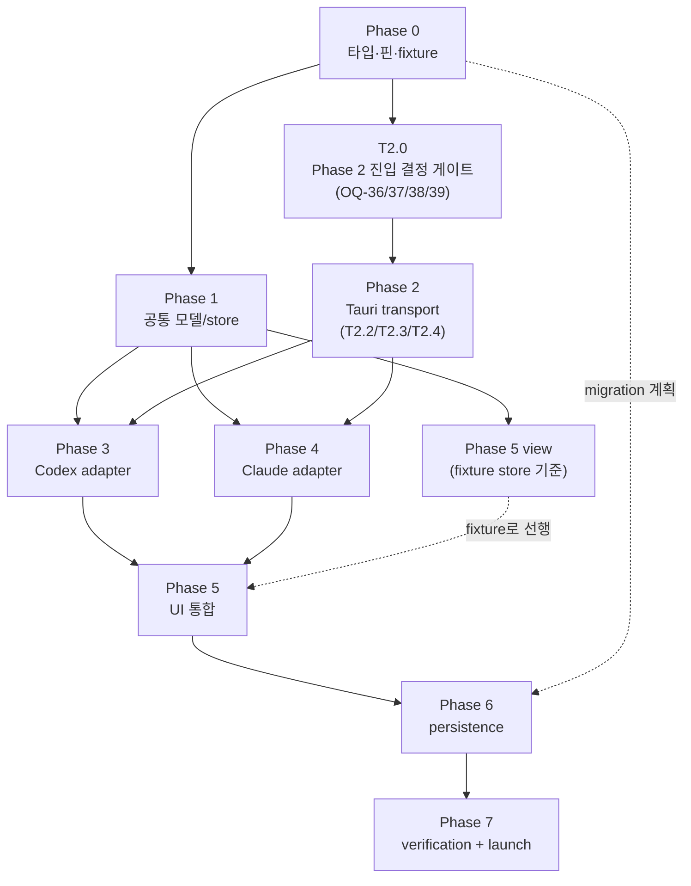

# Implementation Workstreams

> 이 문서는 CLCOMX "Direct Agent Runtime" 구현을 **다운스트림 에이전트가 바로 착수할 수 있는 task 단위**로 분해한다. 각 task는 (대상 파일/모듈 경로 · 선행 의존 · 산출물 · Definition of Done(DoD) · 관련 테스트(11) · 관련 계약(15 §) · 관련 ref §)를 포함한다.
>
> **권위 분리**: 타입은 [`15-data-contracts.md`](15-data-contracts.md)가, 규칙(상태머신·upsert·reconcile·approval 생명주기)은 [`04-normalized-agent-model.md`](04-normalized-agent-model.md)가, 아키텍처 역할은 [`03-target-architecture.md`](03-target-architecture.md)가, process/transport는 [`07-tauri-process-runtime.md`](07-tauri-process-runtime.md)가, 테스트·수용 기준은 [`11-testing-acceptance.md`](11-testing-acceptance.md)가 정본이다. 이 문서는 그 정본을 **재정의하지 않고 인용**한다.
>
> 코드 현실 인용은 [`research/codebase-backend.md`](research/codebase-backend.md)(이하 BE §), [`research/codebase-frontend.md`](research/codebase-frontend.md)(이하 FE §), [`research/ux-reference.md`](research/ux-reference.md)(이하 UX §)를 따른다.
>
> **공통 구현 규약(모든 task 적용)**: 이 plan의 모든 신규 코드와 코드 예시는 [`17-coding-conventions.md`](17-coding-conventions.md)를 따른다 — 도메인 단위 파일 분리(§A), 2000줄 임계 분리 검토(§A.3), 한글 doc-comment(TS=JSDoc/Rust=rustdoc, §B). 아래 각 task의 **공통 DoD**(별도 반복 없이): **파일 분리 기준 충족(도메인 단위·2000줄 검토) + 새/수정 클래스·함수에 doc-comment(한글) 작성**(17 §C.2). 개별 task DoD는 task 고유 항목만 명시한다.

---

## 0. 모듈 배치표 (정본 — research 경로로 확정)

다운스트림이 파일을 만들 때 **이 표가 위치의 단일 출처**다. 모든 경로는 작업 시작 시 `pwd`와 `git rev-parse --show-toplevel`로 확인한 저장소 루트 기준 상대경로다. 이 문서 정리 시점(2026-06-25)에 확인한 루트는 `/home/xenia/work/claudemx`이며, 이전 작성 환경의 절대경로가 보이면 현재 명령 출력이 우선한다. 신설(new)/수정(edit)을 표기한다. 이 표의 책임 단위 분리(특히 adapter를 `*-adapter`/`*-wire-mapper`/`*-launch`/`*-routing`으로 나눈 것, backend `agent_runtime/{mod,transport,process,...}`)는 도메인 단위 파일 분리 규약(17 §A.2)의 적용 사례다.

### 0.1 Frontend — contracts / state / controller / service / adapters / view

| 레이어 | 경로 | 상태 | 책임 | 본뜰 기존 코드(FE §) |
|---|---|---|---|---|
| contracts | `src/lib/features/agent-runtime/contracts/normalized.ts` | new | 15 §1–§5 타입 정본 복사처(import 대상) | FE §1.2 contracts |
| contracts | `src/lib/features/agent-runtime/contracts/runtime-port.ts` | new | 15 §6 `AgentRuntimePort` 등 | FE §1.2 |
| contracts | `src/lib/features/agent-runtime/contracts/metadata.ts` | new | `AgentRuntimeMetadata` 등 persistence 메타(15 §7) + `AgentRuntimeHostProps`(= `SessionHostProps` 동형) | FE §8 |
| state | `src/lib/features/agent-runtime/state/agent-runtime-store.svelte.ts` | new | 세션 단위 transcript[]/status/pendingApproval (1.3 class 패턴) + composer state | FE §1.3, §8 |
| controller | `src/lib/features/agent-runtime/controller/agent-event-router.ts` | new | `AgentEvent`→store dispatch + pending request table (03 §Event Router) | FE §1.5, §8 |
| controller | `src/lib/features/agent-runtime/controller/agent-event-reducer.ts` | new | 순수 함수 prev+event→next (04 §3 규칙) | FE §1.5, §8 |
| service | `src/lib/features/agent-runtime/service/transport.ts` | new | 15 §8.2 invoke 래퍼 + 15 §8.3 listen 구독 + transport wrapper export **`createAgentTransportController`**(`pty.ts` 대응; **adapter는 여기 두지 않음**; 08 §2.2 host가 이 심볼을 `service/transport.ts`에서 import — controller/service 경계 정합) | FE §4.1, §4.2 |
| adapters | `src/lib/features/agent-runtime/adapters/codex/codex-app-server-adapter.ts` | new | Codex wire↔`AgentEvent`/Port (05) | FE §8 |
| adapters | `src/lib/features/agent-runtime/adapters/codex/codex-wire-mapper.ts` | new | Codex notification/request↔normalized 매핑(05) | FE §8 |
| adapters | `src/lib/features/agent-runtime/adapters/codex/codex-launch.ts` | new | Codex stdio start params 생성(provider/distro/workDir/args/env; **command 미생성 — backend resolve, S1**)(05·07) | FE §8 |
| adapters | `src/lib/features/agent-runtime/adapters/codex/codex-routing.ts` | new | 삼중 키 라우팅 + JSON-RPC id 타입 보존(05 §6) | FE §8 |
| adapters | `src/lib/features/agent-runtime/adapters/codex/*.test.ts` | new | 동일 디렉토리 co-located 테스트 | FE §8 |
| adapters | `src/lib/features/agent-runtime/adapters/claude-acp/claude-acp-adapter.ts` 외 06 §1.1 파일들 | new | Claude ACP wire↔`AgentEvent`/Port (06) (+ `*.test.ts`) | FE §8 |
| adapters | `src/lib/features/agent-runtime/adapters/legacy-pty/legacy-pty-adapter.ts` | new | 기존 PTY→`terminal_output_delta` 래핑 (04 §3.5) | FE §4.2, §2.2 |
| generated | `src/lib/features/agent-runtime/generated/codex-app-server/` | new | `codex app-server generate-ts` 산출 타입(수정 금지·핀 고정) | BE §1, ref-codex |
| view | `src/lib/features/agent-runtime/view/AgentTranscriptSurface.svelte` | new | host(`Terminal.svelte` 대응) + transcript 렌더 | FE §2.4, §8, UX |
| view | `src/lib/features/agent-runtime/view/MessageList.svelte` | new | 메시지 리스트 | FE §8, UX |
| view | `src/lib/features/agent-runtime/view/MessageBubble.svelte` | new | 메시지 버블(response/thought 구분) | FE §8, UX |
| view | `src/lib/features/agent-runtime/view/ToolCallCard.svelte` | new | tool call 카드(collapsed/expanded) | FE §8, UX |
| view | `src/lib/features/agent-runtime/view/CommandOutputCard.svelte` | new | command output(terminal embed) | FE §8, UX |
| view | `src/lib/features/agent-runtime/view/FileDiffCard.svelte` | new | 파일 diff 카드 | FE §8, UX |
| view | `src/lib/features/agent-runtime/view/ApprovalModal.svelte` | new | approval modal(testid `approvalModal`) | FE §8, UX |
| view | `src/lib/features/agent-runtime/view/ApprovalInlineCard.svelte` | new | inline approval 카드(testid `approvalInlineCard`) | FE §8, UX |
| view | `src/lib/features/agent-runtime/view/PlanBlock.svelte` | new | plan 블록 | FE §8, UX |
| view | `src/lib/features/agent-runtime/view/AgentComposer.svelte` | new | 입력 박스 | FE §8, UX |

### 0.2 Frontend — 기존 파일 수정(연결점, FE §10 체크리스트)

| # | 파일/심볼 | 상태 | 변경 |
|---|---|---|---|
| 1 | `src/lib/types.ts` `SessionCore`/`WorkspaceTabSnapshot` | edit | `runtimeKind?: SessionRuntimeKind` + `agentRuntime?: AgentRuntimeMetadata` 추가 (15 §7.2) |
| 2 | `src/lib/features/session/service/session-factory.ts` `buildSession` | edit | `runtimeKind` 세팅 (FE §10-2) |
| 3 | `src/lib/features/session/contracts/session-shell.ts` `SessionShellSession`/`SessionHostProps` | edit | `runtimeKind` 전달 (FE §10-3) |
| 4 | `src/lib/features/session/service/session-shell-adapter.ts` `createSessionHostProps` | edit | 새 필드 매핑 한 줄 (FE §10-4) |
| 5 | `src/lib/features/session/view/SessionShell.svelte` | edit | 옵션 B 분기 `{#if useDirectRuntime}` (FE §9, §10-5) |
| 6 | `src/lib/tauri/core.ts` / `event.ts` | reuse | transport는 이 래퍼만 경유 (15 §0.6, FE §4.1) |
| 7 | `src/lib/agents/registry.ts` / `types.ts` `AgentDefinition` | edit | direct 지원 capability 플래그 추가 (FE §10-7, BE §6) |
| 8 | `src/lib/i18n/locales/{en,ko}.ts` | edit | `agentRuntime.*` namespace (en/ko 동시) (FE §6) |
| 9 | `src/lib/testids.ts` `TEST_IDS` | edit | transcript/composer/approval testid (FE §1.6, §10-9) |
| 10 | `src/lib/stores/settings.svelte.ts` + `components/settings/registry.ts` | edit | 새 설정 섹션 시 `cloneDefaults`/`normalizeSettings`/`updateSettings` 3함수 동기화 (FE §7.3, §11) |
| 11 | `src/lib/features/workspace/session-store-snapshot.ts` + `src/lib/features/session/service/live-session-workspace-sync.ts` | edit | 저장은 `createWorkspaceTabSnapshot`, 복원은 `createSessionCore`/`createRuntimeSession` 및 기존 세션 갱신은 `applyWorkspaceWindowSnapshot`에서 `runtimeKind`/`agentRuntime` 전파 |
| 12 | `App.svelte` live-session-store mutator wiring | edit | direct runtime은 `onPtyId` 흐름 우회/대체 (FE §10-12, §11 위험) |

### 0.3 Backend — features / commands

| 경로 | 상태 | 책임 | 본뜰 기존 코드(BE §) |
|---|---|---|---|
| `src-tauri/src/features/agent_runtime/mod.rs` | new | `AgentRuntimeState`(`Mutex<HashMap<RuntimeId, AgentRuntime>>` + `next_id`), spawn/send/cancel/shutdown core fn, snapshot | BE §9 표, §2.1 PtyState |
| `src-tauri/src/features/agent_runtime/transport.rs` | new | newline-delimited JSON-RPC framing, stdin write, stdout/stderr reader thread | BE §2.2 reader loop, §2.6 `decode_utf8_stream_chunk` |
| `src-tauri/src/features/agent_runtime/process.rs` | new | `wsl.exe -d <distro> --cd <wslWorkDir> -e env KEY=VAL <backend-resolved-exe> <argv>` spawn(non-secret env argv·secret은 `Command::env()`+`WSLENV`, 07 §5.1), graceful shutdown(stdin close→timeout→kill) | BE §5.1 `WslShell::spawn`, §2.4 |
| `src-tauri/src/features/agent_runtime/types.rs` | new | 15 §8 Rust 미러 struct/enum (serde camelCase) | BE §3.3, 15 §8 |
| `src-tauri/src/features/agent_runtime/allowlist.rs` | new | provider별 검증: backend-resolved 신뢰 절대경로 command(renderer 비제어, S1) + 정확 args + env key allowlist (신규 강화점, 07 §8.1) | BE §6, §10 권고 6 |
| `src-tauri/src/features/agent_runtime/tests.rs` | new | fixture replay, framing, snapshot/delta, allowlist 단위 테스트 | BE §8.1, §2.3 |
| `src-tauri/src/commands/agent_runtime.rs` | new | 얇은 `#[tauri::command]` 래퍼 5종 + re-export | BE §3.1, `commands/pty.rs` |
| `src-tauri/src/commands/mod.rs` | edit | `pub mod agent_runtime;` 추가 | BE §3.2 |
| `src-tauri/src/lib.rs` | edit | `use` + `.manage(AgentRuntimeState::default())` + `generate_handler![]` 3곳 | BE §3.2 |
| `src-tauri/src/features/workspace/types.rs` | edit | `runtime_kind`/`agent_runtime` 필드 + `AgentRuntimeMetadataRecord` (15 §7.3) | BE §4.2 |
| `src-tauri/src/features/workspace/store.rs` `sanitize_workspace_for_persist` | edit | `provider_session_id`/`provider_thread_id`/`provider_resume_token` scrub (15 §7.3) | BE §4.2, §10 권고 7 |

> **UTF-8 framer 공유(BE §2.6, §10 권고 4)**: `decode_utf8_stream_chunk`는 현재 `features/terminal/parsing.rs`에 `pub(super)`로 있다. transport.rs가 재사용하려면 공용 위치(예: `features/io_util.rs`)로 추출하거나 가시성을 `pub(crate)`로 올린다. terminal 테스트(`features/terminal/tests.rs`)의 `use super::parsing::...` import를 함께 갱신해야 한다 — 이는 **결정 필요** 항목으로 [13](13-risks-open-questions.md)에 연결.

### 0.4 i18n / settings / generated 핀

| 항목 | 경로/명령 | 비고 |
|---|---|---|
| i18n namespace | `src/lib/i18n/locales/en.ts`, `ko.ts` | `agentRuntime.status.*`/`.approval.*`/`.toolKind.*`/`.errors.*`/`.fallback.*` (08에서 예약, FE §6.2) |
| Codex 타입 생성 | `codex app-server generate-ts` → `generated/codex-app-server/` | pinned ref `rust-v0.142.0` (15 머리말, [01](01-source-map.md)) |
| ACP/Claude 기준 | `@agentclientprotocol/claude-agent-acp@0.51.0` (commit `23626c9`), ACP wire `protocolVersion=1`; schema artifact는 T0.0/OQ-41에서 확정(`schema-v1.16.0`은 baseline 후보, 구현 핀 아님) | 15 머리말, [01](01-source-map.md) |

---

## Phase 0: 준비 (Foundation & Pinning)

선행: 없음. 목표: 후속 모든 Phase가 의존하는 타입·생성 코드·fixture 포맷·migration 계획을 고정. **T0.0은 hard gate**다. T0.0 완료 전에는 T0.1 스캐폴드, generated 타입 생성, Claude dependency 추가를 시작하지 않는다. **이 Phase는 코드 동작을 만들지 않으므로 app launch 없음.**

### T0.0 — 작업 루트·브랜치·baseline preflight

- 대상: 로컬 작업 환경 + 본 문서 집합.
- 선행: 없음.
- 산출물: 구현 로그 또는 PR 설명에 `pwd`, `git rev-parse --show-toplevel`, `git status --short --branch`, `codex --version`(가능 시), `npm view @agentclientprotocol/claude-agent-acp version`(가능 시) 결과를 기록. 경로는 확인된 저장소 루트 기준 상대경로로만 사용한다.
- DoD: 문서 baseline(`e7a5f9e`, Codex `rust-v0.142.0`, ACP schema baseline 후보 `schema-v1.16.0`, Claude adapter `0.51.0`)과 현재 환경의 차이를 확인하고, 차이가 있으면 [01](01-source-map.md) §4와 [13](13-risks-open-questions.md) OQ-41 절차로 diff 검토 범위를 적는다. ACP는 public release/tag 목록과 패키지 내 schema artifact를 대조해 **실제 생성 타입 정본**을 확정해야 한다. 네트워크가 없으면 "미확인"으로 남기고 schema/runtime 생성 전 gate로 유지한다.
- 테스트(11): 없음(preflight).
- 계약(15 §): 없음.
- ref §: 01 §4, 13 OQ-41.

### T0.1 — 모듈 스캐폴드 생성

- 대상: §0.1/§0.3 표의 디렉토리만 빈 파일/`mod.rs` 선언으로 생성. 기존 파일 수정 없음.
- 선행: T0.0.
- 산출물: `src/lib/features/agent-runtime/{contracts,state,controller,service,adapters,view,generated}/` 디렉토리, `src-tauri/src/features/agent_runtime/{mod,transport,process,types,allowlist,tests}.rs` 스텁(빈 `pub fn` 또는 `// TODO`). `mod.rs`에 서브모듈 mod 선언(스텁) 포함: `mod transport; mod process; mod types; mod allowlist;` + `#[cfg(test)] mod tests;`(스캐폴드 컴파일 통과의 전제 — 선언 없으면 미참조 파일은 빌드에 포함되지 않음).
- DoD: `npm run check:frontend`와 `npm run check:rust`가 빈 스캐폴드 상태에서 통과(미참조 모듈은 컴파일에 영향 없음). `mod.rs`는 아직 `lib.rs`에 등록하지 않는다. 디렉토리·파일 분할은 도메인 단위 분리 규약(17 §A)을 따른다(이후 task의 공통 DoD 적용 시작점).
- 테스트(11): 없음(스캐폴드).
- 계약(15 §): §9 type 인덱스(어떤 파일에 무엇이 들어갈지).
- ref §: 없음.

### T0.2 — normalized 타입 정본 복사

- 대상: `src/lib/features/agent-runtime/contracts/normalized.ts`, `runtime-port.ts`.
- 선행: T0.0, T0.1.
- 산출물: 15 §1–§6 타입을 **그대로** 복사. 재정의·축약 금지. `UnlistenFn`은 `$lib/tauri/event`에서 import(15 §6 주석).
- DoD: 15 §9 인덱스의 모든 normalized/port 이름이 export됨. `svelte-check` 통과. 다른 모듈이 `import type { AgentEvent } from "../contracts/normalized"`로 참조 가능.
- 테스트(11): 없음(타입 선언).
- 계약(15 §): §1–§6 전체.
- ref §: 없음(타입만).

### T0.3 — Codex 타입 생성 + 핀

- 대상: `src/lib/features/agent-runtime/generated/codex-app-server/`.
- 선행: T0.0, T0.1.
- 산출물: `codex app-server generate-ts` 실행 결과를 그대로 배치. 생성 명령·버전을 디렉토리 `README` 또는 헤더 주석에 기록(T0.0에서 확정한 Codex ref/CLI 버전). 이 디렉토리는 **수동 수정 금지**.
- DoD: generated 타입이 import 가능하고 `svelte-check` 통과. 생성 버전이 T0.0에서 확정한 핀과 일치. **generate-ts 미제공 시 fallback**: `codex` 바이너리가 `generate-ts` subcommand를 제공하지 않으면 ref-codex §6 핵심 타입을 **수기 미러**한다 — `generated/` 대신 `src/lib/features/agent-runtime/contracts/codex-wire.ts`(수기 표시·핀 주석)에 두고, generate-ts 미제공 사실과 미러 출처(ref-codex §6 버전)를 [13](13-risks-open-questions.md)에 기록한다. 이때 Phase 3 입력은 수기 미러가 정본이 된다.
- 테스트(11): 없음.
- 계약(15 §): §3 매핑이 generated 타입(또는 fallback 수기 미러 `contracts/codex-wire.ts`)을 사용함을 명시.
- ref §: ref-codex §6(핵심 타입), §1.2(envelope).
- 미확정: `codex` 바이너리가 generate-ts subcommand를 제공하는지 환경 검증 필요 → [13](13-risks-open-questions.md). T0.0이 "미확인"이면 이 task는 시작하지 않는다(단 generate-ts 미제공이 확인되면 위 fallback 수기 미러 경로로 진행).

### T0.4 — Claude ACP 의존성 고정

- 대상: `package.json`.
- 선행: T0.0.
- 산출물: `@agentclientprotocol/claude-agent-acp@0.51.0` dependency 추가(commit `23626c9`). launch bin은 `claude-agent-acp`(ref-claude §2).
- DoD: `npm install` 성공, lockfile에 T0.0에서 확정한 정확한 버전 핀. `node_modules/.bin/claude-agent-acp` 존재 확인. npm 최신/현재 package가 baseline과 다르면 OQ-41 diff 결론 전에는 임의로 올리지 않는다.
- 테스트(11): 없음.
- 계약(15 §): 머리말 핀.
- ref §: ref-claude §1(capability), §2(launch).

### T0.5 — adapter fixture 포맷 정의

- 대상: `src/lib/features/agent-runtime/adapters/__fixtures__/` (신설) + `fixture-format.md`(또는 README).
- 선행: T0.2.
- 산출물: provider wire message 시퀀스를 재생할 fixture 포맷 정의. **정본 형식 = NDJSON 한 줄 = `{ direction: "in"|"out"; message: JsonRpcMessage }`**(파일 확장자 `.jsonl`, in=provider→client, out=client→provider). 논리적으로는 `{direction,message}[]` 배열과 동형이나 **정본 직렬화는 NDJSON `.jsonl`**(한 줄=한 envelope)로 못박는다 — 11 §1과 단일 형식으로 통일(11 §1 replay harness가 줄 단위로 읽음). 기대 normalized 산출은 `*.expected.json`. Codex/Claude 공용.
- DoD: 포맷 스키마 문서화 + 최소 1개 hello-world fixture(Codex initialize, Claude initialize) 작성. reducer/adapter 테스트가 이 NDJSON 포맷을 줄 단위로 로드(11 §1.2 harness 시그니처와 정합).
- 테스트(11): "interleaved stream fixture", "ACP message chunk/update" 등 모든 adapter 테스트가 이 포맷에 의존(11 §1 fixture replay).
- 계약(15 §): §8.1 `JsonRpcMessage`.
- ref §: ref-codex §1.2, ref-acp §1.

### T0.6 — migration 계획 확정 (session runtime kind)

- 대상: 문서 [10](10-persistence-migration.md) cross-check + `src/lib/types.ts`/`features/workspace/types.rs` 변경 설계만(코드 미작성).
- 선행: 없음.
- 산출물: `runtimeKind` 부재→`"pty"` normalize 규칙, scrub 대상 3필드 확정 메모. 실제 코드 변경은 Phase 6.
- DoD: 10과 15 §7이 일치함을 확인. 미정 항목은 [13](13-risks-open-questions.md)에 기록.
- 테스트(11): "legacy record compatibility"(Phase 6).
- 계약(15 §): §7.1–§7.3.
- ref §: 없음.

**Verification gate (Phase 0)**: `npm run check`(frontend+rust) 통과. app launch 금지(동작 코드 없음). fixture 포맷·핀·타입 정본이 후속 Phase 입력으로 동결됨.

---

## Phase 1: 공통 모델과 store (Normalized core)

선행: Phase 0. 목표: provider 무관 transcript reducer·event router·세션 store·legacy 래퍼. **adapter/transport 없이도 fixture event로 단위 테스트 가능.**

### T1.1 — transcript reducer (순수 함수)

- 대상: `src/lib/features/agent-runtime/controller/agent-event-reducer.ts`.
- 선행: T0.2.
- 산출물: `applyEvent(prev: TranscriptModel, event: AgentEvent): TranscriptModel` 순수 함수. 04 §3의 upsert/append/replace 규칙 구현:
  - message/tool call **id 기준 upsert** (04 §3.1).
  - `mode:"replace"` 전체 교체, `mode:"append"` 누적 (04 §3.1).
  - Codex delta→completed reconcile: message는 completed `text` 권위, plan/reasoning은 completed 권위(delta는 점진 렌더만) (04 §3.2).
  - ACP chunk(append) vs `tool_call_update.content`(전체 교체) 구분 (04 §3.3).
  - **순서 보존: per-(라우팅 키) receive-order** (단일 stdio 스트림이라 같은 키 내 순서 보존) + reconcile 멱등·notice dedup (04 §3.4·§3.6). **cross-key event-level seq 정렬/dedup은 v1 미도입(후속)** — v1 `AgentEvent`에 seq 필드 없음(15 §8.3, 11 NM-29 후속).
- DoD: 함수가 부수효과 없음(룬 미사용). 아래 테스트 통과. `applyEvent` 등 함수에 JSDoc(한글) + reconcile 분기에 한 줄 주석(17 §B.1·§B.2; 예시는 17 §B.1).
- 테스트(11): "message replace/append 순서", "tool call upsert", "provider raw id 보존". co-located `agent-event-reducer.test.ts`, `vi.fn` 불필요(순수).
- 계약(15 §): §3 `AgentEvent`, §4 `AgentContent`, §5 하위 타입.
- ref §: 매핑 전제는 ref-codex §7, ref-acp §4·§5(규칙은 04에서 인용).

### T1.2 — pending approval / status 전이 로직

- 대상: `agent-event-reducer.ts`(또는 `agent-runtime-store` 헬퍼).
- 선행: T1.1.
- 산출물: `AgentSessionStatus` 전이(04 §2.1)와 pending approval table 관리(04 §4):
  - `approval_requested`→pending 추가 + status `requires_action` 합성.
  - `approval_resolved`→pending 제거 + status 복귀.
  - `turn_completed{cancelled}`/`cancelTurn`→해당 turn pending approval 전부 `cancelled`로 닫기(04 §4.2 불변식).
  - `process_exited`→모든 pending 실패로 닫기(04 §5).
  - **닫힌 requestId 멱등 추적**: 이미 닫힌(resolved/cancelled/failed) requestId에 대한 중복 close는 no-op이고, 각 pending은 **정확히 1회만** 종료 emit(이중 종료·누락 없음). exit/shutdown으로 인한 pending 종료가 멱등하도록 닫힌 id 집합을 추적한다(04 §4.2 규칙 4 멱등 무시, §5).
- DoD: 아래 lifecycle 테스트 통과. cancelled turn이 pending approval을 닫는지 검증. 늦은 `process_exited`(이미 닫힌 후 도착)가 재차 닫지 않고 `approval_resolved`가 정확히 1회만 emit되는지(NM-18c/18d) 검증.
- 테스트(11): "approval request/resolution lifecycle", "cancelled turn이 pending approval을 닫는지", NM-18c/18d(늦은 `process_exited` 멱등 — 정확히 1회 emit).
- 계약(15 §): §2 `AgentSessionStatus`, §5 `Approval*`.
- ref §: ref-acp §3.8(cancel MUST), ref-codex §4.4(serverRequest/resolved).

### T1.3 — 세션 단위 state class

- 대상: `src/lib/features/agent-runtime/state/agent-runtime-store.svelte.ts`(세션 단위 state + composer state 포함).
- 선행: T1.1, T1.2.
- 산출물: FE §1.3 class 패턴. interface(plain) + impl class(`$state`). reactive 멤버: `transcript`, `status`, `pendingApproval`, `error`, composer 입력/첨부/전송중. non-reactive: 누적 버퍼·seq counter는 `$state` 없이.
- DoD: `createAgentRuntimeStore()` 팩토리 반환. reducer를 호출해 상태 갱신. `svelte-check` 통과.
- 테스트(11): state는 controller 테스트에서 실제 인스턴스로 사용(FE §1.6).
- 계약(15 §): §2, §3, §5.
- ref §: 없음.

### T1.4 — event router + 윈도우 전역 registry

- 대상: `src/lib/features/agent-runtime/controller/agent-event-router.ts` + `state/agent-runtime-store.svelte.ts`의 module-level registry.
- 선행: T1.3.
- 산출물: router는 `AgentEvent`를 `ref`(provider/sessionId/threadId/turnId/messageId/itemId/toolCallId/requestId) 기준으로 올바른 세션 state로 dispatch(03 §Event Router). module-level registry는 handle→runtimeId/port 매핑과 pending request table(FE §1.4 module store). **approval pending request table key = `(sessionHandle, requestId)`**(03 §2.8). JSON-RPC id(`requestId`)는 runtime/connection(=adapter 연결) 단위에서만 유일하므로 **전역 단독 `requestId`를 key로 쓰는 것을 금지**한다 — 두 runtime이 같은 id를 받아도 서로의 approval로 오라우팅·오응답하지 않아야 한다(불변식). **윈도우 소유권/수명 모델은 13 OQ-48/위험 §1.11의 선행 gate**: registry 단일 윈도우 소유 + `runtimeId`↔window 바인딩 + window-close 시 소유 엔트리만 정리 + cross-window dispatch 금지(불변식). 구현 전 OQ-48 확정.
- DoD: 라우팅 키 표(15 §1.1)대로 Codex 삼중 키·ACP `(sessionId,messageId)`/`(sessionId,toolCallId)` 분기 동작. **pending request table이 `(sessionHandle, requestId)` 복합 키로 인덱싱**되고, 서로 다른 두 runtime이 동일 `requestId`를 받아도 각자의 pending에만 매칭(오응답 없음)됨을 검증(11 충돌 회귀 테스트). co-located 테스트 통과. window-close 격리·cross-window dispatch 차단(OQ-48/§1.11) 동작.
- 테스트(11): "interleaved turn stream이 turn id별로 분리되는지"의 store 측(adapter는 Phase 3). **"두 runtime이 같은 JSON-RPC id를 받아도 오응답하지 않음"(`(sessionHandle, requestId)` 키 충돌 회귀)**. window-close 시 소유 엔트리만 정리되는지(OQ-48).
- 계약(15 §): §1.1 라우팅 키(approval 라우팅 키 = `(sessionHandle, requestId)`).
- ref §: 03 §2.8(pending request table key), ref-codex §7.1(삼중 키), 13 OQ-48·위험 §1.11(멀티 윈도우 registry 소유권/수명).

### T1.5 — legacy PTY 래핑 어댑터

- 대상: `src/lib/features/agent-runtime/adapters/legacy-pty/legacy-pty-adapter.ts`.
- 선행: T1.1.
- 산출물: 기존 PTY output을 `terminal_output_delta` event(15 §3)로 감싸는 얇은 어댑터. transcript 모델로 끌어올리지 않음(04 §3.5).
- DoD: 기존 `pty-output` chunk → `AgentEvent{type:"terminal_output_delta"}` 변환. 호환 테스트 통과(기존 PTY session이 공통 모델 경유로도 표현됨).
- 테스트(11): "기존 PTY session open이 깨지지 않는지"의 모델 측.
- 계약(15 §): §3 `terminal_output_delta`.
- ref §: 없음.

### T1.6 — approval audit trail (in-memory + opt-in redacted 영속 로그)

- 대상: `agent-event-reducer.ts`(또는 `agent-runtime-store.svelte.ts` audit 헬퍼) — 모든 approval 결정 경로(T1.2 lifecycle)에 audit 기록을 부착.
- 선행: T1.2.
- 산출물: approval 결정이 닫힐 때마다 **in-memory audit entry 1건**을 기록한다(Repudiation 방어, 09 §3.4). 한 entry는 `requestId`/`optionId`/`kind`/`outcome`/결정 시각과 **`decidedBy: "user" | "auto" | "cleanup"`**(사용자 선택·자동 결정·exit/cancel/shutdown cleanup)을 담는다 — 즉 user/auto/cleanup 세 경로 모두 정확히 1건 기록(T1.2 멱등 종료와 정합: pending 1개당 audit 1건, 이중 기록 없음). 추가로 **opt-in redacted 영속 로그**: 설정으로 켤 때만 디스크에 redacted entry를 append하며, **명령 전문·credential·파일 내용은 절대 저장하지 않는다**(09 §3.4 형식 — 결정·시각·requestId·optionId·kind·outcome·scope만). secret scrub 경계는 09 §3.4를 따르고, 저장 위치/보존/포맷은 [13](13-risks-open-questions.md) **OQ-51** 선행 결정에 의존한다(미결 시 in-memory만 v1 기본, 영속 로그는 OQ-51 확정 후).
- DoD: 11 audit 수용 케이스 통과 — 모든 approval 결정(user/auto/cleanup)이 audit entry 1건을 남기고, audit·영속 로그 어디에도 명령 전문/credential/파일 내용이 포함되지 않음(비밀 비포함 단정). 영속 로그 포맷·저장 위치는 OQ-51 결정을 인용해 구현(미결 시 in-memory만). audit 기록 함수에 한글 doc-comment(17 §B.1).
- 테스트(11): "approval 결정 audit 기록(모든 결정 1건 + decidedBy)", "audit/영속 로그에 비밀(명령 전문/credential/파일 내용) 비포함"(09 §3.4 scrub과 교차).
- 계약(15 §): §5 `Approval*`(audit는 결정 메타만 보존, 09 §3.4 형식).
- ref §: 09 §3.4(audit trail 형식·redaction), 13 OQ-51(저장 위치/보존/포맷 선행 결정).

**Verification gate (Phase 1)**: `npm run test`(reducer/router/state 단위 테스트) + `npm run check` 통과. app launch 금지(UI/transport 미연결). fixture event만으로 모델 정합 검증 완료.

---

## Phase 2: Tauri JSON-RPC runtime (Backend transport)

선행: Phase 0(타입 핀). **Phase 1과 병렬 가능**(interface 합의=15 §8 고정 후). 목표: stdio subprocess 기동·framing·event emit. 이 Phase는 protocol 의미를 모름 — raw JSON-RPC만 다룬다(15 §8.3 주석).

> **Phase 2 진입 gate**: T2.2/T2.4 구현 전 OQ-36(command/entry resolve owner/cache/entry 탐색)과 OQ-38(provider별 non-secret env key allowlist)을 확정한다. T2.3 구현 전 OQ-39(backpressure cap/line cap/notify interval)를 확정한다. mock 테스트는 가능하지만 실제 allowlist/backpressure 코드는 이 세 결정 없이 작성하지 않는다. **이 gate를 닫는 task가 아래 T2.0**이다.

### T2.0 — Phase 2 진입 결정 게이트

- 대상: 결정 산출물 + 문서 동기화([13](13-risks-open-questions.md)/[07](07-tauri-process-runtime.md)/[11](11-testing-acceptance.md)/[15](15-data-contracts.md)). 코드 미작성(결정 task).
- 선행: T0.0.
- 산출물: 위 Phase 2 진입 gate의 미결정 OQ를 확정해 각 결정값을 산출한다.
  - **OQ-36**: `resolve_trusted_executable(provider,distro)`/`resolve_trusted_adapter_entry(provider,distro)`의 owner 모듈(`agent_runtime/allowlist.rs` 또는 별도 `resolver.rs`), npm 설치 위치 탐색 방식, WSL distro별 cache key/TTL/clear(무효화 트리거) 조건, resolve 실패 에러 문구.
  - **OQ-37**: `src-tauri/Cargo.toml`·lockfile의 serde 버전을 확인해 `#[serde(rename_all_fields="camelCase")]` 사용 가능(≥1.0.181) 여부 또는 필드별 `#[serde(rename)]` 대체 방식 확정(15 §8, T2.1 직렬화 방식 결정).
  - **OQ-38**: Codex/Claude 각각의 non-secret env key allowlist 집합(05/06/07/09 동일 이름).
  - **OQ-39**: `MAX_MESSAGE_LOG_BYTES`/single-line cap/`BACKPRESSURE_NOTIFY_INTERVAL`/drop-vs-block 수치 정책.
- DoD: 위 4개 결정 결론을 [13](13-risks-open-questions.md) 해당 OQ(OQ-36/37/38/39)에 기록하고, 동기화한다 — 07 §8.1(resolve owner·env key allowlist)·§7.2/§7.3(backpressure 상수명), 11 RS-8..RS-10c(resolve)·RS-12b(env key)·RS-16/17(backpressure 기대값)·RS-21..RS-25(serde round-trip), 15 §8(serde 직렬화 방식). 결정값이 07 상수명·allowlist 집합·기대값과 1:1로 일치함을 확인. 결정이 안 닫히면 T2.2/T2.3/T2.4를 시작하지 않는다(gate 유지).
- 테스트(11): 없음(결정 task). 단 11 RS-12b/RS-16/RS-17 기대값이 OQ-38/OQ-39 결정으로 고정된다.
- 계약(15 §): §8(serde 직렬화 방식 결정 반영).
- ref §: 13 OQ-36/OQ-37/OQ-38/OQ-39, 07 §7.2·§7.3·§8.1.

### T2.1 — Rust wire 타입 미러

- 대상: `src-tauri/src/features/agent_runtime/types.rs`.
- 선행: T0.1.
- 산출물: 15 §8.1/§8.2/§8.3 Rust struct/enum 그대로(`RuntimeId`, `JsonRpcMessage`(untagged), `JsonRpcError`, `AgentRuntimeStartParams`(tag=transportKind kebab), `AgentRuntimeCancelTarget`, `AgentRuntimeSnapshot`, `AgentRuntimeEvent`). **struct**(`JsonRpcError`/`AgentRuntimeSnapshot`/`AgentRuntimeMetadataRecord`)는 `#[serde(rename_all="camelCase")]`. **variant 필드를 가진 enum**(`AgentRuntimeStartParams`/`AgentRuntimeCancelTarget`/`AgentRuntimeEvent`/`JsonRpcMessage`)은 `#[serde(rename_all_fields="camelCase")]`(serde≥1.0.181) 또는 필드별 `#[serde(rename)]`로 variant 필드(`workDir`/`requestId`/`runtimeId`/`droppedMessages` 등)까지 camelCase 직렬화(15 §8, S2) — enum 레벨 `rename_all`만으로는 variant 필드가 snake_case로 남는다.
- DoD: `cargo check` 통과. serde round-trip 단위 테스트(JSON↔struct)로 TS와 1:1 미러 확인 — 특히 `AgentRuntimeStartParams`/`AgentRuntimeCancelTarget`/`AgentRuntimeEvent`의 variant 필드가 camelCase로 round-trip되는지(S2). Cargo.toml serde 버전이 `rename_all_fields`(≥1.0.181) 지원인지 확인(미만이면 필드별 rename — 13).
- 테스트(11): framing/직렬화 단위(tests.rs).
- 계약(15 §): §8.1–§8.3 전체.
- ref §: ref-codex §1.2(jsonrpc 생략), ref-acp §1(jsonrpc 2.0).

### T2.2 — process spawn + graceful shutdown

- 대상: `src-tauri/src/features/agent_runtime/process.rs`.
- 선행: T2.0, T2.1 (OQ-36/OQ-38 결정 = T2.0).
- 산출물: 07 §5.1 launch 정본 형태 `wsl.exe -d <distro> --cd <wslWorkDir> -e env KEY1=V1 KEY2=V2 <backend-resolved-exe> <argv...>`로 child spawn(stdin/stdout/stderr piped, `CREATE_NO_WINDOW`). 로그인 셸 비경유 직접 실행(`-e env` 바이너리 주입 → `<executable>` exec)으로 rc 파일 stdout 오염 원천 차단(07 §5.1, 06 §2.3). **executable은 renderer가 넘기지 않고 backend가 provider로 신뢰 절대경로를 resolve한다**(S1: codex→resolve된 codex 절대경로, claude→resolve된 node 절대경로; 동명 바이너리 `/tmp/codex`·`/tmp/node` 우회 불가, 07 §8.1). cwd는 `--cd <wslWorkDir>`로 WSL 내부 경로 직접 설정(09 §canonicalize 완료 값). env 경계: **non-secret env만 `-e env KEY=VAL` argv 경유**(비민감 플래그), **secret env(API key/OAuth token/gateway header/cookie)는 argv 비경유 — `Command::env()`+`WSLENV` passthrough**(07 §5.1 C1; v1 기본값은 secret env 미전달=provider 자체 WSL 인증 의존). PTY의 `HashMap::remove`+Drop에 의존하지 말고 명시적 child handle 보관(BE §2.4, §10 권고 5). graceful shutdown: stdin close→`SHUTDOWN_GRACE_MS`(2000ms) 대기→kill(07 §5.2). wait-중-kill deadlock 회피 정본 패턴(child는 wait 전용 thread로 move, kill은 저장된 OS pid/handle, 07 §5.3).
- DoD: child handle 보관·kill 동작. `cargo test`로 mock(non-WSL) 경로 검증. **executable+argv** 모델 준수(shell string 금지, BE §2.2). 추가 검증:
  - **`--cd <wslWorkDir>` cwd 경계**: spawn argv에 `--cd`와 canonicalize된 WSL absolute workDir이 정확히 포함되는지(Windows path·relative workDir 거부는 §9/T2.4 allowlist 책임이나 spawn 조립에서 cwd 인자 위치를 검증).
  - **non-secret env argv 경계**: `non_secret_env`의 `KEY=VAL`만 `-e env` 뒤 argv에 조립되는지.
  - **secret env 경계**: `secret_env` 키가 child argv(`-e env KEY=VAL`)에 **부재**하고 `Command::env()`+`WSLENV`(`KEY/u` 형태)에만 등재되는지(07 §5.1 C1, AC-10b).
  - **allowlist(backend-resolved executable + 정확 args) 경계**: spawn에 들어오는 executable이 backend resolve 신뢰 절대경로이고, argv가 provider별 정확 일치(Codex `["app-server","--stdio"]`, Claude `[검증된 adapterEntryPath]`)인 검증을 통과한 값만 spawn되는지(07 §8.1, T2.4 연계). renderer는 command를 넘기지 않음(S1).
- 테스트(11): "shutdown timeout 후 kill", "`spawn_wsl_process` argv 조립(`--cd` cwd·non-secret env argv·secret env는 `Command::env()`+`WSLENV`)", "backend-resolved executable + 정확 args allowlist"(T2.4와 교차).
- 계약(15 §): §8.1 `AgentRuntimeStartParams`(provider/distro/workDir/args/env; **command 필드 없음 — backend가 provider로 신뢰 절대경로 resolve, S1**), §8.2 시그니처.
- ref §: 07 §5.1(launch 정본 형태·cwd·non-secret/secret env 경계), §5.2/§5.3(shutdown·wait/kill), §8.1(R4 allowlist·backend-resolved executable·정확 args), §9(WSL path 경계).
- 본뜰 코드: `commands/wsl.rs::WslShell::spawn`(BE §5.1 비-PTY spawn 레퍼런스).

### T2.3 — newline-delimited JSON-RPC framing + reader threads

- 대상: `src-tauri/src/features/agent_runtime/transport.rs`.
- 선행: T2.0, T2.2, §0.3 UTF-8 framer 공유 결정 (OQ-39 결정 = T2.0).
- 산출물: stdout reader thread(newline framing, `decode_utf8_stream_chunk`로 byte→str), stderr reader thread(별도), stdin writer(`Mutex` 잠금). 각 라인을 `JsonRpcMessage`로 파싱해 `agent-runtime-message` emit. invalid JSON·embedded newline은 `agent-runtime-error`(recoverable 분류, 07 §Framing). stderr 라인은 `agent-runtime-stderr`. exit는 `agent-runtime-exit`. bounded queue overflow는 `agent-runtime-backpressure`(07 §Process lifecycle).
- DoD: 아래 framing 테스트 전부 통과. stdout/stderr 분리. PTY reader loop(BE §2.2 mod.rs:513-582)를 newline framer로 치환. framing·decode 같은 핵심 로직에는 한 줄 한글 주석을 단다(17 §B.2).
- 테스트(11): "newline-delimited message framing", "stderr와 stdout 분리", "bounded queue overflow event", "stdio JSON-RPC process start/stop".
- 계약(15 §): §8.3 event payload.
- ref §: 07 §Framing.
- 동시성: `std::thread` + `Arc<Mutex>` 유지(BE §7 옵션 1). tokio 도입은 ADR 결정 — [adr-001](adr-001-direct-agent-runtime.md)/[13](13-risks-open-questions.md).

### T2.4 — allowlist 검증

- 대상: `src-tauri/src/features/agent_runtime/allowlist.rs`.
- 선행: T2.0, T2.1 (OQ-36/OQ-38 결정 = T2.0).
- 산출물: provider enum(`codex`|`claude`)별 검증(07 §8.1 R4 정본 — basename/prefix 비교 폐지). **command는 renderer가 넘기지 않는다**: backend가 provider로 신뢰 절대경로를 resolve(codex→codex 절대경로, claude→node 절대경로; OQ-36에서 확정한 owner/cache/entry 탐색 방식, 또는 사전 등록 절대경로 화이트리스트)하고 동명 바이너리(`/tmp/codex`·`/tmp/node`)를 거부한다(S1). args는 **provider별 정확 일치**: Codex `["app-server","--stdio"]`, Claude `args.length==1` 이고 `args[0]`이 backend가 검증한 `adapterEntryPath`(WSL 절대경로, `claude-agent-acp` `dist/index.js`). env key allowlist(`^[A-Za-z_][A-Za-z0-9_]*$` + OQ-38에서 확정한 provider별 허용 key, 값은 non-secret 전용). renderer가 임의 args/shell string/비신뢰 entry를 넘기면 `Err(String)`(15 §8.1 주석, 07 §8.1). PTY에 선례 없는 신규 강화점(BE §6, §10 권고 6).
- **실제 resolve 구현(T2.0 결정 반영)**: OQ-36 결정에 따라 `resolve_trusted_executable(provider,distro)`/`resolve_trusted_adapter_entry(provider,distro)`의 **실제 성공경로**(npm 설치 위치 탐색→신뢰 절대경로 반환)와 **미설치/탐색 실패 경로**(`Err(String)`, RS-10c)와 **캐시 무효화 정책**(distro별 cache key/TTL/clear 조건)을 구현한다(owner 모듈은 OQ-36 결정 = `allowlist.rs` 또는 별도 `resolver.rs`). mock 주입은 테스트 격리용이고, 실제 resolve 본체는 이 task가 소유한다.
- DoD: 허용/거부 케이스 단위 테스트(backend-resolved 절대경로 통과 vs 동명 바이너리 거부, Codex 정확 args vs 그 외 거부, Claude `adapterEntryPath` 신뢰 vs 비신뢰 거부, env key allowlist 위반 거부). **실제 resolve 함수 + 미설치 실패경로(RS-10c) + 캐시 무효화 정책** 구현·검증(11 RS-8..RS-10c는 현재 실패/mock 주입만 명시 — backend resolve 성공경로 테스트가 추가로 필요함을 11에 인용). `agent_runtime_start`가 spawn 전에 이 검증을 호출.
- 테스트(11): "provider별 startup executable allowlist 검증"(backend-resolved executable + 정확 args + env key, 07 AC-7), backend resolve 성공경로(설치된 codex/node 절대경로 resolve)는 11 RS-8..RS-10c에 성공경로 케이스 추가 필요(11 에이전트가 추가).
- 계약(15 §): §8.1 `AgentRuntimeStartParams`(command 필드 없음 — backend resolve, S1).
- ref §: 07 §8.1(R4 allowlist 정본), §5.1(launch 형태).

### T2.5 — runtime state + command 5종 + 등록

- 대상: `src-tauri/src/features/agent_runtime/mod.rs`, `src-tauri/src/commands/agent_runtime.rs`, `commands/mod.rs`(edit), `lib.rs`(edit).
- 선행: T2.2, T2.3, T2.4.
- 산출물: `AgentRuntimeState`(`Mutex<HashMap<RuntimeId, AgentRuntime>>`+`next_id`, PtyState와 별도, BE §10 권고 1). 얇은 `#[tauri::command]` 5종: `agent_runtime_start/send/cancel/shutdown/get_snapshot`(15 §8.2). `lib.rs` 3곳 등록(`use`+`.manage`+`generate_handler![]`, BE §3.2). process exit이 모든 pending request 실패로 닫음(07 §Process lifecycle). **test-mode mock JSON-RPC 스트림 정의**: `is_test_mode()` 경로가 재생할 스트림은 **T0.5 fixture 포맷(NDJSON 한 줄=`{direction,message}`, `.jsonl`)을 그대로 재사용**한다(E2E mock과 fixture replay 단일 출처, 11 §1과 동일 형식). provider별 최소 시나리오를 정의: Codex `initialize→thread/started→turn delta→item/completed→turn/completed` 및 approval(`requestApproval→respondApproval`); Claude `initialize→session/new→session/update chunk→stopReason` 및 `session/request_permission`. mock은 별도 스크립트가 아니라 T0.5 fixture(`.jsonl`)를 줄 단위로 로드해 재생한다.
- DoD: `cargo check`+`cargo test` 통과. command가 `Result<T,String>` 반환(15 §0.5). test-mode mock 경로 제공(`is_test_mode()`로 가짜 JSON-RPC 스트림, BE §10 권고 8).
- 테스트(11): Tauri tests 전체 + test-mode mock fixture(BE §8.1 `create_mock_session` 본뜸).
- 계약(15 §): §8.2 command 시그니처.
- ref §: 07 §Tauri command v1 계약.

### T2.6 — frontend transport 래퍼

- 대상: `src/lib/features/agent-runtime/service/transport.ts`.
- 선행: T2.5(command 이름 확정), 15 §8.2.
- 산출물: 15 §8.2 invoke 래퍼(`agentRuntimeStart/Send/Cancel/Shutdown/GetSnapshot`) + 15 §8.3 `listen` 구독(`agent-runtime-message`/`-stderr`/`-exit`/`-error`/`-backpressure`). **반드시 `$lib/tauri/core.ts` invoke·`$lib/tauri/event.ts` listen 경유**(15 §0.6, FE §4.1).
- DoD: co-located `transport.test.ts`가 `src/test/mocks/tauri.test.ts` 기반 invoke/listen 모킹으로 통과(FE §8.2).
- 테스트(11): frontend transport 단위.
- 계약(15 §): §8.2, §8.3.
- ref §: 없음.

**Verification gate (Phase 2)**: `npm run test:rust` + `npm run test`(transport.test) + `npm run check` 통과. test-mode mock으로 stdio 왕복 검증. **app launch 금지**(adapter/UI 미연결, raw 메시지만 흐름).

---

## Phase 3: Codex adapter

선행: Phase 1(reducer/router), Phase 2(transport), T0.3(generated), T0.5(fixture). 목표: Codex app-server wire↔공통 모델. **Phase 4와 병렬 가능**(공통 모델 fixture 준비 후).

### T3.1 — Codex Port 구현 (initialize/thread/turn)

- 대상: `src/lib/features/agent-runtime/adapters/codex/codex-app-server-adapter.ts`(+ `codex-launch.ts` start params 생성).
- 선행: T2.6, T0.3, **OQ-33 wire 실측 hard gate**(13 OQ-33, "Codex wire 실측" 묶음 H4 — T0.0 직후 처리). OQ-33이 미해소이면 outbound `UserInput.text` wire 필드가 미확정이므로 05 §5.3d `makeTextUserInput`/`mapAgentContentToUserInput`은 **기본 구현 금지(throw/stub)** 로 두고, OQ-33 확정(wire 실측) 후에만 채운다 — 틀리면 `turn/start`가 거부되어 Codex 경로 전체가 막힌다(Phase 3 blocker).
- 산출물: `AgentRuntimePort` 구현(15 §6). `startSession`=process start→initialize→thread start, `resumeSession`=thread/resume·thread/read(replay), `sendPrompt`=turn start, `cancelTurn`, `respondApproval`, `subscribeEvents`, `shutdown`. Codex는 envelope에 `jsonrpc` 미포함(15 §8.1 주석, ref-codex §1.2). `codex-launch.ts`는 `AgentRuntimeStartParams`(provider/distro/workDir/args=`["app-server","--stdio"]`/env)만 생성하고 **executable command는 넘기지 않는다 — backend가 codex 신뢰 절대경로를 resolve한다(S1, 07 §8.1)**.
- DoD: 아래 mapping 테스트 통과.
- 테스트(11): "thread start/resume mapping", "app-server process exit 처리".
- 계약(15 §): §6 Port, §7.1 `ResumeSessionParams`.
- ref §: ref-codex §6, §8(매핑표).

### T3.2 — notification→AgentEvent 매핑 (delta/completion reconcile)

- 대상: `adapters/codex/codex-wire-mapper.ts`.
- 선행: T3.1, T1.1, **OQ-33 wire 실측 hard gate**(13 OQ-33). outbound `UserInput.text` 매핑(05 §5.3d `makeTextUserInput`)은 OQ-33 확정 전 stub 유지 — T3.1과 동일 gate.
- 산출물: Codex notification/request→`AgentEvent`(15 §3) 변환. delta→completed reconcile(04 §3.2): message는 completed `text` 권위, plan/reasoning은 completed 권위. command output `outputDelta`→`command_output_delta`, fileChange→`file_change_updated`. 삼중 키 `(threadId,turnId,itemId)` ref 보존(15 §1.1).
- DoD: interleaved stream fixture 테스트 통과(turn id별 분리).
- 테스트(11): "agent message delta와 completed item reconcile", "command output delta routing", "interleaved turn stream이 turn id별로 분리되는지".
- 계약(15 §): §3, §5(ToolCallUpdate/TokenUsage).
- ref §: ref-codex §6.3, §7, §8.

### T3.3 — approval request/response 매핑

- 대상: `adapters/codex/codex-app-server-adapter.ts` + `codex-routing.ts`(원본 JSON-RPC id 타입 보존, 05 §6).
- 선행: T3.2, T1.2.
- 산출물: Codex approval server-request→`approval_requested`(15 §5 `ApprovalRequest`/`ApprovalOption`). 응답=`{id, result:{decision}}`(jsonrpc 없음, 04 §4.1). kind→decision 매핑(ref-codex §8.1). `serverRequest/resolved`→해당 requestId 닫기(04 §4.2).
- DoD: approval mapping 테스트 통과. cancelled turn cleanup 검증.
- 테스트(11): "approval request/response mapping".
- 계약(15 §): §5 `Approval*`.
- ref §: ref-codex §8.1, §4.4.

**Verification gate (Phase 3)**: `npm run test`(codex adapter fixture 테스트) + `npm run check` 통과. fixture 기반 mapping 검증 완료. **app launch 금지**(UI 미연결).

---

## Phase 4: Claude ACP adapter

선행: Phase 1, Phase 2, T0.4(npm dep), T0.5(fixture). **Phase 3와 병렬 가능**. 목표: Claude ACP stdio wire↔공통 모델.

### T4.1 — ACP launch + initialize/session lifecycle

- 대상: `src/lib/features/agent-runtime/adapters/claude-acp/claude-acp-adapter.ts`.
- 선행: T2.6, T0.4.
- 산출물: Claude ACP start params 생성(ref-claude §2) + ACP initialize(`protocolVersion=1`)→`session/new`/`session/load`. `AgentRuntimePort` 구현. envelope는 JSON-RPC 2.0(`jsonrpc:"2.0"`, ref-acp §1). start params는 `args = [adapterEntryPath]`(claude-agent-acp `dist/index.js`)만 넘기고 **executable command(node)는 넘기지 않는다 — backend가 node 신뢰 절대경로를 resolve하고 `adapterEntryPath`도 backend 검증(고정 npm 의존 위치 resolve/사전 등록 절대경로) 대상이다(S1, 07 §8.1)**.
- DoD: initialize/session new/load flow 테스트 통과. capability mismatch 처리.
- 테스트(11): "initialize/session new/session load flow", "capability mismatch".
- 계약(15 §): §6 Port.
- ref §: ref-claude §1·§2·§3, ref-acp §13.

### T4.2 — session/prompt vs session/update + chunk/replace semantics

- 대상: `claude-acp-adapter.ts`.
- 선행: T4.1, T1.1.
- 산출물: `session/prompt` accepted 응답(`stopReason`)과 `session/update` notification 분리(04 §2 status 합성). chunk(append, `messageId` 그룹핑) vs `tool_call_update.content`(전체 교체) 구분(04 §3.3). turn id 합성(`<sessionId>:t<n>`, 04 §"turn id 합성"). ACP image base64→data URI/uri 변환(15 §4 주석). `Diff{oldText,newText}`→`{type:"diff",patch}` adapter 생성.
- DoD: chunk/replace 테스트 통과.
- 테스트(11): "`session/prompt` accepted response와 `session/update` 분리", "ACP message chunk/update replace semantics", "tool call content chunk append".
- 계약(15 §): §3, §4, §5.
- ref §: ref-acp §4, §5, §13.2/§13.3.

### T4.3 — permission request/response + cancel cleanup + framing error

- 대상: `claude-acp-adapter.ts`.
- 선행: T4.2, T1.2.
- 산출물: `session/request_permission`→`approval_requested`. 응답=`{jsonrpc:"2.0",id,result:{outcome:{outcome:"selected",optionId}}}`(04 §4.1). cancel 시 모든 pending permission에 `{outcome:{outcome:"cancelled"}}` MUST(04 §4.2, ref-acp §3.8). stdout invalid JSON은 runtime error로 분류(07 §Framing, backend가 이미 분리하므로 adapter는 `agent-runtime-error` 수신 처리).
- DoD: permission mapping + cancel cleanup + framing error 테스트 통과.
- 테스트(11): "permission option과 outcome mapping", "stdout invalid JSON framing error".
- 계약(15 §): §5 `Approval*`.
- ref §: ref-acp §3.8, §6.

**Verification gate (Phase 4)**: `npm run test`(claude adapter fixture 테스트) + `npm run check` 통과. **app launch 금지**.

---

## Phase 5: UI (Desktop-app transcript surface)

선행: Phase 1(state/store), Phase 3·4(최소 1개 adapter). 목표: 데스크톱 앱식 transcript UI. **컴포넌트는 fixture store 기준으로 adapter 완성 전에도 일부 병렬 착수 가능**(FE §8). 08(ui-composition) 정본 인용.

### T5.1 — host shell + 옵션 B 분기

- 대상: `view/AgentTranscriptSurface.svelte`(host), `contracts/metadata.ts`(`AgentRuntimeHostProps`); edit `session/contracts/session-shell.ts`, `session/service/session-shell-adapter.ts`, `session/view/SessionShell.svelte`, `session/service/session-factory.ts`.
- 선행: T1.3.
- 산출물: `AgentTranscriptSurface`(host)가 `SessionHostProps` 동형 props 수신, controller/state 조립(FE §1.5, §2.4). `SessionShell.svelte`에서 `{#if useDirectRuntime}`(`session.runtimeKind?.startsWith("direct-")`, 즉 `"direct-codex"`/`"direct-claude"`) 분기(FE §9 옵션 B). `SessionShellSession`/`SessionHostProps`에 `runtimeKind` 추가 + `createSessionHostProps` 한 줄. **정본 `SessionRuntimeKind` = `"pty" | "direct-codex" | "direct-claude"`(15 §7.1); `"agent-direct"`/`"terminal"` 값은 폐기.**
- DoD: `visible` prop만으로 숨김(`.hidden` CSS), 탭 전환 무재mount(FE §3.3). `onPtyId` 흐름 우회/no-op(FE §10-12 위험). `svelte-check` 통과.
- 테스트(11): "transcript message rendering"의 host 측. focus/shortcut 회귀.
- 계약(15 §): §6 Port, §7.2 `runtimeKind`.
- ref §: 없음.

### T5.2 — transcript surface + 메시지/plan 렌더

- 대상: `view/AgentTranscriptSurface.svelte`, `view/MessageList.svelte`, `view/MessageBubble.svelte`, `view/PlanBlock.svelte`; `controller/agent-event-router.ts`·`agent-event-reducer.ts` 연결.
- 선행: T5.1, T1.4.
- 산출물: transport event→`agent-event-router`→`agent-event-reducer`→`transcript` state→렌더. message(user/agent), plan, delta 점진 렌더. testid 추가(`agentTranscript` 등, FE §1.6).
- DoD: fixture event로 transcript 렌더 테스트 통과. testing-library.
- 테스트(11): "transcript message rendering".
- 계약(15 §): §3, §4.
- ref §: 없음.

### T5.3 — tool/command/diff 카드

- 대상: `view/ToolCallCard.svelte`, `view/CommandOutputCard.svelte`, `view/FileDiffCard.svelte`.
- 선행: T5.2.
- 산출물: ToolCallCard(collapsed/expanded), CommandOutputCard(terminal embed), FileDiffCard. tool kind→아이콘/라벨은 i18n `agentRuntime.toolKind.*`.
- DoD: collapsed/expanded 토글, command output terminal embed 렌더 테스트 통과. embed가 app shortcut을 가로채지 않음(FE §11 focus 위험).
- 테스트(11): "tool card collapsed/expanded 상태", "command output terminal embed".
- 계약(15 §): §5 `ToolCallUpdate`, §3 `command_output_delta`, §4 diff content.
- ref §: 없음.

### T5.4 — approval modal + composer

- 대상: `view/ApprovalModal.svelte`(testid `approvalModal`), `view/ApprovalInlineCard.svelte`(testid `approvalInlineCard`), `view/AgentComposer.svelte`; approval/composer 상태·동작은 `state/agent-runtime-store.svelte.ts`에 포함.
- 선행: T5.2, T1.2.
- 산출물: approval option 렌더(label은 i18n wrap, 04 §4.1)+선택→`respondApproval`. composer send/cancel→Port `sendPrompt`/`cancelTurn`. 이미지 paste 재사용(FE §2.2 overlay-clipboard).
- DoD: `ApprovalModal`/`ApprovalInlineCard` option 렌더 + send/cancel flow 테스트 통과. composer focus가 app shortcut과 충돌 안 함(FE §11).
- 테스트(11): "approval modal option rendering", "focus/shortcut 회귀".
- 계약(15 §): §5 `Approval*`, §6 `sendPrompt`/`cancelTurn`.
- ref §: 없음.

### T5.5 — i18n + locale 키

- 대상: edit `src/lib/i18n/locales/en.ts`, `ko.ts`; edit `src/lib/testids.ts`.
- 선행: T5.2–T5.4(키 사용처 확정).
- 산출물: `agentRuntime.status.*`/`.approval.*`/`.toolKind.*`/`.errors.*`/`.fallback.*`를 en/ko **동시** 추가(FE §6.2). testid 키 추가.
- DoD: i18n key 누락 방지 테스트 통과(en/ko 키 트리 1:1).
- 테스트(11): "i18n key 누락 방지".
- 계약(15 §): 없음.
- ref §: 없음.

**Verification gate (Phase 5)**: `npm run test`(view+controller) + `npm run check` 통과. legacy terminal surface가 옵션 B 분기로 그대로 동작함을 단위 수준에서 확인. **app launch는 아직 보류**(persistence 미완 — Phase 6 후 1회).

---

## Phase 6: Persistence와 migration

선행: Phase 5(또는 T5.1 runtimeKind 전파), T0.6(migration 계획). 목표: runtime metadata 저장·복원·legacy 호환·fallback. runtime metadata type 확정 후 시작(병렬화 메모).

### T6.1 — TS/Rust persistence 타입 확장

- 대상: edit `src/lib/types.ts`(`SessionCore`/`WorkspaceTabSnapshot`), `src-tauri/src/features/workspace/types.rs`.
- 선행: T0.6.
- 산출물: `runtimeKind?: SessionRuntimeKind` + `agentRuntime?: AgentRuntimeMetadata`(TS, 15 §7.2) / `runtime_kind`(default "pty") + `agent_runtime: Option<AgentRuntimeMetadataRecord>`(Rust `#[serde(default)]`, 15 §7.3). 부재→`"pty"` normalize(BE §4.2).
- DoD: 기존 `workspace.json` forward/backward 호환(`#[serde(default)]`). `svelte-check`+`cargo check` 통과.
- 테스트(11): "legacy record compatibility".
- 계약(15 §): §7.1–§7.3.
- ref §: 없음.

### T6.2 — scrub 경계 유지

- 대상: edit `src-tauri/src/features/workspace/store.rs` `sanitize_workspace_for_persist`; edit `src/lib/features/workspace/session-store-snapshot.ts`.
- 선행: T6.1.
- 산출물: `provider_session_id`/`provider_thread_id`/`provider_resume_token` 디스크 저장 직전 scrub(15 §7.3, BE §4.2·§10 권고 7). history에도 저장 안 함(BE §4.4).
- DoD: persist 후 디스크 파일에 3필드 부재. scrub 단위 테스트(`set_state_dir_env` guard, BE §8.1).
- 테스트(11): persistence scrub 테스트(9 권한·보안과 교차, [09](09-permissions-security.md)).
- 계약(15 §): §7.3 보안 경계.
- ref §: 없음.

### T6.3 — recent history 표시 + fallback action

- 대상: edit launcher/history 표시 경로 + `AgentTranscriptSurface` fallback.
- 선행: T6.2, T1.5(legacy adapter).
- 산출물: direct runtime recent history 표시(metadata 기반). direct runtime 실패 시 legacy PTY fallback action(08 §"legacy PTY fallback session", FE §9 옵션 B fallback).
- DoD: fallback이 동일 세션을 `Terminal.svelte`로 graceful 전환. recent history에 provider id 추적 가능.
- 테스트(11): "direct runtime metadata 저장/복원 표시", "direct runtime 실패 후 legacy PTY fallback 선택".
- 계약(15 §): §7.1 `AgentRuntimeMetadata`.
- ref §: 없음.

**Verification gate (Phase 6)**: `npm run verify`(test + test:rust + check) 전체 통과. legacy record 복원·scrub·fallback 검증. **이 시점에서 구현 slice가 정리됨** → Phase 7에서 app launch 1회.

---

## Phase 7: Verification (Integration & app launch)

선행: Phase 0–6 **전부**. 목표: 통합·E2E·런타임 검증.

### T7.1 — full check + E2E

- 대상: 전체.
- 선행: T6.3.
- 산출물: `npm run verify` 통과. E2E 시나리오(11 §7 E2E-1..E2E-10) — Codex/Claude 새 세션 prompt·streaming, approval allow/reject, cancel cleanup, resume/load 복원, fallback, 기존 PTY open 회귀, 탭 전환 무재mount, raw log off.
- DoD: 11 §7 E2E-1..E2E-10 전체 + §8.1–§8.6 Acceptance checklist 전부 충족.
- 테스트(11): §7 E2E-1..E2E-10 전체, §8.1–§8.6 Acceptance checklist 전부.
- 계약(15 §): 전체.
- ref §: 전체.

### T7.2 — Windows/WSL smoke + app launch (1회)

- 대상: 전체.
- 선행: T7.1.
- 산출물: `npm run test:e2e:wsl`/`:windows` smoke를 direct runtime + legacy PTY 둘 다에서. **app launch는 이 task에서 단 1회** 수행(AGENTS.md Build/Run Gate).
- DoD: AGENTS.md gate 준수 — 모든 문서/cleanup/slice 정리 완료 후, intended build command 완료 확인 후 launch. direct runtime과 legacy PTY 모두 smoke 통과.
- 테스트(11): "Windows/WSL E2E smoke를 direct runtime과 legacy PTY 모두에서".
- 계약(15 §): 없음.
- ref §: 없음.

> **app launch 정책 (정본)**: app launch는 **Phase 0–6 slice가 모두 정리되고 `npm run verify`가 통과한 뒤, Phase 7에서 단 1회** 수행한다. Phase별 verification gate는 모두 `test`/`test:rust`/`check`(빌드 검증)까지만이며 launch를 포함하지 않는다. 이는 AGENTS.md "Build / Run Gate"(문서·cleanup·slice 정리 전 launch 금지, intended build command 완료 후에만 launch)와 11 §원칙("앱 실행은 구현 slice가 통과한 뒤 마지막 검증")을 따른다.

---

## 병렬화 가능 단위와 Critical Path

### 의존 그래프

> T2.0은 Phase 2 진입 결정 게이트로, T0.0 후 OQ-36/37/38/39를 확정해 T2.2/T2.3/T2.4를 unblock한다(T2.1 Rust 타입 미러는 결정과 무관하게 T0.1 후 선행 가능하나, serde 직렬화 방식은 OQ-37=T2.0 결정을 반영). 그래프에서는 Phase 2 진입 경로에 T2.0을 명시한다.

### 병렬 트랙

| 트랙 | Phase/Task | 병렬 조건 |
|---|---|---|
| 게이트 | T2.0 | T0.0 후. OQ-36/37/38/39 확정으로 T2.2/T2.3/T2.4를 unblock(트랙 A의 진입 게이트) |
| A (backend) | P2 backend(T2.1–T2.5) ∥ T2.6 frontend(T2.5 후) | 15 §8 interface 동결(P0)·T2.0 결정 후 P1과 무관하게 병렬. T2.6은 frontend `service/transport.ts`지만 controller/state(트랙 B)와 **파일 비충돌**(서로 다른 하위 디렉토리: `service/` vs `controller/`·`state/`)이며 T2.5(backend command 이름 확정) 후 착수 |
| B (model) | P1 전체 | P0 타입 정본 후 P2와 병렬 |
| C (codex) | P3 | P1·P2 완료 후. P4와 병렬 |
| D (claude) | P4 | P1·P2 완료 후. P3와 병렬 |
| E (view) | T5.2–T5.4 일부 | fixture store(P1) 기준으로 adapter 완성 전 선행 착수 가능(FE §8) |
| F (persistence) | P6 | runtime metadata type(15 §7) 확정 후 |

### Critical Path

`P0 → max(P1, P2) → adapter(P3/P4 중 먼저 필요한 하나) → P5 → P6 → P7`.

- **P3/P4 adapter는 P1과 P2 둘 다를 선행으로 요구한다**(reducer/router=P1, transport=P2). P1과 P2는 병렬 트랙이지만 둘 중 **늦게 끝나는 쪽이 adapter 착수 시점을 결정**하므로 critical path 길이는 `max(P1, P2)`다. P2를 "P1에 흡수"라고 단정하지 않는다 — P2(backend host: T2.0 게이트 + T2.1~T2.5 spawn/framing/allowlist/state)가 P1보다 길어지면 **P2가 병목**이 되어 adapter·P5가 그만큼 지연된다(일정 리스크).
- T2.0(Phase 2 진입 결정 게이트)은 T0.0 후 즉시 착수 가능하고 P1과 병렬이나, **P2 경로 자체의 진입 전제**다. OQ-36/37/38/39가 미결이면 P2 backend(T2.2/T2.3/T2.4)가 막혀 `max(P1, P2)`의 P2 쪽이 그대로 늘어나 P3/P4가 지연되므로 **T2.0을 Phase 2 착수 직전 우선 닫는다**.
- adapter는 P3·P4 병렬이지만 P5 통합은 **최소 1개** adapter만 있으면 시작 가능 → critical path 상 하나만 직렬.
- view 선행 착수(트랙 E)는 P5 통합 시간을 단축하나 critical path 길이는 바꾸지 않는다(adapter 완료가 게이트).

---

## 교차 참조

| 대상 | 문서 | 절 |
|---|---|---|
| normalized 타입·Port·persistence·Tauri 계약(정본) | [`15-data-contracts.md`](15-data-contracts.md) | §1–§9 |
| 상태머신·upsert/reconcile·approval 생명주기(규칙) | [`04-normalized-agent-model.md`](04-normalized-agent-model.md) | §2–§5 |
| hexagonal 구조·Port·Router·Store 역할 | [`03-target-architecture.md`](03-target-architecture.md) | 전체 |
| Codex adapter 설계 | [`05-codex-app-server-adapter.md`](05-codex-app-server-adapter.md) | 전체 |
| Claude ACP adapter 설계 | [`06-claude-acp-adapter.md`](06-claude-acp-adapter.md) | 전체 |
| Tauri process/transport/framing/lifecycle | [`07-tauri-process-runtime.md`](07-tauri-process-runtime.md) | 전체 |
| 데스크톱 앱식 UI 구성 | [`08-ui-composition.md`](08-ui-composition.md) | 전체 |
| 권한·보안·scrub·감사 | [`09-permissions-security.md`](09-permissions-security.md) | 전체 |
| persistence·migration·resume/load·scrub | [`10-persistence-migration.md`](10-persistence-migration.md) | 전체 |
| 테스트·수용 기준(정본) | [`11-testing-acceptance.md`](11-testing-acceptance.md) | 전체 |
| 코딩 규약(파일 분리·doc-comment, 정본) | [`17-coding-conventions.md`](17-coding-conventions.md) | §A, §B, §C.2 |
| 위험·기본값·결정 필요 | [`13-risks-open-questions.md`](13-risks-open-questions.md) | 전체 |
| Codex wire 매핑·핵심 타입 | [`ref-codex-app-server-protocol.md`](ref-codex-app-server-protocol.md) | §1, §4, §6, §7, §8 |
| ACP wire 매핑·content/tool/permission | [`ref-acp-protocol.md`](ref-acp-protocol.md) | §1, §3, §4, §5, §6, §13 |
| Claude ACP 구현체 capability/launch/auth | [`ref-claude-agent-acp.md`](ref-claude-agent-acp.md) | §1, §2, §3 |
| backend 코드 현실 | [`research/codebase-backend.md`](research/codebase-backend.md) | §2, §3, §4, §5, §6, §7, §8, §9, §10 |
| frontend 코드 현실 | [`research/codebase-frontend.md`](research/codebase-frontend.md) | §1, §2, §3, §4, §6, §7, §8, §9, §10, §11 |
</content>
</invoke>
