# Sequence & State Diagrams (흐름 시각화)

> 이 문서는 CLCOMX "Direct Agent Runtime"의 핵심 런타임 흐름을 **mermaid sequenceDiagram / stateDiagram**으로 시각화한다. 다운스트림 구현 에이전트가 message 순서·상태 전이·불변식을 한눈에 보고 구현할 수 있도록 한다.
>
> **권위 분리 (반드시 준수)**: 이 문서는 **흐름을 시각화만** 한다. 새 타입을 정의하지 않으며 규칙을 새로 만들지 않는다.
> - 모든 타입(`AgentEvent`, `ProviderRef`, `ToolCallUpdate`, `Approval*`, `AgentSessionStatus`, `JsonRpcMessage`, `AgentRuntimeStartParams`, `AgentRuntimeEvent`, `AgentRuntimeSnapshot` 등)의 정의는 [`15-data-contracts.md`](15-data-contracts.md)가 권위다. 본 문서는 그 타입을 **이름으로만** 사용한다.
> - 상태 전이·upsert/reconcile·approval 생명주기·process exit 정리 **규칙**은 [`04-normalized-agent-model.md`](04-normalized-agent-model.md)가 권위다. 본 문서의 다이어그램은 그 규칙을 그림으로 옮긴 것이며, 충돌 시 04가 이긴다.
> - wire 메서드명/필드명은 protocol ref가 권위다: Codex [`ref-codex-app-server-protocol.md`](ref-codex-app-server-protocol.md) (`rust-v0.142.0`), ACP [`ref-acp-protocol.md`](ref-acp-protocol.md) (`schema-v1.16.0`, `protocolVersion = 1`), Claude 구현체 [`ref-claude-agent-acp.md`](ref-claude-agent-acp.md) (`@agentclientprotocol/claude-agent-acp@0.51.0`).
> - 코드 현실(actor 매핑·실제 파일/심볼)은 [`research/codebase-backend.md`](research/codebase-backend.md), [`research/codebase-frontend.md`](research/codebase-frontend.md)가 권위다.
>
> 미확정 항목은 **unverified** 또는 **결정 필요**로 표시하고 [`13-risks-open-questions.md`](13-risks-open-questions.md)로 연결한다.

조사 시점: 2026-06-25. 코드 정합 기준: 브랜치 `feat/claude-tui-fullscreen-option`.

---

## 0. 다이어그램 읽는 법 — 행위자(actor) 사전

모든 sequenceDiagram은 아래 8개 행위자만 사용한다. 행위자 이름과 실제 코드 레이어/심볼의 대응은 다음과 같다. (코드 현실 출처: `research/codebase-frontend.md` §1·§8, `research/codebase-backend.md` §2·§3; 아키텍처 출처: [`03-target-architecture.md`](03-target-architecture.md).)

| 다이어그램 행위자 | 의미 | 실제 코드 레이어 / 권장 위치 |
|---|---|---|
| `UI` | Composer + Transcript view (Svelte view 레이어). 사용자 입력·렌더링만 담당, 로직 없음 | `src/lib/features/agent-runtime/view/AgentComposer.svelte`, `AgentTranscriptSurface.svelte` (frontend §8) |
| `Store` | Session Store. transcript/tool card/approval/status 보존, single source of truth | `src/lib/features/agent-runtime/state/agent-runtime-state.svelte.ts` (`createAgentRuntimeState`) + `live-session-store.svelte.ts` (frontend §1.4, §8) |
| `Router` | Event Router. `AgentEvent`를 store/pending table로 분배, 순서·라우팅 키 적용 | `src/lib/features/agent-runtime/controller/agent-runtime-controller.ts` + `service/transcript-reducer.ts` (frontend §8) |
| `Port` | Agent Runtime Port. UI/store가 보는 유일한 추상(메서드 7종) | `src/lib/features/agent-runtime/contracts/runtime-port.ts` (`AgentRuntimePort`, 15 §6) |
| `Adapter` | Codex/Claude Adapter. provider wire ↔ `AgentEvent`/`JsonRpcMessage` 변환 | `src/lib/features/agent-runtime/service/` (Codex/Claude adapter). 매핑은 [`05-codex-app-server-adapter.md`](05-codex-app-server-adapter.md)/[`06-claude-acp-adapter.md`](06-claude-acp-adapter.md) |
| `Transport` | Tauri Process Runtime (Rust). subprocess lifecycle·stdio framing·stderr·bounded queue | `commands/agent_runtime.rs` + `features/agent_runtime/` (`AgentRuntimeState`) (backend §3.2, 15 §8) |
| `Provider` | provider process (Codex `codex app-server` / Claude `claude-agent-acp`) | WSL subprocess (backend §6) |
| `User` | 사람 (approval 응답 등 명시적 상호작용에만 등장) | — |

> **경계 규칙 (반복)**: `Transport`(Rust)는 framing만 하고 protocol 의미를 해석하지 않는다. provider wire → `AgentEvent` 변환은 `Adapter`(frontend)가 한다. backend가 올리는 것은 raw `JsonRpcMessage`를 감싼 `AgentRuntimeEvent`(15 §8.3)다. 이 경계는 [`07-tauri-process-runtime.md`](07-tauri-process-runtime.md) §Framing과 15 §8.3에 정의돼 있다.

---

## 1. Codex 새 세션 start

흐름: `startSession` → process spawn → `initialize`/`initialized` → `thread/start` → `thread/started`. 세션 상태는 `starting` → (`thread/start` 응답) → `ready`로 전이한다(04 §2.1 규칙 1).

wire 근거: ref-codex §2 (`initialize`/`initialized`), §3.1 (`thread/start`), §5.1 (`thread/started`), §9 (대표 시퀀스). 단 ref-codex §10은 `initialize`→`initialized` 핸드셰이크가 **필수인지 unverified**라고 명시한다 → [13 결정 필요](13-risks-open-questions.md).

> **command resolve 경계 (S1 정본, 15 §8.1·07 §8.1)**: renderer/adapter는 실행 파일 `command`를 **넘기지 않는다**. `AgentRuntimeStartParams`에서 `command` 필드는 제거됐고(15 §8.1), adapter는 `provider`/`distro`/`workDir`/`args`(검증 대상)/`env`(non-secret)만 넘긴다. backend가 provider로 신뢰 절대경로를 resolve한다(Codex → resolve된 codex 절대경로). 동명 바이너리(`/tmp/codex`) 우회는 불가하다. resolve 주체·캐시 무효화 방식은 [13 결정 필요](13-risks-open-questions.md).

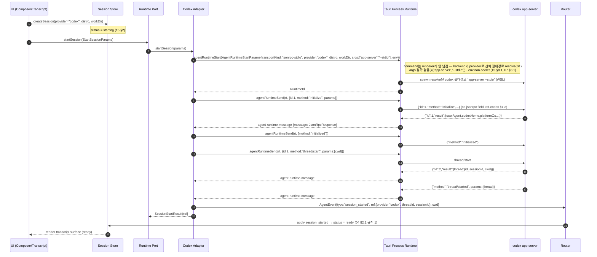

> 참고: ref-codex §9·§10은 `turn/start` 응답과 `turn/started` notification, `thread/start` 응답과 `thread/started` notification의 **상대 순서가 wire 캡처로 검증되지 않았다(unverified)**고 본다. 위 다이어그램은 ref-codex §9 예시 순서를 따른 것이며, adapter는 둘 중 어느 것이 먼저 와도 동작하도록 idempotent하게 구현해야 한다(04 §3.4 순서 보존). → [13](13-risks-open-questions.md).

---

## 2. Claude ACP 새 세션 start

흐름: `startSession` → process spawn → `initialize`(capability 협상) → `session/new` → `sessionId` 수신. ACP는 `protocolVersion = 1`을 협상하고, `loadSession`/`sessionCapabilities.resume`를 capability로 확인한다(ref-acp §3.1, §3.5).

wire 근거: ref-acp §3.1 (`initialize` + capability 구조), §3.3 (`session/new`), §13.1 (매핑). 주의: ACP에는 `initialized` notification이 **없다**(Codex와 다름) — `initialize` 응답 직후 바로 `session/new` 가능.

> **command resolve 경계 (S1 정본, 15 §8.1·07 §8.1)**: Claude도 `command`를 renderer가 넘기지 않는다. backend가 신뢰 `node` 절대경로를 resolve하고, `args`는 `args.length==1` 이고 `args[0]`이 backend가 검증한 `adapterEntryPath`(claude-agent-acp `dist/index.js`) 절대경로여야 한다. `adapterEntryPath`는 renderer 자유 입력이 아니라 backend가 고정 npm 의존 위치에서 resolve(또는 사전 등록 절대경로)한다. resolve 주체·`adapterEntryPath` 탐색 방식은 [13 결정 필요](13-risks-open-questions.md).

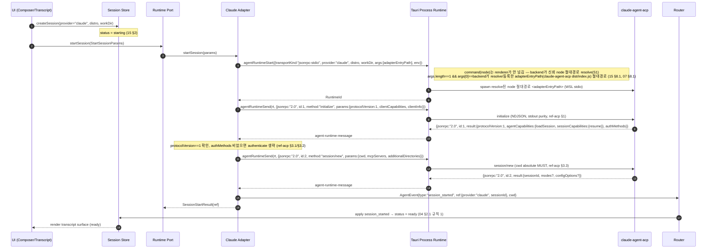

> **capability 비대칭 주의**(ref-acp §3.5): `loadSession`은 top-level `AgentCapabilities.loadSession`, `resume`는 `AgentCapabilities.sessionCapabilities.resume`에 있다. adapter는 §7 resume/load 흐름에서 각 메서드마다 올바른 위치를 확인해야 한다. 미지원 capability는 전부 UNSUPPORTED로 취급(MUST, ref-acp §3.1).
> auth가 필요한 경우(`authMethods` 비어있지 않음)는 `session/new` 전에 `authenticate{methodId}`를 끼워야 한다(ref-acp §3.2). v1 정책·자동 처리 여부는 [13 결정 필요](13-risks-open-questions.md).

---

## 3. Prompt + streaming (delta → completed reconcile → turn_completed)

흐름: `sendPrompt` → turn 시작(`running`) → streaming delta → completed item reconcile → turn 종료(`idle`). 두 provider를 한 다이어그램의 `alt`로 나란히 보여준다.

- Codex reconcile 규칙: 메시지는 `item/agentMessage/delta`(append) 후 `item/completed`의 `text`가 **권위**(04 §3.2 규칙 1, ref-codex §7). reconcile 키는 `itemId`.
- ACP chunk 규칙: `agent_message_chunk`는 `messageId` 기준 append, tool 등은 별도(04 §3.3, ref-acp §13.2).
- 상태 전이: `ready`/`idle` → `running`(04 §2.1 규칙 2) → `turn_completed` → `idle`(규칙 5).

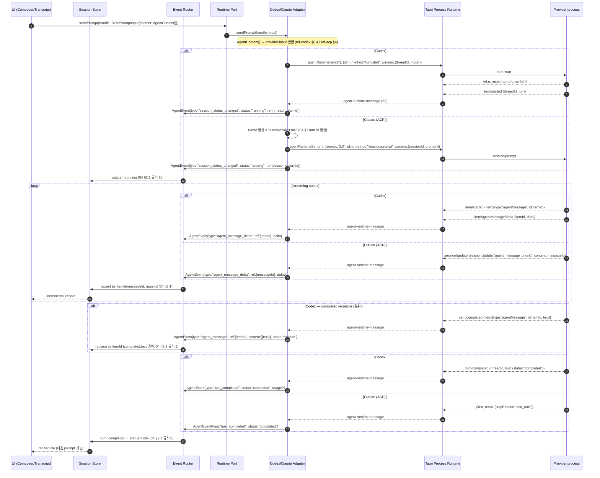

> reconcile 주의(04 §3.2 규칙 2): Codex `plan`/`reasoning`은 "concatenated delta가 completed와 일치하지 않을 수 있음"이 명시돼 있어 **completed item을 권위**로 삼고 delta는 점진 렌더링용으로만 쓴다. 메시지(`agentMessage`)에만 delta=completed 가정이 허용된다.
> ACP stopReason 매핑(ref-acp §13.1): `end_turn`/`max_*`→`completed`, `cancelled`→`cancelled`, `refusal`→`completed`(+UI 거부 표시, refusal은 CLCOMX status enum에 없어 metadata 보존).

---

## 4. Tool call + approval

흐름: `tool_call`/`tool_call_updated` upsert → provider가 approval request 전송 → 세션 `requires_action` → 사용자 응답 → `respondApproval` → wire 응답 → tool 진행/완료. approval은 server→client request이며 `requestId`로 pending table을 관리한다(04 §4).

wire 근거: Codex ref-codex §4.1 (`item/commandExecution/requestApproval`), §8.1 (decision 매핑). ACP ref-acp §6 (`session/request_permission`), §13.4 (매핑).

```mermaid
sequenceDiagram
    autonumber
    participant User as User
    participant UI as UI (Approval card)
    participant Store as Session Store
    participant Router as Event Router
    participant Port as Runtime Port
    participant Adapter as Codex/Claude Adapter
    participant Transport as Tauri Process Runtime
    participant Provider as Provider process

    Provider-->>Transport: tool_call(시작) — item/started(commandExecution) | session/update{sessionUpdate:"tool_call"}
    Transport-->>Adapter: agent-runtime-message
    Adapter->>Router: AgentEvent{type:"tool_call_updated", update:ToolCallUpdate{id, kind:"execute", status:"pending"}}
    Router->>Store: upsert tool card by id (04 §3.1)
    Store-->>UI: render tool card (pending)

    Note over Provider: approval 필요
    alt Codex (server→client request)
        Provider-->>Transport: {id:r, method:"item/commandExecution/requestApproval", params:{threadId,turnId,itemId,command,...}}
    else Claude (ACP, A→C request)
        Provider-->>Transport: {jsonrpc:"2.0", id:r, method:"session/request_permission", params:{sessionId, toolCall, options}}
    end
    Transport-->>Adapter: agent-runtime-message {JsonRpcRequest, id:r}
    Adapter->>Router: AgentEvent{type:"approval_requested", ref:{requestId:r, toolCallId}, request:ApprovalRequest{options}}
    Router->>Store: pending table[r] = request; status = requires_action (04 §2.1 규칙 3, §4.1)
    Store-->>UI: render ApprovalModal (options, i18n label)

    User->>UI: 선택 (예: allow_once)
    UI->>Port: respondApproval(handle, ApprovalDecision{requestId:r, outcome:"selected", optionId})
    Port->>Adapter: respondApproval(handle, decision)
    alt Codex 응답 (jsonrpc 필드 없음)
        Adapter->>Transport: agentRuntimeSend(rt, {id:r, result:{decision:"accept"}})
        Note right of Adapter: kind→decision: allow_once→accept, allow_always→acceptForSession,<br/>reject_once→decline, cancel→cancel (ref-codex §8.1)
    else Claude 응답
        Adapter->>Transport: agentRuntimeSend(rt, {jsonrpc:"2.0", id:r, result:{outcome:{outcome:"selected", optionId}}})
    end
    Transport->>Provider: approval response (id:r 매칭)

    Adapter->>Router: AgentEvent{type:"approval_resolved", ref:{requestId:r}, decision}
    Router->>Store: pending table에서 r 제거; status = running (04 §4.1 규칙 4)
    Store-->>UI: ApprovalModal 닫기

    Provider-->>Transport: tool 진행/완료 — item/commandExecution/outputDelta + item/completed | session/update{tool_call_update status:"completed"}
    Transport-->>Adapter: agent-runtime-message
    Adapter->>Router: AgentEvent{type:"command_output_delta"} / {type:"tool_call_updated", update:{status:"completed"}}
    Router->>Store: append output / upsert status (04 §3.1, §3.3 ACP content replace)
    Store-->>UI: render tool card (completed)
```

> ACP tool content replace 주의(04 §3.3): ACP `tool_call_update`의 `content`/`locations`는 **collection 전체 교체**(append 아님)다. Codex 명령 출력은 `command_output_delta`로 append. provider에 따라 store apply 규칙이 다르다.
> Codex `serverRequest/resolved` notification(`{threadId, requestId}`)을 받으면 사용자 응답 없이 해당 `requestId`를 닫는다(04 §4.2 규칙 3, ref-codex §4.4) — 위 다이어그램의 사용자 응답 경로와 별개의 종료 경로다.

---

## 5. Turn cancel 중 pending approval cleanup (04 §4 불변식)

흐름: `cancelTurn` → **① 해당 turn의 pending approval을 원자적으로 `closing`으로 표시(이중 응답 방지) → ② 각 pending에 `cancelled` wire 응답 먼저 전송 + pending table에서 제거 → ③ 그 다음 provider turn cancel 호출** → `turn_completed{status:"cancelled"}` → `idle`. **④ cancel 이후 도착하는 늦은 `serverRequest/resolved`/동일 requestId 응답/늦은 `stopReason`은 이미 `closing`/`closed`이므로 멱등하게 무시한다.** 이 순서는 04 §4.2 정본이며 두 protocol의 MUST와 정확히 대응한다.

wire 근거: ACP ref-acp §3.8 ("pending된 모든 `session/request_permission`에 `cancelled` outcome으로 MUST 응답"). Codex ref-codex §3.2 (`turn/interrupt`), §4.4 (`serverRequest/resolved`).

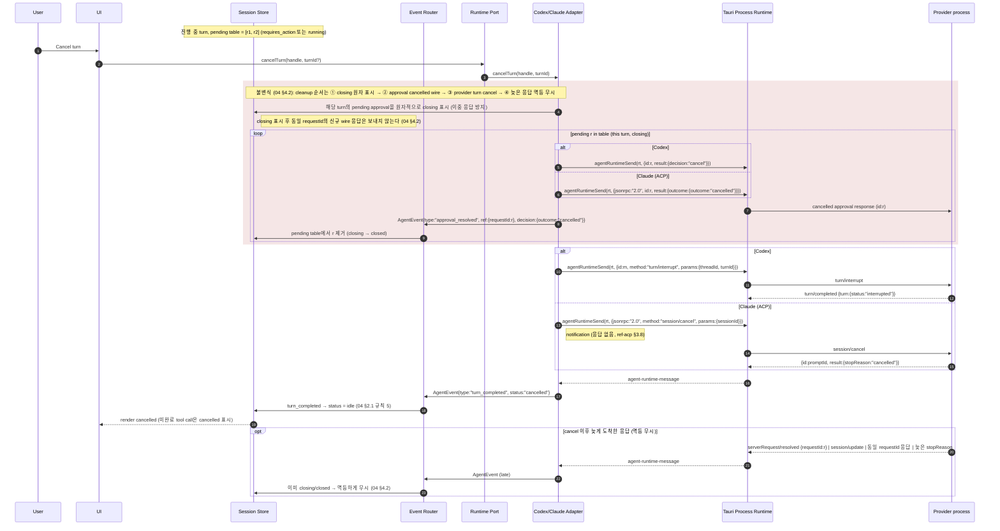

> **순서 정본(04 §4.2)**: pending approval cleanup(② approval `cancelled` wire 응답)을 provider turn cancel(③ `turn/interrupt` / `session/cancel`) **전에** 수행한다. ACP는 cancel 받은 즉시 `cancelled` stopReason을 MUST 반환하므로(ref-acp §3.8), client는 먼저 pending permission을 비워 deadlock(agent가 응답을 기다리는 상태)을 피해야 한다. 시작 시 ① pending을 `closing`으로 원자 표시해 사용자 응답 경로(§4)와의 이중 응답을 막는다.
> **늦은 응답 멱등 무시(04 §4.2)**: ② 이후 도착하는 Codex `serverRequest/resolved`(같은 `requestId`)·동일 requestId의 approval 응답·늦은 `turn_completed`/`stopReason`은 이미 `closing`/`closed` 상태이므로 멱등하게 무시한다(이중 처리·재emit 금지). pending table은 `requestId`(JSON-RPC id) 기준으로 멱등 판정한다(04 §4·§4.2).
> ACP tool call status에는 `cancelled`가 없으므로(ref-acp §5), 미완료 tool card의 `cancelled` 상태는 client가 합성한다(15 §5 `ToolCallUpdate.status` 매핑 주의, 04 §3.3). Codex `interrupted` turn status → `turn_completed{status:"cancelled"}`로 매핑(ref-codex §8).

---

## 6. Process exit 시 pending request 실패 처리

흐름: provider process 종료 → `agent-runtime-exit` → `process_exited` → **모든 pending request(approval 포함)를 실패로 닫는다** → `exited`. process 종료는 turn 정상 종료와 구분되며, 모든 pending을 강제로 정리한다(04 §5, §2.1 규칙 7).

wire/backend 근거: backend §2 (process lifecycle), 15 §8.3 (`agent-runtime-exit` payload), 04 §4.2 규칙 2 / §5.

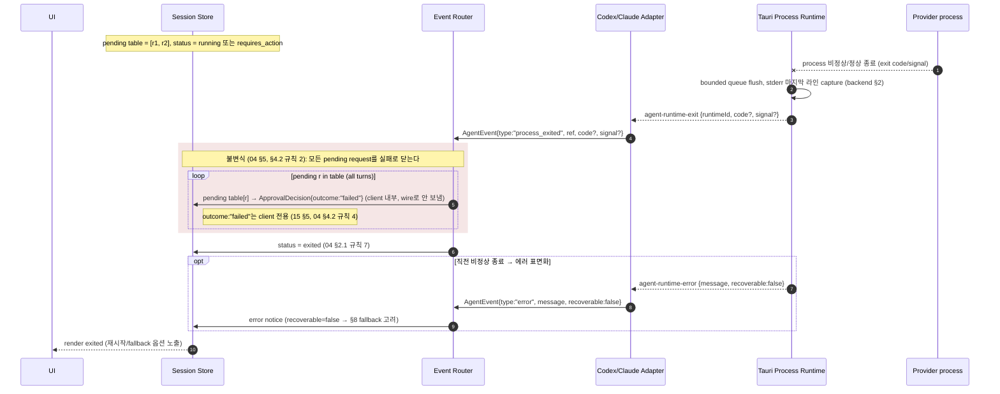

> 주의: process exit으로 닫는 pending approval은 wire로 응답을 보내지 않는다(process가 이미 죽음). 따라서 `ApprovalDecision.outcome:"failed"`(client 내부 전용)를 쓴다 — §5 cancel cleanup이 wire로 `cancelled`를 보내는 것과 대비된다(04 §4.2 규칙 4, 15 §5).
> `turn_completed{status:"failed"}`(turn 실패)와 `process_exited`(세션 exit)는 다르다(04 §2.1 규칙 6): turn 실패는 세션이 `idle`로 갈 수 있지만, process exit은 항상 `exited`다.

### 6.1 Graceful shutdown — authoritative cleanup 경계 (S3 정본)

흐름: `shutdown` → **① adapter가 shutdown 호출 전에 모든 pending을 정리(approval은 process가 살아 있으면 `cancelled`+wire로 닫고 04 §4.2, pending RPC 로컬 reject; listener는 살린 채) → ② adapter가 `agent_runtime_shutdown`을 await(backend가 stdin close → grace timeout → kill → child reap까지 끝낸 뒤 반환) → ③ 반환(최종 exit 반영/계상) 후에만 listener 해제·세션 삭제**. `agent_runtime_shutdown`을 **authoritative cleanup 경계**로 정의한다. exit/shutdown으로 인한 pending 종료는 **멱등**하며 정확히 **한 번만** 수행된다(이중 종료·누락 없음).

순서 정본: 04 §5(exit/shutdown 시 모든 pending을 정확히 한 번, 멱등 종료) + 07 §5.2(backend graceful shutdown: stdin EOF → grace poll → kill → child wait reap 후 반환) + 07 §5.3(child wait thread가 reap 후 `agent-runtime-exit` emit).

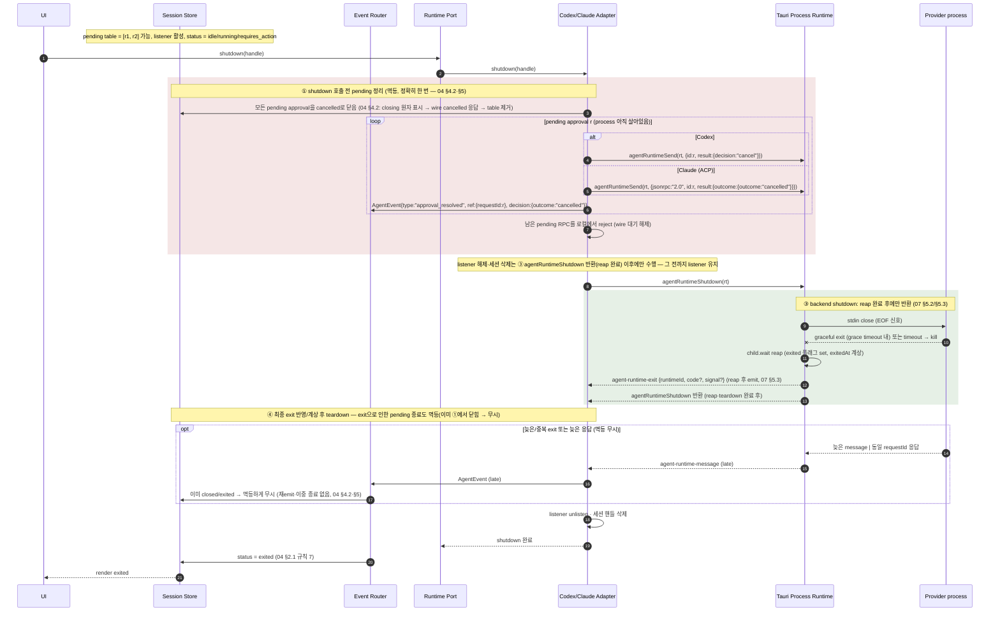

> **순서 정본(04 §5 + 07 §5.2/§5.3)**: ① **pending 정리(approval cancelled close + pending RPC reject)를 listener 해제·세션 삭제보다 먼저** 한다 — listener를 먼저 끊으면 늦게 도착하는 exit이 pending 누락(처리되지 않은 채 사라짐)을 일으킨다(B3). shutdown 시점엔 process가 아직 살아있으므로 approval은 wire로 `cancelled`를 보내 닫는다(04 §4.2; process가 이미 죽은 §6 exit 경로의 `failed` 내부 종료와 대비). ② 그 뒤에 listener를 해제하고 세션을 삭제한다.
> **backend reap 후 반환(07 §5.2/§5.3)**: backend `agent_runtime_shutdown`은 stdin EOF → grace poll → 필요 시 kill → `child.wait`로 **reap(exit 계상)까지 끝낸 뒤** 반환한다. 최종 `agent-runtime-exit`은 reap 후 emit되며(07 §5.3), teardown은 이 최종 exit이 반영/계상된 후에만 일어난다.
> **멱등·정확히 한 번(04 §4.2·§5)**: exit/shutdown으로 인한 pending 종료는 멱등하며 정확히 한 번 수행한다. ①에서 이미 닫은 pending에 대해 뒤늦은 exit·늦은 응답·중복 exit이 와도 이미 `closing`/closed/exited 상태이므로 멱등하게 무시한다(이중 종료·재emit·누락 없음). pending 멱등 판정 키는 `requestId`(JSON-RPC id)다.

---

## 7. Resume / Load replay

흐름: `resumeSession(replay)` → process spawn + `initialize` → provider별 resume/load 호출 → (replay=true면) 과거 transcript를 update 스트림으로 재구성 → `session_loaded`. resume 키는 `AgentRuntimeMetadata.providerSessionId`/`providerThreadId`(15 §7.1, 디스크에선 scrub됨).

wire 근거: Codex ref-codex §3.1 (`thread/resume`, `thread/read`). ACP ref-acp §3.4 (`session/load` = replay), §3.5 (`session/resume` = replay 없음). capability 게이트 위치 비대칭 주의(§2 노트).

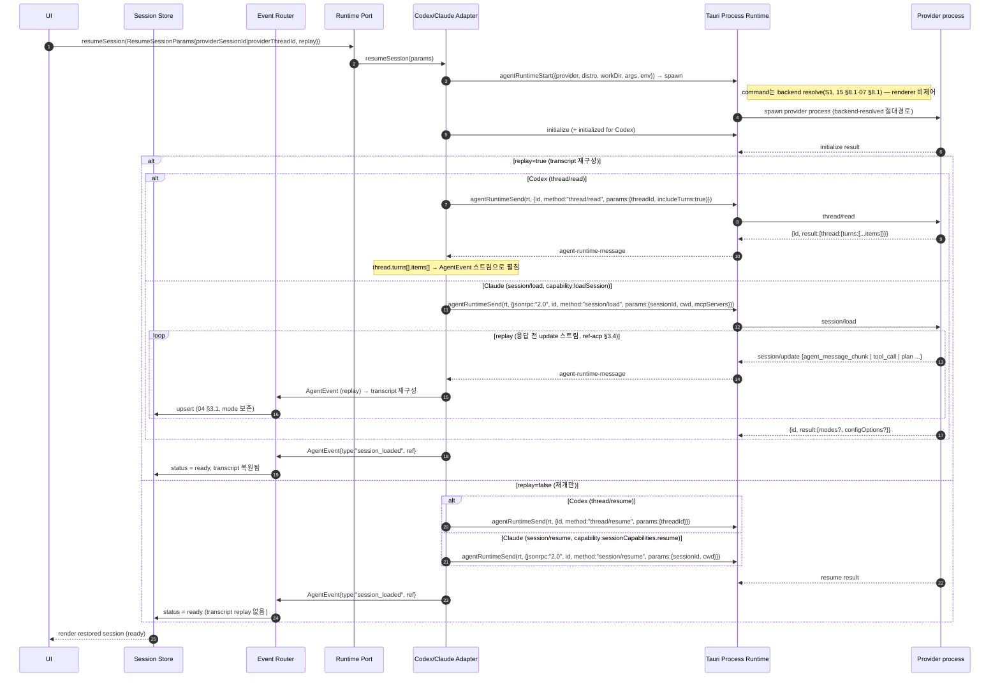

> capability 게이트(ref-acp §3.4/§3.5): `session/load`는 `agentCapabilities.loadSession`(top-level bool), `session/resume`는 `agentCapabilities.sessionCapabilities.resume`(`{}`면 지원). adapter는 호출 전 올바른 위치를 확인하고, 미지원이면 새 세션(§2)으로 fallback하거나 사용자에게 알린다. 정책은 [`10-persistence-migration.md`](10-persistence-migration.md) §resume/load.
> CLCOMX persistence는 transcript 전체가 아니라 metadata만 저장하는 것이 v1 기본이다(15 §7.1, 10 §Transcript persistence). 따라서 "복원"은 위 provider replay에 의존한다.

---

## 8. Direct runtime 실패 → PTY fallback 선택

흐름: direct runtime 시작/초기화 실패(process spawn 실패, `initialize` 실패, capability 미지원 등) → 사용자에게 fallback 제안 → 동일 세션을 legacy PTY runtime으로 재시작. fallback은 host 컴포넌트 분기(옵션 B)로 구현하며, legacy PTY는 보존된다(03 §설계 원칙, frontend §9 옵션 B).

근거: frontend §9 (옵션 B host 분기, `SessionShell.svelte`), 15 §7.1 (`SessionRuntimeKind` "pty"|"direct-codex"|"direct-claude"), 08 §"legacy PTY fallback session". 어떤 실패가 fallback을 trigger하는지의 정확한 기준은 [13 결정 필요](13-risks-open-questions.md).

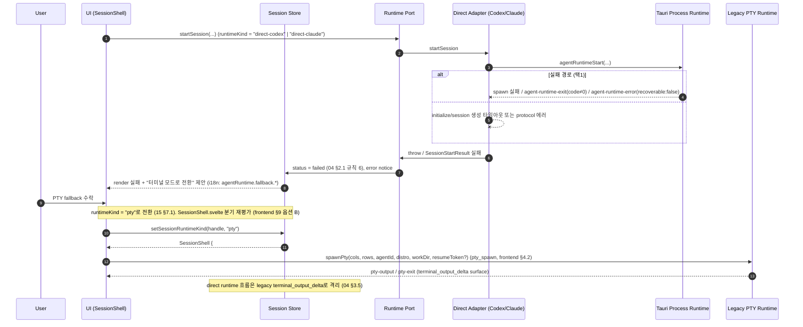

> fallback은 **runtime kind 전환**이지 viewMode 전환이 아니다(frontend §5, §9): `SessionViewMode`(`terminal`/`editor`)는 한 host 내부 토글, `SessionRuntimeKind`는 host 종류 자체다. fallback 시 `SessionShell.svelte`의 `{#if useDirectRuntime}` 분기가 재평가되어 `Terminal.svelte`(PTY host)가 mount된다.
> 자동 fallback vs 사용자 확인, 어떤 실패 코드가 fallback 대상인지(예: `usageLimitExceeded`는 fallback 아님, spawn 실패는 fallback)는 미확정 → [13 결정 필요](13-risks-open-questions.md).

---

## 9. stateDiagram — AgentSessionStatus 전이

정본 타입: 15 §2 (`AgentSessionStatus`). 전이 규칙: 04 §2.1. 아래는 04 §2.1의 텍스트 다이어그램을 mermaid로 옮긴 것이며, 충돌 시 04가 권위다.

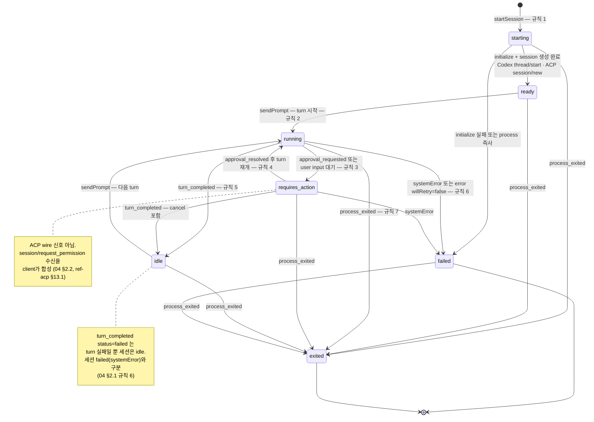

> 위 전이 라벨의 "규칙 N"은 04 §2.1의 규칙 번호다. 전이 트리거가 되는 wire/이벤트 매핑은 §1~§8 시퀀스와 04 §2.1을 함께 본다.

> provider status 합성(04 §2.2): Codex `ThreadStatus`(`notLoaded`→`starting`, `idle`→`idle`/`ready`, `active`→`running`(+activeFlags→`requires_action`), `systemError`→`failed`, ref-codex §8). ACP는 wire 상태 신호가 없어 `stopReason`+tool status+permission 수신을 합성한다(ref-acp §13.1).

---

## 10. stateDiagram — ToolCallUpdate.status 전이

정본 타입: 15 §5 (`ToolCallUpdate.status`: `pending`|`in_progress`|`completed`|`failed`|`cancelled`). upsert 규칙: 04 §3.1. provider 매핑: ref-codex §6.3 (`CommandExecutionStatus`), ref-acp §5 (`ToolCallStatus`).

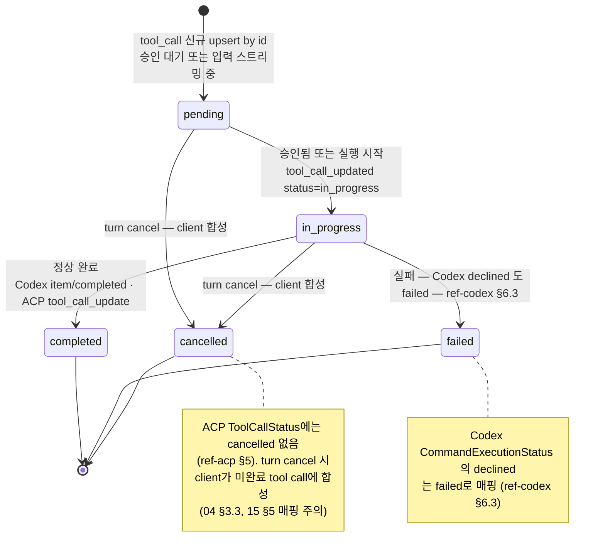

> 매핑 주의(15 §5): Codex `CommandExecutionStatus`(`inProgress`/`completed`/`failed`/`declined`) → `declined`는 `failed`. ACP는 `pending`/`in_progress`/`completed`/`failed` 4종만 wire에 존재하므로 `cancelled`는 항상 client 합성이다(§5 cancel cleanup, §10 노트). status 갱신은 `id` 기준 upsert이며 부분 갱신은 바뀐 필드만 온다(04 §3.1).

---

## 11. stateDiagram — Approval 생명주기

정본 타입: 15 §5 (`ApprovalRequest`/`ApprovalOption`/`ApprovalDecision`). 생명주기 규칙: 04 §4. pending table은 `requestId`(JSON-RPC id)로 관리한다(04 §4, §1.1).

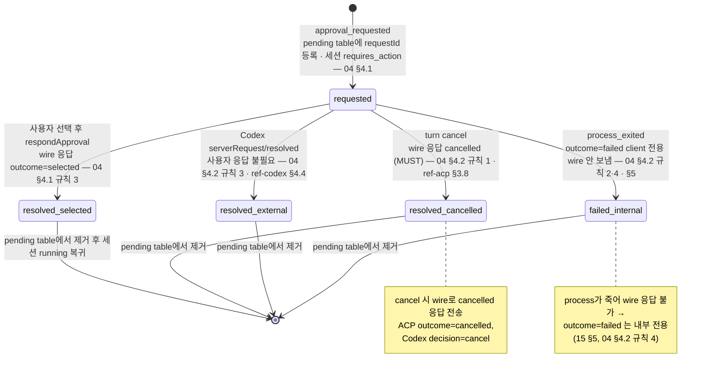

> 핵심 구분(04 §4.2): **cancel cleanup**은 wire로 `cancelled`를 보낸다(process 살아있음, MUST). **process exit cleanup**은 wire 응답 없이 내부 `failed`로 닫는다(process 죽음). 둘 다 pending table에서 제거하지만 wire 동작이 다르다. `ApprovalDecision.outcome:"failed"`는 ACP/Codex wire에 없는 CLCOMX 전용 값이다(15 §5, ref-acp §6 "ACP outcome에는 failed 없음").
> cancel cleanup 순서/멱등(04 §4.2, §5 시퀀스): cancel 시작 시 해당 pending을 먼저 `closing`으로 원자 표시(이중 응답 방지)한 뒤 `cancelled` wire 응답을 보내고 table에서 제거(`closing`→제거)한다. 이후 도착하는 `serverRequest/resolved`/동일 requestId 응답/늦은 `stopReason`은 멱등하게 무시한다. `closing`은 표현용 중간 상태이며 정본 `AgentSessionStatus`/`ApprovalDecision` enum(15 §5·§2)을 재정의하지 않는다.

---

## 12. 교차 참조

| 대상 | 문서 | 절 |
|---|---|---|
| 모든 타입 정의 (정본) | [`15-data-contracts.md`](15-data-contracts.md) | §1–§8 |
| 상태 전이·upsert/reconcile·approval 생명주기·process exit 정리 (규칙 권위) | [`04-normalized-agent-model.md`](04-normalized-agent-model.md) | §1–§5 |
| Codex wire 메서드/notification/decision 매핑 | [`ref-codex-app-server-protocol.md`](ref-codex-app-server-protocol.md) | §2, §3, §4, §5, §7, §8, §9 |
| ACP wire 메서드/update/permission/stopReason 매핑 | [`ref-acp-protocol.md`](ref-acp-protocol.md) | §3, §5, §6, §13 |
| Claude ACP 구현체 capability/launch | [`ref-claude-agent-acp.md`](ref-claude-agent-acp.md) | 전체 |
| hexagonal 구조·Port/Adapter/Router/Store 역할 (actor 매핑) | [`03-target-architecture.md`](03-target-architecture.md) | 전체 |
| Codex/Claude adapter 상세 설계 | [`05-codex-app-server-adapter.md`](05-codex-app-server-adapter.md) / [`06-claude-acp-adapter.md`](06-claude-acp-adapter.md) | 전체 |
| Tauri process lifecycle·framing·cancel·WSL 경계 | [`07-tauri-process-runtime.md`](07-tauri-process-runtime.md) | 전체 |
| UI 구성·transcript surface·fallback session | [`08-ui-composition.md`](08-ui-composition.md) | 전체 |
| resume/load·transcript persistence 정책 | [`10-persistence-migration.md`](10-persistence-migration.md) | 전체 |
| backend 코드 현실 (process state·event payload) | [`research/codebase-backend.md`](research/codebase-backend.md) | §2, §3, §6 |
| frontend 코드 현실 (feature 레이어·host 분기·fallback) | [`research/codebase-frontend.md`](research/codebase-frontend.md) | §1, §4, §5, §8, §9 |
| 미확정·결정 필요 항목 | [`13-risks-open-questions.md`](13-risks-open-questions.md) | 전체 |
